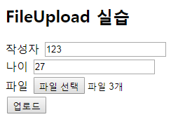

1. **자바스크립트로 지도 보여주기 :** 

   navigator.geolocation.getCurrntPosition(success콜백함수, error콜백함수, [options] )

2. success콜백함수(position객체) {position.coords.latitude

   position.coords.longitude

   ......

   }

3. error콜백함수(error객체) {

     error.message
     error.code
     ...
     }  

4. servlet : 웹 서버에서 실행되는 웹 컴포넌트를 구현하는 기술

   

5. 웹 요청을 처리, 처리 결과를 동적으로 응답 페이지 (HTML) 생성, 응답

   

6. WAS : Web Server + Application Server

   

7. JSP (Java Server Page) - script

8. 웹 컨텍스트 표준 구조 : 

9. 웹 컨텍스트 (http://ip:8080/web1)

   |----html, js, image, ....jsp

   |----WEB-INF (보안폴더)

   ​		|----classes (페키지형태 - class파일)

   ​		|----lib (jar파일형태 - 외부 자바 library)

   ​		|----web.xml(웹 컨텍스트의 환경설정파일 - 컨택스트의 파라미터, 리스너,필터, 전역세션timeout, 전역 에러 페이지 , 서블릿, 리소스 참조, welcom)

   ​		|----src

   ​		|---tid, tage

   

   

   

   

   

   

   

   # JSP,서블릿

   **request.getContentType();**
   --> enctype을 얻어옴(default:application/x~~ , multipart/form-data)

   

   **Collection<Part> parts=request.getParts();**
   --> 넘어온 파라미터들 Collection(set,list 등등)에 나눠서 넣음(배열처럼)
   ​

   **for(Part part:parts ){**
   **part.getName()**
   --> 넘어온 파라미터 이름 얻어옴
   ​

   **part.getHeader("Content-Disposition").contains("filename=")**
   --> 넘어온 Header에 filename이 포함되있냐
   --> 왜 구분? 파일이면 file writer 써야됨
   ​

   **part.getSize();**
   --> 파일인 경우 파일의 크기
   ​

   **part.getSubmittedFileName();**
   --> 업로드한 파일의 이름을 구함
   ​

   **part.write();**
   --> part의 업로드 데이터를 filename이 지정한 파일에 복사(임시보관)
   --> 그래서 파일업로드 안에 클래스를 새로 만들어줘야됨(FileUploadUtil)
   --> 그래서 실제 파일을 업로드할려면 이 클래스를 불러줄거임 얘말고
   ​

   **part.delete();**
   --> part와 관련된 파일 삭제

   

   **Post, Get**

   

   

   ## FileUpload

   ### FormtagUpload

   ```jsp
   <!DOCTYPE html>
   <html>
   <head>
   <meta charset="utf-8">
   <title>FileUpload 실습</title>
   <style>
   input{margin : 2px;}
   </style>
   </head>
   <body>
   <h2>FileUpload 실습</h2>
   <form method="post" action="/web1/upload" enctype="multipart/form-data">
       //form 클라이언트에서 서버로 데이터 전송을 위해 사용
       //method = 전송방식 , action 전송대상
   작성자 <input type="text" name="theAuthor"><br>
   나이 <input type="text" name="theAge"><br>
   파일 <input type="file" name="theFile" multiple><br>
   <input type="submit" value="업로드">
   
   
   
   </form>
   
   </body>
   </html>
   ```

   


```jsp


import java.io.File;
import java.io.IOException;
import java.io.PrintWriter;
import java.util.Collection;

import javax.servlet.ServletException;
import javax.servlet.annotation.MultipartConfig;
import javax.servlet.annotation.WebServlet;
import javax.servlet.http.HttpServlet;
import javax.servlet.http.HttpServletRequest;
import javax.servlet.http.HttpServletResponse;
import javax.servlet.http.Part;


@WebServlet("/upload")
@MultipartConfig(location = "c:/uploadteat", maxFileSize = 1024*1024*5, maxRequestSize = 1024*1024*5*5)
//@MultipartConfig(location ="경로", maxFileSize =업로드최대사이즈, maxRequestSize =HTTP 요청의 최대 크기 값)

public class UploadServlet extends HttpServlet {
       public void doPost(HttpServletRequest request, HttpServletResponse response) throws ServletException, IOException {
    	   response.setContentType("text/html;charset=utf-8");
   		   PrintWriter out = response.getWriter();
   		   request.setCharacterEncoding("utf-8");
   		   String path = "C:/uploadtest";
   		   File isDir = new File(path);
   		   if(!isDir.isDirectory()) {
   			   isDir.mkdirs();
   		   }
   		   
   		   Collection<Part> parts = request.getParts();
   		   for(Part part : parts) {
   			   if(part.getContentType() != null) {
   				   String fileName = part.getSubmittedFileName();
   				   if(fileName != null) {
   					   part.write(fileName.substring(0, fileName.lastIndexOf("."))
   							   + "_" + System.currentTimeMillis() +
   							   fileName.substring(fileName.lastIndexOf(".")));
   					   out.print("<br>업로드한 파일 이름: " + fileName);
   					   out.print("<br>크기 : " + part.getSize());
   				   }
   			   } else {
   				   String partName = part.getName();
   				   String fieldValue = request.getParameter(partName);
   				   out.print("<br>" + partName + " : " + fieldValue);
   			   }
   			
   		   }
   		   out.close();

    	   
    	   // TODO Auto-generated method stub
	}

}

```




## request dispacter

/a.jsp 로 들어온 요청을 /a.jsp 내에서 RequestDispatcher를 사용하여 b.jsp로 요청을 보낼 수 있습니다. 또는 a.jsp에서 b.jsp로 처리를 요청하고 b.jsp에서 처리한 결과 내용을 a.jsp의 결과에 포함시킬 수 있습니다.


## message.jsp 파일 생성 (a.jsp)

```jsp
<%@ page contentType="text/html;charset = utf-8" pageEncoding="utf-8" %>
 
<!DOCTYPE html>
<html>
<head>
<meta charset="utf-8">
<title>message.jsp</title>
</head>
<body>
	<form id="f1" action="./message" method = "post">
	메시지 입력하세요<br>
	<input type = "text" name = "msg" size = 100><br>
	<input type = "submit" value = "전송"><br>
	
	</form>
</body>
</html>
```


## result.jsp생성(b.jsp)

```jsp
<%@ page contentType="text/html;charset = utf-8" pageEncoding="utf-8" %>

<!DOCTYPE html>
<html>
<head>
<meta charset="utf-8">
<style>
#blue{ color:blue;}</style>
<title>message.jsp</title>
</head>
<body>
<h3>메시지 전송 결과</h3>
message.jsp에서 보낸 파라미터 메시지 :
<p id = "blue">
<%
out.println(request.getParameter("msg")+"<br>");
%>
</p>
MessageServlet에서 보낸 추가 정보 :
<p id = "blue">
<%
	String msg2 = (String)request.getAttribute("msg2");
	out.println(msg2+"<br>");
%>
</p>
</body>
</html>
```

## 서블릿 생성 (Forwardservlet)

```jsp
package lab.web.controller;

import java.io.IOException;

import javax.servlet.RequestDispatcher;
import javax.servlet.ServletContext;
import javax.servlet.ServletException;
import javax.servlet.annotation.WebServlet;
import javax.servlet.http.HttpServlet;
import javax.servlet.http.HttpServletRequest;
import javax.servlet.http.HttpServletResponse;


@WebServlet("/message")
public class Forwordservlet extends HttpServlet {
	private static final long serialVersionUID = 1L;
      ServletContext sctx;
      RequestDispatcher rd;

    public Forwordservlet() {
        super();
        // TODO Auto-generated constructor stub
    }


	protected void doGet(HttpServletRequest request, HttpServletResponse response) throws ServletException, IOException {
		// TODO Auto-generated method stub
		sctx = request.getServletContext();
		rd = sctx.getRequestDispatcher("/WEB-INF/view/message.jsp");
		rd.forward(request, response);
	}


	protected void doPost(HttpServletRequest request, HttpServletResponse response) throws ServletException, IOException {

		request.setCharacterEncoding("utf-8");
		response.setContentType("text/html;charset=utf-8");
		
		request.setAttribute("msg2", "xc7230@gmail.com");
		sctx = request.getServletContext();
		rd = sctx.getRequestDispatcher("/WEB-INF/view/result.jsp");
		rd.forward(request, response);
	}

}

```


## Cookie


### 로그인 jsp생성(Cookie_login.jsp)

```jsp
<%@ page contentType="text/html;charset = utf-8" pageEncoding="utf-8" %>

<!DOCTYPE html>
<html>
<head>
<meta charset="utf-8">
<title>사용자 로그인</title>
</head>
	<body><h3 id='header'>사용자 로그인</h3>
	<div id='main' style='text-align:center'>
		<br><br> 
		<form method=post action="cookieLogin">
		<table style='border:1px #0000FF dotted;text-align:center'>
		  <tr><td>사용자 ID </td>
		     <%
		     if(request.getAttribute("userid")==null) {
		    	 %>
		    <td><input type=text name=userid></td></tr>
		    <%}else{
		    	String uid = (String)request.getAttribute("userid");
		    	%>
		    	<td><input type=text name=userid value="<%=uid%>"></td></tr>
		    <%} %>
		  <tr><td>사용자 암호 </td>
		    <td><input type=password name=passwd></td></tr>
		  <tr><td>아이디 저장 사용 </td>
		    <td><input type=checkbox name=cookie></td></tr>			
		  <tr><td colspan=2 style='text-align:right'>
			<input type=submit value='로그인'>
			<input type=reset value='취소'></td></tr>
		</table>
	</form></div></body></html>
```


###  로그인 서블릿 생성(CookieLoginServlet)

```jsp
package lab.web.controller;

import java.io.IOException;
import java.io.PrintWriter;

import javax.servlet.RequestDispatcher;
import javax.servlet.ServletContext;
import javax.servlet.ServletException;
import javax.servlet.annotation.WebServlet;
import javax.servlet.http.Cookie;
import javax.servlet.http.HttpServlet;
import javax.servlet.http.HttpServletRequest;
import javax.servlet.http.HttpServletResponse;


@WebServlet("/cookieLogin")
public class CookieLoginServlet extends HttpServlet {
	private static final long serialVersionUID = 1L;
	String uid = null, passwd = null;
	ServletContext sctx = null;
	RequestDispatcher rd = null;
	
       

    public CookieLoginServlet() {
        super();
        // TODO Auto-generated constructor stub
    }
    
    protected void doGet(HttpServletRequest request, HttpServletResponse response) throws ServletException, IOException {
		// TODO Auto-generated method stub
		request.setCharacterEncoding("utf-8");
		response.setContentType("text/html;charset=utf-8");
		PrintWriter out = response.getWriter();
		
		Cookie cookies[] = request.getCookies();
		if(cookies != null) {
			for(int i=0; i<cookies.length;i++) {
				String name = cookies[i].getName();
				if(name.equals("userid")) {
					uid = cookies[i].getValue();
				}
			}
			request.setAttribute("userid", uid);
		}
		sctx = request.getServletContext();
		rd = sctx.getRequestDispatcher("/Cookie_login.jsp");
		rd.forward(request, response);

			
    	
    }
    
    


	protected void doPost(HttpServletRequest request, HttpServletResponse response) throws ServletException, IOException {
		request.setCharacterEncoding("utf-8");
		response.setContentType("text/html;charset=utf-8");
		PrintWriter out = response.getWriter();
		uid = request.getParameter("userid");
		passwd = request.getParameter("passwd");
		String useCookie = request.getParameter("cookie");
		
		if(useCookie != null) {
			Cookie uidCookie = new Cookie("userid",uid);
			uidCookie.setMaxAge(60*60*24*365);
			response.addCookie(uidCookie);
		}
		
		if(uid.equals("admin") && passwd.equals("1234")) {
			request.setAttribute("userid", uid);
			sctx = request.getServletContext();
			rd = sctx.getRequestDispatcher("/main.jsp");
			rd.forward(request, response);
			
		} else {
			out.println("<script>");
			out.println("alert(\'아이디 또는 비밀번호 오류입니다.\')");
			out.println("location.href=\"./Cookie_login.jsp\"");
			out.println("</script>");
		}
	
	
	}

}

```


## 로그아웃 jsp 생성(logout.jsp)

```jsp
<%@ page language = "java" contentType="text/html;charset = utf-8" pageEncoding="utf-8" %>

<!DOCTYPE html>
<html>
<head>
<meta charset="utf-8">
<title>logout.jsp</title>
</head>
<body>
<script>
alert("로그아웃 되었습니다.\n 쿠키 정보 삭제되었습니다.");
location.href="./Cookie_login.jsp";

</script>
</body>
</html>
```


## 로그아웃 서블릿 생성(CookieLogoutServlet)

```jsp
package lab.web.controller;

import java.io.IOException;
import java.io.PrintWriter;

import javax.servlet.RequestDispatcher;
import javax.servlet.ServletContext;
import javax.servlet.ServletException;
import javax.servlet.annotation.WebServlet;
import javax.servlet.http.Cookie;
import javax.servlet.http.HttpServlet;
import javax.servlet.http.HttpServletRequest;
import javax.servlet.http.HttpServletResponse;


@WebServlet("/cookieLogout")
public class CookieLogoutServlet extends HttpServlet {
	private static final long serialVersionUID = 1L;
	ServletContext sctx = null;
	RequestDispatcher rd = null;


	protected void doGet(HttpServletRequest request, HttpServletResponse response) throws ServletException, IOException {
		request.setCharacterEncoding("utf-8");
		response.setContentType("text/html;charset = utf-8");
		PrintWriter out = response.getWriter();
		Cookie[] cookies = request.getCookies();
		if(cookies != null) {
			for(int i=0; i<cookies.length; i++) {
				if(cookies[i].getName().equals("userid")) {
					cookies[i].setMaxAge(0);
					response.addCookie(cookies[i]);
				}
			}
		}
		sctx = request.getServletContext();
		rd = sctx.getRequestDispatcher("/logout.jsp");
		rd.forward(request, response);
		
		
		
	}

}

```

##  로그아웃페이지 jsp만들기 (main.jsp)

```jsp
<%@ page contentType="text/html;charset = utf-8" pageEncoding="utf-8" %>

<!DOCTYPE html>
<html>
<head>
<meta charset="uft-8">
<title>main.jsp</title>
</head>
<body>
<%= request.getAttribute("userid") %>님 환영합니다 .^^<br>
<a href = "cookieLogout"><button>로그아웃</button></a><br>

</body>
</html>
```


