# R


```R
> s1 <- c(1, 2, 1, 2, 3, 4, 2, 3, 4, 5)  #자연과학
> s2 <- c(1, 3, 1, 2, 3, 4, 2, 4, 3, 4)  # 물리화학
> s3 <- c(2, 3, 2, 3, 2, 3, 5, 3, 4, 2)  #인문사회
> s4 <- c(2, 4, 2, 3, 2, 3, 5, 3, 4, 1)  # 신문방송
> s5 <- c(4, 5, 4, 5, 2, 1, 5, 2, 4, 3)  #응용수학
> s6 <- c(4, 3, 4, 4, 2, 1, 5, 2, 4, 2)  # 추론통계
> name <-1:10  #각 과목의 문제 이름
> subject <- data.frame(s1, s2, s3, s4, s5, s6)
> str(subject)
'data.frame':	10 obs. of  6 variables:
 $ s1: num  1 2 1 2 3 4 2 3 4 5
 $ s2: num  1 3 1 2 3 4 2 4 3 4
 $ s3: num  2 3 2 3 2 3 5 3 4 2
 $ s4: num  2 4 2 3 2 3 5 3 4 1
 $ s5: num  4 5 4 5 2 1 5 2 4 3
 $ s6: num  4 3 4 4 2 1 5 2 4 2
> result <- factanal(subject, factors=3, rotation="varimax" , scores="regression")
> result

Call:
factanal(x = subject, factors = 3, scores = "regression", rotation = "varimax")

Uniquenesses:
   s1    s2    s3    s4    s5    s6 
0.005 0.056 0.051 0.005 0.240 0.005 

Loadings:
   Factor1 Factor2 Factor3
s1 -0.379           0.923 
s2 -0.710   0.140   0.649 
s3  0.236   0.931   0.166 
s4  0.120   0.983  -0.118 
s5  0.771   0.297  -0.278 
s6  0.900   0.301  -0.307 

               Factor1 Factor2 Factor3
SS loadings      2.122   2.031   1.486
Proportion Var   0.354   0.339   0.248
Cumulative Var   0.354   0.692   0.940

The degrees of freedom for the model is 0 and the fit was 0.7745 

> plot(result$scores[, c(1:2)], main = "Factor1과 Factor2의 요인점수 행렬")

> text(result$scores[, 1], result$scores[, 2], labels=name, cex=0.7, pos=3, col="red")

```


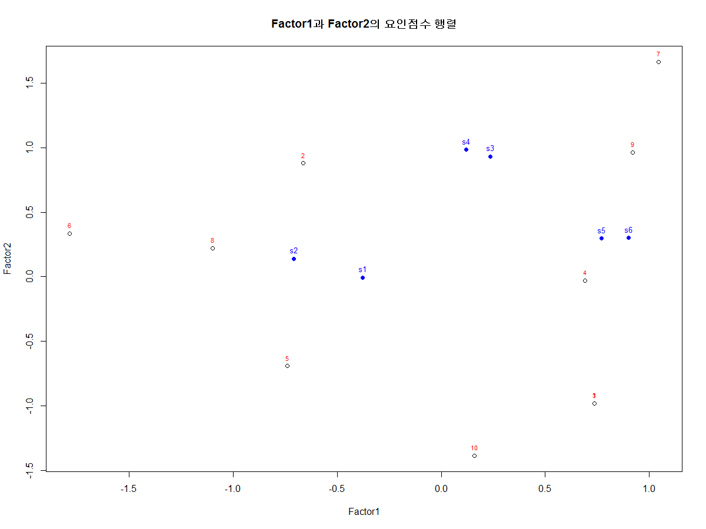


## scatterplot3d

### 요인 점수별 분류

```R
> library(scatterplot3d)
> Factor1 <- result$scores[, 1]
> Factor2 <- result$scores[, 2]
> Factor3 <- result$scores[, 3]
> #scatterplot3d(밑변, 오른쪽 변, 왼쪽변, type)
> scatterplot3d(Factor1, Factor2, Factor3, type='p')

```


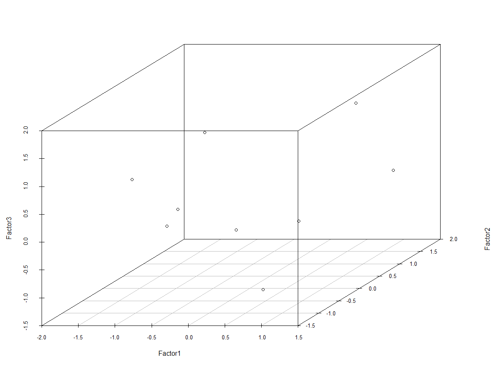


### 요인적재량 표시

```R
> d3 <- scatterplot3d(Factor1, Factor2, Factor3, type='p')
> #요인적재량 표시
> loadings1 <- result$loadings[, 1]
> loadings2 <- result$loadings[, 2]
> loadings3 <- result$loadings[, 3]
> d3$points3d(loadings1, loadings2, loadings3, bg="red", pch=21, cex=2, type="h")

```


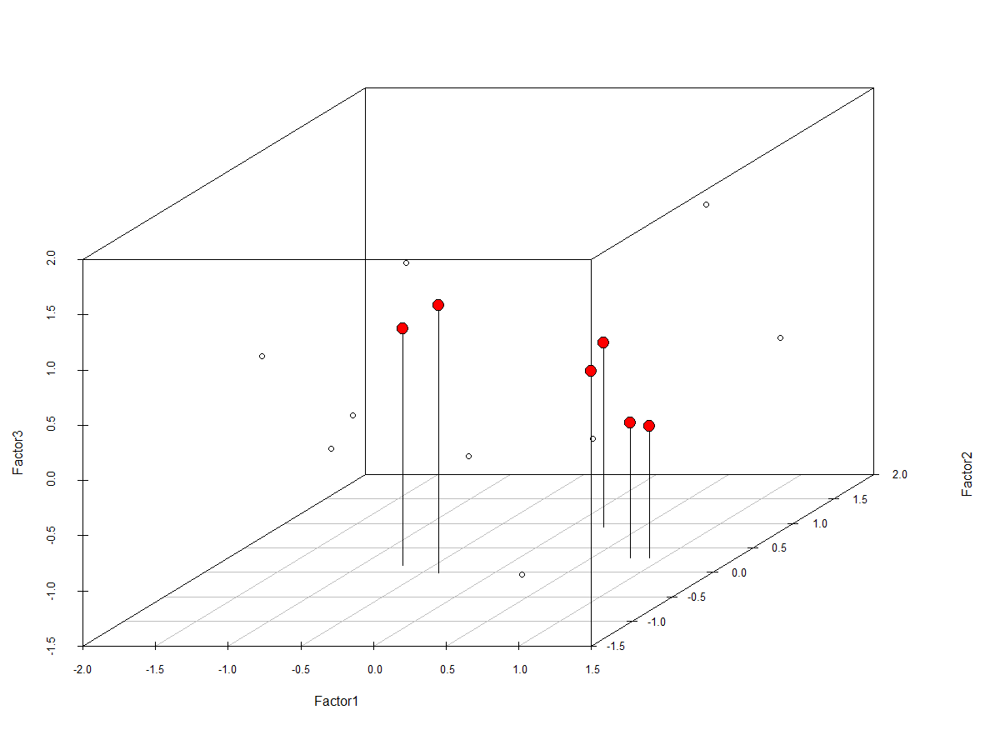


### 요인 분석 결과를 이용하여  변수 묶기->  상관분석이나 회귀분석에서 독립변수로 사용할 수 있는 파생변수 생성

```R
#Factor1은 응용과학
#Factor2은 응용수학
#Factor3은 자연과학

> #요인적재량 표시
> loadings1 <- result$loadings[, 1]
> loadings2 <- result$loadings[, 2]
> loadings3 <- result$loadings[, 3]
> d3$points3d(loadings1, loadings2, loadings3, bg="red", pch=21, cex=2, type="h")
> app <- data.frame(subject$s5, subject$s6)
> soc <- data.frame(subject$s3, subject$s4)
> net <- data.frame(subject$s1, subject$s2)

> #산술평균을 계산하여 요인별 파생변수 생성
> app_science <- round((app$subject.s5 + app$subject.s6)/ncol(app), 2)
> soc_science <- round((soc$subject.s3 + soc$subject.s4)/ncol(soc), 2)
> net_science <- round((net$subject.s1 + net$subject.s2)/ncol(net), 2)
> #상관관계 분석
> subject_factor_df <- data.frame(app_science, soc_science, net_science)
> cor(subject_factor_df)
            app_science soc_science net_science
app_science   1.0000000  0.43572654 -0.68903024
soc_science   0.4357265  1.00000000 -0.02570212
net_science  -0.6890302 -0.02570212  1.00000000


```


### 잘못 분류된 요인 제거로 변수 정제


```R
#음료수 제품의 11개 변수 (친밀도, 적절성, 만족도 3가지 영역)

#특정 변수가 묶일 것으로 예상되는 요인이 묶이지 않는 경우, 해당 변수를 제거하는 정제 작업이 필요합니다.

> library(memisc)
> data.spss <- as.data.set(spss.system.file("./data4/drinking_water.sav"))
> data.spss 

Data set with 380 observations and 15 variables

   q1 q2 q3 q4 q5 q6 q7 q8 q9 q10 q11 성별 연령 ...
 1  3  2  3  3  4  3  4  3  4   3   4 남자 20대 ...
 2  3  3  3  3  3  3  2  3  3   2   3 여자 20대 ...
 3  3  3  3  4  3  4  3  4  4   4   4 남자 20대 ...
 4  3  3  3  1  3  2  3  2  2   2   2 여자 20대 ...
 5  3  3  2  2  3  3  2  2  2   2   2 여자 20대 ...
 6  1  1  1  1  1  1  1  3  3   3   3 남자 30대 ...
 7  2  2  2  3  2  3  5  4  4   4   4 여자 20대 ...
 8  2  2  1  2  1  2  1  2  2   2   2 여자 20대 ...
 9  2  2  1  2  3  3  1  3  2   3   1 여자 20대 ...
10  4  3  3  3  4  3  3  4  2   3   4 여자 20대 ...
11  3  4  4  3  4  4  4  5  5   5   5 여자 20대 ...
12  2  1  1  2  2  2  1  4  4   5   5 남자 20대 ...
13  1  1  1  2  1  1  1  1  1   1   1 여자 20대 ...
14  2  3  2  2  3  1  2  3  2   2   2 여자 20대 ...
15  1  2  2  1  1  1  1  2  2   2   2 남자 30대 ...
16  3  2  2  2  3  2  2  2  2   2   1 남자 20대 ...
17  3  3  3  3  2  3  2  3  3   3   3 여자 20대 ...
18  3  3  3  3  2  2  2  2  3   3   2 여자 20대 ...
19  3  3  2  2  3  2  2  3  3   3   3 여자 20대 ...
20  4  4  4  4  4  4  3  4  4   4   4 여자 20대 ...
21  3  4  2  1  1  1  1  3  2   3   1 여자 20대 ...
22  4  2  2  1  1  1  1  3  4   4   1 여자 20대 ...
23  3  3  2  2  2  2  3  2  3   3   3 남자 20대 ...
24  2  2  2  2  2  3  1  4  4   4   2 남자 20대 ...
25  2  2  2  2  2  2  3  4  3   3   3 남자 20대 ...
.. .. .. .. .. .. .. .. .. .. ... ... .. .. ...
(25 of 380 observations shown)


#제품의 친밀도 (q1 : 브랜드, q2: 친근감, q3: 익숙함, q4: 편안함)
# 제품 적절성 (q5 : 가격적절성, q6:당도적절성, q7:성분적절성)
# 제품 만족도 (q8 : 음료의 목넘김, q9:맛, q10:향 ,q11:가격)

> drinking_water <- data.spss[1:11]
> drinking_water_df <- as.data.frame(data.spss[1:11])
> str(drinking_water_df)
'data.frame':	380 obs. of  11 variables:
 $ q1 : num  3 3 3 3 3 1 2 2 2 4 ...
 $ q2 : num  2 3 3 3 3 1 2 2 2 3 ...
 $ q3 : num  3 3 3 3 2 1 2 1 1 3 ...
 $ q4 : num  3 3 4 1 2 1 3 2 2 3 ...
 $ q5 : num  4 3 3 3 3 1 2 1 3 4 ...
 $ q6 : num  3 3 4 2 3 1 3 2 3 3 ...
 $ q7 : num  4 2 3 3 2 1 5 1 1 3 ...
 $ q8 : num  3 3 4 2 2 3 4 2 3 4 ...
 $ q9 : num  4 3 4 2 2 3 4 2 2 2 ...
 $ q10: num  3 2 4 2 2 3 4 2 3 3 ...
 $ q11: num  4 3 4 2 2 3 4 2 1 4 ...


> #요인 분석
> result <- factanal(drinking_water_df, factors=3, rotation="varimax")
> result

Call:
factanal(x = drinking_water_df, factors = 3, rotation = "varimax")

Uniquenesses:
   q1    q2    q3    q4    q5    q6    q7 
0.321 0.238 0.284 0.447 0.425 0.373 0.403 
   q8    q9   q10   q11 
0.375 0.199 0.227 0.409 

Loadings:
    Factor1 Factor2 Factor3
q1  0.201   0.762   0.240  
q2  0.172   0.813   0.266  
q3  0.141   0.762   0.340  
q4  0.250   0.281   0.641  
q5  0.162   0.488   0.557  
q6  0.224   0.312   0.693  
q7  0.235   0.219   0.703  
q8  0.695   0.225   0.304  
q9  0.873   0.122   0.155  
q10 0.852   0.144   0.161  
q11 0.719   0.152   0.225  

               Factor1 Factor2 Factor3
SS loadings      2.772   2.394   2.133
Proportion Var   0.252   0.218   0.194
Cumulative Var   0.252   0.470   0.664

Test of the hypothesis that 3 factors are sufficient.
The chi square statistic is 40.57 on 25 degrees of freedom.
The p-value is 0.0255 

#p-value는 0.0255로 유의수준 0.05보다 작기 때문에 요인수 선택에 문제가 있다고 볼 수 있다
#(p-value는  chi_square 검정의 결과로서 기대치와 관찰치에 차이가 있음을 알려주는 확률값)
```


```R
> dw_df <- drinking_water_df[-4]
> str(dw_df)
'data.frame':	380 obs. of  10 variables:
 $ q1 : num  3 3 3 3 3 1 2 2 2 4 ...
 $ q2 : num  2 3 3 3 3 1 2 2 2 3 ...
 $ q3 : num  3 3 3 3 2 1 2 1 1 3 ...
 $ q5 : num  4 3 3 3 3 1 2 1 3 4 ...
 $ q6 : num  3 3 4 2 3 1 3 2 3 3 ...
 $ q7 : num  4 2 3 3 2 1 5 1 1 3 ...
 $ q8 : num  3 3 4 2 2 3 4 2 3 4 ...
 $ q9 : num  4 3 4 2 2 3 4 2 2 2 ...
 $ q10: num  3 2 4 2 2 3 4 2 3 3 ...
 $ q11: num  4 3 4 2 2 3 4 2 1 4 ...

> s <- data.frame(dw_df$q8, dw_df$q9, dw_df$q10, dw_df$q11)  #만족도
> c <- data.frame(dw_df$q1, dw_df$q2, dw_df$q3)  #친밀도
> p <- data.frame(dw_df$q5, dw_df$q6, dw_df$q7)  #적절성

> satisfaction <-round( (dw_df$q8+dw_df$q9+dw_df$q10+dw_df$q11)/ncol(s), 2)

> satisfaction <-round( (dw_df$q8+dw_df$q9+dw_df$q10+dw_df$q11)/ncol(s), 2)
> pertinence <-round( (dw_df$q5+dw_df$q6+dw_df$q7)/ncol(p), 2)

> #상관관계 분석
> dwf_df <- data.frame(satisfaction, closeness, pertinence)

> cor(dwf_df)
             satisfaction closeness
satisfaction    1.0000000 0.4047543
closeness       0.4047543 1.0000000
pertinence      0.4825335 0.6344751
             pertinence
satisfaction  0.4825335
closeness     0.6344751
pertinence    1.0000000

```


## 상관관계

### 상관관계 분석(Correlation Analysis)

- 변수 간의 관련성을 분석하기 위해 사용하는 분석방법

- 하나의 변수가 다른 변수와 관련성이 있는지, 있다면 어느 정도의 관련성이 있는지를 개관할 수 있는 분석기법

- 예) 광고량과 브랜드 인지도의 관련성, 광고비와 매출액 사이의 관련성 등을 분석하는데 이용한다.


### 상관관계 분석(Correlation Analysis)중요사항

- 회귀분석에서 변수 간의 인과관계를 분석하기 전에 변수 간의 관련성을 분석하는 선행자료(가설 검정 전 수행)로 이용한다.

- 변수 간의 관련성은 상관계수인 피어슨(Pearson) R 계수를 이용해 관련성의 유무와 정도를 파악한다.

- 상관관계 분석의 척도인 피어슨 상관계수 R과 상관관계 정도


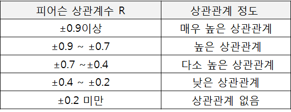


### 상관계수

- 두 변량 X, Y 사이의 상관관계의 정도를 나타내는 수치(계수)이다.

- -1과 1사이의 값을 가지며, 절대값이 1에 가까울수록 두 변량 간의 상관관계의 정도가 높은 것으로 볼 수 있다.

- 상관계수로 두 변량의 인과관계는 알 수 없다. 

- 상관계수로 두 변량의 선형 관계만 파악할 수 있다


### 상관계수 r과 상관관계 정도

- 완전 정(+) 상관관계는 X의 값이 증가하면 Y의 값도 증가하는 형태로 r=1이며, 완전 부(-) 상관관계는 x의 값이 증가하면 y의 값은 감소하는 형태로 r=-1이다.

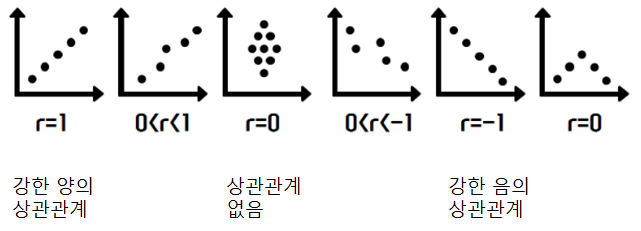

### 상관계수 보기

- 변수 간의 상관계수는 stats 패키지에서 제공되는 cor() 함수를 이용

  

- corrgram() 은 상관계수와 상관계수에 따라서 색의 농도로 시각화해 준다.

- 서열척도로 구성된 변수에 대해서 상관계수를 구하기 위해서는 spearman을 적용할 수 있다.

- 대상 변수가 등간척도 또는 비율척도일 때 피어슨(Pearson) 상관계수를 적용할 수 있다

### 상관관계 분석의 유형  

- 단순 상관 관계 

- 다중 상관 관계 – 둘 이상의 변수들이 어느 한 변수와 관계를 갖는 경우 그 정도를 파악

- 편(Partial) 상관관계 

- 부분(Semi partial) 상관 관계


### 상관분석(correlation Analysis)

- 데이터 내의 두 변수간의 관계를 알아보기 위한 분석 방법
- 상관계수(Correlation coefficient)를 이용
- 상관분석은 연속형, 순서형 자료를 대상으로 하고, 범주형은 불가능함
- 두 변수 간의 연관된 정도만 제시하고 있으며 회귀분석을 통해 두 변수 간 원인과 결과의 인과관계의 방향, 정도, 모형 적합을 통한 함수관계를 검토할 수 있음
- 두 변수의 상관성에 대한 예측이므로, 가설과 검증을 통해 통계적 유의성을 판단
- 등간성이나 비율성이 존재하지 않음
- 결정계수(R square)는 상관계수를 제공하여 나오는 값으로, 회귀분석에서 설명력을 의미


### 상관분석 절차

1. 변수들 간의 산점도 그리기

2. 산점도를 통해 직선관계를 파악

3. 상관계수 계산

4. 상관계수로 자료 해석

5. 상관관계의 유무, 정도에 따라 회귀분석 실시


### 상관분석 유형

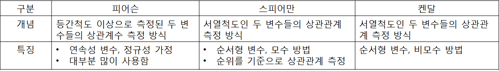


### 상관계수의 유의성 검정

- “상관계수는 0이다＂라는 귀무가설을 기각할 수 있는지 검정
- “유의 확률(양측검정) < 0.05인 경우 상관계수가 있다“ 고 할 수 있음


### 상관계수의 해석

- -1 < 상관계수 < -0.7 : 강한 음의 선형관계

- -0.7 < 상관계수 < -0.3 : 뚜렷한 음의 선형 관계

- -0.3 < 상관계수 < -0.1 : 약한 음의 선형 관계

- -0.1 < 상관계수 < 0.1 : 무시될 수 있음

- 0.1 < 상관계수 < 0.3 :  약한 양의 선형 관계

- 0.3 < 상관계수 < 0.7 : 뚜렷한 양의 선형 관계

- 0.7 < 상관계수 < 1.0 : 강한 양의 선형 관계


```R
> result <- read.csv("./data4/product.csv", header=TRUE)
> head(result)
  제품_친밀도 제품_적절성 제품_만족도
1           3           4           3
2           3           3           2
3           4           4           4
4           2           2           2
5           2           2           2
6           3           3           3
> str(result)
'data.frame':	264 obs. of  3 variables:
 $ 제품_친밀도: int  3 3 4 2 2 3 4 2 3 4 ...
 $ 제품_적절성: int  4 3 4 2 2 3 4 2 2 2 ...
 $ 제품_만족도: int  3 2 4 2 2 3 4 2 3 3 ...
> summary(result)
  제품_친밀도     제품_적절성   
 Min.   :1.000   Min.   :1.000  
 1st Qu.:2.000   1st Qu.:3.000  
 Median :3.000   Median :3.000  
 Mean   :2.928   Mean   :3.133  
 3rd Qu.:4.000   3rd Qu.:4.000  
 Max.   :5.000   Max.   :5.000  
  제품_만족도   
 Min.   :1.000  
 1st Qu.:3.000  
 Median :3.000  
 Mean   :3.095  
 3rd Qu.:4.000  
 Max.   :5.000  
> sd(result$제품_친밀도); sd(result$제품_적절성); sd(result$제품_만족도)
[1] 0.9703446
[1] 0.8596574
[1] 0.8287436

> cor(result$제품_친밀도, result$제품_적절성)
[1] 0.4992086
> cor(result$제품_적절성, result$제품_만족도)
[1] 0.7668527
> cor(result$제품_친밀도+result$제품_적절성, result$제품_만족도)
[1] 0.7017394

```


### 상관계수에 따라 색의 농도로 시각화

```R
> library(corrgram)
> corrgram(result)
> corrgram(result, upper.panel=panel.conf) #위쪽에 상관계수 추가
> corrgram(result, lower.panel=panel.conf) #아래쪽에 상관계수 추가

```

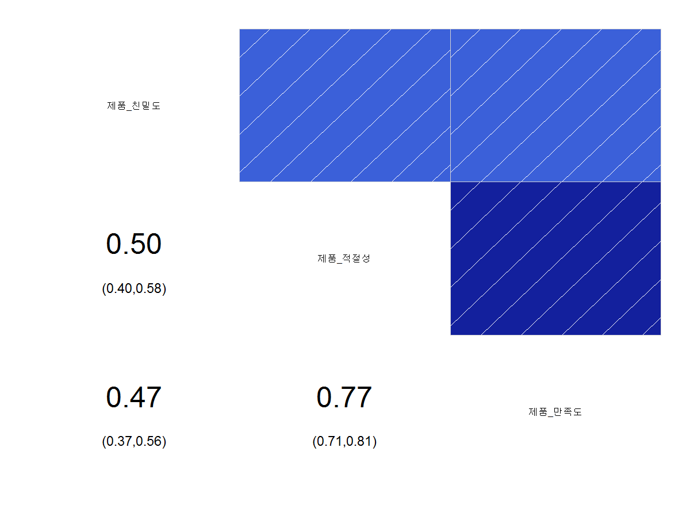


### 상관성, 밀도곡선, 유의확률 시각화

```R
> library(PerformanceAnalytics)
> # 상관성, p값(*), 정규분포 시각화
> chart.Correlation(result, histogram=, pch="+")

```

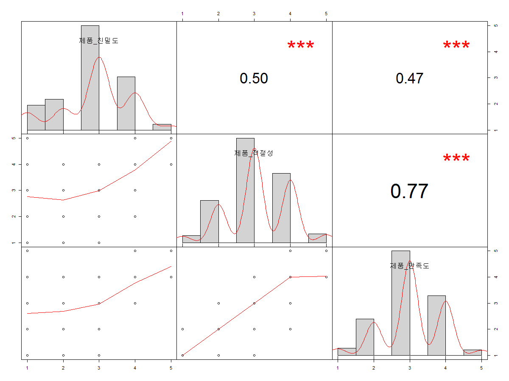


## 예측분석 지도학습

### 기계학습(Machine Learning)

- 알고리즘을 통해서 기계(컴퓨터, 로봇 등)에게 학습을 시킨 후 새로운 데이터가 들어오는 경우 해당 데이터의 결과를 예측하는 학문 분야
- 인간과 로봇과의 상호작용, 포털 사이트에서 검색어 자동 완성 기능, 악성 코드 탐지, 문자인식, 기계 오작동으로 인한 사고 발생 가능성 등을 예측하는 분야에서 이용된다.
- 데이터를 통해서 반복 학습으로 만들어진 모델을 바탕으로 최적의 판단이나 예측을 가능하게 해주는 것을 목표로 한다


### 기계학습 분류

- 지도학습 – 사전에 입력과 출력에 대한 정보를 가지고 있는 상태에서 입력이 들어오는 경우 해당 출력이 나타나는 규칙을 발견(알고리즘 이용) 하고, 만들어진 모델(model)에 의해서 새로운 데이터를 추정 및 예측한다.

- 비지도학습 – 최종적인 정보가 없는 상태에서 컴퓨터 스스로 공통점과 차이점 등의 패턴을 이용해서 규칙을 생성하고, 규칙을 통해서 분석 결과를 도출하는 방식

- 비지도학습은 유사한 데이터를 그룹화해주는 군집화와 군집 내의 특성을 나태내는 연관분석 방법에 주로 이용된다  


### 지도학습과 비지도학습의 차이 비교

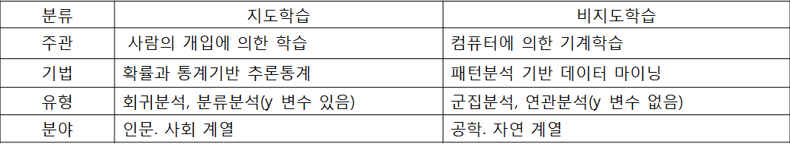


### 혼돈 매트릭스(Confusion Matrix)

- 기계학습에 의해서 생성된 분류분석 모델의 성능을 지표화 할 수 있는 테이블로 모델에 의해서 예측한 값은 열(column)로 나타나고, 관측치의 값은 행(row)로 표시된다.

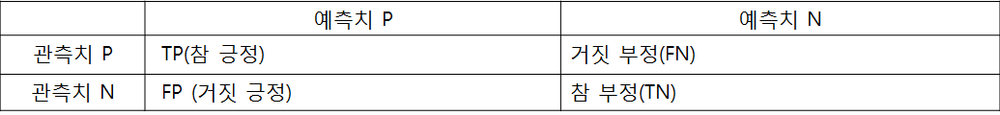


- 정분류율(Accuracy)  = (TP +TN) / 전체관측치(TN+FP+FN+TP)
   모델이 Yes로 판단한 것 중에서 실제로 Yes인 비율

- 오분류율(Inaccuracy)  = (FN +FP) / 전체관측치(TN+FP+FN+TP) = 1- 정분류율

- 정확율(Precision)  = TP  / (TP +FP) 

- 재현율(Recall)  = TP  / (TP +FN) 
   관측치가 Yest인 것 중에서 모델이 Yes로 판단한 비율

- F1 점수(F1 score)  =(2 * (Precision * Recall) / (Precision + Recall)
   기계학습에서 Y변수가 갖는 1(Yes)과 0(No)의 비율이 불균형을 이루는 경우 모델의 평가결과로 F1 점수를 주로 이용한다.


### 지도 학습 절차  

- 단계 1] 학습데이터를 대상으로 알고리즘 (회귀, 분류 관련)적용

- 단계 2] 학습 후 모델 생성

- 단계 3] 검정데이터를 이용하여 생성된 모델의 정확도를 평가


### 회귀분석 (Regression Analysis)

- 특정변수(독립변수)가 다른 변수(종속변수)에  어떠한 영향을 미치는가를 분석하는 방법

- 인과관계가 있는지 등을 분석하기 위한 방법

- 한 변수의 값을 가지고 다른 변수의 값을 예측해 주는 분석 방법


#### 회귀분석 (Regression Analysis)  중요사항

- 가장 강력하고, 사용 범위가 넓은 분석 방법

- 돌깁변수가 종속변수에 영향을 미치는 변수를 규명하고, 이들 변수에 의해서 회귀 방정식(Y=a+βX -> Y:종속변수, a:상수, β:회귀계수, X: 독립변수)을 도출하여 회귀선을 추정한다

- 회귀계수(β)는 단위시간에 따라 변하는 양(기울기)

- 회귀선은 산점도에 위치한 각 점들의 정중앙을 통과하는 직선을 추정하는 최소제곱법을 이용

- 독립변수와 종속변수가 모두 등간척도 또는 비율척도로 구성되어 있어야 한다.


#### 회귀방정식의 이해

- 독립변수(X)와 종속변수(Y)에 대한 분포를 나타내는 산점도를 대상으로 최소자승의 원리를 적용하여 가장 적합한 선을 그릴 수 있다 (회귀선)

- 회귀선은 두 집단의 분포에서 잔차(각 값들과 편차)들의 제곱의 합을 최소화시키는(최소제곱법) 회귀방정식에 의해서 만들어진다.  


#### 단순 회귀분석 (Regression Analysis)

- 독립변수와 종속변수가 각각 한 개일 경우 독립변수가 종속변수에 미치는 인과관계 등을 분석하고자 할 때 이용하는 분석 방법

##### 회귀분석 (Regression Analysis)의 기본적인 가정 충족

- 선형성 : 독립변수와 종속변수가 선형적이어야 한다. – 회귀선 확인

- 잔차 정규성 : 잔차(오차)란 종속변수의 관측값과 회귀모델의 예측값 간의 차이로 잔차의 기대값은 0이며, 정규분포를 이루어야 한다 – 정규성 검정 확인

- 잔차 독립성 : 잔차들은 서로 독립적이어야 한다. – 더빈 왓슨 값 확인

- 잔차 등분산성 : 잔차들의 분산이 일정해야 한다 – 표준잔차와 표준예측치 도표

- 다중 공산성 : 다중 회귀분석을 수행할 경우 3개 이상의 독립변수 간의 강한 상관관계로 인한 문제가 발생하지 않아야 한다. – 분산팽창요인(VIF) 확인


##### 회귀분석 (Regression Analysis)의 분석 절차

단계1] 회귀분석의 기본적인 가정이 충족되는지 확인한다. – 회귀분석의 기본적인 가정 충족 

단계2] 분산분석의 F 값으로 회귀모형의 유의성 여부를 판단한다

단계3] 독립변수와 종속변수 간의 상관관계와 회귀모형의 설명력을 확인한다

단계4] 검정 통계량 t값에 대한 유의확률을 통해서 가설의 채택 여부를 결정한다.

단계5] 회귀방정식을 적용하여 회귀식을 수립하고 결과를 해석한다.


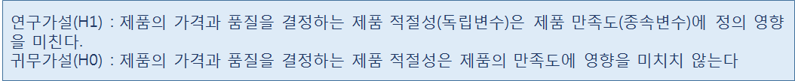


##### 회귀분석(Regression Analysis)의 분석

- 데이터로부터 독립변수와 종속변수 생성

- 단순 선형회귀 모델 생성 – stats 패키지의 lm()

- 모델의 적합값과 잔차 보기(계산)

- 선형회귀분석 모델 시각화  - 회귀선  


##### 회귀 방정식  Y=α + βX

- α  : 절편,  β : 회귀계수, X: 독립 변수, Y: 종속변수

- 절편(Intercept)는 x가 0일때 y값을 의미하고,

- 기울기(gradient)는 x값의 변화에 따른 y 값의 변화하는 정도를 의미

- fitted.values() – 모델의 적합값 확인

- residuals() – 모델의 잔차 확인

- 잔차와 적합값의 합으로 관측값을 계산 할 수 있다


##### 회귀선(regression line)

- 두 변수 간의 예측관계에서 한 변수에 의해서 예측되는 다른 변수의 예측치들이  그 변수의 평균치로 회귀하는 경향이 있다고 하여 갈톤(Galton)에 의해서 명명됨

- 한 변수의 증감이 다른 변수의 단위증가에 대해 어느 정도인가를 나타내는 선을 의미

##### 회귀 분석 결과는 요약 통계량을 구할 때 summary() 이용하여 확인할 수 있다


##### 단순회귀분석 R

```R
> product <- read.csv("./data4/product.csv", header = TRUE)
> head(product)
  제품_친밀도 제품_적절성 제품_만족도
1           3           4           3
2           3           3           2
3           4           4           4
4           2           2           2
5           2           2           2
6           3           3           3
> str(product)
'data.frame':	264 obs. of  3 variables:
 $ 제품_친밀도: int  3 3 4 2 2 3 4 2 3 4 ...
 $ 제품_적절성: int  4 3 4 2 2 3 4 2 2 2 ...
 $ 제품_만족도: int  3 2 4 2 2 3 4 2 3 3 ...


# 단순 선형회귀 모델 생성 lm(y~x, data)
> y<-product$제품_만족도  #종속변수
> x<-product$제품_적절성  #독립변수
> df <- data.frame(x, y)

> library(stats)
> result.lm <- lm(formula=y~x, data=df)
> result.lm

Call:
lm(formula = y ~ x, data = df)

Coefficients:
(Intercept)            x  
     0.7789       0.7393  


# Y=0.7789 +0.7393*X 

> #생성된 선형회귀 모델의 적합값과 찬차 계산
> names(result.lm)
 [1] "coefficients"  "residuals"    
 [3] "effects"       "rank"         
 [5] "fitted.values" "assign"       
 [7] "qr"            "df.residual"  
 [9] "xlevels"       "call"         
[11] "terms"         "model"        
> fitted.values(result.lm)[1:2] #모델의 적합값 확인
       1        2 
3.735963 2.996687 
> head(df, 1) #관측값 x=4, y=3
  x y
1 4 3
> Y = 0.7798 + 0.7393*4
> Y
[1] 3.737

#오차는 관측값 - 적합값
#3 - 3.735963 #-0.735963

> residuals(result.lm)[1:2]
         1          2 
-0.7359630 + -0.9966869 

#관측값은 잔차 + 적합값
0.7359630 + 3.735963 # 3 
```


#####   

#### 다중 회귀분석 (Regression Analysis)

- 여러 개의 독립변수가 동시에 한 개의 종속변수에 미치는 영향을 분석할 때 이용하는 분석방법

- 다수의 독립변수가 투입되기 때문에 한 독립변수가 다른 독립변수들에 의해서 설명되지 않은 부분을 의미하는 공차한계(Tolerance)와 공차한계의 역수로 표시되는 분산팽창요인(VIF)으로 다중 공선성에 문제가 없는지를 확인해야 한다.

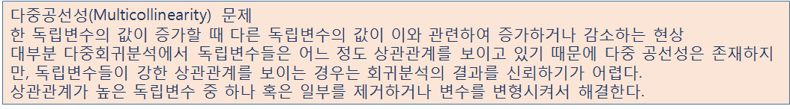


##### 다중 공선성 문제 해결과 모델 성능 평가

- 학습데이터와 검정데이터를 7:3 비율로 샘플링

- 표본 추출

- 다중 공선성 문제 해결 – 강한 상관관계를 갖는 독립변수를 제거하여 해결

- 학습 데이터로부터 회귀모델 생성

- 검정 통계량 분석하여 가설 검정

- 검정 데이터를 이용하여 모델의 예측치 생성 – stats패키지의 predict() 

- 회귀 모델 성능을 평가 – 상관계수를 이용 , 모델의 예측치(pred)와 검정데이터의 종속변수(y)를 이용하여 상관계수(r) 를 구하여 모델의 분류정확도를 평가한다


- 회귀분석은 선형성, 다중 공선성, 잔차의 정규성 등 몇 가지 기본 가정이 총족되어야 수행 할 수 있는 모두 검정 방법이다.

##### 회귀 모델의 결과변수를 대상으로 잔차(오차) 분석과 다중 공선성 검사를 통해서 회귀분석의 기본 가정이 충족하는지 확인 실습

- 잔차의 독립성 검정을 위해서 ‘lmtest’ 패키지의 dwtest() 의 인수로 회귀모델의 결과 변수를 적용하여 더빈 왓슨값을 확인

- 더빈 왓슨값의 p-value가 0.05이상 (DW값 1~3범위)이면 잔차에 유의미한 자기 상관이 없다고 볼 수 있다.  즉 ‘독립성과 차이가 없다’

- 독립변수(X)의 값에 대응하는 종속변수(Y)의 분산이 독립변수의 모든 값에 대해서 같다는 의미인 등분산성 검정을 위해서 회귀모델의 결과변수를 plot()함수의 인수로 적용하여 시각화를 통해서 등분산성 여부를 확인할 수 있다.

- 잔차(Residudals) 0을 기준으로 적합값(Fitted values)의 분포가 좌우균등하면 잔차들은 ‘등분산성과 차이가 없다’라고 볼 수 있다.

- 잔차의 정규성 검정을 위해서 회귀모델의 결과변수를 대상으로 잔차를 추출하고, shapiro.test() 함수를 이용하여 정규성을 검정


##### 다중회귀분석R

```R
> product <- read.csv("./data4/product.csv", header=TRUE)
> head(product)
  제품_친밀도 제품_적절성 제품_만족도
1           3           4           3
2           3           3           2
3           4           4           4
4           2           2           2
5           2           2           2
6           3           3           3
> str(product)
'data.frame':	264 obs. of  3 variables:
 $ 제품_친밀도: int  3 3 4 2 2 3 4 2 3 4 ...
 $ 제품_적절성: int  4 3 4 2 2 3 4 2 2 2 ...
 $ 제품_만족도: int  3 2 4 2 2 3 4 2 3 3 ...

> y<-product$제품_만족도       #종속변수
> x1<-product$제품_적절성     #독립변수1
> x2<-product$제품_clsalfeh   #독립변수2


> x1<-product$제품_적절성     #독립변수1
> x2<-product$제품_친밀도  #독립변수2
> df <- data.frame(x1, x2, y) 
> #다중 회귀 분석
> result.lm <- lm(formula=y~x1+x2, data=df)
> result.lm    #절편(0.66731)과 기울기(x1:0.09593, x2:0.68522) 확인

Call:
lm(formula = y ~ x1 + x2, data = df)

Coefficients:
(Intercept)           x1           x2  
    0.66731      0.68522      0.09593  

> library(car)
> vif(result.lm)     #분산팽창요인(VIF) - 결과값이 10 이상인 경우에는 다중 공선성문제를 의심해 볼수 있습니다. 
      x1       x2 
1.331929 1.331929 


> summary(result.lm)

Call:
lm(formula = y ~ x1 + x2, data = df)

Residuals:
     Min       1Q   Median       3Q      Max 
-2.01076 -0.22961 -0.01076  0.20809  1.20809 

Coefficients:
            Estimate Std. Error t value Pr(>|t|)    
(Intercept)  0.66731    0.13094   5.096 6.65e-07 ***
x1           0.68522    0.04369  15.684  < 2e-16 ***
x2           0.09593    0.03871   2.478   0.0138 *  
---
Signif. codes:  
0 ‘***’ 0.001 ‘**’ 0.01 ‘*’ 0.05 ‘.’ 0.1 ‘ ’ 1

Residual standard error: 0.5278 on 261 degrees of freedom
Multiple R-squared:  0.5975,	Adjusted R-squared:  0.5945 
F-statistic: 193.8 on 2 and 261 DF,  p-value: < 2.2e-16

#x1는 제품의 적절성이 제품 만족도에 미치는 영향 t검정통계량 15.684, 
#x2는 제품의 친밀도가 제품 만족도에 미치는 영향 t검정통계량 2.478
#x1, x2의 유의 확률은 0.05보다 작기 때문에 제품 만족도에 양의 영향을 미친다(연구 가설 채택)

#상관계수(결정계수) 0.5975 다소 높은 상관관계를 나타냄, 설명력은 59.45%
#회귀모델의 적합성 f검정통계량 193.8, p-value < 2.2e-16이므로 0.05 보다 매우 낮으므로 회귀모델은 적합하다고 볼 수 있습니다.


```


##### 다중 공선성 문제 해결과 모델 평가

```R
> fit <- lm(formula= Sepal.Length ~ Sepal.Width+Petal.Length+Petal.Width, data=iris)
> fit

Call:
lm(formula = Sepal.Length ~ Sepal.Width + Petal.Length + Petal.Width, 
    data = iris)

Coefficients:
 (Intercept)   Sepal.Width  Petal.Length   Petal.Width  
      1.8560        0.6508        0.7091       -0.5565  

> #다중공선성 문제 확인
> vif(fit)
 Sepal.Width Petal.Length  Petal.Width 
    1.270815    15.097572    14.234335 

> cor(iris[, -5])
             Sepal.Length Sepal.Width Petal.Length
Sepal.Length    1.0000000  -0.1175698    0.8717538
Sepal.Width    -0.1175698   1.0000000   -0.4284401
Petal.Length    0.8717538  -0.4284401    1.0000000
Petal.Width     0.8179411  -0.3661259    0.9628654
             Petal.Width
Sepal.Length   0.8179411
Sepal.Width   -0.3661259
Petal.Length   0.9628654
Petal.Width    1.0000000
> #학습데이터와 검정 데이터를 7:3으로 표본 추출
> x <- sample(1:nrow(iris), 0.7*nrow(iris))  #70% 표본 추출, 행번호 추출
> train <- iris[x, ] #학습데이터 
> test <- iris[-x, ] #검정데이터


> #Petal.Width 변수를 제거한 후 학습데이터로부터 회귀모델 생성
> model <- lm(formula= Sepal.Length ~ Sepal.Width+Petal.Length, data=iris)
> model

Call:
lm(formula = Sepal.Length ~ Sepal.Width + Petal.Length, data = iris)

Coefficients:
 (Intercept)   Sepal.Width  Petal.Length  
      2.2491        0.5955        0.4719  


> summary(model)

Call:
lm(formula = Sepal.Length ~ Sepal.Width + Petal.Length, data = iris)

Residuals:
     Min       1Q   Median       3Q      Max 
-0.96159 -0.23489  0.00077  0.21453  0.78557 

Coefficients:
             Estimate Std. Error t value Pr(>|t|)    
(Intercept)   2.24914    0.24797    9.07 7.04e-16 ***
Sepal.Width   0.59552    0.06933    8.59 1.16e-14 ***
Petal.Length  0.47192    0.01712   27.57  < 2e-16 ***
---
Signif. codes:  
0 ‘***’ 0.001 ‘**’ 0.01 ‘*’ 0.05 ‘.’ 0.1 ‘ ’ 1

Residual standard error: 0.3333 on 147 degrees of freedom
Multiple R-squared:  0.8402,	Adjusted R-squared:  0.838 
F-statistic: 386.4 on 2 and 147 DF,  p-value: < 2.2e-16

#꽃받침의 너비가 꽃받침의 길이에 영향을 미친다.
#꽃잎의 길이가 꽃받침의 길이에 영향을 준다.
```


##### 검정데이터에 회귀모델 적용 예측값 생성 후 모델 평가

```R
> head(train, 1)
   Sepal.Length Sepal.Width Petal.Length Petal.Width
57          6.3         3.3          4.7         1.6
      Species
57 versicolor


> Y=2.2491 + 0.5955*3.3 + 0.4719*5.7
> Y
[1] 6.90408 #회귀모델로부터 계산된 예측값

#오차 = 예측값 - 관측값 (6.90408-6.7) = 0.20408

> pred <- predict(model, test)
> pred
       4        5        9       10       11       12 
4.803147 5.053717 4.636850 4.803147 5.160462 5.028996 
      24       36       37       38       44       48 
5.016636 4.721123 4.946973 5.053717 5.088549 4.815507 
      50       52       55       56       61       66 
4.875060 6.278460 6.087442 6.040250 5.091910 6.171715 
      67       68       69       72       79       80 
6.159355 5.791929 5.682935 5.804290 6.099802 5.449225 
      81       83       94      100      103      110 
5.471696 5.697545 5.176183 5.851482 6.820043 7.271741 
     112      113      114      115      118      123 
6.358233 6.631275 6.097552 6.323402 7.673998 7.078474 
     126      129      130      132      136      141 
6.986340 6.559362 6.772851 7.532422 6.914427 6.738019 
     142      143      150 
6.502059 6.263849 6.442507 

#모델 평가는 상관계수를 이용하여 모델의 정확도를 평가합니다.
cor(pred, test$Sepal.Length) 
# 예측치와 실제 관측치는 상관계수가 0.9419519 이므로 매우 높은 상관관계를 보인다고 할 수 있으며, 
# 모델의 정확도가 아주 높다고 볼 수 있습니다.
```


```R
#단계1 : 학습데이터(train), 검정데이터(test)를 7 : 3 비율로 샘플링
product <- read.csv("./data5/product2.csv", header=TRUE)
> x <- sample(1:nrow(product), 0.7*nrow(product))
> x
  [1] 163 227 204  57  29 127  55 215  23 165 190 118 132
 [14] 205   7 251 224  76  84 191 141 238  73 229  75 253
 [27] 185 192 223  98 218 187 241 121 256  61 161  71 105
 [40] 164 151 176  87  28  49 123 243 259 133   2  90  38
 [53] 230 178  36  53  42 219 110 156 157  21 166 112 140
 [66] 124 100 213  91   3  97 228  80 240  35  17  22 102
 [79]  50 193  20  32 160 216 159 171 222 263  48 258 168
 [92] 217 158  12 200 220 188 196  19  86  11 174 129   8
[105] 206  96 146 202 208  16 183 199   4  94 103  13 143
[118] 117 169  34 149  85  24 108 225  63  14 195 194 122
[131] 162 236 250 179  83 221 233  51 126 234 130 264  46
[144] 153  37 106 214  27 173  54 101 147  10 197 207 245
[157] 128 131  65  26 154 134  67  33  41  66 237 136 142
[170] 261 167 210 180 145 252 231 235 138 244 152 148 209
[183] 249 255


#단계2 : 학습데이터 이용 회귀모델 생성
train <- product[x, ] #학습데이터 
test <- product[-x, ] #검정데이터


#변수 모델링) y변수 : 제품_만족도, x변수 : 제품_적절성, 제품_친밀도

> model <- lm(formula= 제품_만족도 ~ 제품_적절성+제품_친밀도, data=train)
> model

Call:
lm(formula = 제품_만족도 ~ 제품_적절성 + 제품_친밀도, data = train)

Coefficients:
(Intercept)  제품_적절성  제품_친밀도  
     0.7023       0.6307       0.1378  

> summary(model)

Call:
lm(formula = 제품_만족도 ~ 제품_적절성 + 제품_친밀도, data = train)

Residuals:
    Min      1Q  Median      3Q     Max 
-2.0080 -0.2394 -0.0080  0.2235  1.2676 

Coefficients:
            Estimate Std. Error t value Pr(>|t|)    
(Intercept)  0.70234    0.15310   4.588 8.35e-06 ***
제품_적절성  0.63073    0.05568  11.327  < 2e-16 ***
제품_친밀도  0.13782    0.04965   2.776  0.00609 ** 
---
Signif. codes:  
0 ‘***’ 0.001 ‘**’ 0.01 ‘*’ 0.05 ‘.’ 0.1 ‘ ’ 1

Residual standard error: 0.5251 on 181 degrees of freedom
Multiple R-squared:  0.5929,	Adjusted R-squared:  0.5884 
F-statistic: 131.8 on 2 and 181 DF,  p-value: < 2.2e-16


#단계3 : 검정데이터 이용 모델 예측치 생성
> head(train, 1)
    제품_친밀도 제품_적절성 제품_만족도
163           3           3           3
> Y=0.66731 + 0.68522*3 + 0.09593*3
> Y
[1] 3.01076 #예측값


#단계4 : 모델 평가 : cor() 함수 이용

> pred <- predict(model, test) # 예측치 생성
> cor(pred, test$제품_만족도) # 모델 평가
[1] 0.7786382

# 예측치와 실제 관측치는 상관계수가 0.7786382 이므로 높은 상관관계를 보인다고 할 수 있으며, 
# 모델의 정확도가 높다고 볼 수 있습니다.
```


```R
02] ggplot2패키지에서 제공하는 diamonds 데이터 셋을 대상으로 carat, table, depth 변수
중 다이아몬드의 가격(price)에 영향을 미치는 관계를 다중회귀 분석을 이용하여 예측하
시오.
조건1) 다이아몬드 가격 결정에 가장 큰 영향을 미치는 변수는?

> formula <- price ~ carat + table + depth
> head(diamonds)
# A tibble: 6 x 10
  carat cut   color clarity depth table price     x     y
  <dbl> <ord> <ord> <ord>   <dbl> <dbl> <int> <dbl> <dbl>
1 0.23  Ideal E     SI2      61.5    55   326  3.95  3.98
2 0.21  Prem~ E     SI1      59.8    61   326  3.89  3.84
3 0.23  Good  E     VS1      56.9    65   327  4.05  4.07
4 0.290 Prem~ I     VS2      62.4    58   334  4.2   4.23
5 0.31  Good  J     SI2      63.3    58   335  4.34  4.35
6 0.24  Very~ J     VVS2     62.8    57   336  3.94  3.96
# ... with 1 more variable: z <dbl>
> result <- lm(formula, data=diamonds)
> summary(result) # 회귀분석 결과

Call:
lm(formula = formula, data = diamonds)

Residuals:
     Min       1Q   Median       3Q      Max 
-18288.0   -785.9    -33.2    527.2  12486.7 

Coefficients:
             Estimate Std. Error t value Pr(>|t|)    
(Intercept) 13003.441    390.918   33.26   <2e-16 ***
carat        7858.771     14.151  555.36   <2e-16 ***
table        -104.473      3.141  -33.26   <2e-16 ***
depth        -151.236      4.820  -31.38   <2e-16 ***
---
Signif. codes:  
0 ‘***’ 0.001 ‘**’ 0.01 ‘*’ 0.05 ‘.’ 0.1 ‘ ’ 1

Residual standard error: 1526 on 53936 degrees of freedom
Multiple R-squared:  0.8537,	Adjusted R-squared:  0.8537 
F-statistic: 1.049e+05 on 3 and 53936 DF,  p-value: < 2.2e-16


조건2) 다중회귀 분석 결과를 양(+)과 음(-) 관계로 해설
해설>carat은 price에 정(+)의 영향을 미치지만, table과 depth는 부(-)의 영향을 미친다.


```


## R복습


- 단일 집단을 대상으로 전. 후에 대해 표본 추출해서 비율의 차이 비교  검정 - binom.test() (유의순준과 유의확률)

- 단일 집단을 평균이 어떤 특정한 집단의 평균과의 차이를 검정을 위해서 단일 집단의 평균이 정규분포를 이루

- 는지 먼저 검정 -shapiro.test()

- 단일 집단을 평균이 정규분포를 따르는 경우 t.test() (유의확률과 t검정통계량)

- 단일 집단을 평균이 정규분포를 따르지 않는 경우 wilcox.text()

  

- 두집단을 대상으로 비율 검정 (독립표본 이항분포 비율 검정) - prop.test()

- 두집단을 대상으로 평균 검정 ->  두 집단의 평균의 정규분포가 동일한지 검정 (동질성 검정 -var.test() )

- 두 집단의 평균이 정규분포를 따르는 경우 t.test()

- 두 집단의 평균이 정규분포를 따르지 않는 경우 wilcox.text()

  

- 대응 두 집단 (예] 교수법 전, 교수법 후 동일 대상의 서로 다른 점수)의 평균 차이 비교

- 대응 두 집단의 평균의 정규분포가 동일한지 검정 (동질성 검정 -var.test() )

- 대응 두 집단의 평균이 정규분포를 따르는 경우 t.test()

- 대응 두 집단의 평균이 정규분포를 따르지 않는 경우 wilcox.text()

  

- 세 집단 대상으로 비율 검정 - prop.test()

- 세 집단 대상으로 평균 검정 - 분산분석, F검정

- 세 집단의 평균의 정규분포가 동일한지 검정 (동질성 검정 - bartlett.test())

- 세 집단의 평균이 정규분포를 따르는 경우 aov()

- 세 집단의 정규분포를 따르지 않는 경우 kruskal.test()

- 사후 검정 TukeyHSD()

  

- 요인 분석 - 다수의 변수를 대상으로 변수간의 관계를 분석하여 결과를 이용하여 상관분석이나 회귀분석의 설명변수 (독립변수)로 활용하기 위해 수행하는 분석

- 변수의 주요 성분 분석 요인수를 알아보려면
  1. 주성분 분석 - prcomp()
  2. 고유값(변수의 상관계수 행렬)으로 요인수 분석 - eigen() 

- 변수들간의 상관관계 분석으로 요인 분석 - 변수들간의 상관성을 이용해서 공통요인 추출 factenal(dataset, factors="", rotation="")


```R
> result <- read.csv("./data4/product.csv", header=TRUE)
#선형회귀분석 모델 시각화
> plot(formula= y~x, data=result)
> abline(result.lm, col="red") #회귀선
> #선형회귀분석 결과
> summary(result.lm)

Call:
lm(formula = y ~ x, data = df)

Residuals:
     Min       1Q   Median       3Q 
-1.99669 -0.25741  0.00331  0.26404 
     Max 
 1.26404 

Coefficients:
            Estimate Std. Error t value
(Intercept)  0.77886    0.12416   6.273
x            0.73928    0.03823  19.340
            Pr(>|t|)    
(Intercept) 1.45e-09 ***
x            < 2e-16 ***
---
Signif. codes:  
  0 ‘***’ 0.001 ‘**’ 0.01 ‘*’ 0.05
  ‘.’ 0.1 ‘ ’ 1

Residual standard error: 0.5329 on 262 degrees of freedom
Multiple R-squared:  0.5881,	Adjusted R-squared:  0.5865 
F-statistic:   374 on 1 and 262 DF,  p-value: < 2.2e-16


# Multiple R-squared:  0.5881 는 독립변수에 의해서 종속변수가 얼마만큼 설명되었는가 (회귀모델의 설명력)
# Multiple R-squared 값은 독립변수와 종속변수 간의 상관관계를 나타내는 결정계수
# 설명력이 1에 가까울수록 설명변수(독립변수)가 설명을 잘한다고 판단할 수 있습니다. => 변수의 모델링이 잘 되었다는 의미

#Adjusted R-squared:  0.5865은 오차를 감안하여 조정된 R 값으로 (실제 분석은 이 값을 적용합니다.)

#F-statistic:   374 회귀모델의 적합성을 나타내며    
#p-value: < 2.2e-16 
#F-statistic와 p-value를 이용하여 회귀모델 자체를 신뢰할 수 있는지 판단
#p-value가 0.05보다 매우 작기 때문에 회귀선이 모델에 적합하다고 볼 수 있습니다.

#x            0.73928    0.03823  19.340  < 2e-16 ***
#x변수의 t=19.340 , p-value는 < 2e-16 이므로  p-value가 0.05보다 매우 작기 때문에 "제품의 가격과 품질을 결정하는 제품 적절성은 제품 만족도에 양의 영향을 미친다." 연구가설 채택


```


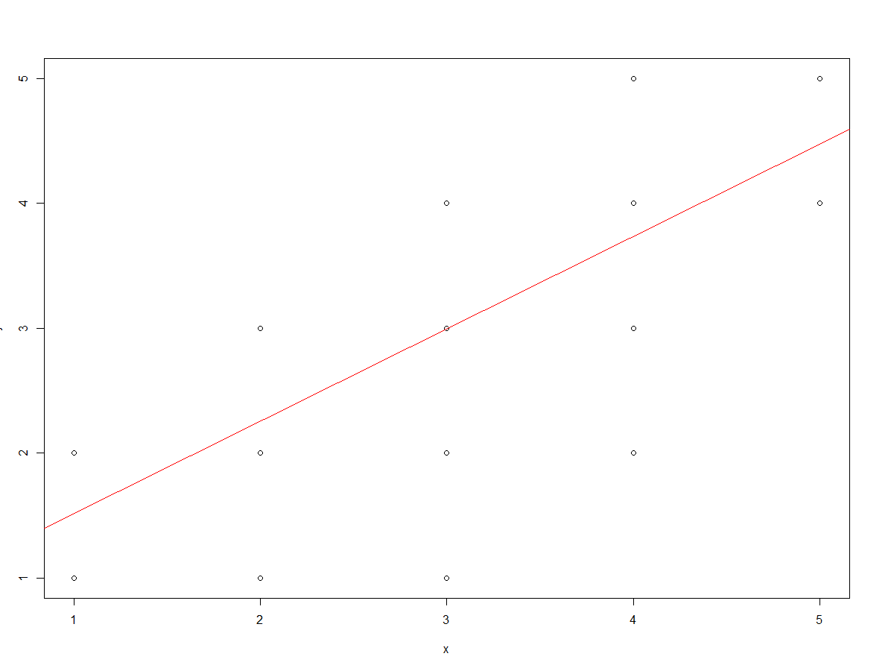


