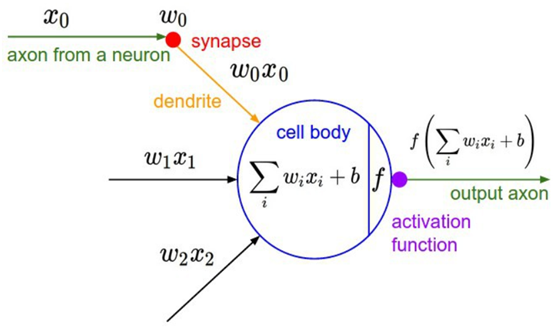

# R

## 분류분석

- 다수의 변수를 갖는 데이터 셋을 대상으로 특정 변수의 값을 조건으로 지정하여 데이터를 분류하고 트리 형태의 모델을 생성하는 분석 방법
- 의사결정트리(Decision Tree)
- 랜덤 포레스트(Random Forest)
- 인공신경망(Artificial Neural Network)
- 고객을 분류하는 변수, 규칙, 특성을 찾아내고 이를 토대로 미래 잠재 고객의 행동이나 반응을 예측하거나 유도하는데 활용된다.
  - 예) 대출 은행에서 기존 고객들의 데이터를 활용하여 신용상태의 분류모델을 생성한 후 새로운 고객에 대하여 향후 신용상태를 예측하는 데 이용한다 ( 분류 모델 생성 규칙 : 기존 체납횟수, 대출금과 현재 고객의 수입 비율, 대출 사유 등)
  - 예) 과거의 환자들에 대한 종양 검사의 결과를 바탕으로 종양의 악성 또는 양성 여부를 분류하는 모델을 생성하여 새로운 환자에 대한 암을 진단하는데 이용 ( 분류 조건 : 종양의 크기, 모양, 색깔)


### 분류 분석(Classification Analysis) 특징

- Y 변수 존재 : 설명변수(x 변수)와 반응변수(y 변수)가 존재한다.
- 의사결정트리 : 분류 예측모델에 의해서 의사결정트리 형태로 데이터가 분류된다.
- 비모수 검정 : 선형성, 정규성, 등분산성 가정이 필요 없다
- 추론 기능 : 유의수준 판단 기준이 없다 (추론 기능 없음)
- 활용분야 : 이탈고객과 지속고객 분류, 신용상태의 좋고, 나쁨, 번호이동고객과 지속 고객 분류 등


### 분류 분석(Classification Analysis) 절차

- 학습 데이터 생성
- 분류 알고리즘을 통해 예측 모델 생성
- 검정 데이터를 통해 분류규칙의 모델 평가(모형 평가)
- 새로운 데이터에 적용하여 결과 예측


### 의사 결정 트리(Decision Tree)

- 나무(Tree) 구조 형태로 분류결과를 도출

- 입력변수 중 가장 영향력 있는 변수를 기준으로 이진분류하여 분류 결과를 나무 구조 형태로 시각화

- 비교적 모델 생성이 쉽고, 단순, 명료하여 현업에서 많이 사용되는 지도학습 모델

- 의사결정규칙을 도표화 하여 분류와 예측을 수행하는 분석방법

- party 패키지 ctree()

- rpart 패키지 rpart()


### party 패키지 ctree()  분류 결과 해석

- 첫번째 번호는 반응변수(종속변수)에 대해서 설명변수(독립변수)가 영향을 미치는 중요 변수의 척도를 나타내는 수치로서 수치가 작을 수록 영향을 미치는 정도가 높고, 순서는 분기되는 순서를 의미한다.

- 두번째는 의사결정 트리의 노드명 (노드 번호 뒤에 * 기호가 오면 해당 노드가 마지막 노드를 의미)
   노드명 뒤에 해당 변수의 임계값이 조건식으로 온다

- 세번째는 노드의 분기 기준(criterion)이 되는 수치

- 네번째는 반응변수(종속변수)의 통계량(statistic)이 표시된다. 


### rpart 패키지 rpart()를 이용한 분류 분석

- 재귀분할(recursive partitioning)

- 2수준 요인으로 분산분석을 실행한 결과를 트리 형태로 제공하여 모형을 단순화

- 전체적인 분류기준을 쉽게 분석할 수 있는 장점이 있다


#### 뉴욕의 대기 질을 측정한 데이터셋

```R
> library(party)
필요한 패키지를 로딩중입니다: grid
필요한 패키지를 로딩중입니다: mvtnorm
필요한 패키지를 로딩중입니다: modeltools
필요한 패키지를 로딩중입니다: stats4
필요한 패키지를 로딩중입니다: strucchange
필요한 패키지를 로딩중입니다: zoo

다음의 패키지를 부착합니다: ‘zoo’

The following objects are masked from ‘package:base’:

    as.Date, as.Date.numeric

필요한 패키지를 로딩중입니다: sandwich
> library(datasets)
> #뉴욕의 대기 질을 측정한 데이터셋
> str(airquality) #관측치 15개, 변수 6개
'data.frame':	153 obs. of  6 variables:
 $ Ozone  : int  41 36 12 18 NA 28 23 19 8 NA ...
 $ Solar.R: int  190 118 149 313 NA NA 299 99 19 194 ...
 $ Wind   : num  7.4 8 12.6 11.5 14.3 14.9 8.6 13.8 20.1 8.6 ...
 $ Temp   : int  67 72 74 62 56 66 65 59 61 69 ...
 $ Month  : int  5 5 5 5 5 5 5 5 5 5 ...
 $ Day    : int  1 2 3 4 5 6 7 8 9 10 ...
> #Ozone, Solar.R(태양광), Wind, Temp, Month, Day
> #온도에 영향을 미치는 변수를 알아보기
> formula <- Temp ~ Solar.R + Wind+Ozone
> 
> #분류모델 생성
> air_tree <- ctree(formula, data=airquality)
> air_tree

	 Conditional inference tree with 5 terminal nodes

Response:  Temp 
Inputs:  Solar.R, Wind, Ozone 
Number of observations:  153 

1) Ozone <= 37; criterion = 1, statistic = 56.086
  2) Wind <= 15.5; criterion = 0.993, statistic = 9.387
    3) Ozone <= 19; criterion = 0.964, statistic = 6.299
      4)*  weights = 29 
    3) Ozone > 19
      5)*  weights = 69 
  2) Wind > 15.5
    6)*  weights = 7 
1) Ozone > 37
  7) Ozone <= 65; criterion = 0.971, statistic = 6.691
    8)*  weights = 22 
  7) Ozone > 65
    9)*  weights = 26 
> 
> plot(air_tree)

#온도에 가장 큰 영향을 미치는 첫번째 영향변수는 Ozone
# 두번째 영향변수는 Wind
# 오존량 37이하이면서 바람의 양이 15.5이상이면 평균온도는 63정도에 해당
#바람의 양이 15.5이하인 경우 평균 온도는 70이상으로 나타남
#태양광은 온도에 영향을 미치지 않는 것으로 분석됨

```


#### iris 데이터 셋으로 분류 분석 수행

```R
> set.seed(1234)
> idx <- sample(1:nrow(iris), nrow(iris)*0.7)
> train <- iris[idx, ] #학습 데이터
> test <- iris[-idx, ] #검정 데이터
> 
> #종속변수는 Species, 독립변수는 .....
> formula <- Species ~ Sepal.Length + Sepal.Width + Petal.Length + Petal.Width
> 
> #분류모델 생성
> iris_ctree <- ctree(formula, data = train)
> iris_ctree

	 Conditional inference tree with 4 terminal nodes

Response:  Species 
Inputs:  Sepal.Length, Sepal.Width, Petal.Length, Petal.Width 
Number of observations:  105 

1) Petal.Length <= 1.9; criterion = 1, statistic = 98.365
  2)*  weights = 34 
1) Petal.Length > 1.9
  3) Petal.Width <= 1.6; criterion = 1, statistic = 47.003
    4) Petal.Length <= 4.6; criterion = 1, statistic = 14.982
      5)*  weights = 28 
    4) Petal.Length > 4.6
      6)*  weights = 8 
  3) Petal.Width > 1.6
    7)*  weights = 35 

# 꽃종 분류에 가장 중요한 독립변수는 Petal.Length, Petal.Width
> plot(iris_ctree, type = "simple")
> plot(iris_ctree)


> # 분류모델 평가 - 예측치 생성, 혼돈 매트릭스 생성
> pred <- predict(iris_ctree, test)
> table(pred, test$Species)
            
pred         setosa versicolor virginica
  setosa         16          0         0
  versicolor      0         15         1
  virginica       0          1        12


> (16 + 15 + 12)/nrow(test)
[1] 0.9555556
#분류정확도 95.56%
```


#### rpart

- 재귀분할(recursive partitioning)

- 2수준 요인으로 분산분석을 실행한 결과를 트리 형태로 제공하여 모형을 단순화

- 전체적인 분류기준을 쉽게 분석할 수 있는 장점이 있다

```R
> iris.df <- rpart(Species ~., data = iris)
> iris.df
n= 150 

node), split, n, loss, yval, (yprob)
      * denotes terminal node

1) root 150 100 setosa (0.33333333 0.33333333 0.33333333)  
  2) Petal.Length< 2.45 50   0 setosa (1.00000000 0.00000000 0.00000000) *
  3) Petal.Length>=2.45 100  50 versicolor (0.00000000 0.50000000 0.50000000)  
    6) Petal.Width< 1.75 54   5 versicolor (0.00000000 0.90740741 0.09259259) *
    7) Petal.Width>=1.75 46   1 virginica (0.00000000 0.02173913 0.97826087) *
> 
> plot(iris.df)
> text(iris.df, use.n = T, cex=0.6)
> post(iris.df, file="")
> 
> #줄기에 분기 조건
> #끝 노드에드 반응변수의 결과값이 나타남
> # 꽃 종류 변수를 분류하는 가장 중요한 변수는 Petal.Length와 Petal.Width로 나타난다.

```


#### 분류분석 연습문제 3

```R
############분류분석 연습문제 3 ########################
weather <- read.csv("./data/weather.csv", header=TRUE)

#RainTomorrow 컬럼을 종속변수로 
# 날씨 요인과 관련없는 Date와 RainToday컬럼을 제외한 나머지 변수를 x변수로 지정하여 분류 모델 생성하고 모델을 평가하시오


> str(weather)
'data.frame':	366 obs. of  15 variables:
 $ Date         : Factor w/ 366 levels "2014-11-01","2014-11-02",..: 1 2 3 4 5 6 7 8 9 10 ...
 $ MinTemp      : num  8 14 13.7 13.3 7.6 6.2 6.1 8.3 8.8 8.4 ...
 $ MaxTemp      : num  24.3 26.9 23.4 15.5 16.1 16.9 18.2 17 19.5 22.8 ...
 $ Rainfall     : num  0 3.6 3.6 39.8 2.8 0 0.2 0 0 16.2 ...
 $ Sunshine     : num  6.3 9.7 3.3 9.1 10.6 8.2 8.4 4.6 4.1 7.7 ...
 $ WindGustDir  : Factor w/ 16 levels "E","ENE","ESE",..: 8 2 8 8 11 10 10 1 9 1 ...
 $ WindGustSpeed: int  30 39 85 54 50 44 43 41 48 31 ...
 $ WindDir      : Factor w/ 16 levels "E","ENE","ESE",..: 8 14 6 14 3 1 3 1 2 3 ...
 $ WindSpeed    : int  20 17 6 24 28 24 26 24 17 6 ...
 $ Humidity     : int  29 36 69 56 49 57 47 57 48 32 ...
 $ Pressure     : num  1015 1008 1007 1007 1018 ...
 $ Cloud        : int  7 3 7 7 7 5 6 7 7 1 ...
 $ Temp         : num  23.6 25.7 20.2 14.1 15.4 14.8 17.3 15.5 18.9 21.7 ...
 $ RainToday    : Factor w/ 2 levels "No","Yes": 1 2 2 2 2 1 1 1 1 2 ...
 $ RainTomorrow : Factor w/ 2 levels "No","Yes": 2 2 2 2 1 1 1 1 2 1 ...
> names(weather)
 [1] "Date"          "MinTemp"       "MaxTemp"      
 [4] "Rainfall"      "Sunshine"      "WindGustDir"  
 [7] "WindGustSpeed" "WindDir"       "WindSpeed"    
[10] "Humidity"      "Pressure"      "Cloud"        
[13] "Temp"          "RainToday"     "RainTomorrow" 
> weather.df <- rpart(RainTomorrow ~ ., data=weather[, c(-1, -14)], cp=0.01) 
> X11()
> plot(weather.df)
> text(weather.df, use.n=T, cex=0.7)
> 
> #분석 결과 : 분기조건이 True이면 왼쪽으로 분류되고, False
> 이면 오른쪽으로 분류된다.
Error: unexpected symbol in "이면 오른쪽으로"
> #rpart()함수의 cp속성값을 높이면 가지 수가 적어지고, 낮추면 가지 수가 많아진다. cp 기본값은 0.01
> 
> weather_pred <- predict(weather.df , weather)
> weather_pred
 
> #y의 범주로 코딩 변환 : Yes(0.5이상), No(0.5미만)
> #rpart의 분류모델 예측치는 비 유무를 0~1사이의 확률값으로 예측하다 
> # 혼돈매트릭스를 이용하여 분류정확도를 구하기 위해 범주화 코딩 변경
> weather_pred2 <- ifelse(weather_pred[,2] >= 0.5, 'Yes', 'No')
> table(weather_pred2, weather$RainTomorrow)
             
weather_pred2  No Yes
          No  278  13
          Yes  22  53

#정확도
> (53 + 278)/nrow(weather)
[1] 0.9043716


```


### k겹 교차 검증(k-fold cross validation)

- 테스트를 더 정확하게 설정할수록 세상으로 나왔을 때 더 잘 작동한다고 할 수 있습니다. 

- 딥러닝 혹은 머신러닝 작업을 할 때 늘 어려운 문제 중 하나는 알고리즘을 충분히 테스트하였어도 데이터가 충분치 않으면 좋은 결과를 내기가 어렵습니다

- 데이터의 약 70%를 학습셋으로 써야 했으므로 테스트셋은 겨우 전체 데이터의 30%에 그쳤습니다. 이 정도 테스트만으로는 실제로 얼마나 잘 작동하는지 확신하기는 쉽지 않습니다.

- k겹 교차 검증(k-fold cross validation)  - 테스트 데이터 충분하지 않을 경우  단점을 보완하고자 만든 방법이 바로 입니다. 

- k겹 교차 검증이란 데이터셋을 여러 개로 나누어 하나씩 테스트셋으로 사용하고 나머지를 모두 합해서 학습셋으로 사용하는 방법입니다. 이렇게 하면 가지고 있는 데이터의 100%를 테스트셋으로 사용할 수 있습니다. 


```R
> #k겹 교차 검증
> library(cvTools)
필요한 패키지를 로딩중입니다: lattice
필요한 패키지를 로딩중입니다: robustbase
> cross <- cvFolds(nrow(iris), K=3, R=2)
> str(cross)
List of 5
 $ n      : num 150
 $ K      : num 3
 $ R      : num 2
 $ subsets: int [1:150, 1:2] 21 102 134 9 19 22 40 29 109 38 ...
 $ which  : int [1:150] 1 2 3 1 2 3 1 2 3 1 ...
 - attr(*, "class")= chr "cvFolds"


> #k겹 교차 검증
> library(cvTools)
> cross <- cvFolds(nrow(iris), K=3, R=2)
> str(cross)
List of 5
 $ n      : num 150
 $ K      : num 3
 $ R      : num 2
 $ subsets: int [1:150, 1:2] 67 25 82 3 27 124 86 119 65 6 ...
 $ which  : int [1:150] 1 2 3 1 2 3 1 2 3 1 ...
 - attr(*, "class")= chr "cvFolds"
> cross  #교차검정 데이터 확인

Repeated 3-fold CV with 2 replications:    
Fold      1   2
   1     67   8
   2     25 143
   3     82 128
   1      3  68
   2     27 109
   3    124  56
   1     86  22
   2    119  53
   3     65  40
   1      6  27
   2    112 141
   3     64  84
   1    123 148
   2    114  95
   3     98 123
   1     24  74
   2     57 137
   3     31  32
   1     71 105
   2     97  45
   3    118 126
   1     41  39
   2     52 129
   3     35  26
   1     55  80
   2     92 127
   3    101  36
   1    135  28
   2     54   2
   3     94  93
   1    128 133
   2     69  97
   3     23  96
   1     37 118
   2    130  29
   3    148  81
   1    131  37
   2     88  69
   3     53 149
   1     90  66
   2     17  11
   3    133  64
   1    122 122
   2    143 150
   3    144 116
   1    129  10
   2     40  78
   3     93  47
   1    127  48
   2    139 135
   3     89  71
   1    111  41
   2     59  24
   3     16  30
   1     68  94
   2     28  51
   3      9  92
   1     91 119
   2    120 136
   3     33 102
   1     48 121
   2    134  50
   3     56  57
   1    145  13
   2     81  54
   3     87 120
   1     72 111
   2    146  23
   3    136  99
   1     58 104
   2     45 107
   3     84  86
   1     13 134
   2    147 106
   3     62 115
   1     30 108
   2    132 100
   3     34 147
   1     76  91
   2    105 131
   3    142   6
   1    138 103
   2     61 139
   3    137   7
   1     83 145
   2     49  43
   3     78 130
   1     19  44
   2     18  17
   3     63  77
   1    103  73
   2     85 142
   3    121 114
   1    108  90
   2    109  31
   3    116   1
   1    115  14
   2     32  59
   3     77  12
   1     12  89
   2    110  52
   3     44 117
   1      5  58
   2     96  76
   3     38  75
   1     39  42
   2     10  46
   3     74 138
   1      8  55
   2     22  21
   3     42 146
   1     95  34
   2     50  20
   3     11 112
   1      7 101
   2     43  35
   3     47  79
   1     79 125
   2    150  18
   3    141  85
   1    107   4
   2      2  19
   3    102  16
   1    126  67
   2    117 113
   3     73  82
   1     21  70
   2     26 110
   3     36  60
   1    104  63
   2     29 140
   3    125  65
   1     14  62
   2    113  33
   3     60  98
   1     80 124
   2     46 132
   3    140 144
   1     66  49
   2     99  88
   3     51  38
   1     75  72
   2      4   9
   3    100   5
   1     15  15
   2     20  61
   3      1  25
   1     70  87
   2    106   3
   3    149  83
> length(cross$which)
[1] 150
> dim(cross$subsets)
[1] 150   2
> table(cross$which)

 1  2  3 
50 50 50 
> R=1:2
> K=1:3
> CNT=0               #카운트 변수
> ACC <- numeric()    #정확도 저장

> for(r in R) {
+   cat('\n R=', r, '\r')
+   for (k in K) {
+     datas_idx <- cross$subsets[cross$which==k, r]
+     test <- iris[datas_idx, ]   #테스트 데이터 생성
+     cat('test:', nrow(test), '\n')
+     
+     formula <- Species ~ .
+     train <- iris[-datas_idx, ]  #훈련 데이터 생성
+     cat('train:', nrow(train), '\n')
+     
+     model <- ctree(formula, data=train)
+     pred <- predict(model, test)
+     t <- table(pred, test$Species)
+     print(t)              #혼돈 메트릭스
+     CNT <- CNT+1
+     ACC[CNT] <- (t[1,1]+t[2,2]+t[3,3]) /sum(t)
+     
+   }
+ }

test: 50 
train: 100 
            
pred         setosa versicolor virginica
  setosa         17          0         0
  versicolor      0         16         2
  virginica       0          1        14
test: 50 
train: 100 
            
pred         setosa versicolor virginica
  setosa         17          0         0
  versicolor      2         13         3
  virginica       0          0        15
test: 50 
train: 100 
            
pred         setosa versicolor virginica
  setosa         14          0         0
  versicolor      0         19         0
  virginica       0          1        16

test: 50 
train: 100 
            
pred         setosa versicolor virginica
  setosa         17          0         0
  versicolor      0         17         1
  virginica       0          0        15
test: 50 
train: 100 
            
pred         setosa versicolor virginica
  setosa         19          0         0
  versicolor      0         12         1
  virginica       0          1        17
test: 50 
train: 100 
            
pred         setosa versicolor virginica
  setosa         14          0         0
  versicolor      0         19         2
  virginica       0          1        14
> CNT   #테스트 데이터 3셋 생성 모델, 예측 비교를 2번 반복, 즉 6회 수행 
[1] 9
> ACC  #6회 수행 정확도 확인
[1] 0.9555556        NA 0.9555556 0.9400000 0.9000000
[6] 0.9800000 0.9800000 0.9600000 0.9400000
> #6회 정확도의 평균
> mean(ACC, na.rm=T)
[1] 0.9513889

```


````R
# ggplot2::mpg 데이터 셋
# model(모델), displ(엔진 크기) , cyl(실린더 수), drv(구동 방식)
# 종속변수 : 고속도로 주행거리(hwy)


> library(ggplot2)
> data(mpg)
> t <-sample(1:nrow(mpg), 120)
> train <- mpg[t, ]
> test <- mpg[-t, ]
> test$drv <- factor(test$drv)  #구동방식 범주형 변환
> formula <- hwy ~ displ+cyl+drv
> hwy_ctree <- ctree(formula, data=test)
> plot(hwy_ctree)

#분석 결과 : 엔진 크기가 작으면서 전륜구동(f)이나 후륜(r) 방식이면서 실린더의 수가 적은 경우 고속도로 주행거리가 좋아지고,
#엔진 크기가 크고, 사륜구동 방식이면 실린더 수가 많은 경우 고속도로 주행거리가 적은 것으로 분석된다.
````


```R
> library(arules)
필요한 패키지를 로딩중입니다: Matrix

다음의 패키지를 부착합니다: ‘arules’

The following object is masked from ‘package:modeltools’:

    info

The following objects are masked from ‘package:base’:

    abbreviate, write

> data("AdultUCI")

#성인 대상 인구 소득에 관한 설문 조사 데이터
#48,842 관측치와 15개변수
#age, workclass(직업 :4개), education(교육수준: 16개), marital-status(결혼상태: 6개), occupation(직업:12개), relationship(관계: 6개), race(인종:아시아계, 백인), sex(성별), capital-gain(자본이득), capital-loss(자본손실), fnlwgt(미지의 변수), hours-per-week(주당 근무시간), native-country(국가), income(소득)

#10,000개 관측치를 샘플링해서
#자본이득에 영향을 미치는 변수를 분석하기 위해 
#capital-gain, hours-per-week, education-num, race, age, income 변수로만 구성된 데이터프레임을 생성한후 분류모델 생성하고 예측하시오

> set.seed(1234)
> choice <- sample(1:nrow(AdultUCI), 10000)

> adult.df <- AdultUCI[choice, ]
> str(adult.df)
'data.frame':	10000 obs. of  15 variables:
 $ age           : int  76 34 44 44 50 36 17 26 43 25 ...
 $ workclass     : Factor w/ 8 levels "Federal-gov",..: 6 6 4 4 4 4 4 4 4 4 ...
 $ fnlwgt        : int  106430 201292 318046 368757 115284 207853 158704 147821 160246 135645 ...
 $ education     : Ord.factor w/ 16 levels "Preschool"<"1st-4th"<..: 5 12 13 13 15 14 6 14 13 15 ...
 $ education-num : int  5 11 10 10 14 13 6 13 10 14 ...
 $ marital-status: Factor w/ 7 levels "Divorced","Married-AF-spouse",..: 3 3 3 3 3 3 5 5 1 5 ...
 $ occupation    : Factor w/ 14 levels "Adm-clerical",..: 5 5 12 7 3 12 12 12 10 12 ...
 $ relationship  : Factor w/ 6 levels "Husband","Not-in-family",..: 1 1 1 1 1 1 4 4 5 2 ...
 $ race          : Factor w/ 5 levels "Amer-Indian-Eskimo",..: 5 5 5 5 5 5 5 5 3 5 ...
 $ sex           : Factor w/ 2 levels "Female","Male": 2 2 2 2 2 2 2 1 1 2 ...
 $ capital-gain  : int  0 0 0 0 0 15024 0 0 0 0 ...
 $ capital-loss  : int  0 0 0 0 0 0 0 0 0 0 ...
 $ hours-per-week: int  40 50 35 40 40 65 20 45 40 20 ...
 $ native-country: Factor w/ 41 levels "Cambodia","Canada",..: 39 39 39 39 39 39 39 NA 39 39 ...
 $ income        : Ord.factor w/ 2 levels "small"<"large": NA NA NA 1 NA NA 1 1 1 1 ...
> capital <- adult.df$'capital-gain'
> hours <- adult.df$'hours-per-week'
> education <- adult.df$'education-num'
> race <- adult.df$race
> age <- adult.df$age
> income <- adult.df$income
> adult_df <- data.frame(capital=capital, age=age , hours=hours,
+                        education=education, income=income)
> str(adult_df)
'data.frame':	10000 obs. of  5 variables:
 $ capital  : int  0 0 0 0 0 15024 0 0 0 0 ...
 $ age      : int  76 34 44 44 50 36 17 26 43 25 ...
 $ hours    : int  40 50 35 40 40 65 20 45 40 20 ...
 $ education: int  5 11 10 10 14 13 6 13 10 14 ...
 $ income   : Ord.factor w/ 2 levels "small"<"large": NA NA NA 1 NA NA 1 1 1 1 ...
> formula <- capital ~ income+education+hours+age
> adult_ctree <- ctree(formula, data=adult_df)
> plot(adult_ctree)
> #분류 모델의 조건에 맞는 subset 생성
> adultResult <- subset(adult_df, adult_df$income=='large' &  adult_df$education > 14)
> length(adultResult$education)
[1] 139
> summary(adultResult$capital) 
   Min. 1st Qu.  Median    Mean 3rd Qu.    Max. 
      0       0       0    9241    6042   99999 
> boxplot(adultResult$capital)


```


### 랜덤 포레스트(Random Forest)

- 의사결정트리에서 파생된 앙상블 학습기법을 적용한 모델

- 앙상블 학습 기법 – 새로운 데이터에 대해서 여러 개의 트리(Forest)로 학습을 수행한 후 학습 결과들을 종합해서 예측하는 모델

- 기존의 의사결정트리 방식에 비해서 많은 데이터를 이용하여 학습을 수행하기 때문에 비교적 예측력이 뛰어나고, 과적합(overfitting)문제를 해결할 수 있다

- 과적합 문제 – 작은 데이터 셋은 높은 정확도가 나타나지만 큰 데이터셋에서는 정확도가 떨어지는 현상을 의미

```R
randomForest(formula, data, ntree, mtry, na.action, importance)
```

- formula : y~x 형식으로 반응변수와 설명변수 식

- data : 모델 생성에 사용될 데이터 셋

- ntree :  복원추출하여 생성할 트리 수 지정

- mtry : 자식 노드를 분류할 변수 수 지정

- na.action :  결측치를 제거할 함수 지정

- importance : 분류모델 생성과정에서 중요 변수 정보 제공 여부


```R
> library(randomForest)
> data(iris)
> model <- randomForest(Species ~., data = iris)
> model

Call:
 randomForest(formula = Species ~ ., data = iris) 
               Type of random forest: classification
                     Number of trees: 500
No. of variables tried at each split: 2

        OOB estimate of  error rate: 4.67%
Confusion matrix:
           setosa versicolor virginica class.error
setosa         50          0         0        0.00
versicolor      0         47         3        0.06
virginica       0          4        46        0.08
> #Number of trees는 학습데이터로(Forest)로 복원 방식으로 500개 생성했다는 의미
> #No, of variables tried at each split는 두 개의 변수를 이용하여 트리의 자식노드가 분류되었다는 의미 (ntree:500, mtry:2)
> #error.rate는 모델의 분류정확도 오차 비율을 의미
> #Confusion matrix(혼돈 메트릭스)
> #분류 정확도는 (setosa+versicolor+virgina)/150 : 96%
> (50+47+46)/150
[1] 0.9533333


> model2<-randomForest(Species~., data=iris, ntree=300, mtry=4, na.action=na.omit)
> model2

Call:
 randomForest(formula = Species ~ ., data = iris, ntree = 300,      mtry = 4, na.action = na.omit) 
               Type of random forest: classification
                     Number of trees: 300
No. of variables tried at each split: 4

        OOB estimate of  error rate: 4.67%
Confusion matrix:
           setosa versicolor virginica class.error
setosa         50          0         0        0.00
versicolor      0         47         3        0.06
virginica       0          4        46        0.08


> #중요변수 생성으로 랜덤 포레스트 모델 생성
> 
> model3 <- randomForest(Species~., data = iris, importance = T, na.action = na.omit)
> model3

Call:
 randomForest(formula = Species ~ ., data = iris, importance = T,      na.action = na.omit) 
               Type of random forest: classification
                     Number of trees: 500
No. of variables tried at each split: 2

        OOB estimate of  error rate: 4.67%
Confusion matrix:
           setosa versicolor virginica class.error
setosa         50          0         0        0.00
versicolor      0         47         3        0.06
virginica       0          4        46        0.08

> #중요 변수 보기 - importance속성은 분류모델 생성하는 과정에서 입력변수 중 가장 중요한 변수가 어떤 변수인가를 알려주는 역할을 한다.
> 
> importance(model3)
                setosa versicolor virginica
Sepal.Length  5.959432   8.358710  8.780367
Sepal.Width   4.536569   1.684909  4.403012
Petal.Length 21.480683  34.195190 27.393482
Petal.Width  22.978192  31.944509 30.407446
             MeanDecreaseAccuracy MeanDecreaseGini
Sepal.Length            10.758066         9.307593
Sepal.Width              5.100748         2.307766
Petal.Length            32.484872        43.096519
Petal.Width             33.233729        44.558629

# MeanDecreaseAccuracy - 분류정확도를 개선하는데 기여한 변수를 수치로 제공


> for(i in param$n) {
+   cat('ntree=', i, '\n')
+   for(j in param$m) {
+       cat('mtry = ', j, '\n')
+       model_iris <- randomForest(Species~., data=iris, ntree=i, mtry=j, na.action=na.omit)
+       print(model_iris)
+   }
+ }
ntree= 400 
mtry =  2 

Call:
 randomForest(formula = Species ~ ., data = iris, ntree = i, mtry = j,      na.action = na.omit) 
               Type of random forest: classification
                     Number of trees: 400
No. of variables tried at each split: 2

        OOB estimate of  error rate: 4%
Confusion matrix:
           setosa versicolor virginica class.error
setosa         50          0         0        0.00
versicolor      0         47         3        0.06
virginica       0          3        47        0.06
mtry =  3 

Call:
 randomForest(formula = Species ~ ., data = iris, ntree = i, mtry = j,      na.action = na.omit) 
               Type of random forest: classification
                     Number of trees: 400
No. of variables tried at each split: 3

        OOB estimate of  error rate: 4%
Confusion matrix:
           setosa versicolor virginica class.error
setosa         50          0         0        0.00
versicolor      0         47         3        0.06
virginica       0          3        47        0.06
mtry =  4 

Call:
 randomForest(formula = Species ~ ., data = iris, ntree = i, mtry = j,      na.action = na.omit) 
               Type of random forest: classification
                     Number of trees: 400
No. of variables tried at each split: 4

        OOB estimate of  error rate: 4.67%
Confusion matrix:
           setosa versicolor virginica class.error
setosa         50          0         0        0.00
versicolor      0         47         3        0.06
virginica       0          4        46        0.08
ntree= 500 
mtry =  2 

Call:
 randomForest(formula = Species ~ ., data = iris, ntree = i, mtry = j,      na.action = na.omit) 
               Type of random forest: classification
                     Number of trees: 500
No. of variables tried at each split: 2

        OOB estimate of  error rate: 4%
Confusion matrix:
           setosa versicolor virginica class.error
setosa         50          0         0        0.00
versicolor      0         47         3        0.06
virginica       0          3        47        0.06
mtry =  3 

Call:
 randomForest(formula = Species ~ ., data = iris, ntree = i, mtry = j,      na.action = na.omit) 
               Type of random forest: classification
                     Number of trees: 500
No. of variables tried at each split: 3

        OOB estimate of  error rate: 4.67%
Confusion matrix:
           setosa versicolor virginica class.error
setosa         50          0         0        0.00
versicolor      0         47         3        0.06
virginica       0          4        46        0.08
mtry =  4 

Call:
 randomForest(formula = Species ~ ., data = iris, ntree = i, mtry = j,      na.action = na.omit) 
               Type of random forest: classification
                     Number of trees: 500
No. of variables tried at each split: 4

        OOB estimate of  error rate: 4.67%
Confusion matrix:
           setosa versicolor virginica class.error
setosa         50          0         0        0.00
versicolor      0         47         3        0.06
virginica       0          4        46        0.08
ntree= 600 
mtry =  2 

Call:
 randomForest(formula = Species ~ ., data = iris, ntree = i, mtry = j,      na.action = na.omit) 
               Type of random forest: classification
                     Number of trees: 600
No. of variables tried at each split: 2

        OOB estimate of  error rate: 4.67%
Confusion matrix:
           setosa versicolor virginica class.error
setosa         50          0         0        0.00
versicolor      0         47         3        0.06
virginica       0          4        46        0.08
mtry =  3 

Call:
 randomForest(formula = Species ~ ., data = iris, ntree = i, mtry = j,      na.action = na.omit) 
               Type of random forest: classification
                     Number of trees: 600
No. of variables tried at each split: 3

        OOB estimate of  error rate: 4%
Confusion matrix:
           setosa versicolor virginica class.error
setosa         50          0         0        0.00
versicolor      0         47         3        0.06
virginica       0          3        47        0.06
mtry =  4 

Call:
 randomForest(formula = Species ~ ., data = iris, ntree = i, mtry = j,      na.action = na.omit) 
               Type of random forest: classification
                     Number of trees: 600
No. of variables tried at each split: 4

        OOB estimate of  error rate: 4.67%
Confusion matrix:
           setosa versicolor virginica class.error
setosa         50          0         0        0.00
versicolor      0         47         3        0.06
virginica       0          4        46        0.08
> 

#오차 비율을 비교하여, 최적의 트리와 변수의 수를 결정합니다.
#(400, 2) (400,3) (400,4)
#(500, 2) (500,3) (500,4)
#(600, 2) (600,3) (600,4)
```


#### 랜덤 포레스트(Random Forest) 학습데이터 구성방법

- 표본에서 일부분만 복원추출 방법으로 랜덤하게 샘플링하는 방식인 부트스트랩 표본(bootstrap sample) 방식으로 학습데이터로 사용될 트리(Forest)를 생성한다.

- 입력변수 중에서 일부 변수만 적용하여 트리의 자식노드(child node)를 분류한다.


### 인공신경망

- 인간의 두뇌 신경(뉴런)들이 상호작용하여 경험과 학습을 통해서 패턴을 발견하고,  발견된 패턴을 통해서 특정 사건을 일반화하거나 데이터를 분류하는데 이용되는 기계학습 방법

- 인간의 개입 없이 컴퓨터가 스스로 인지하고 추론, 판단하여 사물을 구분하거나 특정 상황의 미래를 예측하는데 이용될 수 있는 기계학습 방법

- 문자, 음성, 이미지 인식, 증권시장 예측, 날씨 예보 등 다양한 분야에서 활용
  - 예) 구글의 알파고(딥러닝)


#### 생물학적 신경망 구조

- 수상돌기(Dendrites) : 외부로부터 신경 자극을 받아들이는 역할

- 시냅스(Synapse) : 신경과 신경의 연결 고리(뉴런 간의 교신)  신경과 신경 간의 신호 전달 기능으로 전달할 신호의 세기(Weight) 결정

- 세포액(Soma) : 여러 신경으로부터 전달되는 신경 자극에 대한 판정과 다른 신경으로 신호 전달 여부 결정

- 흑색돌기(Axon) : 전류와 비슷한 형태로 다른 신경으로 신호 전달 기능


#### 인공신경망과 비교


- 신경세포(뉴런)의 입력은 다수이고 출력은 하나이며, 여러 신경세포로부터 전달되어 온 신호들은 합산되어 출력됩니다. 합산된 값이 설정값 이상이면 출력 신호가 생기고 이하이면 출력 신호가 없습니다.  


- 인간의 생물학적 신경세포가 하나가 아닌 다수가 연결되어 의미 있는 작업을 하듯, 인공신경망의 경우도 개별 뉴런들을 서로 시냅스를 통해 서로 연결시켜서 복수개의 계층(layer)이 서로 연결되어 각 층간의 연결 강도는 가중치로 수정(update) 가능합니다. 이와 같이 다층 구조와 연결강도로 학습과 인지를 위한 분야에 활용됩니다.


- 외부 신호를 받는 수상돌기는 컴퓨터에 입력 신호(X)에 해당되고, 시냅스는 입력 시호에 가중치를 적용하는 역할을 한다.
- 세포핵은 입력 신호와 가중치를 이용하여 망의 총합(Σ)을 계산하고, 활성함수(f)를 이용하여 망의 총합을 출력 신호(y)에 보내는 역할을 한다.
- 망의 총합은 입력 신호(X)와 가중치(W) 곱의 합 (Σ) 에 의해서 계산된다.
- 활성함수(f)는 망의 총합을 받아서 축색돌기 출력 신호(y)를 전송하는 역할을 한다





#### 가중치 적용

- 시냅스에서는 외부 신호 입력에 따라서 세기를 적용한다.

- 입력값 (x1, x2, x3,…xn)은 수상돌기에 해당하는 외부 신경 자극에 해당하고, 가중치 (w1, w2, w3, ….주) 는 시냅스에 의해서 신호의 세기가 결정되는 부분에 해당한다.

- 입력 신호(X)와 일대일로 가중치(W)가 적용된다.

- 경계값(b:bias)은 활성 함수에 의해서 망의 총합을 다음 계층으로 넘길 때 영향을 주는 값이다.

- 입력 신호의 가중치는 중요 변수에 따라서 가중치가 달라지는데, 초기 가중치는 무작위(Random)로 생성되지만, 출력 값의 예측결과에 따라서 가중치는 수정(중요 변수의 가중치는 높게 설정)된다. 


#### 활성 함수

- 망의 총합과 경계값(bias)을 계산하여 출력 신호(y)를 결정한다.

- 활성 함수는 0과 1사이의 확률분포를 갖는 시그모이드 함수(Sigmoid function)를 이용한다
- 시그모이드 함수는 가중치나 경계값(bias)이 변경된 경우 출력 신호에 변화를 준다.
- 스텝 함수(Step function)는 0 또는 1의 이항값으로 출력 신호(y)가 결정하므로 가중치와 경계값의 변화에 대해서 출력 신호에 변화를 주지 못한다.
- 스텝 함수는 x 변량이 0보다 큰 경우 1, 0보다 적으면 0으로 극단적인 상황만 제공
- 시그모이드 함수는 0과 1 사이의 확률분포를 제공하여 가중치나 바이어스(bias) 변화 시 출력 신호(y)에 변화를 준다


#### 인공신경망 퍼셉트론(Perceptron)

- 여러 개의 계츠응로 다층화하여 만들어진 인공신경망

- 퍼셉트론 모형에서 입력변수와 출력변수는 분석자가 지정해준다.
- 인공신경망은 은닉층에서 연산과정이 공개되지 않기 때문에 블랙박스 모형으로 분류되기도 한다.
- 데이터 분류나 예측 결과는 제공하지만 어떠한 원인으로 결과가 도출되었는지에 대한 이유를 설명할 수 없는 모형
- 여러 변수 간의 관계를 밝히는데 이 모형을 이용할 수 없다.


##### 퍼셉트론(Perceptron) 각 계층의 구성 요소

- 입력값 : x1, x2, x3

- 입력층 : 입력변수의 가중치(w)와 경계값(b)

- 은닉층 : 입력층의 가중치(w)와 경계값(b)

- 출력층 : 은직층의 가중치(w)와 경계값(b)

- 출력값 : o1, o2, o3


#### 인공신경망 기계학습 역전파 알고리즘


- 인공신경망에서 기계학습은 출력값(o1)과 실제 관측치(y1)을 비교하여 오차(E)를 계산하고, 이러한 오차를 줄이기 위해서 가중치(w)와 경계값(b)를 조절한다.
  - 예) 오차(E)가 0보다 큰 경우( E > 0)는  관측값에 비교하여 출력값이   작다는 의미이다 따라서 은닉층의 출력(hi)이 양수이면 가중치(wi)를 크게 하고, 은닉층의 출력(hi)이 음수이면 가중치(wi)를 더 작게 한다 또한, 오차(E)가 0보다 작은 경우( E < 0)는  관측값에 비교하여 출력값이  작다는 의미이다 따라서 은닉층의 출력(hi)이 양수이면 가중치(wi)를 더 작게 하고, 은닉층의 출력(hi)이 음수이면 가중치(wi)를 더 크게 한다

- 인공신경망(퍼셉트론)은 기본적으로 단방향 망(Feed Forward Network)으로 구성된다 (입력층->은닉층->출력층)

- 단방향 전파 방식을 개선하여 (은닉층<-출력층) 역방향으로 오차(E)를 전파하여 은닉층의 가중치와 경계값을 조정하여 분류정확도를 높이는 역전파(Backpropagation) 알고리즘을 도입하고 있다.

- 역전파 알고리즘은 출력에서 생긴 오차를 신경망의 역방향(입력층)으로 전파하여 순차적으로 편미분을 수행하면서 가중치(w)와 경계값(b)등을 수정한다.

- 입력값에 최적화된 가중치와 경계값이 적용되도록 구현된 인공신경망 관련된 알고리즘을 의미한다. 


 


```R
nnet::nnet(formula, data, weights, size)
```


딥러닝 관련책 : https://thebook.io/006958/


#### Simple 인공신경망 모델 생성 실습


```R
> library(nnet)
#x1, x2는 입력변수, y는 출력변수로 사용할 데이터 프레임 생성
> df = data.frame(x2 = c(1:6), x1=c(6:1), y=factor(c('no', 'no','no', 'yes','yes','yes')))
> str(df)
'data.frame':	6 obs. of  3 variables:
 $ x2: int  1 2 3 4 5 6
 $ x1: int  6 5 4 3 2 1
 $ y : Factor w/ 2 levels "no","yes": 1 1 1 2 2 2

> model_net <- nnet(y~., df, size = 1)
# weights:  5
initial  value 4.633555 
iter  10 value 0.291131
iter  20 value 0.000384
final  value 0.000066 
converged

#결과는 5개의 가중치 생성, 오차는 점차적으로 줄어드는 결과를 확인

> model_net
a 2-1-1 network with 5 weights #경계값 - 입력변수 - 은닉층 - 출력변수
inputs: x2 x1 
output(s): y 
options were - entropy fitting

> summary(model_net) #가중치 요약 정보 확인
#입력층의 경계값(b) 1개와 입력변수(i1, i2)2개가 은닉층(h1)으로 연결되는 가중치
#은닉층의 경계값(b) 1개와 은닉층의 결과값이 출력층으로 연결되는 가중치
a 2-1-1 network with 5 weights
options were - entropy fitting 
 b->h1 i1->h1 i2->h1 
  0.00 -23.63  26.97 
 

  b->o  h1->o 
 11.05 -23.04 


> model_net$fitted.values  # 분류모델의 적합값 
          [,1]
1 6.208685e-06
2 6.208685e-06
3 6.208685e-06
4 9.999842e-01
5 9.999842e-01
6 9.999842e-01

#분류모델의 예측치 생성, 정확도 확인
#type = "class"는 예측 결과를 출력변수 y의 범주 ('no', 'yes')로 분류

> p <- predict(model_net, df, type="class")
> table(p, df$y)
     
p     no yes
  no   3   0
  yes  0   3


```


####  iris데이터로 인공신경망 실습

```R
> idx <- sample(1:nrow(iris), 0.7*nrow(iris))
> training <- iris[idx, ]
> testing <- iris[-idx, ]
> 
> model_net_iris <- nnet(Species~ ., training, size = 1)
# weights:  11
initial  value 125.644629 
iter  10 value 46.941571
iter  20 value 20.307255
iter  30 value 3.821971
iter  40 value 2.991653
iter  50 value 2.833941
iter  60 value 2.805167
iter  70 value 2.679797
iter  80 value 2.424290
iter  90 value 2.392800
iter 100 value 2.331330
final  value 2.331330 
stopped after 100 iterations
#은닉층 1개, 11개의 가중치, 출력값 3개


> model_net_iris3 <- nnet(Species ~ ., training, size = 3)
# weights:  27
initial  value 136.040645 
iter  10 value 38.631528
iter  20 value 4.566505
iter  30 value 2.352174
iter  40 value 0.007546
final  value 0.000056 
converged
#은닉층 3개, 27개의 가중치, 출력값 3개

# 입력변수의 값들이 일정하지 않으면 과적합(overfitting)을 피하기 위해서 정규화 과정을 수행해야 합니다.

> #가중치 확인
> summary(model_net_iris) 
a 4-1-3 network with 11 weights
options were - softmax modelling 
  b->h1  i1->h1  i2->h1  i3->h1  i4->h1 
   3.96    0.18    0.75   -0.83   -2.36 
  b->o1  h1->o1 
 -50.08   84.09 
  b->o2  h1->o2 
   6.57   20.37 
  b->o3  h1->o3 
  42.86 -105.24 
> summary(model_net_iris3) 
a 4-3-3 network with 27 weights
options were - softmax modelling 
  b->h1  i1->h1  i2->h1  i3->h1  i4->h1 
 -28.56  -67.04 -132.17  185.86   93.93 
  b->h2  i1->h2  i2->h2  i3->h2  i4->h2 
  -1.82  -10.02   -4.42   -7.98   -1.80 
  b->h3  i1->h3  i2->h3  i3->h3  i4->h3 
 153.55    5.34   19.54  -25.42  -69.01 
  b->o1  h1->o1  h2->o1  h3->o1 
  80.81 -166.65    8.36  128.46 
  b->o2  h1->o2  h2->o2  h3->o2 
 -58.29   61.21    0.32  233.59 
  b->o3  h1->o3  h2->o3  h3->o3 
 -22.75  106.01   -7.78 -360.32 


> #분류모델의 정확도 평가
> table(predict(model_net_iris, testing, type="class"), testing$Species)
            
             setosa versicolor virginica
  setosa         19          0         0
  versicolor      0         13         1
  virginica       0          0        12
> (19 + 13 + 12)/nrow(testing)
[1] 0.9777778
> table(predict(model_net_iris3, testing, type="class"), testing$Species)
            
             setosa versicolor virginica
  setosa         19          2         0
  versicolor      0         11         1
  virginica       0          0        12
> (19 + 11 + 12)/nrow(testing)
[1] 0.9333333


```


#### neuralnet 패키지

```R
> library("neuralnet")
> idx<-sample(1:nrow(iris), 0.7*nrow(iris))
> training <- iris[idx, ]
> testing <- iris[-idx, ]

> training$Species2[training$Species == 'setosa'] <- 1
> training$Species2[training$Species == 'versicolor'] <- 2
> training$Species2[training$Species == 'virginica'] <- 3
> head(training)
    Sepal.Length Sepal.Width Petal.Length
24           5.1         3.3          1.7
87           6.7         3.1          4.7
104          6.3         2.9          5.6
94           5.0         2.3          3.3
62           5.9         3.0          4.2
93           5.8         2.6          4.0
    Petal.Width    Species Species2
24          0.5     setosa        1
87          1.5 versicolor        2
104         1.8  virginica        3
94          1.0 versicolor        2
62          1.5 versicolor        2
93          1.2 versicolor        2


> testing$Species2[testing$Species == 'setosa'] <- 1
> testing$Species2[testing$Species == 'versicolor'] <- 2
> testing$Species2[testing$Species == 'virginica'] <- 3
> head(testing)
   Sepal.Length Sepal.Width Petal.Length
2           4.9         3.0          1.4
4           4.6         3.1          1.5
5           5.0         3.6          1.4
7           4.6         3.4          1.4
8           5.0         3.4          1.5
15          5.8         4.0          1.2
   Petal.Width Species Species2
2          0.2  setosa        1
4          0.2  setosa        1
5          0.2  setosa        1
7          0.3  setosa        1
8          0.2  setosa        1
15         0.2  setosa        1


#정규화 함수를 이용하여 학습데이터와 검정데이터를 정규화


> normal <- function(x){
+   return ((x-min(x))/(max(x)-min(x)))
+ }
> training$Species <- NULL
> testing$Species <-NULL
> training$Species <- NULL
> testing$Species <-NULL
> 
> training_nor <- as.data.frame(lapply(training, normal))
> summary(training_nor)
  Sepal.Length     Sepal.Width    
 Min.   :0.0000   Min.   :0.0000  
 1st Qu.:0.2222   1st Qu.:0.3333  
 Median :0.4167   Median :0.4167  
 Mean   :0.4235   Mean   :0.4250  
 3rd Qu.:0.5833   3rd Qu.:0.5417  
 Max.   :1.0000   Max.   :1.0000  
  Petal.Length      Petal.Width     
 Min.   :0.00000   Min.   :0.00000  
 1st Qu.:0.06897   1st Qu.:0.08333  
 Median :0.56897   Median :0.50000  
 Mean   :0.45369   Mean   :0.45119  
 3rd Qu.:0.68966   3rd Qu.:0.70833  
 Max.   :1.00000   Max.   :1.00000  
    Species2     
 Min.   :0.0000  
 1st Qu.:0.0000  
 Median :0.5000  
 Mean   :0.4952  
 3rd Qu.:1.0000  
 Max.   :1.0000  
> 
> testing_nor <- as.data.frame(lapply(testing, normal))
> summary(testing_nor)
  Sepal.Length     Sepal.Width      Petal.Length   
 Min.   :0.0000   Min.   :0.0000   Min.   :0.0000  
 1st Qu.:0.1935   1st Qu.:0.3333   1st Qu.:0.1053  
 Median :0.3871   Median :0.3889   Median :0.5789  
 Mean   :0.4151   Mean   :0.4691   Mean   :0.4947  
 3rd Qu.:0.5806   3rd Qu.:0.6111   3rd Qu.:0.7544  
 Max.   :1.0000   Max.   :1.0000   Max.   :1.0000  
  Petal.Width         Species2     
 Min.   :0.00000   Min.   :0.0000  
 1st Qu.:0.08333   1st Qu.:0.0000  
 Median :0.54167   Median :0.5000  
 Mean   :0.47407   Mean   :0.5111  
 3rd Qu.:0.75000   3rd Qu.:1.0000  
 Max.   :1.00000   Max.   :1.0000  

#인공신경망 분류 모델 생성
model_net <- neuralnet(Species2 ~ Sepal.Length+ Sepal.Width+Petal.Length+Petal.Width, data=training_nor, hidden=1)
model_net
plot(model_net)

#분류모델 정확도(성능) 평가
model_result <- compute(model_net, testing_nor[c(1:4)])
model_result$net.result

> cor(model_result2$net.result, testing_nor$Species2)
          [,1]
[1,] 0.9822037


#은닉층 2개
model_net2 <- neuralnet(Species2 ~ Sepal.Length+ Sepal.Width+Petal.Length+Petal.Width, 
                        data=training_nor, hidden=2, algorithm="backprop", learningrate=0.01)
model_net2
plot(model_net2)


#분류모델 정확도(성능) 평가
model_result2 <- compute(model_net, testing_nor[c(1:4)])
model_result2$net.result
> cor(model_result2$net.result, testing_nor$Species2)
          [,1]
[1,] 0.9822037
```


#### 분류분석 연습문제 4

```R
########################분류분석 연습문제 4#######################
# mpg 데이터 셋을 대상으로 7:3 비율로 학습데이터와 검정데이터로 각각 샘플링한 후
각 단계별로 분류분석을 수행하시오.
조건) 변수모델링 : x변수(displ + cyl + year), y변수(cty)

단계1 : 학습데이터와 검정 데이터 생성
idx <- sample(1: nrow(mpg), nrow(mpg) * 0.7)
train <- mpg[idx, ] # 학습데이터
dim(train)
test <- mpg[-idx, ] # 검정데이터
dim(test)

단계2 : formula 생성
# 도시 주행마일수 <- 실린더, 엔진크기, 제조년도 
formula <- cty ~ displ + cyl + year

단계3 : 학습데이터에 분류모델 적용
mpg_train <- ctree(formula, data=train)

단계4 : 검정데이터에 분류모델 적용
mpg_test <- ctree(formula, data=test)

단계5 : 분류분석 결과 시각화
plot(mpg_test)

단계6 : 분류분석 결과 해설
실린더가 5이하이면 엔진크기에 의해서 23개가 분류되고, 실린더가 5이상이고,
6이하이면 27개가 분류되고, 6을 초과한 경우 21개가 분류된다.
```


#### 분류분석 연습문제 5

```R
> #weather 데이터를 이용하여 다음과 같은 단계별로 분류분석을 수행하시오.
> #조건1) rpart() 함수 이용 분류모델 생성
> #조건2) 변수 모델링 :
>  # y변수(RainTomorrow), x변수(Date와 RainToday 변수 제외한 나머지 변수)
> #조건3) 비가 올 확률이 50% 이상이면 ‘Yes Rain’, 50% 미만이면 ‘No Rain’으로 범주화
> 
> #단계1 : 데이터 가져오기
> library(rpart)
> weather = read.csv("./data5/weather.csv", header=TRUE)
> 
> #단계2 : 데이터 샘플링
> weather.df <- weather[, c(-1,-14)]
> nrow(weather.df)
[1] 366
> idx <- sample(1:nrow(weather.df), nrow(weather.df)*0.7)
> weather_train <- weather.df[idx, ]
> weather_test <- weather.df[-idx, ]
> 
> #단계3 : 분류모델 생성
> weather_model <- rpart(RainTomorrow ~ ., data = weather.df)
> weather_model # Humidity 중요변수
n= 366 

node), split, n, loss, yval, (yprob)
      * denotes terminal node

 1) root 366 66 No (0.81967213 0.18032787)  
   2) Humidity< 71.5 339 46 No (0.86430678 0.13569322)  
     4) WindGustSpeed< 64 321 34 No (0.89408100 0.10591900)  
       8) Pressure>=1011.75 268 18 No (0.93283582 0.06716418)  
        16) Sunshine>=5.15 222  7 No (0.96846847 0.03153153) *
        17) Sunshine< 5.15 46 11 No (0.76086957 0.23913043)  
          34) WindGustDir=E,ENE,N,NW,SE,SSE,WNW 25  1 No (0.96000000 0.04000000) *
          35) WindGustDir=ESE,NE,NNE,NNW,S 21 10 No (0.52380952 0.47619048)  
            70) MaxTemp< 15.8 7  0 No (1.00000000 0.00000000) *
            71) MaxTemp>=15.8 14  4 Yes (0.28571429 0.71428571) *
       9) Pressure< 1011.75 53 16 No (0.69811321 0.30188679)  
        18) WindGustDir=ENE,NE,NNE,NNW,NW,SSE,W,WNW,WSW 44  9 No (0.79545455 0.20454545)  
          36) Sunshine>=7 37  5 No (0.86486486 0.13513514) *
          37) Sunshine< 7 7  3 Yes (0.42857143 0.57142857) *
        19) WindGustDir=E,ESE,N,S,SW 9  2 Yes (0.22222222 0.77777778) *
     5) WindGustSpeed>=64 18  6 Yes (0.33333333 0.66666667) *
   3) Humidity>=71.5 27  7 Yes (0.25925926 0.74074074) *
> 
> #단계4 : 예측치 생성 : 검정데이터 이용
> weater_pred <- predict(weather_model, weather_test)
> weater_pred
           No        Yes
3   0.3333333 0.66666667
8   0.9600000 0.04000000
11  0.9684685 0.03153153
12  0.9684685 0.03153153
16  0.9684685 0.03153153
19  0.9684685 0.03153153
20  0.9684685 0.03153153
25  0.9684685 0.03153153
26  0.9684685 0.03153153
37  0.2592593 0.74074074
39  0.8648649 0.13513514
40  0.8648649 0.13513514
41  0.9600000 0.04000000
42  0.9684685 0.03153153
45  0.2222222 0.77777778
49  0.2857143 0.71428571
54  0.8648649 0.13513514
56  0.9684685 0.03153153
57  0.3333333 0.66666667
60  0.9684685 0.03153153
61  0.9684685 0.03153153
64  0.2857143 0.71428571
65  0.9684685 0.03153153
66  0.8648649 0.13513514
67  0.8648649 0.13513514
70  0.9684685 0.03153153
71  0.9684685 0.03153153
74  0.8648649 0.13513514
80  0.2592593 0.74074074
82  0.9600000 0.04000000
83  0.9684685 0.03153153
85  0.9684685 0.03153153
87  0.9684685 0.03153153
99  0.2592593 0.74074074
101 0.8648649 0.13513514
110 0.9684685 0.03153153
112 0.2222222 0.77777778
113 0.2222222 0.77777778
115 0.8648649 0.13513514
117 0.9684685 0.03153153
123 0.9684685 0.03153153
126 0.9684685 0.03153153
130 0.9684685 0.03153153
132 0.9684685 0.03153153
135 0.9684685 0.03153153
139 0.9684685 0.03153153
142 0.9600000 0.04000000
143 0.9600000 0.04000000
145 0.9600000 0.04000000
146 0.2592593 0.74074074
147 0.8648649 0.13513514
152 0.9684685 0.03153153
153 0.9684685 0.03153153
161 0.9684685 0.03153153
163 0.9684685 0.03153153
164 0.9684685 0.03153153
170 0.9684685 0.03153153
187 0.9684685 0.03153153
189 0.9684685 0.03153153
190 0.9684685 0.03153153
197 0.9684685 0.03153153
199 0.2592593 0.74074074
201 0.9684685 0.03153153
204 0.9684685 0.03153153
208 0.2857143 0.71428571
220 0.9684685 0.03153153
221 0.9600000 0.04000000
222 0.2857143 0.71428571
223 0.2592593 0.74074074
224 0.9600000 0.04000000
227 0.9684685 0.03153153
228 0.9684685 0.03153153
234 0.9684685 0.03153153
236 0.9684685 0.03153153
243 0.3333333 0.66666667
246 0.9684685 0.03153153
247 1.0000000 0.00000000
251 0.2592593 0.74074074
261 0.2592593 0.74074074
263 0.2592593 0.74074074
264 0.8648649 0.13513514
269 0.9684685 0.03153153
272 0.9684685 0.03153153
273 0.9684685 0.03153153
275 0.2592593 0.74074074
277 0.9684685 0.03153153
279 0.2592593 0.74074074
280 0.9684685 0.03153153
283 0.9684685 0.03153153
286 0.9684685 0.03153153
290 0.9684685 0.03153153
294 0.9600000 0.04000000
297 0.9684685 0.03153153
301 0.9684685 0.03153153
302 0.9684685 0.03153153
307 0.9684685 0.03153153
313 0.9684685 0.03153153
316 0.9684685 0.03153153
317 0.8648649 0.13513514
319 0.3333333 0.66666667
322 0.9684685 0.03153153
324 0.8648649 0.13513514
325 0.3333333 0.66666667
326 0.9684685 0.03153153
334 0.9684685 0.03153153
341 0.3333333 0.66666667
343 0.9684685 0.03153153
344 0.9684685 0.03153153
354 0.9684685 0.03153153
355 0.9684685 0.03153153
> 
> #단계5 : 예측 확률 범주화('Yes Rain', 'No Rain')
> weater_class <- ifelse(weater_pred[,1] >=0.5, 'No Rain', 'Rain')
> 
> #단계6 : 혼돈 행렬(confusion matrix) 생성 및 분류정확도 구하기
> table(weater_class, weather_test$RainTomorrow)
            
weater_class No Yes
     No Rain 82   4
     Rain     4  20
> # weater_class No Yes
> # No Rain 83 6
> # Rain 2 19
> # (83 + 19) / nrow(weather_test)
> # [1] 0.9272727


```


## 군집분석 비지도학습

### 비지도학습(unSupervised Learning)

- 데이터에 의한 학습을 통해 최적의 판단이나 예측을 가능하게 해주는 기계학습 방법의 하나로 어떤 입력에 대해서 어떤 결과가 출력되는지 사전지식이 없는 상태에서 컴퓨터 스스로 공통점과 차이점 등의 패턴을 찾아서 규칙(rule)을 생성하고, 분석 결과를 도출해내는 방식

- Y변수(정답)가 없기 때문에 검정 데이터를 이용하여 모델을 평가할 수 없다.


### 군집분석(Cluster Analysis)

- 데이터 간의 유사도를 정의하고 그 유사도에 가까운 것부터 순서대로 합쳐 가는 방법으로 그룹(군집)을 형성한 후 각 그룹의 성격을 파악하거나 그룹 간의 비교분석을 통해서 데이터 전체의 구조에 대한 이해를 돕고자 하는 탐색적 분석 방법

- 유사도 거리(distance)를 이용 – 유클리디안(Euclidean) 거리도 측정한 거리정보를 이용해서 분석 대상을 몇 개의 집단으로 분류한다. 

- 군집분석에 의해서 그룹화된 군집은 변수의 특성이 그룹 내적으로는 동일하고, 외적으로는 이질적인 특성을 갖는다.

- 용도 – 고객의 충성도에 따라서 몇 개의 그룹으로 분류하고, 그룹별로 맞춤형 마케팅 및 프로모션 전략을 수립하는데 활용된다.


#### 군집분석(Cluster Analysis) 목적

- 데이터 셋 전체를 대상으로 서로 유사한 개체 들을 몇 개의 군집으로 세분화하여 대상 집단을 정확하게 이해하고, 효율적으로 활용하기 위함


#### 군집분석(Cluster Analysis) 중요사항

- 군집화를 위해서 거리 측정에 사용되는 변인은 비율척도나 등간척도이어야 하며, 인구 통계적 변인, 구매패턴 변인, 생활 패턴 변인 등이 이용된다.

- 군집분석에 사용되는 입력 자료는 변수의 측정단위와 관계없이 그 차이에 따라 일정하게 거리를 측정하기 때문에 변수를 표준화하여 사용하는 것이 필요하다.

- 군집화 방법에 따라 계층적 군집분석과 비계층적 군집분석으로 분류된다. 


#### 군집분석(Cluster Analysis)에 이용되는 변인


- 인구 통계적 변인 : 거주지, 성별, 나이, 교육수준, 직업, 소득수준 등

- 구매패턴 변인 : 구매상품, 1회 평균 거래액, 구매횟수, 구매주기 등

- 생활패턴 변인 : 생활습관, 가치관, 성격, 취미 등


#### 군집분석(Cluster Analysis) 특징


- 전체적인 데이터 구조를 파악하는데 이용된다.

- 관측대상 간 유사성을 기초로 비슷한 것끼리 그룹화(Clustering)한다.

- 유사성은 유클리디안 거리를 이용한다

- 분석결과에 대한 가설 검정이 없다

- 반응변수(y 변수)가 존재하지 않는 데이터마이닝 기법이다.

- 규칙(Rule)을 기반으로 계층적인 트리 구조를 생성한다.

- 활용분야는 구매패턴에 따른 고객분류, 충성도에 따른 고객분류 등


#### 군집분석(Cluster Analysis) 절차

단계 1] 분석 대상의 데이터에서 군집분석에 사용할 변수 추출

단계 2] 계층적 군집분석을 이용한 대략적인 군집의 수 결정

단계 3] 계층적 군집분석에 대한 타당성 검증(ANOVA 분석)

단계 4] 비계층적 군집분석을 이용한 군집분류

단계 5] 분류된 군집의 특성 파악 및 업무 적용


#### 유클리디안 거리(Euclidean distance)

- 두 점 사이의 거리를 계산하는 방법

- 관측대상 p와 q의 대응하는 변량 값의 차가 작으면, 두 관측대상은 유사하다고 정의하는 식

- 유클리디안 거리 계산식은 관측대상 p와 q의 대응하는 변량 값의 차의 제곱의 합에 제곱근을 적용한 결과이다.


- matrix 객체를 대상으로 dist() 함수를 이용하여 유클리디안 거리를 생성한다.

```R
dist( x, method=“euclidean”)
```

- matrix 객체의 값이 서로 가까울수록 유클리디안 거리값이 작은 값으로 나타나고, 거리가 멀수록 큰 값으로 나타난다.


##### 유클라디안 거리 계산

```R
> x <- matrix(1:9, nrow=3, by=T)
> x
     [,1] [,2] [,3]
[1,]    1    2    3
[2,]    4    5    6
[3,]    7    8    9
> dist<-dist(x, method="euclidean")
> dist
          1         2
2  5.196152          
3 10.392305  5.196152

#1과 2, 2와 3은  유클라디안 거리 1과 3보다는 가깝고


> s <- sum((x[1,]-x[2,])^2) #1행과 3행의 변량 차의 제곱의 합
> sqrt(s)
[1] 5.196152


```


#### 계층적 군집분석(Hierarchical Clustering) 절차

- 개별대상 간의 거리에 의하여 가장 가까운 대상부터 결합하여 나무 모양의 계층구조를 상향식(Bottom-up)으로 만들어가면서 군집을 형성하는 방법

- 계층적 군집 분석은 군집이 형성되는 과정을 파악할 수 있다는 장점과 자료의 크기가 큰 경우 분석이 어렵다는 단점이 있다.
- 군집화된 결과를 plot() 함수를 이용하여 시각화하면 덴드로그램(Dendrogram)에 의해서 클러스터 형태로 시각화해 준다.
- 덴드로그램에서 Height는 해당 군집에 대한 유클리디안 거리를 의미한다.
- 계층적 군집분석결과에서 분석자가 원하는 군집수 만큼 인위적으로 군집을 만들 수 있다 (stats::cutree(계층적 군집분석결과, k=군집수))


##### 유클리디안 거리 계산 계층적 군집 분석

```R
> library(cluster)
> x <- matrix(1:9, nrow=3, by=T)
> x
     [,1] [,2] [,3]
[1,]    1    2    3
[2,]    4    5    6
[3,]    7    8    9
> dist<-dist(x, method="euclidean")
> dist
          1         2
2  5.196152          
3 10.392305  5.196152
> #유클리드 거리 matrix를 이용한 군집화
> hc <- hclust(dist) #클러스터링 적용
> plot(hc)

```


##### 군집 대상 간의 거리를 산정하는 기준에 따라 계층적 군집 분석 분류

- 단일결합기준(최소거리 이용)
- 완전결합기준(최대거리 이용)
- 평균결합기준(평균거리 이용)
- 중심결합 기준(중심 값의 거리 이용)
- ward(유클리디안 제곱거리)  


### 비계층적 군집분석(Cluster Analysis)

- 군집의 수가 정해진 상태에서 군집의 중심에서 가장 가까운 개체를 하나씩 포함해 나가는 방법

- 군집수를 미리 알고 있는 경우 군집 대상의 분포에 따라 군집의 초기값을 설정해 주면, 초기값에 가장 가까운 거리에 있는 대상을 하나씩 더해 가는 방식으로 군집화를 수행

- 계층적 군집분석을 통해 대략적인 군집의 수를 파악하고 이를 초기 군집 수로 설정하여 비계층적 군집분석을 수행하는 것이 효과적

- K-means clustering  (stats::kmeans())


#### 비계층적 군집분석(Cluster Analysis)  장점

- 대량의 자료를 빠르고 쉽게 분류할 수 있다


#### 비계층적 군집분석(Cluster Analysis) 단점

- 군집의 수를 미리 알고 있어야 한다