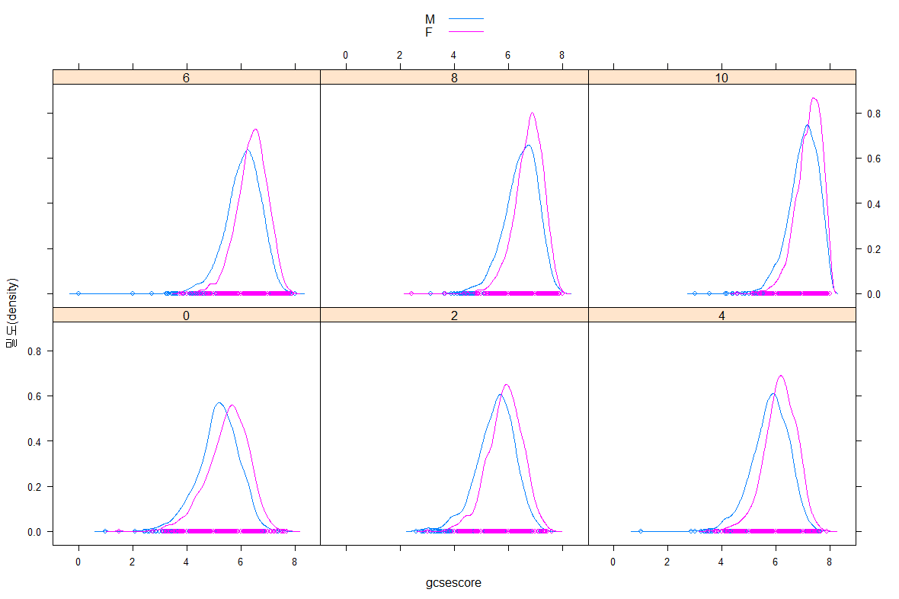
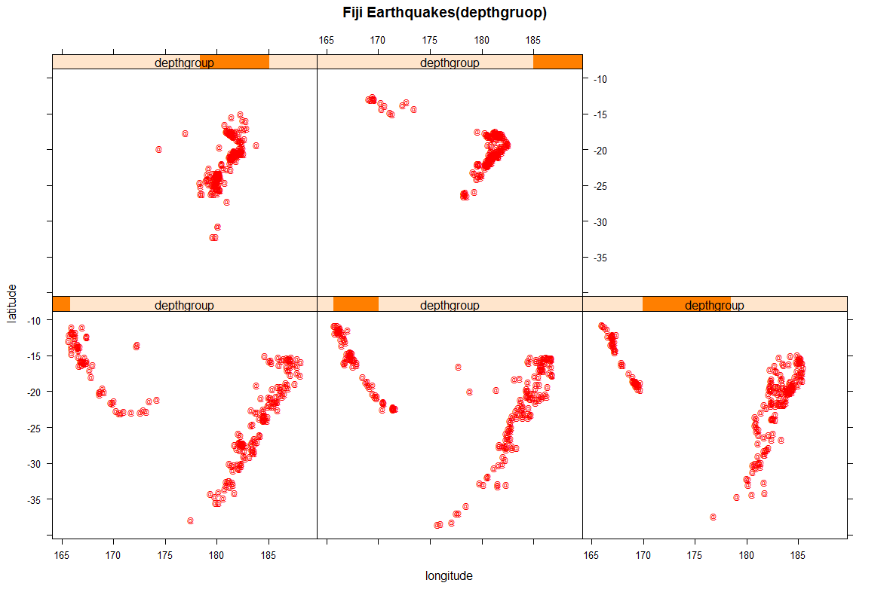

# R


## 연관분석 비지도학습

### 연관 분석(Association Analysis) 

- 하나의 거래나 사건에 포함된 항목 간의 관련성을 파악하여 둘 이상의 항목들로 구성된 연관성 규칙을 도출하는 탐색적인 분석방법

- 군집분석에 의해서 생성된 군집(cluster)의 특성을 분석하는 장바구니 분석

- 예) 트랜잭션(상품 거래 정보)을 대상으로 트랜잭션 내의 연관성을 분석하여 상품 거래의 규칙이나 패턴을 통해서 상품 간의 연관성을 도출해내는 분석 방법

- 거래나 사건으로부터 연관성을 찾아내기 위해서는 각각 연관성을 비교할 수 있는 규칙(지지도support, 신뢰도confidence, 향상도lift)을 평가 척도로 사용한다.


#### 연관 분석(Association Analysis) 활용 분야

- 마케팅에 활용
- 예1) 고객 대상 상품추천 및 상품정보 발송 : A 고객에 대한 B 상품 쿠폰 발송
- 예2) 텔레마케팅을 통해서 패키지 상품 판매 기획 및 홍보
- 예3) 상점대 상품 진열 및 쇼윈도(show window) 상품 디스플레이


#### 연관 분석(Association Analysis) 특징

- 데이터베이스에서 사건의 연관규칙을 찾아는 데이터마이닝 기법이다.

- Y 변수가 없으면, 비지도 학습에 의한 패턴 분석 방법이다.

- 거래 사실이 기록된 트랜잭션(Transaction) 형식의 데이터 셋을 이용한다.

- 사건과 사건 간의 연관성을 찾는 방법(예: 기저귀와 맥주)이다

- 지지도(제품 동시 구매패턴), 신뢰도(A제품 구매시 B제품 구매패턴), 향상도(A 제품과 B 제품간의 상관성)를 연관규칙의 평가 도구로 사용한다.

- 활용분야 : 상품구매 규칙을 통한 구매패턴 예측(상품 연관성)


#### 연관 분석(Association Analysis) 절차

- 단계 1] 거래 내역 데이터를 대상으로 트랜잭션 객체 생성
- 단계 2] 품목(item)과 트랜잭션 ID 관찰
- 단계 3] 평가 척도(지지도, 신뢰도, 향상도)를 이용한 연관 규칙(rule) 발견
- 단계 4] 연관분석결과에 대한 시각화
- 단계 5] 연관분석결과 해설 및 업무 적용


#### 연관 분석(Association Analysis) 평가 척도  

- 연관규칙(Association Rule)  :  어떤 사건이 얼마나 자주 동시에 발생하는가를 표현하는 규칙(조건)으로 데이터 내에 포함된 특정 항목들의 연관성을 수치화시켜 나타내는 방법
- 지지도(Support) - 전체에 대한 품목 A와 품목 B가 동시에 일어나는 확률 
  전체 품목에서 관련 품목의 거래 확률을 나타낸다.


- A를 구매한 후 B를 구매하는 거래 비율을 제공한다.
- 지지도가 낮다는 의미는 해당 규칙(A를 구매한 후 B를 구매하는 거래)이 자주 발생하지 않는 규칙을 의미
- 지지도가 낮은 규칙을 제거하는데 이용
- 지지도는 Support(A->B)와 Support(B->A)가 상호 대칭적으로 서로 같은 값을 가진다.

 


#### 연관 분석(Association Analysis) 평가 척도

- 신뢰도(confidence) - 품목 A가 구매될 때 품목 B가 구매되는 경우의 조건부확률  


지지도가 상호 대칭적으로 Support(A->B)와 Support(B->A)가 서로 같은 값을 가지기 때문에 포함비중이 낮은 경우에는 연관성을 판단하는데 어려움이 있다.
 지지도의 단점을 보완하는 것이 신뢰도이며 품목 A가 포함된 거래 중에서 품목 B를 포함한 거래의 비율을 제공한다.

- 향상도(Lift) - 하위 항목들이 독립에서 얼마나 벗어나는지의 정도를 측정한 값


지지도 또는 신뢰도가 높은 연관성 규칙 중에서는 우연히 연관성이 높게 보이는 것들이 나타날 수도 있는데, 이부분을 보완하기 위해 향상도가 사용된다.
 두 상품의 독립성 여부를 수치로 제공- 독립성 여부에 따라서 상품 간의 상관관계를 예측할 수 있다.


- 향상도 (Lift)가 1에 가까우면 두 상품은 서로 독립적이고, 1보다 작으면 두 상품은 음의 상관성을 1보다 크면 두 상품은 양의 상관성을 나타낸다.

- 연관규칙에 의미가 있으려면 향상도가 1보다 큰 값이어야 한다. (향상도의 값이 클수록 상품 간의 연관성이 높다고 볼 수 있다) 


#### 트랜잭션 객체를 대상으로 연관 규칙 생성  


- arules 패키지는 read.transactions(), apriori() 와 Adult와 AdultUCK 데이터 셋을 제공한다.

- arules 패키지에서 제공하는 inspect() 함수를 이용하여 트랜잭션 객체를 확인할 수 있다.

- arules 패키지에서 제공하는 apriori()를 이용하여 트랜잭션 객체를 대상으로 규칙을 발견할 수 있다.


```R
> library(arules)
> tran <- read.transactions("./data5/tran.txt", format="basket",sep=",")
> #거래 data는 6개
> inspect(tran)
    items           
[1] {라면,맥주,우유}
[2] {고기,라면,우유}
[3] {고기,과일,라면}
[4] {고기,맥주,우유}
[5] {고기,라면,우유}
[6] {과일,우유}     


> #거래 data는 6개
> inspect(tran)   #항목(품목) 확인
    items           
[1] {라면,맥주,우유}
[2] {고기,라면,우유}
[3] {고기,과일,라면}
[4] {고기,맥주,우유}
[5] {고기,라면,우유}
[6] {과일,우유}     
> 
> rule <- apriori(tran, parameter=list(supp=0.3, conf=0.1))
Apriori

Parameter specification:
 confidence minval smax arem  aval originalSupport
        0.1    0.1    1 none FALSE            TRUE
 maxtime support minlen maxlen target   ext
       5     0.3      1     10  rules FALSE

Algorithmic control:
 filter tree heap memopt load sort verbose
    0.1 TRUE TRUE  FALSE TRUE    2    TRUE

Absolute minimum support count: 1 

set item appearances ...[0 item(s)] done [0.00s].
set transactions ...[5 item(s), 6 transaction(s)] done [0.00s].
sorting and recoding items ... [5 item(s)] done [0.00s].
creating transaction tree ... done [0.00s].
checking subsets of size 1 2 3 done [0.00s].
writing ... [16 rule(s)] done [0.00s].
creating S4 object  ... done [0.00s].
> #맥주를 구매한 사람은 대체로 고기를 사지 않는다
> #{라면, 맥주} => {우유}는 향상도가 1.2이므로 두 상품간의 상관성이 높습니다.
> 
> rule2 <- apriori(tran, parameter=list(supp=0.1, conf=0.1))
Apriori

Parameter specification:
 confidence minval smax arem  aval originalSupport
        0.1    0.1    1 none FALSE            TRUE
 maxtime support minlen maxlen target   ext
       5     0.1      1     10  rules FALSE

Algorithmic control:
 filter tree heap memopt load sort verbose
    0.1 TRUE TRUE  FALSE TRUE    2    TRUE

Absolute minimum support count: 0 

set item appearances ...[0 item(s)] done [0.00s].
set transactions ...[5 item(s), 6 transaction(s)] done [0.00s].
sorting and recoding items ... [5 item(s)] done [0.00s].
creating transaction tree ... done [0.00s].
checking subsets of size 1 2 3 done [0.00s].
writing ... [35 rule(s)] done [0.00s].
creating S4 object  ... done [0.00s].


> stran <- read.transactions("./data5/demo_single", format="single", cols=c(1,2))
> inspect(stran)
    items         transactionID
[1] {item1}       trans1       
[2] {item1,item2} trans2       


> stran2 <- read.transactions("./data5/single_format.csv", format="single", cols=c(1,2))
> stran2  #트랜잭션 248, 항목은 68
transactions in sparse format with
 616 transactions (rows) and
 600 items (columns)

> summary(stran2)
transactions as itemMatrix in sparse format with
 616 rows (elements/itemsets/transactions) and
 600 columns (items) and a density of 0.001739719 

most frequent items:
2010-04-01-0827,10001519 2010-04-03-0828,10001519 
                       3                        3 
2010-07-17-0823,10001519 2010-07-18-0825,10001519 
                       3                        3 
2010-01-09-0818,10186585                  (Other) 
                       2                      629 

element (itemset/transaction) length distribution:
sizes
  1   2   3 
592  21   3 

   Min. 1st Qu.  Median    Mean 3rd Qu.    Max. 
  1.000   1.000   1.000   1.044   1.000   3.000 

includes extended item information - examples:
                    labels
1 2010-01-01-0823,10000005
2 2010-01-01-0823,10001519
3 2010-01-01-0823,10003333

includes extended transaction information - examples:
             transactionID
1 2010-01-01-0823,10003364
2 2010-01-01-0823,10003374
3 2010-01-01-0823,10007892


> #규칙 생성 (연관규칙 생성을 위한 평가척도 기본값 supp=0.1, conf=0.8)
> astran2 <- apriori(stran2) # 102 rules

Apriori

Parameter specification:
 confidence minval smax arem  aval originalSupport
        0.8    0.1    1 none FALSE            TRUE
 maxtime support minlen maxlen target   ext
       5     0.1      1     10  rules FALSE

Algorithmic control:
 filter tree heap memopt load sort verbose
    0.1 TRUE TRUE  FALSE TRUE    2    TRUE

Absolute minimum support count: 61 

set item appearances ...[0 item(s)] done [0.00s].
set transactions ...[600 item(s), 616 transaction(s)] done [0.00s].
sorting and recoding items ... [0 item(s)] done [0.00s].
creating transaction tree ... done [0.00s].
checking subsets of size 1 done [0.00s].
writing ... [0 rule(s)] done [0.00s].
creating S4 object  ... done [0.00s].


```


####  연관규칙 생성, 네트워크 형태로 시각화

```R
##### 연관규칙 생성, 네트워크 형태로 시각화######
data(Adult) 
str(Adult) 

> data(Adult) 
> str(Adult) 
Formal class 'transactions' [package "arules"] with 3 slots
  ..@ data       :Formal class 'ngCMatrix' [package "Matrix"] with 5 slots
  .. .. ..@ i       : int [1:612200] 1 10 25 32 35 50 59 61 63 65 ...
  .. .. ..@ p       : int [1:48843] 0 13 26 39 52 65 78 91 104 117 ...
  .. .. ..@ Dim     : int [1:2] 115 48842
  .. .. ..@ Dimnames:List of 2
  .. .. .. ..$ : NULL
  .. .. .. ..$ : NULL
  .. .. ..@ factors : list()
  ..@ itemInfo   :'data.frame':	115 obs. of  3 variables:
  .. ..$ labels   : chr [1:115] "age=Young" "age=Middle-aged" "age=Senior" "age=Old" ...
  .. ..$ variables: Factor w/ 13 levels "age","capital-gain",..: 1 1 1 1 13 13 13 13 13 13 ...
  .. ..$ levels   : Factor w/ 112 levels "10th","11th",..: 111 63 92 69 30 54 65 82 90 91 ...
  ..@ itemsetInfo:'data.frame':	48842 obs. of  1 variable:
  .. ..$ transactionID: chr [1:48842] "1" "2" "3" "4" ...


# AdultUCI 데이터셋을 트랜잭션 객체로 변환한 데이터셋
# 관측치 48,842 , 변수 15개 
# 종속변수(Class)에 의해서 연간 개입 수입이 $5만 이상인지를 예측하는 데이터 셋

> attributes(Adult) #transaction의 변주와 범주

> adult <- as(Adult, "data.frame") 
> head(adult)
                                                                                                                                                                                                                                                                     items
1      {age=Middle-aged,workclass=State-gov,education=Bachelors,marital-status=Never-married,occupation=Adm-clerical,relationship=Not-in-family,race=White,sex=Male,capital-gain=Low,capital-loss=None,hours-per-week=Full-time,native-country=United-States,income=small}
2 {age=Senior,workclass=Self-emp-not-inc,education=Bachelors,marital-status=Married-civ-spouse,occupation=Exec-managerial,relationship=Husband,race=White,sex=Male,capital-gain=None,capital-loss=None,hours-per-week=Part-time,native-country=United-States,income=small}
3         {age=Middle-aged,workclass=Private,education=HS-grad,marital-status=Divorced,occupation=Handlers-cleaners,relationship=Not-in-family,race=White,sex=Male,capital-gain=None,capital-loss=None,hours-per-week=Full-time,native-country=United-States,income=small}
4             {age=Senior,workclass=Private,education=11th,marital-status=Married-civ-spouse,occupation=Handlers-cleaners,relationship=Husband,race=Black,sex=Male,capital-gain=None,capital-loss=None,hours-per-week=Full-time,native-country=United-States,income=small}
5                {age=Middle-aged,workclass=Private,education=Bachelors,marital-status=Married-civ-spouse,occupation=Prof-specialty,relationship=Wife,race=Black,sex=Female,capital-gain=None,capital-loss=None,hours-per-week=Full-time,native-country=Cuba,income=small}
6        {age=Middle-aged,workclass=Private,education=Masters,marital-status=Married-civ-spouse,occupation=Exec-managerial,relationship=Wife,race=White,sex=Female,capital-gain=None,capital-loss=None,hours-per-week=Full-time,native-country=United-States,income=small}
  transactionID
1             1
2             2
3             3
4             4
5             5
6             6
> str(adult)
'data.frame':	48842 obs. of  2 variables:
 $ items        : Factor w/ 26771 levels "{age=Middle-aged,education=10th,marital-status=Divorced,relationship=Not-in-family,race=White,sex=Female,capita"| __truncated__,..: 12330 20981 6200 16289 5154 8308 16981 21198 8525 4929 ...
 $ transactionID: chr  "1" "2" "3" "4" ...


> summary(adult)
                                                                                                                                                                                                                                                                  items      
 {age=Middle-aged,workclass=Private,education=HS-grad,marital-status=Married-civ-spouse,occupation=Craft-repair,relationship=Husband,race=White,sex=Male,capital-gain=None,capital-loss=None,hours-per-week=Full-time,native-country=United-States,income=small}     :  207  
 {age=Middle-aged,workclass=Private,education=HS-grad,marital-status=Married-civ-spouse,occupation=Craft-repair,relationship=Husband,race=White,sex=Male,capital-gain=None,capital-loss=None,hours-per-week=Full-time,native-country=United-States}                  :  137  
 {age=Middle-aged,workclass=Private,education=HS-grad,marital-status=Married-civ-spouse,occupation=Machine-op-inspct,relationship=Husband,race=White,sex=Male,capital-gain=None,capital-loss=None,hours-per-week=Full-time,native-country=United-States,income=small}:  110  
 {age=Senior,workclass=Private,education=HS-grad,marital-status=Married-civ-spouse,occupation=Craft-repair,relationship=Husband,race=White,sex=Male,capital-gain=None,capital-loss=None,hours-per-week=Full-time,native-country=United-States,income=small}          :  107  
 {age=Middle-aged,workclass=Private,education=HS-grad,marital-status=Married-civ-spouse,occupation=Craft-repair,relationship=Husband,race=White,sex=Male,capital-gain=None,capital-loss=None,hours-per-week=Over-time,native-country=United-States,income=small}     :  102  
 {age=Middle-aged,workclass=Private,education=Bachelors,marital-status=Married-civ-spouse,occupation=Exec-managerial,relationship=Husband,race=White,sex=Male,capital-gain=None,capital-loss=None,hours-per-week=Over-time,native-country=United-States,income=large}:   86  
 (Other)                                                                                                                                                                                                                                                             :48093  
 transactionID     
 Length:48842      
 Class :character  
 Mode  :character  


> ar <- apriori(Adult, parameter=list(supp=0.1, conf=0.8))  #rules는 6,137개
Apriori

Parameter specification:
 confidence minval smax arem  aval originalSupport
        0.8    0.1    1 none FALSE            TRUE
 maxtime support minlen maxlen target   ext
       5     0.1      1     10  rules FALSE

Algorithmic control:
 filter tree heap memopt load sort verbose
    0.1 TRUE TRUE  FALSE TRUE    2    TRUE

Absolute minimum support count: 4884 

set item appearances ...[0 item(s)] done [0.00s].
set transactions ...[115 item(s), 48842 transaction(s)] done [0.04s].
sorting and recoding items ... [31 item(s)] done [0.01s].
creating transaction tree ... done [0.02s].
checking subsets of size 1 2 3 4 5 6 7 8 9 done [0.10s].
writing ... [6137 rule(s)] done [0.00s].
creating S4 object  ... done [0.01s].
> 
> ar2 <- apriori(Adult, parameter=list(supp=0.3, conf=0.95))  #rules는 124개
Apriori

Parameter specification:
 confidence minval smax arem  aval originalSupport
       0.95    0.1    1 none FALSE            TRUE
 maxtime support minlen maxlen target   ext
       5     0.3      1     10  rules FALSE

Algorithmic control:
 filter tree heap memopt load sort verbose
    0.1 TRUE TRUE  FALSE TRUE    2    TRUE

Absolute minimum support count: 14652 

set item appearances ...[0 item(s)] done [0.00s].
set transactions ...[115 item(s), 48842 transaction(s)] done [0.04s].
sorting and recoding items ... [14 item(s)] done [0.00s].
creating transaction tree ... done [0.02s].
checking subsets of size 1 2 3 4 5 6 done [0.00s].
writing ... [124 rule(s)] done [0.00s].
creating S4 object  ... done [0.00s].
> 
> 
> ar3 <- apriori(Adult, parameter=list(supp=0.35, conf=0.95))  #rules는  67
Apriori

Parameter specification:
 confidence minval smax arem  aval originalSupport
       0.95    0.1    1 none FALSE            TRUE
 maxtime support minlen maxlen target   ext
       5    0.35      1     10  rules FALSE

Algorithmic control:
 filter tree heap memopt load sort verbose
    0.1 TRUE TRUE  FALSE TRUE    2    TRUE

Absolute minimum support count: 17094 

set item appearances ...[0 item(s)] done [0.00s].
set transactions ...[115 item(s), 48842 transaction(s)] done [0.04s].
sorting and recoding items ... [11 item(s)] done [0.00s].
creating transaction tree ... done [0.02s].
checking subsets of size 1 2 3 4 5 done [0.00s].
writing ... [67 rule(s)] done [0.00s].
creating S4 object  ... done [0.00s].
> 
> ar4 <- apriori(Adult, parameter=list(supp=0.4, conf=0.95))  #rules는  36
Apriori

Parameter specification:
 confidence minval smax arem  aval originalSupport
       0.95    0.1    1 none FALSE            TRUE
 maxtime support minlen maxlen target   ext
       5     0.4      1     10  rules FALSE

Algorithmic control:
 filter tree heap memopt load sort verbose
    0.1 TRUE TRUE  FALSE TRUE    2    TRUE

Absolute minimum support count: 19536 

set item appearances ...[0 item(s)] done [0.00s].
set transactions ...[115 item(s), 48842 transaction(s)] done [0.04s].
sorting and recoding items ... [11 item(s)] done [0.00s].
creating transaction tree ... done [0.02s].
checking subsets of size 1 2 3 4 5 done [0.00s].
writing ... [36 rule(s)] done [0.00s].
creating S4 object  ... done [0.00s].
> 
> #상위 6개 규칙
> inspect(head(ar4))
    lhs                       rhs                                   support confidence     lift count
[1] {}                     => {capital-loss=None}                 0.9532779  0.9532779 1.000000 46560
[2] {relationship=Husband} => {marital-status=Married-civ-spouse} 0.4034233  0.9993914 2.181164 19704
[3] {relationship=Husband} => {sex=Male}                          0.4036485  0.9999493 1.495851 19715
[4] {age=Middle-aged}      => {capital-loss=None}                 0.4800786  0.9504276 0.997010 23448
[5] {income=small}         => {capital-gain=None}                 0.4849310  0.9581311 1.044414 23685
[6] {income=small}         => {capital-loss=None}                 0.4908480  0.9698220 1.017355 23974
> 
> #신뢰도 기준 내림차순 정렬 상위 6개
> inspect(head(sort(ar4, descreasing=T, by="confidence")))
    lhs                                    rhs                                   support confidence     lift count
[1] {relationship=Husband}              => {sex=Male}                          0.4036485  0.9999493 1.495851 19715
[2] {marital-status=Married-civ-spouse,                                                                           
     relationship=Husband}              => {sex=Male}                          0.4034028  0.9999492 1.495851 19703
[3] {relationship=Husband}              => {marital-status=Married-civ-spouse} 0.4034233  0.9993914 2.181164 19704
[4] {relationship=Husband,                                                                                        
     sex=Male}                          => {marital-status=Married-civ-spouse} 0.4034028  0.9993913 2.181164 19703
[5] {marital-status=Married-civ-spouse,                                                                           
     sex=Male}                          => {relationship=Husband}              0.4034028  0.9901503 2.452877 19703
[6] {income=small}                      => {capital-loss=None}                 0.4908480  0.9698220 1.017355 23974
> 
> 
> #향상도 기준 내림차순 정렬 상위 6개
> inspect(head(sort(ar4, descreasing=T, by="lift")))
    lhs                                    rhs                                   support confidence     lift count
[1] {marital-status=Married-civ-spouse,                                                                           
     sex=Male}                          => {relationship=Husband}              0.4034028  0.9901503 2.452877 19703
[2] {relationship=Husband}              => {marital-status=Married-civ-spouse} 0.4034233  0.9993914 2.181164 19704
[3] {relationship=Husband,                                                                                        
     sex=Male}                          => {marital-status=Married-civ-spouse} 0.4034028  0.9993913 2.181164 19703
[4] {relationship=Husband}              => {sex=Male}                          0.4036485  0.9999493 1.495851 19715
[5] {marital-status=Married-civ-spouse,                                                                           
     relationship=Husband}              => {sex=Male}                          0.4034028  0.9999492 1.495851 19703
[6] {income=small}                      => {capital-gain=None}                 0.4849310  0.9581311 1.044414 23685


> plot(ar3, method="graph", control=list(type="items"))
Warning: Unknown control parameters: type
Available control parameters (with default values):
main	 =  Graph for 67 rules
nodeColors	 =  c("#66CC6680", "#9999CC80")
nodeCol	 =  c("#EE0000FF", "#EE0303FF", "#EE0606FF", "#EE0909FF", "#EE0C0CFF", "#EE0F0FFF", "#EE1212FF", "#EE1515FF", "#EE1818FF", "#EE1B1BFF", "#EE1E1EFF", "#EE2222FF", "#EE2525FF", "#EE2828FF", "#EE2B2BFF", "#EE2E2EFF", "#EE3131FF", "#EE3434FF", "#EE3737FF", "#EE3A3AFF", "#EE3D3DFF", "#EE4040FF", "#EE4444FF", "#EE4747FF", "#EE4A4AFF", "#EE4D4DFF", "#EE5050FF", "#EE5353FF", "#EE5656FF", "#EE5959FF", "#EE5C5CFF", "#EE5F5FFF", "#EE6262FF", "#EE6666FF", "#EE6969FF", "#EE6C6CFF", "#EE6F6FFF", "#EE7272FF", "#EE7575FF",  "#EE7878FF", "#EE7B7BFF", "#EE7E7EFF", "#EE8181FF", "#EE8484FF", "#EE8888FF", "#EE8B8BFF", "#EE8E8EFF", "#EE9191FF", "#EE9494FF", "#EE9797FF", "#EE9999FF", "#EE9B9BFF", "#EE9D9DFF", "#EE9F9FFF", "#EEA0A0FF", "#EEA2A2FF", "#EEA4A4FF", "#EEA5A5FF", "#EEA7A7FF", "#EEA9A9FF", "#EEABABFF", "#EEACACFF", "#EEAEAEFF", "#EEB0B0FF", "#EEB1B1FF", "#EEB3B3FF", "#EEB5B5FF", "#EEB7B7FF", "#EEB8B8FF", "#EEBABAFF", "#EEBCBCFF", "#EEBDBDFF", "#EEBFBFFF", "#EEC1C1FF", "#EEC3C3FF", "#EEC4C4FF", "#EEC6C6FF", "#EEC8C8FF",  "#EEC9C9FF", "#EECBCBFF", "#EECDCDFF", "#EECFCFFF", "#EED0D0FF", "#EED2D2FF", "#EED4D4FF", "#EED5D5FF", "#EED7D7FF", "#EED9D9FF", "#EEDBDBFF", "#EEDCDCFF", "#EEDEDEFF", "#EEE0E0FF", "#EEE1E1FF", "#EEE3E3FF", "#EEE5E5FF", "#EEE7E7FF", "#EEE8E8FF", "#EEEAEAFF", "#EEECECFF", "#EEEEEEFF")
edgeCol	 =  c("#474747FF", "#494949FF", "#4B4B4BFF", "#4D4D4DFF", "#4F4F4FFF", "#515151FF", "#535353FF", "#555555FF", "#575757FF", "#595959FF", "#5B5B5BFF", "#5E5E5EFF", "#606060FF", "#626262FF", "#646464FF", "#666666FF", "#686868FF", "#6A6A6AFF", "#6C6C6CFF", "#6E6E6EFF", "#707070FF", "#727272FF", "#747474FF", "#767676FF", "#787878FF", "#7A7A7AFF", "#7C7C7CFF", "#7E7E7EFF", "#808080FF", "#828282FF", "#848484FF", "#868686FF", "#888888FF", "#8A8A8AFF", "#8C8C8CFF", "#8D8D8DFF", "#8F8F8FFF", "#919191FF", "#939393FF",  "#959595FF", "#979797FF", "#999999FF", "#9A9A9AFF", "#9C9C9CFF", "#9E9E9EFF", "#A0A0A0FF", "#A2A2A2FF", "#A3A3A3FF", "#A5A5A5FF", "#A7A7A7FF", "#A9A9A9FF", "#AAAAAAFF", "#ACACACFF", "#AEAEAEFF", "#AFAFAFFF", "#B1B1B1FF", "#B3B3B3FF", "#B4B4B4FF", "#B6B6B6FF", "#B7B7B7FF", "#B9B9B9FF", "#BBBBBBFF", "#BCBCBCFF", "#BEBEBEFF", "#BFBFBFFF", "#C1C1C1FF", "#C2C2C2FF", "#C3C3C4FF", "#C5C5C5FF", "#C6C6C6FF", "#C8C8C8FF", "#C9C9C9FF", "#CACACAFF", "#CCCCCCFF", "#CDCDCDFF", "#CECECEFF", "#CFCFCFFF", "#D1D1D1FF",  "#D2D2D2FF", "#D3D3D3FF", "#D4D4D4FF", "#D5D5D5FF", "#D6D6D6FF", "#D7D7D7FF", "#D8D8D8FF", "#D9D9D9FF", "#DADADAFF", "#DBDBDBFF", "#DCDCDCFF", "#DDDDDDFF", "#DEDEDEFF", "#DEDEDEFF", "#DFDFDFFF", "#E0E0E0FF", "#E0E0E0FF", "#E1E1E1FF", "#E1E1E1FF", "#E2E2E2FF", "#E2E2E2FF", "#E2E2E2FF")
alpha	 =  0.5
cex	 =  1
itemLabels	 =  TRUE
labelCol	 =  #000000B3
measureLabels	 =  FALSE
precision	 =  3
layout	 =  NULL
layoutParams	 =  list()
arrowSize	 =  0.5
engine	 =  igraph
plot	 =  TRUE
plot_options	 =  list()
max	 =  100
verbose	 =  FALSE

```


```R
> plot(ar4, method="graph", control=list(type="items"))
Warning: Unknown control parameters: type
Available control parameters (with default values):
main	 =  Graph for 36 rules
nodeColors	 =  c("#66CC6680", "#9999CC80")
nodeCol	 =  c("#EE0000FF", "#EE0303FF", "#EE0606FF", "#EE0909FF", "#EE0C0CFF", "#EE0F0FFF", "#EE1212FF", "#EE1515FF", "#EE1818FF", "#EE1B1BFF", "#EE1E1EFF", "#EE2222FF", "#EE2525FF", "#EE2828FF", "#EE2B2BFF", "#EE2E2EFF", "#EE3131FF", "#EE3434FF", "#EE3737FF", "#EE3A3AFF", "#EE3D3DFF", "#EE4040FF", "#EE4444FF", "#EE4747FF", "#EE4A4AFF", "#EE4D4DFF", "#EE5050FF", "#EE5353FF", "#EE5656FF", "#EE5959FF", "#EE5C5CFF", "#EE5F5FFF", "#EE6262FF", "#EE6666FF", "#EE6969FF", "#EE6C6CFF", "#EE6F6FFF", "#EE7272FF", "#EE7575FF",  "#EE7878FF", "#EE7B7BFF", "#EE7E7EFF", "#EE8181FF", "#EE8484FF", "#EE8888FF", "#EE8B8BFF", "#EE8E8EFF", "#EE9191FF", "#EE9494FF", "#EE9797FF", "#EE9999FF", "#EE9B9BFF", "#EE9D9DFF", "#EE9F9FFF", "#EEA0A0FF", "#EEA2A2FF", "#EEA4A4FF", "#EEA5A5FF", "#EEA7A7FF", "#EEA9A9FF", "#EEABABFF", "#EEACACFF", "#EEAEAEFF", "#EEB0B0FF", "#EEB1B1FF", "#EEB3B3FF", "#EEB5B5FF", "#EEB7B7FF", "#EEB8B8FF", "#EEBABAFF", "#EEBCBCFF", "#EEBDBDFF", "#EEBFBFFF", "#EEC1C1FF", "#EEC3C3FF", "#EEC4C4FF", "#EEC6C6FF", "#EEC8C8FF",  "#EEC9C9FF", "#EECBCBFF", "#EECDCDFF", "#EECFCFFF", "#EED0D0FF", "#EED2D2FF", "#EED4D4FF", "#EED5D5FF", "#EED7D7FF", "#EED9D9FF", "#EEDBDBFF", "#EEDCDCFF", "#EEDEDEFF", "#EEE0E0FF", "#EEE1E1FF", "#EEE3E3FF", "#EEE5E5FF", "#EEE7E7FF", "#EEE8E8FF", "#EEEAEAFF", "#EEECECFF", "#EEEEEEFF")
edgeCol	 =  c("#474747FF", "#494949FF", "#4B4B4BFF", "#4D4D4DFF", "#4F4F4FFF", "#515151FF", "#535353FF", "#555555FF", "#575757FF", "#595959FF", "#5B5B5BFF", "#5E5E5EFF", "#606060FF", "#626262FF", "#646464FF", "#666666FF", "#686868FF", "#6A6A6AFF", "#6C6C6CFF", "#6E6E6EFF", "#707070FF", "#727272FF", "#747474FF", "#767676FF", "#787878FF", "#7A7A7AFF", "#7C7C7CFF", "#7E7E7EFF", "#808080FF", "#828282FF", "#848484FF", "#868686FF", "#888888FF", "#8A8A8AFF", "#8C8C8CFF", "#8D8D8DFF", "#8F8F8FFF", "#919191FF", "#939393FF",  "#959595FF", "#979797FF", "#999999FF", "#9A9A9AFF", "#9C9C9CFF", "#9E9E9EFF", "#A0A0A0FF", "#A2A2A2FF", "#A3A3A3FF", "#A5A5A5FF", "#A7A7A7FF", "#A9A9A9FF", "#AAAAAAFF", "#ACACACFF", "#AEAEAEFF", "#AFAFAFFF", "#B1B1B1FF", "#B3B3B3FF", "#B4B4B4FF", "#B6B6B6FF", "#B7B7B7FF", "#B9B9B9FF", "#BBBBBBFF", "#BCBCBCFF", "#BEBEBEFF", "#BFBFBFFF", "#C1C1C1FF", "#C2C2C2FF", "#C3C3C4FF", "#C5C5C5FF", "#C6C6C6FF", "#C8C8C8FF", "#C9C9C9FF", "#CACACAFF", "#CCCCCCFF", "#CDCDCDFF", "#CECECEFF", "#CFCFCFFF", "#D1D1D1FF",  "#D2D2D2FF", "#D3D3D3FF", "#D4D4D4FF", "#D5D5D5FF", "#D6D6D6FF", "#D7D7D7FF", "#D8D8D8FF", "#D9D9D9FF", "#DADADAFF", "#DBDBDBFF", "#DCDCDCFF", "#DDDDDDFF", "#DEDEDEFF", "#DEDEDEFF", "#DFDFDFFF", "#E0E0E0FF", "#E0E0E0FF", "#E1E1E1FF", "#E1E1E1FF", "#E2E2E2FF", "#E2E2E2FF", "#E2E2E2FF")
alpha	 =  0.5
cex	 =  1
itemLabels	 =  TRUE
labelCol	 =  #000000B3
measureLabels	 =  FALSE
precision	 =  3
layout	 =  NULL
layoutParams	 =  list()
arrowSize	 =  0.5
engine	 =  igraph
plot	 =  TRUE
plot_options	 =  list()
max	 =  100
verbose	 =  FALSE

```


```R
> #신뢰도 기준 내림차순 정렬 상위 6개
> inspect(head(sort(ar4, descreasing=T, by="confidence")))
    lhs                                    rhs                                   support confidence     lift count
[1] {relationship=Husband}              => {sex=Male}                          0.4036485  0.9999493 1.495851 19715
[2] {marital-status=Married-civ-spouse,                                                                           
     relationship=Husband}              => {sex=Male}                          0.4034028  0.9999492 1.495851 19703
[3] {relationship=Husband}              => {marital-status=Married-civ-spouse} 0.4034233  0.9993914 2.181164 19704
[4] {relationship=Husband,                                                                                        
     sex=Male}                          => {marital-status=Married-civ-spouse} 0.4034028  0.9993913 2.181164 19703
[5] {marital-status=Married-civ-spouse,                                                                           
     sex=Male}                          => {relationship=Husband}              0.4034028  0.9901503 2.452877 19703
[6] {income=small}                      => {capital-loss=None}                 0.4908480  0.9698220 1.017355 23974
> 
> 
> #향상도 기준 내림차순 정렬 상위 6개
> inspect(head(sort(ar4, descreasing=T, by="lift")))
    lhs                                    rhs                                   support confidence     lift count
[1] {marital-status=Married-civ-spouse,                                                                           
     sex=Male}                          => {relationship=Husband}              0.4034028  0.9901503 2.452877 19703
[2] {relationship=Husband}              => {marital-status=Married-civ-spouse} 0.4034233  0.9993914 2.181164 19704
[3] {relationship=Husband,                                                                                        
     sex=Male}                          => {marital-status=Married-civ-spouse} 0.4034028  0.9993913 2.181164 19703
[4] {relationship=Husband}              => {sex=Male}                          0.4036485  0.9999493 1.495851 19715
[5] {marital-status=Married-civ-spouse,                                                                           
     relationship=Husband}              => {sex=Male}                          0.4034028  0.9999492 1.495851 19703
[6] {income=small}                      => {capital-gain=None}                 0.4849310  0.9581311 1.044414 23685

```


#### Groceries 데이터 셋 연관분석

```R
> data("Groceries")
> str(Groceries)
Formal class 'transactions' [package "arules"] with 3 slots
  ..@ data       :Formal class 'ngCMatrix' [package "Matrix"] with 5 slots
  .. .. ..@ i       : int [1:43367] 13 60 69 78 14 29 98 24 15 29 ...
  .. .. ..@ p       : int [1:9836] 0 4 7 8 12 16 21 22 27 28 ...
  .. .. ..@ Dim     : int [1:2] 169 9835
  .. .. ..@ Dimnames:List of 2
  .. .. .. ..$ : NULL
  .. .. .. ..$ : NULL
  .. .. ..@ factors : list()
  ..@ itemInfo   :'data.frame':	169 obs. of  3 variables:
  .. ..$ labels: chr [1:169] "frankfurter" "sausage" "liver loaf" "ham" ...
  .. ..$ level2: Factor w/ 55 levels "baby food","bags",..: 44 44 44 44 44 44 44 42 42 41 ...
  .. ..$ level1: Factor w/ 10 levels "canned food",..: 6 6 6 6 6 6 6 6 6 6 ...
  ..@ itemsetInfo:'data.frame':	0 obs. of  0 variables
> Groceries
transactions in sparse format with
 9835 transactions (rows) and
 169 items (columns)
> #1개월동안 실제 로컬 식품점 매장에서 판매되는 트랜잭션 데이터
> #transaction은 9835, item은 169
> Groceries_df <- as(Groceries, "data.frame")


> rules <- apriori(Groceries, parameter= list(supp=0.1 , conf=0.8))  # rules
Apriori

Parameter specification:
 confidence minval smax arem  aval originalSupport
        0.8    0.1    1 none FALSE            TRUE
 maxtime support minlen maxlen target   ext
       5     0.1      1     10  rules FALSE

Algorithmic control:
 filter tree heap memopt load sort verbose
    0.1 TRUE TRUE  FALSE TRUE    2    TRUE

Absolute minimum support count: 983 

set item appearances ...[0 item(s)] done [0.00s].
set transactions ...[169 item(s), 9835 transaction(s)] done [0.01s].
sorting and recoding items ... [8 item(s)] done [0.00s].
creating transaction tree ... done [0.00s].
checking subsets of size 1 2 done [0.00s].
writing ... [0 rule(s)] done [0.00s].
creating S4 object  ... done [0.00s].


> rules <- apriori(Groceries, parameter= list(supp=0.001 , conf=0.8))  # rules
Apriori

Parameter specification:
 confidence minval smax arem  aval originalSupport
        0.8    0.1    1 none FALSE            TRUE
 maxtime support minlen maxlen target   ext
       5   0.001      1     10  rules FALSE

Algorithmic control:
 filter tree heap memopt load sort verbose
    0.1 TRUE TRUE  FALSE TRUE    2    TRUE

Absolute minimum support count: 9 

set item appearances ...[0 item(s)] done [0.00s].
set transactions ...[169 item(s), 9835 transaction(s)] done [0.00s].
sorting and recoding items ... [157 item(s)] done [0.00s].
creating transaction tree ... done [0.00s].
checking subsets of size 1 2 3 4 5 6 done [0.01s].
writing ... [410 rule(s)] done [0.00s].
creating S4 object  ... done [0.00s].


> inspect(rules)

#빈도수가 가장 높은 상품 순서대로 2개

rules2 <- apriori(Groceries, parameter= list(supp=0.002 , conf=0.8))  # rules 11
inspect(rules2)
plot(rules2, method="grouped")

#빈도수가 가장 높은 상품

#규칙이 A상품 ->B상품 형태로 표현 : 왼쪽에 있는 LHS표현, 오른쪽 RHS


```


```R
#최대 길이(LHS와 RHS길이의 합) 3 이하 규칙 생성
rules <- apriori(Groceries, parameter= list(supp=0.001 , conf=0.8 , maxlen=3))  # rules  29inspect(rules)

rules <- sort(rules, descreasing=T, by="confidence")
inspect(rules)
plot(rules, method="graph", control=list(type="items"))

```


#### 특정 상품 서브셋 생성하여 시각화하기

```R
######특정 상품 서브셋 생성하여 시각화하기######
wmilk <- subset(rules, rhs %in% 'whole milk')
wmilk 
inspect(wmilk)
plot(wmilk, method="graph")
```


```R
aveg <- subset(rules, rhs %in% 'other vegetables')
aveg
inspect(aveg)
plot(aveg, method="graph")
```


#### 장바구니 연관분석 연습문제 1 

```R
################장바구니 연관분석 연습문제 1 ################
연관성 규칙은 상품 호은 서비스 간의 관계를 살펴보고 이로부터 유용한 규칙을 찾아내고자 할 때 이용될 수 있는 기법이다.
데이터들의 빈도수와 동시발생 확률을 이용하여 한 항목들의 그룹과 다른 항목들의 그룹 사이에 강한 연관성이 있음을 밝혀주는 기법이다.

예제 데이터 : B 마트에서 판매된 트랜잭션 데이터 파일
mybasket.csv

변수 : 의류, 냉동식품, 주류, 야채, 제과, 육류, 과자, 생활장식, 우유

분석문제 :
1. 전체 트랜잭션 개수와 상품아이템 유형은 몇개인가?
2. 가장  발생빈도가 높은 상품아이템은 무엇인가?
3. 지지도를 10%로 설정했을 때의 생성되는 규칙의 가짓수는?
4. 상품 아이템 중에서 가장 발생확률이 높은 아이템과 낮은 아이템은 무엇인가?
5. 가장 발생가능성이 높은 <2개 상품간>의 연관규칙은 무엇인가?
6. 가장 발생가능성이 높은 <2개 상품이상에서> <제 3의 상품으로>의 연관규칙은 무엇인가?


> result
transactions in sparse format with
 786 transactions (rows) and
 10 items (columns)
> summary(result)
transactions as itemMatrix in sparse format with
 786 rows (elements/itemsets/transactions) and
 10 columns (items) and a density of 0.3049618 

most frequent items:
clothes   snack    deco  bakery  frozen (Other) 
    386     373     358     337     318     625 

element (itemset/transaction) length distribution:
sizes
  1   2   3   4   5   6   7   8   9 
209 166 147 101  57  48  33  18   7 

   Min. 1st Qu.  Median    Mean 3rd Qu.    Max. 
   1.00    1.00    3.00    3.05    4.00    9.00 

includes extended item information - examples:
   labels
1 alcohol
2  bakery
3 clothes
> image(result)

as(result, "data.frame")
rules <- apriori(result, parameter=list(supp=0.1, conf=0.1))
inspect(rules)


```


```R
plot(rules)
```


```R
plot(rules, method="grouped")  #lhs가로축 조건과 rhs세로축-결과로 구성한 메트릭스 그래프
```


```R
> plot(rules, method="graph", control=list(type="items"))
Warning: Unknown control parameters: type
Available control parameters (with default values):
main	 =  Graph for 100 rules
nodeColors	 =  c("#66CC6680", "#9999CC80")
nodeCol	 =  c("#EE0000FF", "#EE0303FF", "#EE0606FF", "#EE0909FF", "#EE0C0CFF", "#EE0F0FFF", "#EE1212FF", "#EE1515FF", "#EE1818FF", "#EE1B1BFF", "#EE1E1EFF", "#EE2222FF", "#EE2525FF", "#EE2828FF", "#EE2B2BFF", "#EE2E2EFF", "#EE3131FF", "#EE3434FF", "#EE3737FF", "#EE3A3AFF", "#EE3D3DFF", "#EE4040FF", "#EE4444FF", "#EE4747FF", "#EE4A4AFF", "#EE4D4DFF", "#EE5050FF", "#EE5353FF", "#EE5656FF", "#EE5959FF", "#EE5C5CFF", "#EE5F5FFF", "#EE6262FF", "#EE6666FF", "#EE6969FF", "#EE6C6CFF", "#EE6F6FFF", "#EE7272FF", "#EE7575FF",  "#EE7878FF", "#EE7B7BFF", "#EE7E7EFF", "#EE8181FF", "#EE8484FF", "#EE8888FF", "#EE8B8BFF", "#EE8E8EFF", "#EE9191FF", "#EE9494FF", "#EE9797FF", "#EE9999FF", "#EE9B9BFF", "#EE9D9DFF", "#EE9F9FFF", "#EEA0A0FF", "#EEA2A2FF", "#EEA4A4FF", "#EEA5A5FF", "#EEA7A7FF", "#EEA9A9FF", "#EEABABFF", "#EEACACFF", "#EEAEAEFF", "#EEB0B0FF", "#EEB1B1FF", "#EEB3B3FF", "#EEB5B5FF", "#EEB7B7FF", "#EEB8B8FF", "#EEBABAFF", "#EEBCBCFF", "#EEBDBDFF", "#EEBFBFFF", "#EEC1C1FF", "#EEC3C3FF", "#EEC4C4FF", "#EEC6C6FF", "#EEC8C8FF",  "#EEC9C9FF", "#EECBCBFF", "#EECDCDFF", "#EECFCFFF", "#EED0D0FF", "#EED2D2FF", "#EED4D4FF", "#EED5D5FF", "#EED7D7FF", "#EED9D9FF", "#EEDBDBFF", "#EEDCDCFF", "#EEDEDEFF", "#EEE0E0FF", "#EEE1E1FF", "#EEE3E3FF", "#EEE5E5FF", "#EEE7E7FF", "#EEE8E8FF", "#EEEAEAFF", "#EEECECFF", "#EEEEEEFF")
edgeCol	 =  c("#474747FF", "#494949FF", "#4B4B4BFF", "#4D4D4DFF", "#4F4F4FFF", "#515151FF", "#535353FF", "#555555FF", "#575757FF", "#595959FF", "#5B5B5BFF", "#5E5E5EFF", "#606060FF", "#626262FF", "#646464FF", "#666666FF", "#686868FF", "#6A6A6AFF", "#6C6C6CFF", "#6E6E6EFF", "#707070FF", "#727272FF", "#747474FF", "#767676FF", "#787878FF", "#7A7A7AFF", "#7C7C7CFF", "#7E7E7EFF", "#808080FF", "#828282FF", "#848484FF", "#868686FF", "#888888FF", "#8A8A8AFF", "#8C8C8CFF", "#8D8D8DFF", "#8F8F8FFF", "#919191FF", "#939393FF",  "#959595FF", "#979797FF", "#999999FF", "#9A9A9AFF", "#9C9C9CFF", "#9E9E9EFF", "#A0A0A0FF", "#A2A2A2FF", "#A3A3A3FF", "#A5A5A5FF", "#A7A7A7FF", "#A9A9A9FF", "#AAAAAAFF", "#ACACACFF", "#AEAEAEFF", "#AFAFAFFF", "#B1B1B1FF", "#B3B3B3FF", "#B4B4B4FF", "#B6B6B6FF", "#B7B7B7FF", "#B9B9B9FF", "#BBBBBBFF", "#BCBCBCFF", "#BEBEBEFF", "#BFBFBFFF", "#C1C1C1FF", "#C2C2C2FF", "#C3C3C4FF", "#C5C5C5FF", "#C6C6C6FF", "#C8C8C8FF", "#C9C9C9FF", "#CACACAFF", "#CCCCCCFF", "#CDCDCDFF", "#CECECEFF", "#CFCFCFFF", "#D1D1D1FF",  "#D2D2D2FF", "#D3D3D3FF", "#D4D4D4FF", "#D5D5D5FF", "#D6D6D6FF", "#D7D7D7FF", "#D8D8D8FF", "#D9D9D9FF", "#DADADAFF", "#DBDBDBFF", "#DCDCDCFF", "#DDDDDDFF", "#DEDEDEFF", "#DEDEDEFF", "#DFDFDFFF", "#E0E0E0FF", "#E0E0E0FF", "#E1E1E1FF", "#E1E1E1FF", "#E2E2E2FF", "#E2E2E2FF", "#E2E2E2FF")
alpha	 =  0.5
cex	 =  1
itemLabels	 =  TRUE
labelCol	 =  #000000B3
measureLabels	 =  FALSE
precision	 =  3
layout	 =  NULL
layoutParams	 =  list()
arrowSize	 =  0.5
engine	 =  igraph
plot	 =  TRUE
plot_options	 =  list()
max	 =  100
verbose	 =  FALSE
Warning message:
plot: Too many rules supplied. Only plotting the best 100 rules using ‘support’ (change control parameter max if needed) 

```


```R
> plot(rules, method="graph", interactive=TRUE , control=list(type="items"))
Warning: Unknown control parameters: type
Available control parameters (with default values):
main	 =  Graph for 100 rules
nodeColors	 =  c("#66CC6680", "#9999CC80")
nodeCol	 =  c("#EE0000FF", "#EE0303FF", "#EE0606FF", "#EE0909FF", "#EE0C0CFF", "#EE0F0FFF", "#EE1212FF", "#EE1515FF", "#EE1818FF", "#EE1B1BFF", "#EE1E1EFF", "#EE2222FF", "#EE2525FF", "#EE2828FF", "#EE2B2BFF", "#EE2E2EFF", "#EE3131FF", "#EE3434FF", "#EE3737FF", "#EE3A3AFF", "#EE3D3DFF", "#EE4040FF", "#EE4444FF", "#EE4747FF", "#EE4A4AFF", "#EE4D4DFF", "#EE5050FF", "#EE5353FF", "#EE5656FF", "#EE5959FF", "#EE5C5CFF", "#EE5F5FFF", "#EE6262FF", "#EE6666FF", "#EE6969FF", "#EE6C6CFF", "#EE6F6FFF", "#EE7272FF", "#EE7575FF",  "#EE7878FF", "#EE7B7BFF", "#EE7E7EFF", "#EE8181FF", "#EE8484FF", "#EE8888FF", "#EE8B8BFF", "#EE8E8EFF", "#EE9191FF", "#EE9494FF", "#EE9797FF", "#EE9999FF", "#EE9B9BFF", "#EE9D9DFF", "#EE9F9FFF", "#EEA0A0FF", "#EEA2A2FF", "#EEA4A4FF", "#EEA5A5FF", "#EEA7A7FF", "#EEA9A9FF", "#EEABABFF", "#EEACACFF", "#EEAEAEFF", "#EEB0B0FF", "#EEB1B1FF", "#EEB3B3FF", "#EEB5B5FF", "#EEB7B7FF", "#EEB8B8FF", "#EEBABAFF", "#EEBCBCFF", "#EEBDBDFF", "#EEBFBFFF", "#EEC1C1FF", "#EEC3C3FF", "#EEC4C4FF", "#EEC6C6FF", "#EEC8C8FF",  "#EEC9C9FF", "#EECBCBFF", "#EECDCDFF", "#EECFCFFF", "#EED0D0FF", "#EED2D2FF", "#EED4D4FF", "#EED5D5FF", "#EED7D7FF", "#EED9D9FF", "#EEDBDBFF", "#EEDCDCFF", "#EEDEDEFF", "#EEE0E0FF", "#EEE1E1FF", "#EEE3E3FF", "#EEE5E5FF", "#EEE7E7FF", "#EEE8E8FF", "#EEEAEAFF", "#EEECECFF", "#EEEEEEFF")
edgeCol	 =  c("#474747FF", "#494949FF", "#4B4B4BFF", "#4D4D4DFF", "#4F4F4FFF", "#515151FF", "#535353FF", "#555555FF", "#575757FF", "#595959FF", "#5B5B5BFF", "#5E5E5EFF", "#606060FF", "#626262FF", "#646464FF", "#666666FF", "#686868FF", "#6A6A6AFF", "#6C6C6CFF", "#6E6E6EFF", "#707070FF", "#727272FF", "#747474FF", "#767676FF", "#787878FF", "#7A7A7AFF", "#7C7C7CFF", "#7E7E7EFF", "#808080FF", "#828282FF", "#848484FF", "#868686FF", "#888888FF", "#8A8A8AFF", "#8C8C8CFF", "#8D8D8DFF", "#8F8F8FFF", "#919191FF", "#939393FF",  "#959595FF", "#979797FF", "#999999FF", "#9A9A9AFF", "#9C9C9CFF", "#9E9E9EFF", "#A0A0A0FF", "#A2A2A2FF", "#A3A3A3FF", "#A5A5A5FF", "#A7A7A7FF", "#A9A9A9FF", "#AAAAAAFF", "#ACACACFF", "#AEAEAEFF", "#AFAFAFFF", "#B1B1B1FF", "#B3B3B3FF", "#B4B4B4FF", "#B6B6B6FF", "#B7B7B7FF", "#B9B9B9FF", "#BBBBBBFF", "#BCBCBCFF", "#BEBEBEFF", "#BFBFBFFF", "#C1C1C1FF", "#C2C2C2FF", "#C3C3C4FF", "#C5C5C5FF", "#C6C6C6FF", "#C8C8C8FF", "#C9C9C9FF", "#CACACAFF", "#CCCCCCFF", "#CDCDCDFF", "#CECECEFF", "#CFCFCFFF", "#D1D1D1FF",  "#D2D2D2FF", "#D3D3D3FF", "#D4D4D4FF", "#D5D5D5FF", "#D6D6D6FF", "#D7D7D7FF", "#D8D8D8FF", "#D9D9D9FF", "#DADADAFF", "#DBDBDBFF", "#DCDCDCFF", "#DDDDDDFF", "#DEDEDEFF", "#DEDEDEFF", "#DFDFDFFF", "#E0E0E0FF", "#E0E0E0FF", "#E1E1E1FF", "#E1E1E1FF", "#E2E2E2FF", "#E2E2E2FF", "#E2E2E2FF")
alpha	 =  0.5
cex	 =  1
itemLabels	 =  TRUE
labelCol	 =  #000000B3
measureLabels	 =  FALSE
precision	 =  3
layout	 =  NULL
layoutParams	 =  list()
arrowSize	 =  0.5
engine	 =  igraph
plot	 =  TRUE
plot_options	 =  list()
max	 =  100
verbose	 =  FALSE
Warning messages:
1: In plot.rules(rules, method = "graph", interactive = TRUE, control = list(type = "items")) :
  The parameter interactive is deprecated. Use engine='interactive' instead.
2: plot: Too many rules supplied. Only plotting the best 100 rules using ‘support’ (change control parameter max if needed) 

```


```R
#######Twitter 앱 인증 
#twitteR 패키지 로딩 ? twitter 인증 관련 함수 제공
#ROAuth  패키지 로딩 ? OAuthFactory 객체 제공
#Base64enc 패키지 로딩 ? enc2utf8()  함수 제공
install.packages("twitteR")
install.packages("ROAuth")
install.packages("Base64enc")
library(twitteR)
library(ROAuth)
library(base64enc)

> #  Twitter 앱 요청 URL과 API 설정
> # [Details] - 3개 url 변수 생성
> reqURL <- "https://api.twitter.com/oauth/request_token"
> authURL <- "https://api.twitter.com/oauth/authorize"
> accessURL <- "https://api.twitter.com/oauth/access_token"
> # [Keys and Access Tokens] - 4개 변수 : ##Site에서 받아온다.
> apiKey <-  "" 
> apiSecret <- "" 
> accessToken="-"
> accessTokenSecret=""
> # Twitter 앱 인증 요청
> twitCred <- OAuthFactory$new(
+   consumerKey = apiKey, 
+   consumerSecret = apiSecret,
+   requestURL = reqURL,
+   accessURL = accessURL, 
+   authURL = authURL
+ )

```


## 시계열분석

- 시계열 자료 – 시간의 변화에 따라 관측치 또는 통계량의 변화를 기록해 놓은 자료
- 시계열 자료는 이전에 기록된 자료에 의존적이다.
- 시계열 자료를 대상으로 분석을 수행하기 위해서는 기존에 관측된 자료들을 분석하여 시계열 모형을 추정하고, 추정된 모델을 통해서 미래의 관측치 또는 통계량을 예측하게 된다.
- 시계열 분석은 어떤 현상에 대해서 시간의 변화량을 기록한 시계열 자료를 대상으로 미래의 변화에 대한 추세를 분석하는 방법
- ‘시간의 경과에 따른 관측값의 변화’를 패턴으로 인식하여 시계열 모형을 추정, 이 모형을 통해서 미래의 변화를 추정하는 분석 방법


### 시계열 분석 (Time Series Analysis) 특징

- 회귀분석과 동일하게 설명변수와 반응변수를 토대로 유의수준에 의해서 판단하는 추론통계방식
- y 변수 존재 : 시간 t를 설명변수(x)로 시계열Yt를 반응변수(y)로 사용한다.
- 미래 예측 : 시간 축을 기준으로 계절성이 있는 데이터가 기록된 시계열 자료를 데이터 셋으로 이용한다.
- 모수검정 : 선형성, 정규성, 등분산성 가정이 만족해야 한다.
- 추론 기능 : 유의수준 판단 기준이 존재하는 추론통계 방식이다
- 활용분야 : 경기계측, 판매예측, 주식시장분석, 예산 및 투자 분석 등에서 활용된다.


### 시계열 분석 (Time Series Analysis)의 적용범위

- 시계열 분석은  어떤 시간의 변화에 따라 현재 시점(t)의 자료와 이전 시점(t-1)의 자료 간의 상관성을 토대로 분석한다.
- 시간을 축으로 변화하는 통계량의 현상을 파악하여 가까운 미래를 추정하는 도구로 적합하다
- 먼 미래를 예측하는 도구로 사용될 경우 실패할 확률이 높다 – 시간의 경과에 따라 오차가 중첩되기 때문에 분산이 증가하여 예측력이 떨어진다.


### 시계열 분석 (Time Series Analysis) 적용 사례

- **기존 사실에 대한 결과 규명** : 주별, 월별, 분기별, 년도별 분석을 통해서 고객의 구매패턴을 분석한다.
- **시계열 자료 특성 규명** : 시계열에 영향을 주는 일반적인 요소(추세, 계절, 순환, 불규칙)를 분해해서 분석한다(시계열 요소 분해법)
- **가까운 미래에 대한 시나리오 규명** : 탄소배출 억제에 성공했을 때와 실패했을 때 지구 온난화는 얼마나 심각해질 것인가를 분석한다
- **변수와 변수의 관계 규명** : 경기선행지수와 종합주가지수의 관계를 분석한다. 일반적으로 국가 경제가 좋으면 주가가 오르고, 경제가 나빠지면 주가가 내려가는 현상을 볼 수 있다.
- **변수 제어 결과 규명** : 입력변수의 제어(조작)을 통해서 미래의 예측결과를 통제할 수 있다.  - 예) 상품에 대한 판매예측 시스템에서 판매 촉진에 영향을 주는 변수의 값을 조작할 경우 판매에 어떠한 영향을 미치는지를 알아볼 수 있다.


### 시계열 자료 구분

- 정상적(stationary) 시계열 – 어떤 시계열 자료의 변화 패턴이 일정한 평균값을 중심으로 일정한 변동 폭을 갖는 시계열일 때 (시간의 추이와 관계없이 평균과 분산이 일정)
   평균이 0이며 일정한 분산을 갖는 정규분포에서 추출된 임의의 값으로 불규칙성(독립적)을 갖는 데이터
   불규칙성을 갖는 패턴을 백색잡음(white noise)이라고 부른다.

- 비정상 시계열(non-stationary) – 시간의 추이에 따라서 점진적으로 증가하는 추세와 분산이 일정하지 않은 경우
   규칙성(비독립적)을 갖는 패턴으로 시간의 추이에 따라서 점진적으로 증가하거나 하강하는 추세(Trend)의 규칙, 일정한 주기(cycle) 단위로 동일한 규칙이 반복되는 계절성(Seasonality)의 규칙을 보인다


- 비정상 시계열(non-stationary)은 시계열 자료의 추세선, 시계열요소분해, 자기 상관함수의 시각화 등을 통해서 확인할 수 있다.
- 시계열 자료가 비정상적 시계열이면 정상적 시계열로 변화시켜야 시계열 모형을 생성할 수 있다. – 정상적 시계열로 변경하는 대표적인 방법은 차분과 로그변환 
- **차분****(Differencing)** – 현재 시점에서 이전 시점의 자료를 빼는 연산으로 평균을 정상화하는데 이용
- 차분을 수행한 결과가 대체로 일정한 값을 얻으면 선형의 추세를 갖는다는 판단을 할 수 있다
- 차분된 것을 다시 차분했을 때 일정한 값들을 보인다면 그 시계열 자료는 2차식의 추세를 갖는다고 판단한다
- **로그 변환** - log() 함수를 이용하여 분산을 정상화하는 데 이용
- 시계열 자료를 대상으로 대수를 취한 값들(log Yt)의 1차 차분이 일정한 값을 갖는 경우 분산이 정상화되었다고 할 수 있다. 
- 시계열 추세를 찾아낸 후에는 원 시계열에서 추세를 제거함으로 추세가 없는 시계열의 형태로 나타나면 정상적 시계열(Stationary Time-series)로 볼 수 있다.


### 비정상 시계열 자료를 정상성 시계열 자료 변환


```R
> ##########비정상 시계열 자료를 정상성 시계열 자료 변환 ##########
> data(AirPassengers)  #12년간 항공기 탑승 승객 수
Warning message:
In rm(list = cmd, envir = .tkplot.env) : object 'tkp.4' not found
> head(AirPassengers)
[1] 112 118 132 129 121 135
> str(AirPassengers)
 Time-Series [1:144] from 1949 to 1961: 112 118 132 129 121 135 148 148 136 119 ...
> 
> #차분을 이용한 평균에 대한 정상화
> par(mfrow=c(1,2))
> ts.plot(AirPassengers)   #시계열 시각화
> diff <- diff(AirPassengers)  #차분 수행
> plot(diff)   #평균 정상화

```


```R
> #로그를 이용한 분산에 대한 정상화
> par(mfrow=c(1,2))
> plot(AirPassengers)
> log <-diff(log(AirPassengers))  #로그 + 차분 
> plot(log)
```


### 시계열 자료로부터 추세선 시각화

```R
#############시계열 자료로부터 추세선 시각화 ##################
> data(WWWusage) #인터넷 사용시간을 분 단위로 측정 
> str(WWWusage) #측정치 : 100  , 자료구조 형태: 벡터
 Time-Series [1:100] from 1 to 100: 88 84 85 85 84 85 83 85 88 89 ...

ts.plot(WWWusage, type="l", col="red")
```


### 시계열 추세선 시각화


- 추세 – 어떤 현상이 일정한 방향으로 나아가는 경향
- 예) 주식시장분석이나 판매예측 등에서 어느 기간 동안 같은 방향으로 움직이는 경향
- 추세선 – 추세를 직선이나 곡선 형태로 차트에서 나타내는 선
- 추세선을 통해서 어느 정도 평균이나 분산을 확인 할 수 있다.
- 추세선의 시각화는 추세나 순환 등의 요인을 어느 정도 확인할 수 있기 때문에 시계열 자료의 특징을 파악하는데 도움이 된다.


### 다중 시계열 자료의 추세선 시각화

```R
> #다중 시계열 자료의 추세선 시각화
> data(EuStockMarkets)  #유럽 주요 주식의 주가지수 일일 마감 가격  
> str(EuStockMarkets)  #DAX:독일, SMI:스위스, CAC: 프랑스 , FISE:영국)
 Time-Series [1:1860, 1:4] from 1991 to 1999: 1629 1614 1607 1621 1618 ...
 - attr(*, "dimnames")=List of 2
  ..$ : NULL
  ..$ : chr [1:4] "DAX" "SMI" "CAC" "FTSE"
> EuStock <- data.frame(EuStockMarkets);
> X11()
> plot(EuStock$DAX[1:1000], type="l", col="red")
> plot(EuStock$DAX[1:1000],EuStock$SMI[1:1000], main="주가지수 추세선")
> #로그를 이용한 분산에 대한 정상화
> par(mfrow=c(1,2))
> plot(EuStock$DAX[1:1000], type="l", col="red")
> plot(EuStock$DAX[1:1000],EuStock$SMI[1:1000], main="주가지수 추세선")
> X11()

```


### 고급 시각화


- 시각화 주요 패키지 : graphics, lattice, ggplot2, ggmap
- 이산변수 시각화 : barplot(), dotchart(), pie() 
- 연속변수 시각화 : boxplot(), hist(), plot()
- lattice 패키지는 서로 상관있는 확률적 종속변수의 시각화에 사용
- 특정 변수가 갖는 범주별로 독립된 패널을 격차(lattice)처럼 배치하여  여러 개의 변수에 대한 범주를 세부적으로 시각화해주는 도구를 제공 
- ggplot2 패키지는 기하학적 객체들(점, 선, 막대 등)에 미적특성(색상, 모양, 크기)을 적용하여 시각화하는 방법을제공
- ggmap 패키지는 지도를 기반으로 위치, 영역, 시각과 공간에 따른 차이 및 변화를 다루는 공간시각화에 적합


```R
####lattice 패키지#####
histogram()  
densityplot() 연속형변수 밀도 그래프
barchart() 
dotplot()  점그래프
xyplot()  교차그래프
equal.count() 데이터셋에 지정된 영역만큼 범주화
coplot() 조건 변수와 관련 조건 그래프 
cloud()  3차원 산점도


> library(mlmRev)
필요한 패키지를 로딩중입니다: lme4
> data(Chem97)
> str(Chem97)  # data.frame':  31022 obs. of  8 variables:
'data.frame':	31022 obs. of  8 variables:
 $ lea      : Factor w/ 131 levels "1","2","3","4",..: 1 1 1 1 1 1 1 1 1 1 ...
 $ school   : Factor w/ 2410 levels "1","2","3","4",..: 1 1 1 1 1 1 1 1 1 1 ...
 $ student  : Factor w/ 31022 levels "1","2","3","4",..: 1 2 3 4 5 6 7 8 9 10 ...
 $ score    : num  4 10 10 10 8 10 6 8 4 10 ...
 $ gender   : Factor w/ 2 levels "M","F": 2 2 2 2 2 2 2 2 2 2 ...
 $ age      : num  3 -3 -4 -2 -1 4 1 4 3 0 ...
 $ gcsescore: num  6.62 7.62 7.25 7.5 6.44 ...
 $ gcsecnt  : num  0.339 1.339 0.964 1.214 0.158 ...
> table(Chem97$score)

   0    2    4    6    8   10 
3688 3627 4619 5739 6668 6681 
> head(Chem97,30) # 앞쪽 30개 레코드 
   lea school student score gender age gcsescore
1    1      1       1     4      F   3     6.625
2    1      1       2    10      F  -3     7.625
3    1      1       3    10      F  -4     7.250
4    1      1       4    10      F  -2     7.500
5    1      1       5     8      F  -1     6.444
6    1      1       6    10      F   4     7.750
7    1      1       7     6      F   1     6.750
8    1      1       8     8      F   4     6.909
9    1      1       9     4      F   3     6.375
10   1      1      10    10      F   0     7.750
11   1      1      11    10      F  -1     7.857
12   1      1      12     8      F   1     7.333
13   1      1      13    10      F   1     7.750
14   1      2      14    10      M   0     7.700
15   1      2      15    10      M  -4     6.300
16   1      2      16    10      M   5     7.300
17   1      2      17     8      M  -3     6.636
18   1      2      18    10      M   4     7.272
19   1      2      19    10      M   0     7.200
20   1      2      20     4      M  -3     6.454
21   1      2      21     6      M   4     6.818
22   1      2      22    10      M  -5     7.300
23   1      2      23     2      M  -1     6.200
24   1      2      24    10      M  -2     7.111
25   1      2      25    10      M   2     6.800
26   1      2      26     8      M  -4     6.500
27   1      2      27    10      M  -5     6.727
28   1      2      28     6      M  -6     7.000
29   1      2      29    10      M  -2     7.700
30   1      2      30    10      M   3     7.300
       gcsecnt
1   0.33931571
2   1.33931571
3   0.96431571
4   1.21431571
5   0.15831571
6   1.46431571
7   0.46431571
8   0.62331571
9   0.08931571
10  1.46431571
11  1.57131571
12  1.04731571
13  1.46431571
14  1.41431571
15  0.01431571
16  1.01431571
17  0.35031571
18  0.98631571
19  0.91431571
20  0.16831571
21  0.53231571
22  1.01431571
23 -0.08568429
24  0.82531571
25  0.51431571
26  0.21431571
27  0.44131571
28  0.71431571
29  1.41431571
30  1.01431571
> #  히스토그램 
> histogram( ~ gcsescore, data=Chem97) 
```


```R
> histogram # histogram(~x축 | 조건, dataframe)
function (x, data, ...) 
UseMethod("histogram")
<bytecode: 0x0000000002c871b0>
<environment: namespace:lattice>
> table(Chem97$score) #  0  2  4   6  8  10 <- 빈도수

   0    2    4    6    8   10 
3688 3627 4619 5739 6668 6681 
> # score 변수를 조건으로 지정 


> # 1) 데이터셋 가져오기
> data(VADeaths)  #사망연령대, 도시출신, 남녀
> VADeaths
      Rural Male Rural Female Urban Male
50-54       11.7          8.7       15.4
55-59       18.1         11.7       24.3
60-64       26.9         20.3       37.0
65-69       41.0         30.9       54.6
70-74       66.0         54.3       71.1
      Urban Female
50-54          8.4
55-59         13.6
60-64         19.3
65-69         35.1
70-74         50.0
> str(VADeaths)
 num [1:5, 1:4] 11.7 18.1 26.9 41 66 8.7 11.7 20.3 30.9 54.3 ...
 - attr(*, "dimnames")=List of 2
  ..$ : chr [1:5] "50-54" "55-59" "60-64" "65-69" ...
  ..$ : chr [1:4] "Rural Male" "Rural Female" "Urban Male" "Urban Female"


> # 2) 데이터셋 구조보기
> mode(VADeaths) # numeric
[1] "numeric"
> class(VADeaths) # matrix
[1] "matrix"


> # 3) 데이터 리모델링
> # (1) matrix -> data.frame 변환
> df <- as.data.frame(VADeaths)
> str(df) # 'data.frame':	5 obs. of  4 variables:
'data.frame':	5 obs. of  4 variables:
 $ Rural Male  : num  11.7 18.1 26.9 41 66
 $ Rural Female: num  8.7 11.7 20.3 30.9 54.3
 $ Urban Male  : num  15.4 24.3 37 54.6 71.1
 $ Urban Female: num  8.4 13.6 19.3 35.1 50
> class(df) # "data.frame"
[1] "data.frame"
> df 
      Rural Male Rural Female Urban Male
50-54       11.7          8.7       15.4
55-59       18.1         11.7       24.3
60-64       26.9         20.3       37.0
65-69       41.0         30.9       54.6
70-74       66.0         54.3       71.1
      Urban Female
50-54          8.4
55-59         13.6
60-64         19.3
65-69         35.1
70-74         50.0
> 
> # (2) matrix -> data.table 변환
> dft <- as.data.frame.table(VADeaths)
> str(dft) # 'data.frame':  20 obs. of  3 variables:
'data.frame':	20 obs. of  3 variables:
 $ Var1: Factor w/ 5 levels "50-54","55-59",..: 1 2 3 4 5 1 2 3 4 5 ...
 $ Var2: Factor w/ 4 levels "Rural Male","Rural Female",..: 1 1 1 1 1 2 2 2 2 2 ...
 $ Freq: num  11.7 18.1 26.9 41 66 8.7 11.7 20.3 30.9 54.3 ...
> class(dft) # "data.frame"
[1] "data.frame"
> dft # Var1  Var2 Freq -> 1열 기준으로 data.table 생성
    Var1         Var2 Freq
1  50-54   Rural Male 11.7
2  55-59   Rural Male 18.1
3  60-64   Rural Male 26.9
4  65-69   Rural Male 41.0
5  70-74   Rural Male 66.0
6  50-54 Rural Female  8.7
7  55-59 Rural Female 11.7
8  60-64 Rural Female 20.3
9  65-69 Rural Female 30.9
10 70-74 Rural Female 54.3
11 50-54   Urban Male 15.4
12 55-59   Urban Male 24.3
13 60-64   Urban Male 37.0
14 65-69   Urban Male 54.6
15 70-74   Urban Male 71.1
16 50-54 Urban Female  8.4
17 55-59 Urban Female 13.6
18 60-64 Urban Female 19.3
19 65-69 Urban Female 35.1
20 70-74 Urban Female 50.0


> # 막대 그래프 그리기 
> barchart(Var1 ~ Freq | Var2, data=dft, layout=c(4,1))
> # Var2변수 단위(그룹화)로 x축-Freq, y축-Var1으로 막대차트 플로팅
```


```R
> # 막대 그래프 그리기(origin 속성 사용)
> barchart(Var1 ~ Freq | Var2, data=dft, layout=c(4,1), origin=0)
```


```R
> histogram(~gcsescore | score, data=Chem97) # score 단위 
```


```R
> densityplot(~gcsescore | factor(score), data=Chem97, 
+             groups = gender, plot.points=T, auto.key = T) 
```




```R
# 밀도 점 : plot.points=F
# 범례: auto.key=T
# 성별 단위(그룹화)로 GCSE점수를 밀도로 플로팅   
```


### 점 그래프

```R
####################점 그래프 ############################
> dotplot(Var1 ~ Freq, data=dft, groups=Var2, type="o", 
+         auto.key=list(space="right", points=T, lines=T)) 


```


### 산점도 그래프

```R
library(datasets)
str(airquality) # datasets의 airqulity 테이터셋 로드

airquality # Ozone Solar.R Wind Temp Month(5~9) Day

> # airquality의 Ozone(y),Wind(x) 산점도 플로팅
> xyplot(Ozone ~ Wind, data=airquality) 
> range(airquality$Ozone,na.rm=T)
[1]   1 168
> xyplot(Ozone ~ Wind | Month, data=airquality) # 2행3컬럼 
> xyplot(Ozone ~ Wind | factor(Month), data=airquality, layout=c(5,1))

```


```R
> # airquality 데이터셋의 Month 타입변경(factor)
> convert <- transform(airquality, Month=factor(Month))
> str(convert) # Month 변수의 Factor값 확인
'data.frame':	153 obs. of  6 variables:
 $ Ozone  : int  41 36 12 18 NA 28 23 19 8 NA ...
 $ Solar.R: int  190 118 149 313 NA NA 299 99 19 194 ...
 $ Wind   : num  7.4 8 12.6 11.5 14.3 14.9 8.6 13.8 20.1 8.6 ...
 $ Temp   : int  67 72 74 62 56 66 65 59 61 69 ...
 $ Month  : Factor w/ 5 levels "5","6","7","8",..: 1 1 1 1 1 1 1 1 1 1 ...
 $ Day    : int  1 2 3 4 5 6 7 8 9 10 ...
> # $ Month  : Factor w/ 5 levels "5","6","7","8"

```


### equal.count

```R
> ################# equal.count() 함수 이용 이산형 변수 범주화 
> #################
> 
> # (1) 1~150을 대상으로 겹치지 않게 4개 영역으로 범주화
> numgroup<- equal.count(1:150, number=4, overlap=0)
> numgroup

Data:
  [1]   1   2   3   4   5   6   7   8   9  10  11
 [12]  12  13  14  15  16  17  18  19  20  21  22
 [23]  23  24  25  26  27  28  29  30  31  32  33
 [34]  34  35  36  37  38  39  40  41  42  43  44
 [45]  45  46  47  48  49  50  51  52  53  54  55
 [56]  56  57  58  59  60  61  62  63  64  65  66
 [67]  67  68  69  70  71  72  73  74  75  76  77
 [78]  78  79  80  81  82  83  84  85  86  87  88
 [89]  89  90  91  92  93  94  95  96  97  98  99
[100] 100 101 102 103 104 105 106 107 108 109 110
[111] 111 112 113 114 115 116 117 118 119 120 121
[122] 122 123 124 125 126 127 128 129 130 131 132
[133] 133 134 135 136 137 138 139 140 141 142 143
[144] 144 145 146 147 148 149 150

Intervals:
    min   max count
1   0.5  38.5    38
2  37.5  75.5    38
3  75.5 112.5    37
4 113.5 150.5    37

Overlap between adjacent intervals:
[1] 1 0 0
> 
> # (2) 지진의 깊이를 5개 영역으로 범주화
> depthgroup<-equal.count(quakes$depth, number=5, overlap=0)
> depthgroup

Data:
   [1] 562 650  42 626 649 195  82 194 211 622 583
  [12] 249 554 600 139 306  50 590 570 598 576 211
  [23] 512 125 431 537 155 498 582 328 553  50 292
  [34] 349  48 600 206 574 585 230 263  96 511  94
  [45] 246  56 329  70 493 129 554 223  46 593 489
  [56] 562 445 584 535 530 582 260 613  84 593 286
  [67] 587 627 530  40 152 201  96 506 546 564 197
  [78] 265 323 304  75 367 579 284 450 170 117 538
  [89] 123  69 128 236 497 271 224 375 365 306  50
 [100] 484 108 583 608  72 636 293  42 100  42 146
 [111] 280 388 477 617 606 609  46  64 178 248  82
 [122]  81 606 571 328  49 517 600  94 307 189 527
 [133]  63 510 624  53  42 199 149 210 658 582 220
 [144] 205 614 186  97  48 462 573  56 127 229 112
 [155] 140 597  69 452  93 103 626 504 202  42  59
 [166]  40 205 244 553 239 640 434 627  99 399 216
 [177] 544 206 542 339 640  67 161 375 534  45 309
 [188] 576 523 290 234 223 569 605 422 637 204 175
 [199] 538 595 360 445 367 190 629 261 603 508 350
 [210] 533 411 338 226  93 535 573 186 618 242 342
 [221]  90 130  65 397 505  71 207 154 232 106 664
 [232] 397 431  57 525 574  74 617  44 470 298 148
 [243]  48 107 218 597 619  46 553 150 180  97 587
 [254] 106 179 680 304 254 521 526 270 548 158 562
 [265] 300  65 130  82 482 607 105 590 498 504 577
 [276] 529 528 492 561 579 413 565 138 383 260 522
 [287] 671 123 572 529 641  67 546 507 158 148 562
 [298] 601 175 260 654 242 126 555 637 500 515 583
 [309] 501  55 644 641 442 464 200 479 497 218 492
 [320] 325 123 210 575 129  74  49 483  93 118  83
 [331]  61 534  42 219 544  56  68  69  45  43  65
 [342]  80  51  68  69 103  61  69  51  55  54  59
 [353] 573  56  65 587 150 403  60 130 590 135 583
 [364] 406 221  40 502 103 423 158 527 219 536 630
 [375] 249  48 553 112 153 130 188 226 124 204 605
 [386] 221 573 401 195  56 102  44 556 417 591 646
 [397] 565  52 535 641  41 109  40 548 118 593 492
 [408] 123 475 153 112  99  66 481 139 211 151 211
 [419] 246  47 484 119  70 579  57 176 602 488 149
 [430] 546 343 530 563 537 325  80 259 476 499 257
 [441] 165 136 146 524  82  90 138 499 538 467 184
 [452] 538  45 237 162 136 604 107 538 639  45 636
 [463] 628 632 215 556 135 297 568 168 269 143  95
 [474] 142 104 169  65  54 474 125 617 294 180  47
 [485] 593  94 201 537 594 638  80 211 520 384 223
 [496]  54  57  49 508 242  62  63 203 132 543 589
 [507]  51  45  63 485  66  58  70 541 598  50 102
 [518] 144  58 460  69 570  70 137  41 586 140 213
 [529] 393  51  64  45 296  50  44  68 549 150  47
 [540] 543  40 100  85  98  58 125  89 590  49 543
 [551] 506  40  42  76  63 104  93  64 587  83 579
 [562]  40  62 273 393 264 174 574 309  75 195  44
 [573] 420  63 609  40 575 559 405  70  41 605 130
 [584] 577 599  82  50 480 559 566 611 409 209  70
 [595]  74 134 150 406 243  89  53  68 605 615 546
 [606] 176  52  66 377 186  51  67 234 597  64 511
 [617]  47  49 546  75  60 278 550 518 116 518  75
 [628] 491  56 376 584  48  53 617 294 417 280 332
 [639]  85 525 613 182  57  79 595 164 148  82 153
 [650] 556 649 651  93 533 642  47 548 154 627 622
 [661] 286 390 624 539 624 631 631 299 498 255 539
 [672] 195 594 573 128 137 143 511 564 559 248 210
 [683] 390 616  98 218 655 356 564 548 655 385 518
 [694] 598 476 579 603 249 208 587 221 545 586 488
 [705] 246  61 524 104 271 487  83 183  55 166 586
 [716] 618 524 133 201 383  86 555 605 609 204 287
 [727] 390 348 550 487 578 361 275 498 162  78 134
 [738] 554 608 367 599  45  50 162 302  57 203  66
 [749] 591 440 611  57 627  89 500 264 127  85  50
 [760]  75 182 619 223 156  46  50 230 184 188  80
 [771]  86 391 199 592 595 618 213 616 175 589  83
 [782] 119  70  74  40  87  63 537  47 490 593 644
 [793] 576 199 589 178 248 500  71 568  42 510  97
 [804] 663 625 210 557 582 402 474 577  56  43 118
 [815] 544 532 237 111 595 603 505 100 587 364 100
 [826] 350 228  93  66 225 334  70 220 397 326 121
 [837] 209 510  54 242 574  82 102  43 432 580 464
 [848] 479 581 513  77  68  71  68 586 243 658 315
 [859] 210 278 638 615 567 560  99 266 397 180  40
 [870] 242 530 133  62 580 530 566 501 548 587 592
 [881] 221 560  94 139 162 562 204  56  49 100 231
 [892] 601  42 180 559 524  69 594 262 538 331  48
 [903]  47 558 524 545 477 129 268 117 541 112 162
 [914] 609  76  61 202  90 133 589 190 138 598 600
 [925] 162 626 137  57 201  69 219 553 524  51 107
 [936]  44 574 128 568 583 622 193 544 118  51  63
 [947] 442  87  61  60 561 138 174 543 530 497  63
 [958]  82 605 234  41  40 137 223 109 595 512 613
 [969]  60  43 172  54  68 217 102 178 251  42 575
 [980]  43 577  42  75  71  60 291 125  69 614 108
 [991] 575 409 243 642  45 470 248 244  40 165

Intervals:
    min   max count
1  39.5  80.5   203
2  79.5 186.5   203
3 185.5 397.5   203
4 396.5 562.5   202
5 562.5 680.5   200

Overlap between adjacent intervals:
[1] 4 3 4 0


#범주화된 변수(depthgroup)를 조건으로 산점도 그래프 그리기 
xyplot(lat ~ long | depthgroup, data=quakes,
       main="Fiji Earthquakes(depthgruop)",
       ylab="latitude", xlab="longitude", pch="@",col='red' )

#수심과 리히터규모 변수를 동시에 적용하여 산점도 그래프 그리기 
magnitudegroup<-equal.count(quakes$mag, number=2, overlap=0)
magnitudegroup
```




```R
> xyplot(lat ~ long | magnitudegroup, data=quakes,
+        main="Fiji Earthquakes(magjitude)",
+        ylab="latitude", xlab="longitude", pch="@", col='blue')

```


```R
> # 수심과 리히터 규모를 동시에 표현(2행 5열 패널 구조)
> xyplot(lat ~ long | depthgroup*magnitudegroup, data=quakes,
+        main="Fiji Earthquakes",
+        ylab="latitude", xlab="longitude",
+        pch="@",col=c("red","blue"))
>
```


```R
> coplot(lat~long | depth, data=quakes) # 2행3열, 0.5, 사이간격 6
```


```R
> coplot(lat~long | depth, data=quakes, overlap=0.1) # 겹치는 구간 : 0.1
```


```R
> coplot(lat~long | depth, data=quakes, number=5, row=1) # 사이간격 5, 1행 5열
```


```R
> #  패널과 조건 막대에 색 적용 후 조건 그래프 그리기 
> coplot(lat~long | depth, data=quakes, number=5, row=1, panel=panel.smooth)
```


```R
> coplot(lat~long | depth, data=quakes, number=5, row=1, 
+        col='blue',bar.bg=c(num='green')) # 패널과 조건 막대 색 
```


```R
> #   3차원 산점도 그래프 
> 
> #   위도, 경도, 깊이를 이용하여 3차원 산점도 그래프 그리기 
> cloud(depth ~ lat * long , data=quakes,
+       zlim=rev(range(quakes$depth)), 
+       xlab="경도", ylab="위도", zlab="깊이")

```


```R
> #   테두리와 회전 속성을 추가하여 3차원 산점도 그래프 그리기 
> cloud(depth ~ lat * long , data=quakes,
+       zlim=rev(range(quakes$depth)), 
+       panel.aspect=0.9,
+       screen=list(z=45,x=-25),
+       xlab="경도", ylab="위도", zlab="깊이")
```


## 복습

```R
> rect.hclust(hc, k=4, border = "red")
> #############분석자가 군집수를 설정(자르기)##################
> #stats::cutree()
> idist<-dist(iris[1:4])
> hc<-hclust(idist)  # 계층형 군집분석
> plot(hc, hang=-1)
> rect.hclust(hc, k=4, border = "red")
> #군집분석 결과를 대상으로 3개의 군집수를 지정
> ghc <- cutree(hc, k=3)
> ghc #군집을 의미하는 1~3의 숫자로 출력
  [1] 1 1 1 1 1 1 1 1 1 1 1 1 1 1 1 1 1 1 1 1 1 1 1
 [24] 1 1 1 1 1 1 1 1 1 1 1 1 1 1 1 1 1 1 1 1 1 1 1
 [47] 1 1 1 1 2 2 2 3 2 3 2 3 2 3 3 3 3 2 3 2 3 3 2
 [70] 3 2 3 2 2 2 2 2 2 2 3 3 3 3 2 3 2 2 2 3 3 3 2
 [93] 3 3 3 3 3 2 3 3 2 2 2 2 2 2 3 2 2 2 2 2 2 2 2
[116] 2 2 2 2 2 2 2 2 2 2 2 2 2 2 2 2 2 2 2 2 2 2 2
[139] 2 2 2 2 2 2 2 2 2 2 2 2

> iris$ghc <- ghc
> table(iris$ghc) #군집수의 빈도수수

 1  2  3 
50 72 28 


> #각 군집별로 내적 특성, 다른 군집과의 차이에 해당하는 외적 특성 확인
> g1<-subset(iris, ghc==1)
> summary(g1[1:4])
  Sepal.Length    Sepal.Width     Petal.Length  
 Min.   :4.300   Min.   :2.300   Min.   :1.000  
 1st Qu.:4.800   1st Qu.:3.200   1st Qu.:1.400  
 Median :5.000   Median :3.400   Median :1.500  
 Mean   :5.006   Mean   :3.428   Mean   :1.462  
 3rd Qu.:5.200   3rd Qu.:3.675   3rd Qu.:1.575  
 Max.   :5.800   Max.   :4.400   Max.   :1.900  
  Petal.Width   
 Min.   :0.100  
 1st Qu.:0.200  
 Median :0.200  
 Mean   :0.246  
 3rd Qu.:0.300  
 Max.   :0.600  
> 
> g2<-subset(iris, ghc==2)
> summary(g2[1:4])
  Sepal.Length    Sepal.Width     Petal.Length  
 Min.   :5.600   Min.   :2.200   Min.   :4.300  
 1st Qu.:6.200   1st Qu.:2.800   1st Qu.:4.800  
 Median :6.400   Median :3.000   Median :5.100  
 Mean   :6.546   Mean   :2.964   Mean   :5.274  
 3rd Qu.:6.800   3rd Qu.:3.125   3rd Qu.:5.700  
 Max.   :7.900   Max.   :3.800   Max.   :6.900  
  Petal.Width  
 Min.   :1.20  
 1st Qu.:1.50  
 Median :1.80  
 Mean   :1.85  
 3rd Qu.:2.10  
 Max.   :2.50  
> 
> g3<-subset(iris, ghc==3)
> summary(g3[1:4])
  Sepal.Length    Sepal.Width     Petal.Length  
 Min.   :4.900   Min.   :2.000   Min.   :3.000  
 1st Qu.:5.475   1st Qu.:2.475   1st Qu.:3.775  
 Median :5.600   Median :2.650   Median :4.000  
 Mean   :5.532   Mean   :2.636   Mean   :3.961  
 3rd Qu.:5.700   3rd Qu.:2.825   3rd Qu.:4.200  
 Max.   :6.100   Max.   :3.000   Max.   :4.500  
  Petal.Width   
 Min.   :1.000  
 1st Qu.:1.075  
 Median :1.250  
 Mean   :1.229  
 3rd Qu.:1.300  
 Max.   :1.700  

```


### 최단연결법

```R
#############군집분석 : 최단연결법(Single Linkage Method)##########
#군집에 속하는 두 개체(데이터) 사이의 최단 거리를 이용
#가장 유사성이 큰 개체들을 군집으로 묶어 나가는 방법
#빠르고, 자료에 대한 단조변환에 대하여 Tree구조가 불변하기 때문에 
#순서적 의미를 갖는 자료에 대해서 좋은 결과를 제공함
#최단연결법(Single Linkage Method)은 고립된 군집을 찾는데 유용


> a <- c(1, 5)
> b <- c(2, 3)
> c <- c(5, 7)
> d <- c(3, 5)
> e <- c(5, 2)
> data <- data.frame(a, b, c, d, e)
> data <- t(data)
> data
  [,1] [,2]
a    1    5
b    2    3
c    5    7
d    3    5
e    5    2


> m1 <- hclust(dist(data)^2, method = "single")
> plot(m1)
```


### 최장연결법

```R
# 최장연결법(Complete Linkage Method)
#군집들의 응집성을 찾는데 유용

> m2 <- hclust(dist(data)^2, method="complete")
> plot(m2)
```


### 와드연결법

```R
#새로운 군집으로 인하여 파생되는 ESS(오차 제곱의 합)의 증가량을
#두 군집 사이의 거리로 정의하여 가장 유사성이 큰 개체들을 군집으로 묶어 가는 방법

> m3<-hclust(dist(data)^2, method="ward.D2")
> plot(m3)
```


### 평균 연결법

```R
#########평균 연결법(Average Linkage Method) #########
#두 군집 사이의 거리를 각 군집에 속하는 모든 개체들의 평균거리로 정의하여
#가장 유사성이 큰 개체들을 군집으로 묶어 가는 방법

> m4<-hclust(dist(data)^2, method="average")
> plot(m4)

```


### 비계층적 군집 분석

```R
##############비계층적 군집 분석 #######################
> library(ggplot2)
> data(diamonds)
> t <- sample(1:nrow(diamonds), 1000)
> test <- diamonds[t, ]   #표본으로 검정 데이터 생성
> names(test)
 [1] "carat"   "cut"     "color"   "clarity"
 [5] "depth"   "table"   "price"   "x"      
 [9] "y"       "z"      

> data<- test[c("price", "carat", "depth", "table")]
> head(data)
# A tibble: 6 x 4
  price carat depth table
  <int> <dbl> <dbl> <dbl>
1  1740  0.53  61.6    55
2  4253  0.91  59.3    58
3  4656  1.06  62      59
4   524  0.32  61.2    58
5  4586  1.05  61.9    56
6   689  0.34  63.7    57
> #계층적 군집분석
> result <- hclust(dist(data), method="ave")
> result

Call:
hclust(d = dist(data), method = "ave")

Cluster method   : average 
Distance         : euclidean 
Number of objects: 1000 

> plot(result, hang=-1)

```


```R
> #3개의 군집수를 적용하여 비계층적 군집분석 수행
> result2 <- kmeans(data, 3)  
> names(result2)
[1] "cluster"      "centers"      "totss"       
[4] "withinss"     "tot.withinss" "betweenss"   
[7] "size"         "iter"         "ifault"      
> result2$cluster #각 개체가 속하는 군집수 확인
   [1] 3 2 2 3 2 3 3 2 3 3 2 3 3 3 2 3 3 3 2 3 1 3 3
  [24] 2 3 3 3 2 1 2 3 2 2 1 3 3 2 3 3 2 3 3 1 3 3 2
  [47] 1 3 1 3 3 3 3 1 2 2 2 1 3 3 3 2 2 3 3 2 2 1 1
  [70] 2 1 3 3 1 3 2 1 3 1 3 2 3 3 3 3 2 2 3 2 1 3 3
  [93] 3 2 3 3 3 2 3 2 2 3 3 1 3 2 2 3 3 2 3 3 3 3 3
 [116] 2 2 3 3 3 3 3 3 3 2 3 3 1 3 3 3 3 1 3 3 1 3 2
 [139] 3 2 3 3 3 2 3 1 3 2 1 3 1 3 1 3 3 2 1 3 1 3 1
 [162] 2 2 3 3 2 3 3 2 2 3 2 3 3 3 2 3 3 3 3 1 1 3 3
 [185] 3 3 3 3 3 3 3 3 3 3 2 3 3 2 2 1 2 2 2 1 2 3 3
 [208] 3 3 2 3 3 3 3 3 1 3 3 2 3 3 2 3 3 1 3 3 3 2 3
 [231] 1 2 3 1 3 3 2 2 1 3 2 3 2 2 2 3 3 3 2 3 2 1 3
 [254] 3 3 2 2 2 3 3 3 3 1 2 3 2 2 3 3 2 3 3 1 3 3 2
 [277] 2 3 3 1 3 3 3 2 1 2 1 2 2 1 1 2 1 3 3 3 2 1 3
 [300] 3 1 3 3 2 2 2 3 2 3 3 2 3 3 2 3 2 3 3 3 3 2 3
 [323] 3 2 3 2 2 3 3 3 3 2 3 3 3 2 2 2 1 2 2 3 3 2 3
 [346] 2 3 3 2 3 1 3 2 2 3 3 3 3 2 1 2 3 3 3 3 1 2 1
 [369] 3 2 3 3 3 2 3 3 3 1 3 3 2 3 2 3 3 3 3 3 3 3 3
 [392] 3 3 3 3 3 3 3 1 3 3 3 2 2 3 2 3 1 3 1 2 2 3 3
 [415] 2 3 3 2 2 3 2 3 3 3 2 3 3 3 3 3 3 3 3 3 3 3 3
 [438] 3 3 3 3 3 1 1 3 1 2 2 2 3 3 3 3 1 2 3 3 3 2 3
 [461] 2 2 1 3 3 3 2 3 3 3 3 1 2 3 3 3 2 2 2 2 3 3 3
 [484] 3 3 3 3 2 3 2 3 2 3 3 2 3 3 1 2 3 3 2 2 2 1 3
 [507] 2 2 3 3 3 3 2 3 2 3 3 3 1 2 2 1 2 2 2 3 3 2 3
 [530] 3 3 1 2 3 3 3 3 2 2 3 3 2 3 3 3 3 1 1 3 3 3 3
 [553] 3 2 3 3 3 2 1 3 2 1 3 3 2 2 1 2 2 1 3 3 2 3 2
 [576] 2 3 3 2 3 1 3 2 3 2 3 2 2 3 1 3 3 3 2 1 2 3 3
 [599] 3 2 3 2 3 3 2 1 3 3 2 3 3 2 3 3 3 3 2 2 2 3 3
 [622] 3 3 3 3 3 3 3 3 1 3 3 3 3 1 2 1 3 3 3 2 2 2 2
 [645] 3 2 2 3 1 3 3 1 3 3 2 3 2 2 3 1 3 3 3 3 3 3 1
 [668] 1 3 3 1 2 3 3 3 3 2 3 2 3 2 3 3 2 3 3 3 2 3 3
 [691] 3 3 2 3 3 1 3 3 3 3 3 2 1 3 3 1 2 3 3 2 1 3 3
 [714] 2 2 2 3 3 2 3 1 2 2 2 2 1 3 2 2 3 3 3 2 3 3 3
 [737] 3 3 2 3 3 3 3 3 1 2 2 2 3 3 2 2 1 3 3 3 3 2 3
 [760] 3 3 3 3 1 3 1 3 3 3 3 3 2 3 3 3 3 3 3 3 3 3 2
 [783] 2 3 1 3 3 2 3 3 3 3 3 3 2 2 3 2 3 3 3 3 1 1 3
 [806] 2 3 2 3 3 3 1 3 2 2 3 3 3 2 2 2 3 2 3 3 1 3 2
 [829] 2 3 3 2 3 3 3 3 1 2 3 3 1 2 3 2 3 2 3 3 2 3 3
 [852] 3 1 3 3 2 3 2 2 3 3 3 3 3 3 3 3 3 3 2 3 1 2 3
 [875] 3 1 2 3 3 2 3 3 2 2 2 2 2 1 3 3 3 3 2 3 3 2 3
 [898] 2 3 3 3 2 3 3 3 3 3 2 3 2 2 3 3 3 3 2 3 3 3 2
 [921] 2 3 2 3 3 3 1 2 1 3 3 3 1 3 2 2 2 3 3 1 3 3 2
 [944] 3 1 3 2 3 1 3 3 3 3 3 3 3 3 3 3 1 2 2 3 3 2 2
 [967] 3 3 2 3 3 1 3 3 3 3 3 3 3 3 2 3 3 3 2 2 3 3 3
 [990] 3 3 3 3 2 3 3 3 3 3 1


```


### iris 데이터셋 비계층적 군집 분석

```R
> ########iris 데이터셋 비계층적 군집 분석 ##########
>      data<-iris
>      data$Species <- NULL
>      head(data)
  Sepal.Length Sepal.Width Petal.Length Petal.Width
1          5.1         3.5          1.4         0.2
2          4.9         3.0          1.4         0.2
3          4.7         3.2          1.3         0.2
4          4.6         3.1          1.5         0.2
5          5.0         3.6          1.4         0.2
6          5.4         3.9          1.7         0.4
  ghc
1   1
2   1
3   1
4   1
5   1
6   1
>      m<-kmeans(data, 3)
>      
>      table(iris$Species, m$cluster)
            
              1  2  3
  setosa      0  0 50
  versicolor 47  3  0
  virginica  13 37  0
>      plot(data[c("Sepal.Length", "Sepal.Width")], main="kmeans", col=m$cluster)     

```


```R
> m2<-kmeans(data, 4)
> m2
K-means clustering with 4 clusters of sizes 27, 45, 50, 28

Cluster means:
  Sepal.Length Sepal.Width Petal.Length Petal.Width
1     7.014815    3.096296     5.918519    2.155556
2     6.264444    2.884444     4.886667    1.666667
3     5.006000    3.428000     1.462000    0.246000
4     5.532143    2.635714     3.960714    1.228571
  ghc
1   2
2   2
3   1
4   3

Clustering vector:
  [1] 3 3 3 3 3 3 3 3 3 3 3 3 3 3 3 3 3 3 3 3 3 3 3
 [24] 3 3 3 3 3 3 3 3 3 3 3 3 3 3 3 3 3 3 3 3 3 3 3
 [47] 3 3 3 3 2 2 2 4 2 4 2 4 2 4 4 4 4 2 4 2 4 4 2
 [70] 4 2 4 2 2 2 2 2 2 2 4 4 4 4 2 4 2 2 2 4 4 4 2
 [93] 4 4 4 4 4 2 4 4 1 2 1 2 1 1 4 1 1 1 2 2 1 2 2
[116] 2 2 1 1 2 1 2 1 2 1 1 2 2 1 1 1 1 1 2 2 1 1 2
[139] 2 1 1 1 2 1 1 1 2 2 2 2

Within cluster sum of squares by cluster:
[1] 15.351111 17.014222 15.151000  9.749286
 (between_SS / total_SS =  92.4 %)

Available components:

[1] "cluster"      "centers"      "totss"       
[4] "withinss"     "tot.withinss" "betweenss"   
[7] "size"         "iter"         "ifault"      
> 
> table(iris$Species, m2$cluster)  
            
              1  2  3  4
  setosa      0  0 50  0
  versicolor  0 23  0 27
  virginica  27 22  0  1

```


