# R

## 시계열 분석

### 시계열 요소 분해 시각화

- 시계열요소분해를 통해서 만들어진 그래프를 대상으로 분석하는 자체를 시계열 분석 기법에 포함한다. 
- 시계열요소분해 시각화는 시계열 자료를 이해하는 데 도움을 제공할 뿐만 아니라 시계열 자료를 분석하는 데 중요한 역할을 제공한다.
- stl() 함수는 하나의 시계열 자료를 대상으로 시계열 변동요인인 계절요소(seasonal), 추세(trend), 잔차(remainder)를 모두 제공해준다. 
- 시계열의 변동요인을 분석하여 시계열 모형을 선정하는데 유용한 역할을 제공한다.
- decompse() – 시계열 분해


### R code

```R
##########시계열요소 분해 시각화 ########################
data <- c(45, 56, 45, 43, 69, 75, 58, 59, 66, 64, 62, 65, 
          55, 49, 67, 55, 71, 78, 71, 65, 69, 43, 70, 75, 
          56, 56, 65, 55, 82, 85, 75, 77, 77, 69, 79, 89)

> length(data)# 36
[1] 36

> #시계열자료 생성 : 시계열자료 형식으로 객체 생성
> tsdata <- ts(data, start = c(2016, 1), frequency = 12)
> tsdata
     Jan Feb Mar Apr May Jun Jul Aug Sep Oct Nov
2016  45  56  45  43  69  75  58  59  66  64  62
2017  55  49  67  55  71  78  71  65  69  43  70
2018  56  56  65  55  82  85  75  77  77  69  79
     Dec
2016  65
2017  75
2018  89

#추세선 확인

> par(mfrow = c(1,1))
> ts.plot(tsdata) #각 요인(추세, 순환, 계절, 불규칙)을 시각적 확인

```

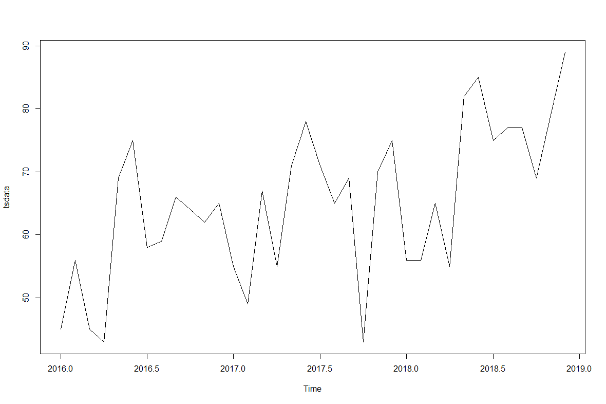


```R
> #시계열 분해
> plot(stl(tsdata, "periodic")) #주기적
#잔차는 회귀식에 의해 추정된 값과 실제 값의 차이 - 계절과 추세 적합 결과에 의해서 나타남
```

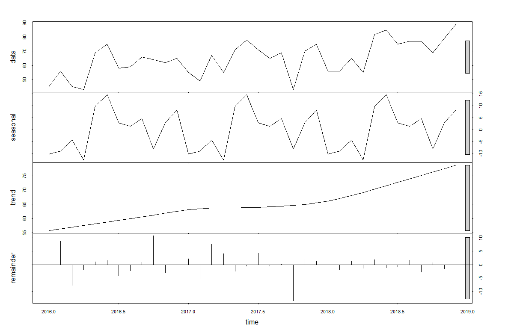


#### 시계열 분해, 변동요인 제거

```R
#시계열 분해, 변동요인 제거
> #시계열 분해
> plot(stl(tsdata, "periodic")) #주기적
> m <- decompose(tsdata)
> attributes(m)
$names
[1] "x"        "seasonal" "trend"    "random"  
[5] "figure"   "type"    

$class
[1] "decomposed.ts"

> plot(m)
> plot(tsdata - m$seasonal)
> #시계열 분해, 변동요인 제거
> m<- decompose(tsdata)
> attributes(m)
$names
[1] "x"        "seasonal" "trend"    "random"  
[5] "figure"   "type"    

$class
[1] "decomposed.ts"

> plot(m)       #추세, 계정, 불규칙 요인 포함 시각화
> plot(tsdata - m$seasonal)  #계절 요인을 제거한 시각화

```


#### 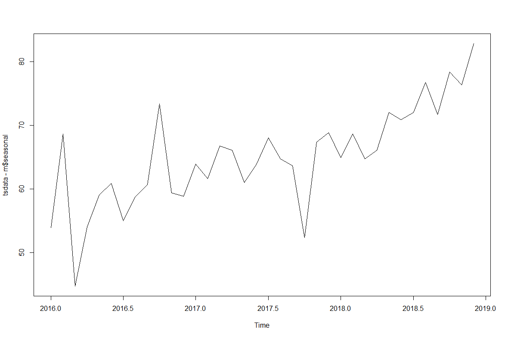

```R
plot(tsdata - m$trend)    #계절 요인을 제거한 시각화
```

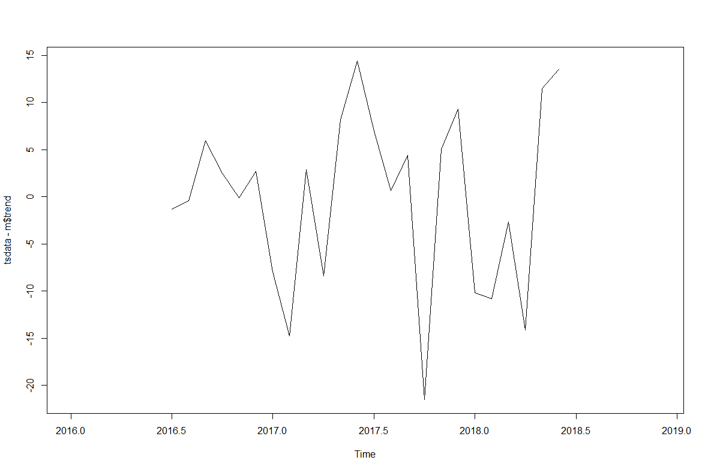


#### 불규칙 요인만 시각화

```R
> plot(tsdata - m$seasonal - m$trend)  #불규칙 요인만 시각화
```

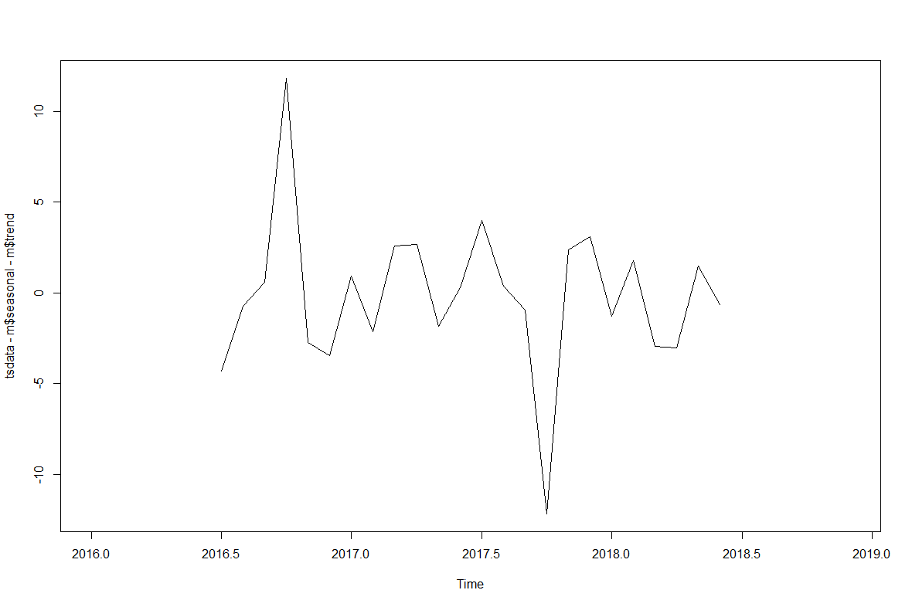


### 시계열 자료의 변동요인

- **추세 변동**(Trend variation: T) – 인구 변동, 지각변동, 기술변화 등으로 인하여 상승과 하락의 영향을 받아 시계열 자료에 영향을 주는 장기 변동 요인
- **순환 변동**(Cyclical variation: C) – 2년 ~ 10년의 주기에서 일정한 기간 없이 반복적인 요소를 가지는 중.장기 변동 요인
- **계절 변동**(Seasonal variation: S) – 일정한 기간(월, 요일, 분기 등)에 의해서 1년을 단위로 반복적인 요소를 가지는 단기 변동 요인
- **불규칙변동**(Irregular variation: I) – 어떤 규칙 없이 예측 불가능한 변동요인으로 추세, 순환, 계절요인으로 설명할 수 없는 요인 (실제 시계열 자료에서 추세, 순환, 계절요인을 뺀 결과로 나타난다. – 회귀분석에서 오차에 해당)


### 자기 상관 함수 / 부분 자기 상관 함수

- 자기 상관성은 자기 상관계수가 유의미한가를 나타내는 특성이다.
- 자기 상관계수 - 시계열 자료(Yt)에서 시차(lag)를 일정하게 주는 경우 얻어지는 상관계수이다.
  - 예) 시차 1의 자기 상관계수는 Yt와 Yt-1 간의 상관계수를 의미한다.

- 자기 상관계수는 서로 이웃한 시점 간의 상관계수를 찾는 데 이용된다.
- 부분 자기 상관계수 -  다른 시차들의 시계열 자료가 미치는 영향을 제거한 후에 주어진 시차에 대한 시계열 간의 상관계수이다.
- 자기 상관 함수와 부분 자기 상관 함수는 시계열의 모형을 식별하는 수단으로 이용된다.


### 자기 상관 함수 / 부분 자기 상관 함수  시각화

- packf()


```R
#################자기 상관 함수 ###########################
input <- c(3180,3000,3200,3100,3300,3200,3400,3550,3200,3400,3300,3700) 
```


#### 추세선 시각화

```R
#추세선 시각화
plot(tsdata, type="l", col = 'red')
```

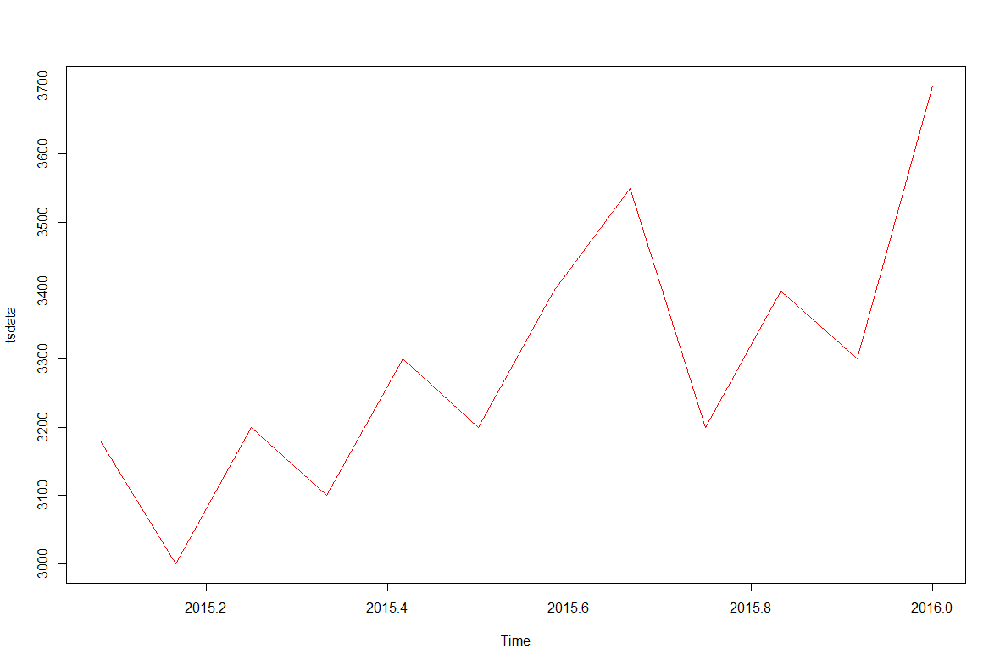


#### 자기상관 함수 시각화

```R
> acf(na.omit(tsdata), main="자기상관함수", col="red")
#파란점선은 유의미한 자기 상관관계에 대한 임계값을 의미
#모든 시차(Lag)가 파란 점선 안에 있기 때문에 서로 이웃한 시점 간의  자기 상관성은 없는 것으로 해석
```

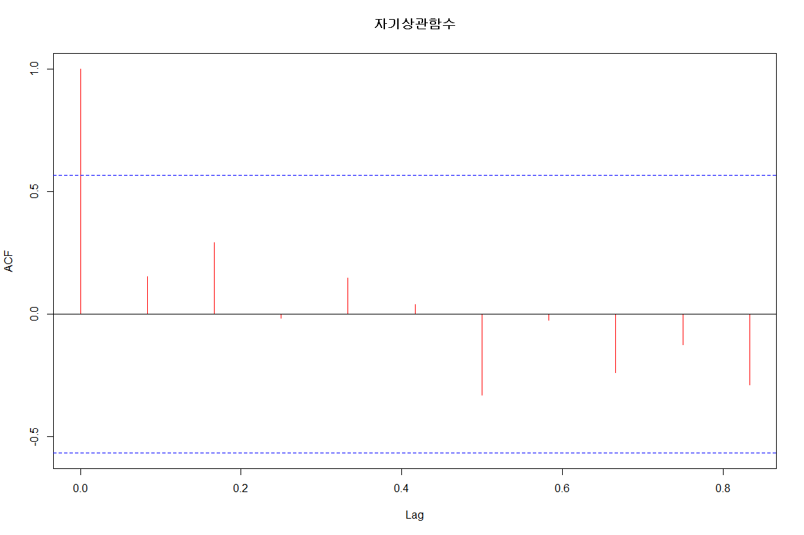


#### 부분 자기 상관 함수 시각화

```R
#부분 자기 상관 함수 시각화
pacf(na.omit(tsdata), main="부분자기상관함수", col="red") 
#주기 생성에 어떤 종류의 시간 간격이 영향을 미치는지 보여줌
#간격 0.5에서 가장 작은 값(-0.5)를 나타냄
#모든 시차가 파란 점선 안쪽에 있기 때문에 주어진 시점 간의 자기 상관성은 없는 것으로 해석
```

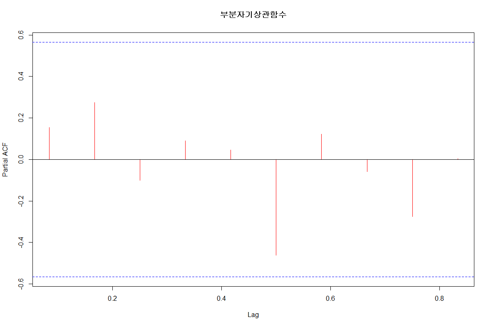


#### 추세 패턴 찾기 시각화

- 추세 패턴 – 시계열 자료가 증가 또는 감소하는 경향이 있는지 알아보고, 증가나 감소의 경향이 선형(Linear)인지 비선형(non-Linear)인지를 찾는 과정

- 추세 패턴의 객관적인 근거는 차분(Differencing)과 자기 상관성(Autocorrelation)을 통해서 얻을 수 있는데 여기서 차분은 현재 시점에서 이전 시점의 자료를 빼는 연산을 의미한다.


#### 시계열분석 기법  

- 평활법, 시계열요소분해법 – 시각적인 측면에서 직관성을 제공
- 회귀분석법, ARIMA 모형법 – 수학적 이론을 배경으로 1개 이상의 다변량 시계열 데이터를 대상으로 분석하는 방법
- 일반 회귀모형 – 시계열 자료에서 시간 t를 설명변수로 시계열 자료를 반응변수로 지정한 회귀모형
- 계량경제모형 – Yt와 Yt-1 사이의 시계열 자료를 대상으로 회귀분석을 수행하는 모형으로 경제변수 간의 경제적 관계에 대한 정량적, 수치적 분석과 측정을 위한 모형인 계량경제모형은 인플레이션이 환율에 미치는 요인, 엔/달러 환율이 물가에 미치는 영향 등을 분석하는데 이용된다.

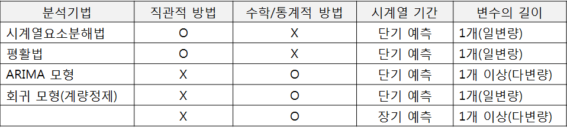


#### 시계열요소 분해법

- 시계열 요소 분해법은 시계열 자료의 4가지 변동요인을 찾아서 시각적으로 분석하는 기법
- ‘추세’와 ‘계절’ 변동 요인은 추세선에서 뚜렷하게 나타난다 .
- 추세 변동에 대한 분석은 시계열 자료가 증가하거나 감소하는 경향이 있는지를 파악하고, 증가나 감소의 경향이 선형(Linear)인지, 비선형(non-Linear)인지 또는 S 곡선과 같은 성장곡선인지를 찾는 과정이 필요하다.


#### 추세 패턴 찾는 방법 

- 차분 후 일정한 값을 나타내며 선형의 패턴(대각선)
- 로그변환 후 일정한 값을 나타내며 비션형의 패턴(U자, 역U자)
- 로그변환 후 1차 차분 결과가 일정한 값으로 나타나며 성장곡선의 패턴(S자) 


#### 평활법(Smothing Method)

- 시계열 자료의 체계적인 자료의 흐름을 파악하기 위해서 과거 자료의 불규칙적인 변동을 제거하는 방법
- 시계열 자료의 뾰족한 작은 변동들을 제거하여 부드러운 곡서으로 시계열 자료를 조정하는 기법
- 이동평균, 지수평활법 


#### 이동평균(Moving Average) 

- 시계열 자료를 대상으로 일정한 기간의 자료를 평균으로 계산하고, 이동시킨 추세를 파악하여 다음 기간의 추세를 예측하는 방법
- 시계열 자료에서 계절 변동과 불규치변동을 제거하여 추세 변동과 순환 변동만 갖는 시계열로 변환한다(시계열에서 추세와 순환예측)
- 자료의 수가 많고 비교적 안정적 패턴을 보이는 경우 효과적이다
- TTR::SMA() – 이동평균번으로 평활하는 함수
- 가장 평탄한 형태로 분포된 결과를 선정하여 추세를 예측하는데 사용된다


```R
> #########이동평균(Moving Average) 평활법 ###################  
> data <- c(45, 56, 45, 43, 69, 75, 58, 59, 66, 64, 62, 65, 
+           55, 49, 67, 55, 71, 78, 71, 65, 69, 43, 70, 75, 
+           56, 56, 65, 55, 82, 85, 75, 77, 77, 69, 79, 89)

> # 시계열자료 생성 : 시계열자료 형식으로 객체 생성
> tsdata <- ts(data, start=c(2016, 1), frequency=12) 
> tsdata    # 2016~2018
     Jan Feb Mar Apr May Jun Jul Aug Sep Oct Nov
2016  45  56  45  43  69  75  58  59  66  64  62
2017  55  49  67  55  71  78  71  65  69  43  70
2018  56  56  65  55  82  85  75  77  77  69  79
     Dec
2016  65
2017  75
2018  89


> library(TTR)
> par(mfrow=c(2,2))

> plot(tsdata, main="원 시계열 자료") # 시계열 자료 시각화
> plot(SMA(tsdata, n=1), main="1년 단위 이동평균법으로 평활")
> plot(SMA(tsdata, n=2), main="2년 단위 이동평균법으로 평활")
> plot(SMA(tsdata, n=3), main="3년 단위 이동평균법으로 평활")
#가장 평탄한 형태로 분포된 결과를 선정하여 추세를 예측하는데 사용
#평균으로 평활한 결과가 가장 평탄한 값으로 나타나는 값은  3년 단위 이동평균법으로 평활한 것
```


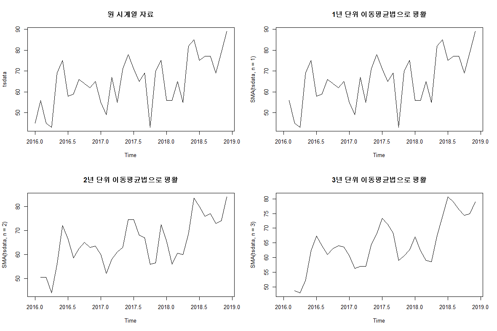

#### 회귀분석법

- 시계열 자료는 시간이라는 설명변수(독립변수)에 의해서 어떤 반응변수(종속변수)를 나타내는 것을 말한다.
  - 예) 매분 매시간 단위로 주식 시세의 데이터가 기록되는 경우, 매분, 매시간은 반응변수이고, 주식 시세의 값은 설명변수에 해당한다.

- 선형회귀 분석을 이용하여 시계열 자료의 선형성이나 정규성, 등분산성 등의 모수검정을 위한 타당성을 검정해야 한다.


#### 정상성을 가진 시계열 모형  

- 뚜렷한 추세가 없는 시계열
- 시계열의 평균이 시간 축에 평행하게 나타난다.
- 자기회귀모형(AR), 이동평균모형(MA), 자기회귀이동평균모형(ARMA)


#### 비정상성을 가진 시계열 모형  

- 대부분의 시계열 자료는 비정상성 시계열의 형태를 갖는다.
- 자기회귀 누적이동평균모형(ARIMA) – 3개의 인수(p는 자기회귀모형 차수, d는 차분 차수, q는 이동평균모형의 차수)를 갖는다.
- 시계열 자료 Yt를 d번 차분한 결과가 정상성 시계열의 ARIMA(p, q) 모형이라면 시계열 Yt는 차수 d를 갖는 ARIMA(p, d, q)모형이 된다.


##### ARIMA 모형 시계열 자료 처리 절차

- 식별(Identification) – ARIMA의 3개의 차수  (p, d, q)를 결정하는 단계, 현재 시계열 자료가 어떤 모형(AR, MA, ARMA)에 해당하는가를 판단하는 단계, 식별의 수단으로 자기 상관 함수(acf)와 부분 자기 상관 함수(pacf)를 이용
- 추정(Estimation) – 식별된 모형의 파라미터를 추정하는 단계, 최소제곱법을 이용
- 진단(Diagnosis) – 모형식별과 파라미터 추정에 의해서 생성된 모형이 적합한지를 검증하는 단계, 적합성 검증의 수단으로 잔차가 백색 잡음(white noise)인지를 살펴보고, 백색 잡음과 차이가 없으면 적합하다고 할 수 있다.

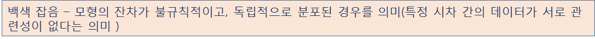


##### ARIMA 모형 시계열 예측 - ARIMA 모형 분석 절차

- 단계 1] 시계열 자료 특성분석(정상성/비정상성)
- 단계 2] 정상성 시계열 반환
- 단계 3] 모형 식별과 추정  - forecast::auto.arima() 
- 단계 4] 모형 생성
- 단계 5] 모형 진단(모형 타당성 검정) -  자기 상관 함수의 결과가 유의미한 시차가 없는 경우, 오차 간에 상관관계가 존재하는지를 검정하는 방법인 Box-Ljung 검정에서 p 값이 0.05 이상인 경우
- 단계 6] 미래 예측(업무 적용)


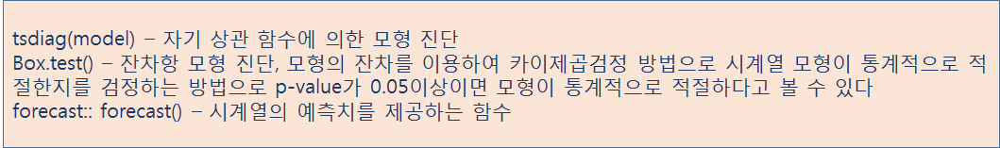


```R
> ############정상성 시계열의 ARIMA  모델 분석 ##################
> 
> input <- c(3180,3000,3200,3100,3300,3200,3400,3550,3200,3400,3300,3700) 
> 
> #시계열객체 생성(12개월 : 2015년 2월 ~ 2016년 1개)
> tsdata <- ts(input, start=c(2015, 2), frequency=12) 
> tsdata
      Jan  Feb  Mar  Apr  May  Jun  Jul  Aug  Sep
2015      3180 3000 3200 3100 3300 3200 3400 3550
2016 3700                                        
      Oct  Nov  Dec
2015 3200 3400 3300
2016               

> # 추세선 시각화
> plot(tsdata, type="l", col='red')
> # 정상성시계열 변환
> par(mfrow=c(1,2))
> ts.plot(tsdata)
> diff <- diff(tsdata)
> plot(diff) # 차분 : 현시점에서 이전시점의 자료를 빼는 연산

```

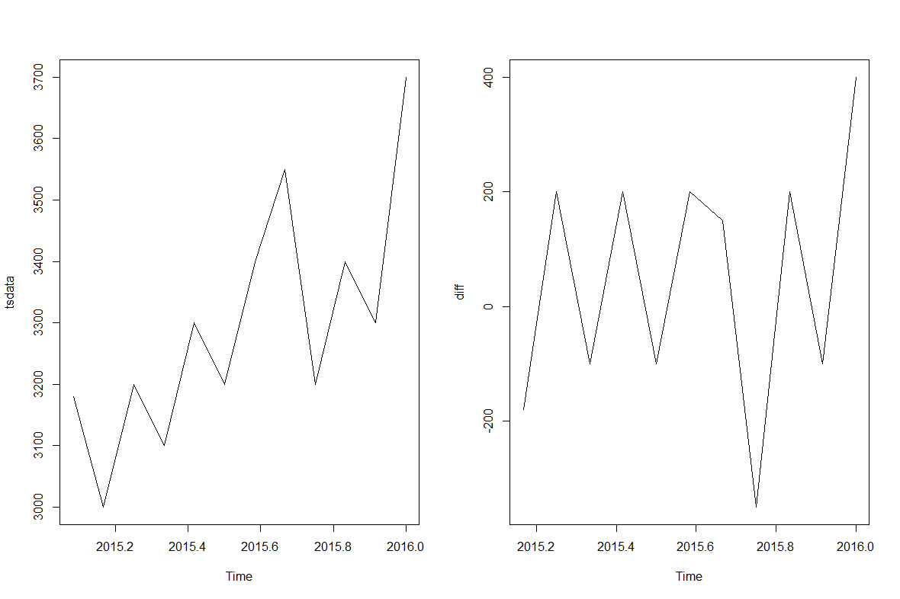


```R
# auto.arima() : 시계열 모형을 식별하는 알고리즘에 의해서 최적의 모형과 파라미터를 추정하여 제공
install.packages('forecast')
library(forecast)

> arima <- auto.arima(tsdata) # 시계열 데이터 이용 
> arima
Series: tsdata 
ARIMA(1,1,0) 

Coefficients:
          ar1
      -0.6891
s.e.   0.2451

sigma^2 estimated as 31644:  log likelihood=-72.4
AIC=148.8   AICc=150.3   BIC=149.59

# ARIMA(1,1,0) - 자기 회귀 모형 차수 1, 차분 차수 1
# 1번 차분한 결과가 정상성 시계열 ARMA(1, 0) 모형으로 나타남
# AIC=148.8 는 이론적 예측력 (모형의 적합도 지수로 값이 적은 모형을 채택한다.)
# d =0 이면, ARMA(p, q) 모형이며, 정상성을 만족합니다.
# p =0 이면, IMA(d, q) 모형이며, d번 차분하면 MA(q) 모형을 따른다.
# q=0이면, IAR(p, d) 모형이며, d번 차분하면 AR(p) 모형을 따른다.


> ####  모형 생성 
> model <- arima(tsdata, order=c(1, 1, 0))
> model 

Call:
arima(x = tsdata, order = c(1, 1, 0))

Coefficients:
          ar1
      -0.6891
s.e.   0.2451

sigma^2 estimated as 28767:  log likelihood = -72.4,  aic = 148.8
> 
> #모형의 계수값과 표준 오차를 확인
> 
> 
####모형 진단(모형 타당성 검정)

# (1) 자기상관함수에 의한 모형 진단
tsdiag(model)
#잔차의 ACF에서 자기 상관이 발견되지 않고, p value값이 0 이상으로 분포되어 있으므로
ARIMA 모형은 매우 양호한 시계열 모형이라고 진단할 수 있다

# (2) Box-Ljung에 의한 잔차항 모형 진단
Box.test(model$residuals, lag=1, type = "Ljung")   #p-value가 0.725
#  p-value가 0.05이상이면 모형이 통계적으로 적절하다고 볼 수 있다 

> # 미래 예측(업무 적용)
> fore <- forecast(model) # 향후 2년 예측
> fore
         Point Forecast    Lo 80    Hi 80    Lo 95
Feb 2016       3424.367 3207.007 3641.727 3091.944
Mar 2016       3614.301 3386.677 3841.925 3266.180
Apr 2016       3483.421 3198.847 3767.995 3048.203
May 2016       3573.608 3272.084 3875.131 3112.467
Jun 2016       3511.462 3175.275 3847.649 2997.308
Jul 2016       3554.286 3199.003 3909.568 3010.928
Aug 2016       3524.776 3143.569 3905.984 2941.770
Sep 2016       3545.111 3144.813 3945.408 2932.908
Oct 2016       3531.099 3109.224 3952.974 2885.897
Nov 2016       3540.754 3100.585 3980.923 2867.574
Dec 2016       3534.101 3074.901 3993.300 2831.816
Jan 2017       3538.685 3062.192 4015.179 2809.951
Feb 2017       3535.526 3041.695 4029.357 2780.277
Mar 2017       3537.703 3027.557 4047.849 2757.502
Apr 2017       3536.203 3009.958 4062.448 2731.381
May 2017       3537.237 2995.565 4078.908 2708.822
Jun 2017       3536.524 2979.724 4093.325 2684.972
Jul 2017       3537.015 2965.573 4108.457 2663.070
Aug 2017       3536.677 2950.901 4122.453 2640.809
Sep 2017       3536.910 2937.181 4136.639 2619.704
Oct 2017       3536.749 2923.359 4150.140 2598.650
Nov 2017       3536.860 2910.124 4163.596 2578.350
Dec 2017       3536.784 2896.968 4176.600 2558.270
Jan 2018       3536.836 2884.211 4189.462 2538.732
            Hi 95
Feb 2016 3756.791
Mar 2016 3962.421
Apr 2016 3918.639
May 2016 4034.748
Jun 2016 4025.615
Jul 2016 4097.643
Aug 2016 4107.783
Sep 2016 4157.313
Oct 2016 4176.301
Nov 2016 4213.934
Dec 2016 4236.385
Jan 2017 4267.420
Feb 2017 4290.775
Mar 2017 4317.904
Apr 2017 4341.025
May 2017 4365.651
Jun 2017 4388.077
Jul 2017 4410.960
Aug 2017 4432.545
Sep 2017 4454.116
Oct 2017 4474.849
Nov 2017 4495.371
Dec 2017 4515.298
Jan 2018 4534.941
> par(mfrow=c(1,2))
> plot(fore) # 향후 24개월 예측치 시각화 
> model2 <- forecast(model, h=6) # 향후 6개월 예측치 시각화 
> plot(model2)

```

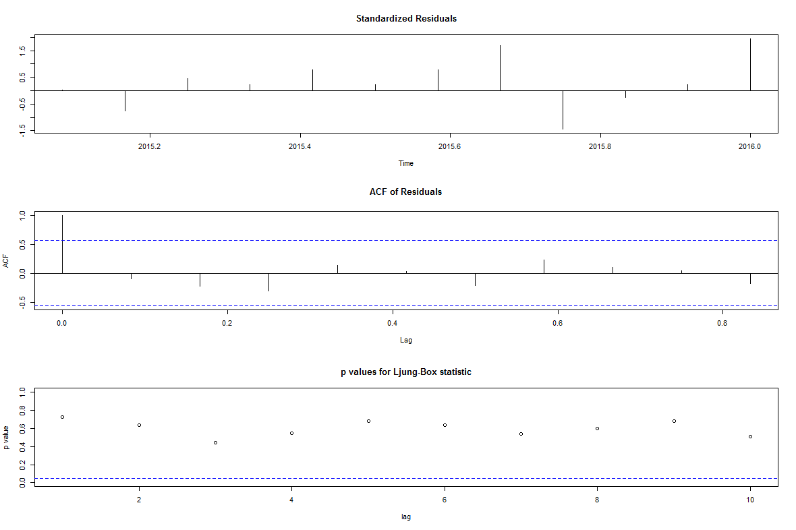

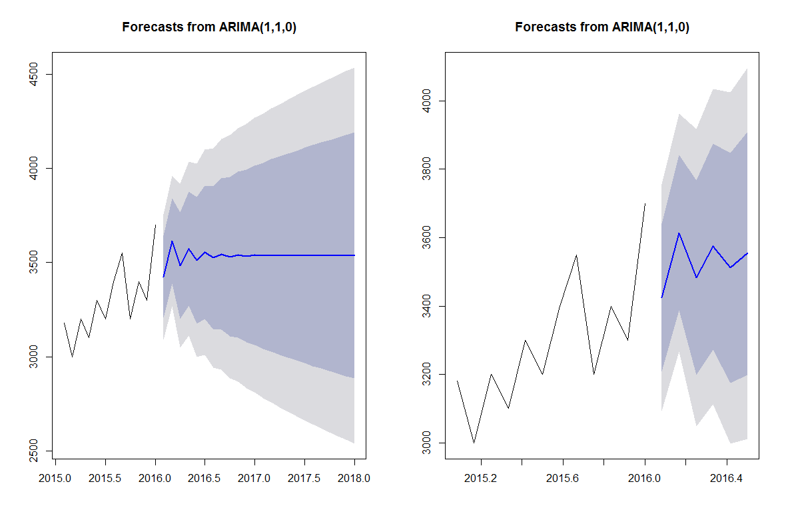


#### 계절성 있는 데이터의 정상성시계열의 ARIMA 모델 **분석**

```R
> ######계절성 있는 데이터의 정상성시계열의 ARIMA 모델 분석########
> data <- c(45, 56, 45, 43, 69, 75, 58, 59, 66, 64, 62, 65, 
+           55, 49, 67, 55, 71, 78, 71, 65, 69, 43, 70, 75, 
+           56, 56, 65, 55, 82, 85, 75, 77, 77, 69, 79, 89)
> length(data)# 36
[1] 36
> 
> # 시계열자료 생성 
> tsdata <- ts(data, start=c(2016, 1), end = c(2018, 10),frequency=12)
> tsdata 
     Jan Feb Mar Apr May Jun Jul Aug Sep Oct Nov
2016  45  56  45  43  69  75  58  59  66  64  62
2017  55  49  67  55  71  78  71  65  69  43  70
2018  56  56  65  55  82  85  75  77  77  69    
     Dec
2016  65
2017  75
2018    
> head(tsdata)
     Jan Feb Mar Apr May Jun
2016  45  56  45  43  69  75
> tail(tsdata)
     May Jun Jul Aug Sep Oct
2018  82  85  75  77  77  69


> #시계열요소분해 시각화
> ts_feature <- stl(tsdata, s.window="periodic")
> plot(ts_feature)
> #계절성이 뚜렷하게 나타남

```

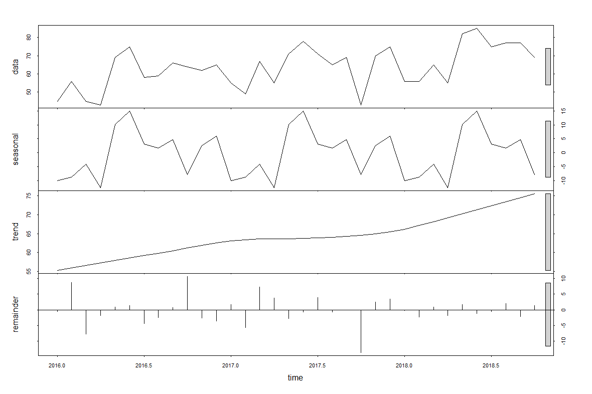


```R
> # 단계2 : 정상성시계열 변환
> par(mfrow=c(1,2))
> ts.plot(tsdata)
> diff <- diff(tsdata)  
> plot(diff) # 차분 시각화

```

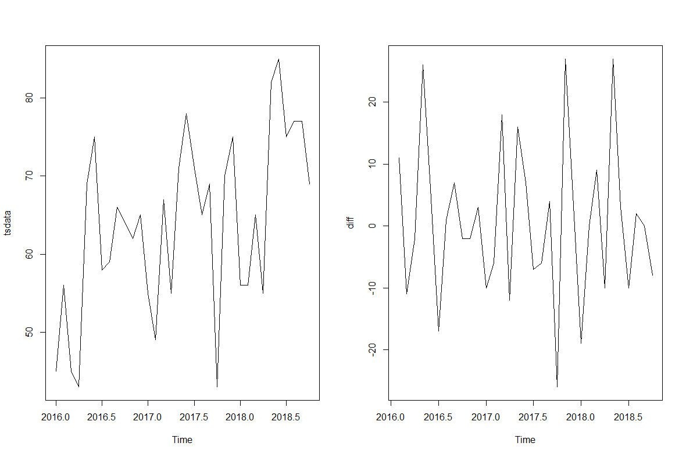


```R
> # 단계3 : 모형 식별과 추정
> library(forecast)
> ts_model2 <- auto.arima(tsdata)  
Warning message:
The chosen seasonal unit root test encountered an error when testing for the second difference.
From stl(): series is not periodic or has less than two periods
1 seasonal differences will be used. Consider using a different unit root test. 
> ts_model2
Series: tsdata 
ARIMA(0,0,0)(0,1,0)[12] with drift 

Coefficients:
       drift
      0.5114
s.e.  0.1653

sigma^2 estimated as 90.7:  log likelihood=-80.29
AIC=164.57   AICc=165.21   BIC=166.76
# ARIMA(2,1,0) - 자기 회귀 모형 차수 2, 차분 차수 1
# 1번 차분한 결과가 정상성 시계열 ARMA(2, 0) 모형으로 나타남
# ARIMA 두번째 파라미터 (1, 0, 0)는 계절성을 갖는 자기회귀(AR) 모형 차수가 1로 나타남 =>계절성을 갖는 시계열이라는 의미
# [12]는 계절의 차수가 12개월임을 의미함
# 계수(Coefficients)는 자기회귀 모형의 차수 2(ar1, ar2)와 계절성 자기회귀 차수(sar1)에 대한 계수값임을 나타냄


> # 단계4 : 모형 생성 
> model <- arima(tsdata, c(2, 1, 0), 
+                seasonal = list(order = c(1, 0, 0)))
> model

Call:
arima(x = tsdata, order = c(2, 1, 0), seasonal = list(order = c(1, 0, 0)))

Coefficients:
          ar1      ar2   sar1
      -0.5188  -0.4664  0.492
s.e.   0.1562   0.1574  0.162

sigma^2 estimated as 82.72:  log likelihood = -121.66,  aic = 251.31
> #모형의 계수값과 표준 오차를 확인

> # 단계5 : 모형 진단(모형 타당성 검정)
> # (1) 자기상관함수에 의한 모형 진단
> tsdiag(model)
> #잔차의 ACF에서 자기 상관이 발견되지 않고, p value값이 0 이상으로 분포되어 있으므로
> #ARIMA 모형은 매우 양호한 시계열 모형이라고 진단할 수 있다
> 
> 
> # (2)Box-Ljung에 의한 잔차항 모형 진단
> Box.test(model$residuals, lag=1, type = "Ljung")  #0.593

	Box-Ljung test

data:  model$residuals
X-squared = 0.22956, df = 1, p-value = 0.6318

> #  p-value가 0.05이상이면 모형이 통계적으로 적절하다고 볼 수 있다 


> #  p-value가 0.05이상이면 모형이 통계적으로 적절하다고 볼 수 있다 
> # 단계6 : 미래 예측
> par(mfrow=c(1,2))
> fore <- forecast(model, h=24) # 2년 예측 
> plot(fore)
> fore2 <- forecast(model, h=6) # 6개월 예측 
> plot(fore2)

```

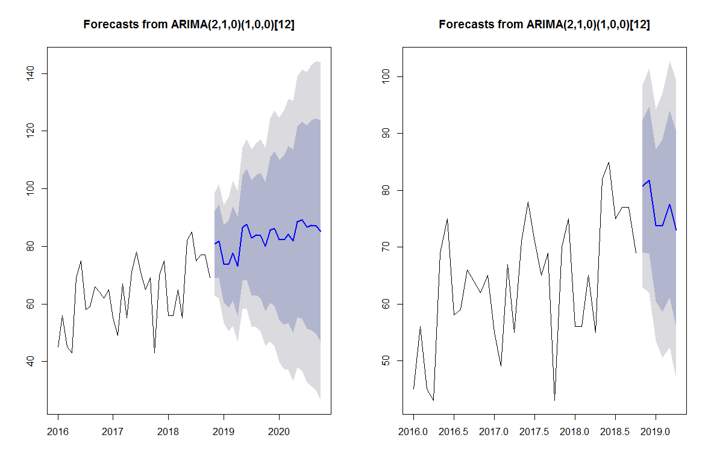


##### 시계열 분석 연습문제 1 

```R
##########시계열 분석 연습문제 1 #####################
시계열 자료를 대상으로 다음 단계별로 시계열 모형을 생성하고, 미래를 예측하시오.
<데이터 셋 준비>
data(EuStockMarkets)
head(EuStockMarkets)
EuStock<- data.frame(EuStockMarkets)
head(EuStock)
Second <- c(1:500) # 초단 단위로 벡터 생성
DAX <- EuStock$DAX[1001:1500] # DAX 칼럼으로 백터 생성
EuStock.df <- data.frame(Second, DAX) # 데이터프레임 생성

단계1 : 시계열자료 생성 : EuStock.df$DAX 칼럼을 대상으로 2001년1월 단위
> #단계1 : 시계열자료 생성 : EuStock.df$DAX 칼럼을 대상으로 2001년1월 단위
> tsdata <- ts(EuStock.df$DAX, start=c(2001, 1), frequency=12)


단계2 : 시계열 자료 분해
(1) stl() 함수 이용 분해 시각화
> ts_feature <- stl(tsdata, s.window="periodic")
> plot(ts_feature)

(2) decompose() 함수 이용 분해 시각화, 불규칙요인만 시각화
> m <- decompose(tsdata)
> attributes(m)
$names
[1] "x"        "seasonal" "trend"    "random"  
[5] "figure"   "type"    

$class
[1] "decomposed.ts"


(3) 계절요인추세요인 제거 그래프-불규칙요인만 출력
> plot(m)       #추세, 계정, 불규칙 요인 포함 시각화
> plot(tsdata - m$seasonal - m$trend)  #계절 요인, 추세요인을 제거한 시각화


단계3 : ARIMA 시계열 모형 생성
> arima <- auto.arima(tsdata) # 시계열 데이터 이용 
> arima
Series: tsdata 
ARIMA(2,1,2)(1,0,2)[12] with drift 

Coefficients:
          ar1      ar2     ma1     ma2     sar1
      -1.2998  -0.9743  1.2667  0.9730  -0.5776
s.e.   0.0209   0.0243  0.0222  0.0299   0.1407
        sma1     sma2   drift
      0.6156  -0.1153  2.7548
s.e.  0.1409   0.0542  0.8165

sigma^2 estimated as 379.7:  log likelihood=-2186.91
AIC=4391.82   AICc=4392.19   BIC=4429.73


단계4 : 향후 3년의 미래를 90%와 95% 신뢰수준으로 각각 예측 및 시각화


```


## shiny


https://www.shinyapps.io/

```R
library(shiny)


ui <- fluidPage(
    
    # Sidebar with a slider input for number of bins 
    sidebarLayout(
        sidebarPanel(
            selectInput(inputId="xAxis", "Choose X axis:", 
                        choices=c("mpg", "disp", "hp", "drat","wt")
            ),
            selectInput(inputId="yAxis", "Choose Y axis:", 
                        choices=c("wt", "drat", "hp",  "disp","mpg"  )
            ),
            selectInput(inputId="pch", "Choose shape:", 
                        choices=c("circle"=1, "circle2"=16, "square"=22  )
            ),
            sliderInput(inputId="cex", "point size", 
                        min=0.1 , max=3, value=1
            )
        ),
        # Show a plot of the generated distribution
        mainPanel(
            plotOutput(outputId="mtcarsPlot")
        )
    )
)

# Define server logic required to draw a histogram
server <- function(input, output) {
    output$mtcarsPlot <- renderPlot({
        title <- paste(input$xAxis , " VS ", input$yAxis)
        plot(mtcars[, c(input$xAxis, input$yAxis)],
             main=title,
             pch=as.numeric(input$pch),
             cex=input$cex)
    })
    
}

# Run the application 
shinyApp(ui = ui, server = server)
###########################여기까지만 저장#####################################
#콘솔에 직접쳐야함
library(rsconnect)

rsconnect::setAccountInfo(name='xc7230',
                          token='EEF9A6093DDC0CFB481E779EB38F3B17',
                          secret='eBg+rLWYM/PtdTqZI8lLnQMgwjz4b0z3Svo7pXoK')

```

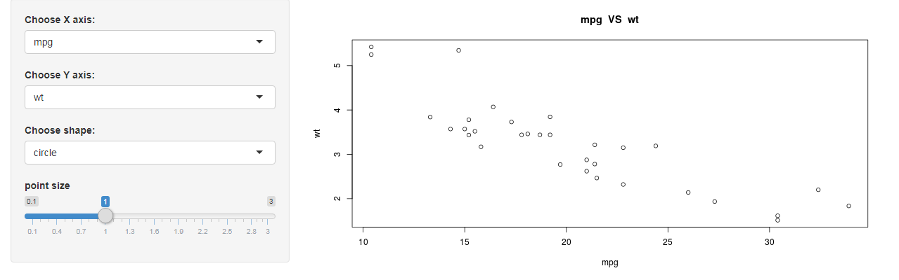