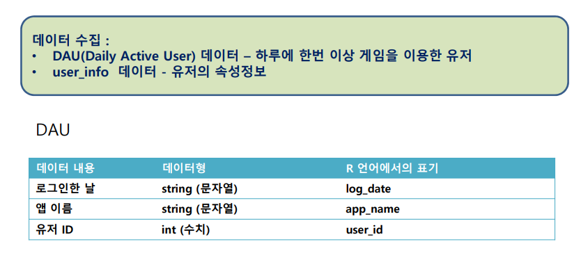
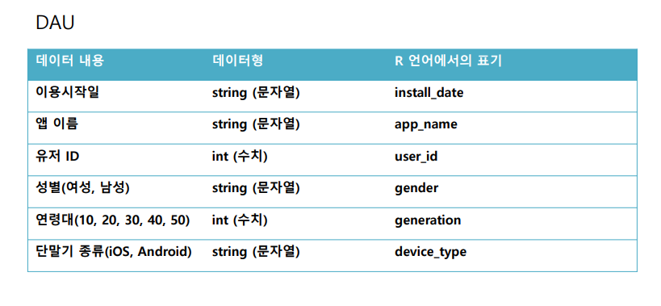
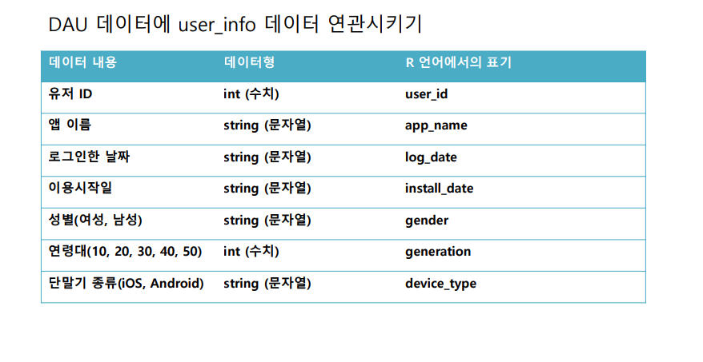
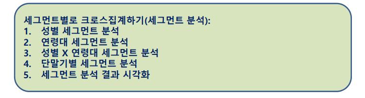
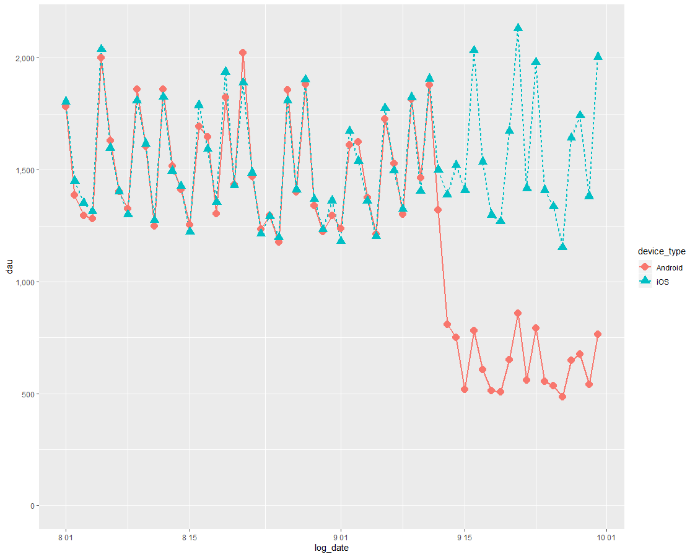
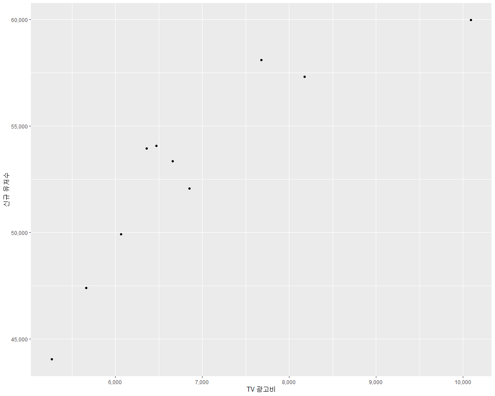

# R

## 데이터 분석 workshop3

### 소셜게임의 이용자 탈퇴 이유 분석

```R
퍼즐컬렉션 서비스를 시작한지 1년 3개월이 지났습니다. 서비스 직후에는 사전 등록자를 중심으로 유저수가 크게 증가하였고, 몇 주 후에는 심각한 버그 때문에 유저가 탈퇴하다
가, 1년 후에는 광고 효과로 다시 유저수가 증가하였고, 그 후에는 그 광고를 보고 가입 했던 유저드리 조금씩 떠나는 등 유저수가 단기적으로는 오르락 내리락하면서 월 단위로
반년 정도 계속해서 상승하였습니다. 그 후 8개월동안 유저수가 정점을 찍은 상태로 유지되었습니다. 이달 들어 퍼즐컬렉션 유저수가 크게 줄어들었고, 회사를 대표하는 히트 게임이었던 만큼 경영진을 중심으로 유저수의 감소를 큰 문제로 인식하고 있습니다. 원인을 밝혀서 대책을 세우기 위해 분석 담당자에게 의뢰했습니다.
```


### 가설

1. 광고에 문제가 있어서 신규 유저수보다 탈퇴 유저수가 더 많았다
2. 매월 테마를 바꿔서 개최하던 게임 이벤트가 식상해져서 그만둔 유저가 많았다
3. 성별 혹은 연령 등 특정 유저 층에서 탈퇴한 유저가 많았다
마케팅 부서와 게임 개발 부서에 질의 응답을 한 결과 :
1. 광고는 지난달과 비교해서 거의 같은 수준이었으며 신규 유저수도 거의 같은 수준이
었다. 2. 이벤트 내용도 지난달과 거의 바뀌지 않았다.


### 문제

- 지난달과 비교해서 유저수가 줄어들었다 (사실)
- 어떤 특정한 유저층에서 문제가 생겼을 것이다. (가설)
  분석 스토리
- 퍼즐컬렉션의 유저수가 지난달보다 줄어들었다. (사실)
- 어딘가 숫자가 줄어든 세그먼트가 있을 것이다. (가설)
- 그 세그먼트에 적합한 대책을 세워서 유저수를 지난달과 같은 수준으로 회복한다. (해결책)


### 탐색형 데이터 분석

• 사전에 원인을 짐작하기 어려운 상황에서 출발하여 그 원인을 데이 터 분석을 통해 탐색해나가는 방법





### 데이터 수집




### 데이터 가공




### 데이터 분석

• 어떤 속성을 가진 유저층이 지난달에 비해 감소하였는지 그 세그먼트(계층)을 찾아내기 위해 크로스집계를 실시


### 크로스 집계

- 2개 변수의 인과관계를 교차해서 집계하는 분석 기법


### 소셜게임의 이용자 탈퇴 이유 분석

– 어떤 속성을 가진 유저층이 지난달에 비해 감소하였는지 그 세그먼 트(계층)를 찾아내기 위해 크로스 집계를 실행하고 , 원인으로 생각되는 속성이 발견되면 시각화한다. – 어떤 상태의 데이터와 유저의 속성정보(원인 데이터)를 연관시켜서 특정한 속성(원인)이 어떠한 상태(결과)를 야기하는 것이 아닌진 검토하는 방식으로 분석





### 실행 환경으로 데이터 로딩

```R
> #실행 환경으로 데이터 로딩
> dau <- read.csv("./workshop2_data/ws3-dau.csv", header = T, stringsAsFactors = F)
> head(dau)
    log_date app_name user_id
1 2013-08-01  game-01   33754
2 2013-08-01  game-01   28598
3 2013-08-01  game-01   30306
4 2013-08-01  game-01     117
5 2013-08-01  game-01    6605
6 2013-08-01  game-01     346
> user.info <- read.csv("./workshop2_data/ws3-user_info.csv", header = T, stringsAsFactors = F)
> head(dpu)
  install_date app_name user_id gender generation
1   2013-04-15  game-01       1      M         40
2   2013-04-15  game-01       2      M         10
3   2013-04-15  game-01       3      F         40
4   2013-04-15  game-01       4      M         10
5   2013-04-15  game-01       5      M         40
6   2013-04-15  game-01       6      M         40
  device_type
1         iOS
2     Android
3         iOS
4     Android
5         iOS
6         iOS
> 
> 
> dau.user.info <- merge(dau, user.info, by = c("user_id", "app_name"))
> 
> head(dau.user.info)
  user_id app_name   log_date install_date gender
1       1  game-01 2013-09-06   2013-04-15      M
2       1  game-01 2013-09-05   2013-04-15      M
3       1  game-01 2013-09-28   2013-04-15      M
4       1  game-01 2013-09-12   2013-04-15      M
5       1  game-01 2013-09-11   2013-04-15      M
6       1  game-01 2013-09-08   2013-04-15      M
  generation device_type
1         40         iOS
2         40         iOS
3         40         iOS
4         40         iOS
5         40         iOS
6         40         iOS

```


### 세그먼트 분석

```R
> # 월 항목을 추가
> 
> dau.user.info$log_month <- substr(dau.user.info$log_date, 1, 7)
> 
> # 세그먼트 분석（성별로 집계）
> 
> table(dau.user.info[, c("log_month", "gender")])
         gender
log_month     F     M
  2013-08 47343 46842
  2013-09 38027 38148
> 
> 
> 
> # 세그먼트 분석(연령대별로 집계）
> 
> table(dau.user.info[, c("log_month", "generation")])
         generation
log_month    10    20    30    40    50
  2013-08 18785 33671 28072  8828  4829
  2013-09 15391 27229 22226  7494  3835
> 
> 
> 
> # 세그먼트 분석（성별과 연령대를 조합해 집계）
> 
> library(reshape2)
> 
> dcast(dau.user.info, log_month ~ gender + generation, value.var = "user_id",
+       
+       length)
  log_month F_10  F_20  F_30 F_40 F_50 M_10  M_20  M_30
1   2013-08 9091 17181 14217 4597 2257 9694 16490 13855
2   2013-09 7316 13616 11458 3856 1781 8075 13613 10768
  M_40 M_50
1 4231 2572
2 3638 2054
> 
> 
> 
> # 세그먼트 분석（단말기별로 집계）
> 
> table(dau.user.info[,c("log_month","device_type")])
         device_type
log_month Android   iOS
  2013-08   46974 47211
  2013-09   29647 46528

```


### 날짜별 데이터 형식으로 변환하기

```R
> # 날짜별 데이터 형식으로 변환하기
> 
> dau.user.info.device.summary$log_date <- as.Date(dau.user.info.device.summary$log_date)
> 
> # 시계열의 트렌드 그래프 그리기
> 
> library(ggplot2)
> 
> library(scales)
> 
> limits <- c(0, max(dau.user.info.device.summary$dau))
> 
> ggplot(dau.user.info.device.summary, aes(x=log_date, y=dau, col=device_type, lty=device_type, shape=device_type)) +
+   
+   geom_line(lwd=1) +
+   
+   geom_point(size=4) +
+   
+   scale_y_continuous(label=comma, limits=limits)

```




## 매스미디어 광고 실시의 최적화 문제

```R
> ############################################
> #매스미디어 광고 실시의 최적화 문제
> ############################################
> #단계 1: CSV 파일 읽기
> ad.data <- read.csv("./workshop5-data/ad_result.csv", header = T, stringsAsFactors = F)
> ad.data
     month  tvcm magazine install
1  2013-01  6358     5955   53948
2  2013-02  8176     6069   57300
3  2013-03  6853     5862   52057
4  2013-04  5271     5247   44044
5  2013-05  6473     6365   54063
6  2013-06  7682     6555   58097
7  2013-07  5666     5546   47407
8  2013-08  6659     6066   53333
9  2013-09  6066     5646   49918
10 2013-10 10090     6545   59963
> #단계 2: TV 광고의 광고비용과 신규 유저수의 산점도 그리기
> library(ggplot2)
> library(scales)
> 
> ggplot(ad.data, aes(x = tvcm, y = install)) + geom_point() + 
+   xlab("TV 광고비") + ylab("신규 유저수") + 
+   scale_x_continuous(label = comma) +
+   scale_y_continuous(label = comma)

```




```R
> #단계 3: 잡지 광고의 광고비용과 신규 유저수의 산점도 그리기
> ggplot(ad.data, aes(x = magazine, y = install)) + geom_point() + 
+   xlab("잡지 광고비") + ylab("신규 유저수") + 
+   scale_x_continuous(label = comma) + 
+   scale_y_continuous(label = comma)
> 
> #단계 4: 회귀분석 실행
> fit <- lm(install ~ ., data = ad.data[, c("install", "tvcm", "magazine")])
> fit

Call:
lm(formula = install ~ ., data = ad.data[, c("install", "tvcm", 
    "magazine")])

Coefficients:
(Intercept)         tvcm     magazine  
    188.174        1.361        7.250  

> 
> 
> #단계 5: 회귀분석 해석
> # 회귀분석 결과를 해석하기
> summary(fit) 

Call:
lm(formula = install ~ ., data = ad.data[, c("install", "tvcm", 
    "magazine")])

Residuals:
     Min       1Q   Median       3Q      Max 
-1406.87  -984.49   -12.11   432.82  1985.84 

Coefficients:
             Estimate Std. Error t value Pr(>|t|)   
(Intercept)  188.1743  7719.1308   0.024  0.98123   
tvcm           1.3609     0.5174   2.630  0.03390 * 
magazine       7.2498     1.6926   4.283  0.00364 **
---
Signif. codes:  
0 ‘***’ 0.001 ‘**’ 0.01 ‘*’ 0.05 ‘.’ 0.1 ‘ ’ 1

Residual standard error: 1387 on 7 degrees of freedom
Multiple R-squared:  0.9379,	Adjusted R-squared:  0.9202 
F-statistic: 52.86 on 2 and 7 DF,  p-value: 5.967e-05

#TV광고보다 잡지 광고가 광고 효과가 높다는 것을 알 수 있습니다.
#신규 유저수 = 0.136 * TV광고비 + 0.725*잡지 광고비 + 188.174

#3개월에 한번 광고 발주를 할때 
#TV광고 : 42000(만원) , 잡지 광고 : 75000(만원)
#이면 대략 신규 유저수 55000명 획득 예측

```


## 게임 단말기  피처폰에서 스마트폰으로  이용 분석

```R
> ######################################################
> #게임 단말기  피처폰에서 스마트폰으로  이용 분석
> ######################################################
> #단계 1: CSV 파일 읽기
> dau <- read.csv("./workshop6-data/ws6-dau.csv", header = T, stringsAsFactors = F)
> head(dau)
  region_month region_day app_name  user_id device
1      2013-01 2013-01-01  game-02 10061580     FP
2      2013-01 2013-01-01  game-02 10154440     FP
3      2013-01 2013-01-01  game-02 10164762     SP
4      2013-01 2013-01-01  game-02 10165615     FP
5      2013-01 2013-01-01  game-02 10321356     FP
6      2013-01 2013-01-01  game-02 10406653     SP
> #단계 2: 유저별로 ID 이전을 한 유저인지 아닌지 나타내는 데이터 정리
> mau <- unique (dau[, c("region_month", "device", "user_id")])
> fp.mau <- unique (dau[dau$device=="FP", c("region_month", "device",
+                                           "user_id")])
> sp.mau <- unique (dau[dau$device=="SP", c("region_month", "device",
+                                           "user_id")])


> # 1월과 2월 데이터를 나누기
> fp.mau1 <- fp.mau[fp.mau$region_month == "2013-01", ]
> fp.mau2 <- fp.mau[fp.mau$region_month == "2013-02", ]
> sp.mau1 <- sp.mau[sp.mau$region_month == "2013-01", ]
> sp.mau2 <- sp.mau[sp.mau$region_month == "2013-02", ]
> # 1월에 피쳐폰으로 이용했던 유저가 2월에도 이용했는가
> mau$is_access <- 1
> fp.mau1 <- merge(fp.mau1, mau[mau$region_month == "2013-02",
+                               c("user_id", "is_access")], by = "user_id", all.x = T)
> fp.mau1$is_access[is.na(fp.mau1$is_access)] <- 0
> head(fp.mau1)
  user_id region_month device is_access
1  397286      2013-01     FP         1
2  471341      2013-01     FP         1
3  503874      2013-01     FP         0
4  512250      2013-01     FP         1
5  513811      2013-01     FP         1
6  638688      2013-01     FP         1


> # 1월에 피쳐폰으로 이용했고 2월에도 피쳐폰으로 이용했는가
> fp.mau2$is_fp <- 1
> fp.mau1 <- merge(fp.mau1, fp.mau2[, c("user_id", "is_fp")],
+                  by = "user_id",
+                  all.x = T)
> fp.mau1$is_fp[is.na(fp.mau1$is_fp)] <- 0
> head(fp.mau1)
  user_id region_month device is_access is_fp
1  397286      2013-01     FP         1     1
2  471341      2013-01     FP         1     0
3  503874      2013-01     FP         0     0
4  512250      2013-01     FP         1     1
5  513811      2013-01     FP         1     1
6  638688      2013-01     FP         1     1
> # 1월에는 피쳐폰으로 이용하다가 2월에는 스마트폰으로 이용했는가
> sp.mau2$is_sp <- 1
> fp.mau1 <- merge(fp.mau1, sp.mau2[, c("user_id", "is_sp")],
+                  by = "user_id", all.x = T)
> fp.mau1$is_sp[is.na(fp.mau1$is_sp)] <- 0
> head(fp.mau1)
  user_id region_month device is_access is_fp is_sp
1  397286      2013-01     FP         1     1     0
2  471341      2013-01     FP         1     0     1
3  503874      2013-01     FP         0     0     0
4  512250      2013-01     FP         1     1     0
5  513811      2013-01     FP         1     1     0
6  638688      2013-01     FP         1     1     0
> # 1월에는 피쳐폰으로 이용했는데 2월에는 이용하지 않았거나 혹은 스마트폰으로 이용한 유저
> fp.mau1 <- fp.mau1[fp.mau1$is_access == 0 | fp.mau1$is_sp == 1, ]
> head(fp.mau1)
   user_id region_month device is_access is_fp is_sp
2   471341      2013-01     FP         1     0     1
3   503874      2013-01     FP         0     0     0
11 1073544      2013-01     FP         0     0     0
12 1073864      2013-01     FP         0     0     0
14 1163733      2013-01     FP         1     0     1
15 1454629      2013-01     FP         0     0     0


> #단계 3: 날짜별 게임 이용 상황 데이터 정리
> library(reshape2)
> fp.dau1 <- dau[dau$device == "FP" & dau$region_month == "2013-01", ]
> fp.dau1$is_access <- 1
> fp.dau1.cast <- dcast(fp.dau1, user_id ~ region_day, value.var =
+                         "is_access", function(x) as.character(length(x)))
> names(fp.dau1.cast)[-1] <- paste0("X", 1:31, "day")
> head(fp.dau1.cast)
  user_id X1day X2day X3day X4day X5day X6day X7day
1  397286     1     1     1     1     1     1     1
2  471341     1     1     1     1     0     0     0
3  503874     1     0     0     0     0     0     0
4  512250     1     1     1     1     1     1     1
5  513811     0     0     0     0     0     0     0
6  638688     1     1     1     1     1     1     1
  X8day X9day X10day X11day X12day X13day X14day X15day
1     1     1      1      1      1      2      1      1
2     0     0      0      0      0      0      0      0
3     0     0      0      0      0      0      0      0
4     1     1      1      1      1      1      1      1
5     0     0      0      0      0      0      0      0
6     1     1      1      1      1      1      1      1
  X16day X17day X18day X19day X20day X21day X22day
1      1      2      1      1      1      1      1
2      0      0      0      0      0      0      0
3      0      0      0      0      0      0      0
4      1      1      1      1      1      1      1
5      0      0      0      0      0      0      1
6      1      1      1      1      1      1      1
  X23day X24day X25day X26day X27day X28day X29day
1      1      1      1      1      1      1      1
2      0      0      0      0      0      0      0
3      0      0      0      0      0      0      0
4      1      1      1      1      1      1      1
5      0      0      0      0      0      1      1
6      1      1      1      1      1      1      1
  X30day X31day
1      1      1
2      0      0
3      0      0
4      1      1
5      0      1
6      1      1
> # 2월에 스마트폰으로 이용한 유저 데이터를 결합하기
> fp.dau1.cast <- merge(fp.dau1.cast, fp.mau1[, c("user_id", "is_sp")],
+                       by = "user_id")
> head(fp.dau1.cast)
  user_id X1day X2day X3day X4day X5day X6day X7day
1  471341     1     1     1     1     0     0     0
2  503874     1     0     0     0     0     0     0
3 1073544     0     0     0     0     0     0     0
4 1073864     0     0     0     0     0     0     0
5 1163733     1     1     0     0     0     0     0
6 1454629     0     0     0     0     0     0     0
  X8day X9day X10day X11day X12day X13day X14day X15day
1     0     0      0      0      0      0      0      0
2     0     0      0      0      0      0      0      0
3     0     0      1      0      0      0      0      0
4     0     0      0      1      0      0      1      0
5     0     0      0      0      0      0      0      0
6     0     0      0      0      0      1      0      0
  X16day X17day X18day X19day X20day X21day X22day
1      0      0      0      0      0      0      0
2      0      0      0      0      0      0      0
3      0      0      0      0      0      0      0
4      0      0      0      0      0      0      0
5      0      1      1      0      0      1      1
6      0      0      0      0      0      0      0
  X23day X24day X25day X26day X27day X28day X29day
1      0      0      0      0      0      0      0
2      0      0      0      0      0      0      0
3      1      1      1      0      0      0      0
4      0      0      0      0      0      0      0
5      1      1      1      1      1      1      0
6      0      0      0      0      0      0      0
  X30day X31day is_sp
1      0      0     1
2      0      0     0
3      0      0     0
4      0      0     0
5      0      0     1
6      0      0     0
> table(fp.dau1.cast$is_sp)

  0   1 
190  62 

                        
#단계 4: 로지스틱 회귀분석을 통한 모델 작성
> fit.logit <- step(glm(is_sp ~ ., data = fp.dau1.cast[, -1],
                      family = binomial))
> summary(fit.logit)
                        
                        
> #단계 5: 작성된 모델을 이용해서 예측하기
> # SP(스마트폰) 이전 확률
> fp.dau1.cast$prob <- round(fitted(fit.logit), 2)
> # SP(스마트폰)으로 이전할 지 예측
> fp.dau1.cast$pred <- ifelse(fp.dau1.cast$prob > 0.5, 1, 0)
> head(fp.dau1.cast)
  user_id X1day X2day X3day X4day X5day X6day X7day
1  471341     1     1     1     1     0     0     0
2  503874     1     0     0     0     0     0     0
3 1073544     0     0     0     0     0     0     0
4 1073864     0     0     0     0     0     0     0
5 1163733     1     1     0     0     0     0     0
6 1454629     0     0     0     0     0     0     0
  X8day X9day X10day X11day X12day X13day X14day X15day
1     0     0      0      0      0      0      0      0
2     0     0      0      0      0      0      0      0
3     0     0      1      0      0      0      0      0
4     0     0      0      1      0      0      1      0
5     0     0      0      0      0      0      0      0
6     0     0      0      0      0      1      0      0
  X16day X17day X18day X19day X20day X21day X22day
1      0      0      0      0      0      0      0
2      0      0      0      0      0      0      0
3      0      0      0      0      0      0      0
4      0      0      0      0      0      0      0
5      0      1      1      0      0      1      1
6      0      0      0      0      0      0      0
  X23day X24day X25day X26day X27day X28day X29day
1      0      0      0      0      0      0      0
2      0      0      0      0      0      0      0
3      1      1      1      0      0      0      0
4      0      0      0      0      0      0      0
5      1      1      1      1      1      1      0
6      0      0      0      0      0      0      0
  X30day X31day is_sp prob pred
1      0      0     1 0.43    0
2      0      0     0 0.11    0
3      0      0     0 0.00    0
4      0      0     0 0.03    0
5      0      0     1 0.39    0
6      0      0     0 0.10    0

> #단계 6: 예측결과로부터 유저 군 추측하기
> # 예측과 실제
> table(fp.dau1.cast[, c("is_sp", "pred")])
     pred
is_sp   0   1
    0 180  10
    1  20  42
> # 예측결과로부터 유저군을 추측하기
> fp.dau1.cast1 <- fp.dau1.cast[fp.dau1.cast$is_sp == 1 & fp.dau1.cast$pred
+                               == 1, ]
> head(fp.dau1.cast1[order(fp.dau1.cast1$prob, decreasing = T), ])
     user_id X1day X2day X3day X4day X5day X6day X7day
137 24791702     1     1     0     1     0     1     1
138 24791702     1     1     0     1     0     1     1
22   5526146     1     1     1     1     1     1     1
44   9567562     1     1     1     1     1     1     1
45   9567562     1     1     1     1     1     1     1
86  16557842     1     1     1     1     1     1     1
    X8day X9day X10day X11day X12day X13day X14day
137     1     1      1      1      1      1      1
138     1     1      1      1      1      1      1
22      1     1      1      1      1      1      1
44      1     1      1      1      1      1      1
45      1     1      1      1      1      1      1
86      1     1      1      1      1      1      1
    X15day X16day X17day X18day X19day X20day X21day
137      1      1      1      1      0      1      1
138      1      1      1      1      0      1      1
22       1      1      1      1      1      1      1
44       1      1      1      1      0      1      1
45       1      1      1      1      0      1      1
86       1      1      1      1      1      1      1
    X22day X23day X24day X25day X26day X27day X28day
137      1      1      1      1      1      1      1
138      1      1      1      1      1      1      1
22       1      1      1      1      1      1      1
44       1      1      1      1      1      1      1
45       1      1      1      1      1      1      1
86       1      1      1      1      1      1      1
    X29day X30day X31day is_sp prob pred
137      1      1      1     1 1.00    1
138      1      1      1     1 1.00    1
22       1      1      1     1 0.99    1
44       1      1      1     1 0.99    1
45       1      1      1     1 0.99    1
86       1      1      1     1 0.99    1
> fp.dau1.cast2 <- fp.dau1.cast[fp.dau1.cast$is_sp == 0 & fp.dau1.cast$pred
+                               == 1, ]
> head(fp.dau1.cast2[order(fp.dau1.cast2$prob, decreasing = T), ])
     user_id X1day X2day X3day X4day X5day X6day X7day
109 19432099     1     1     1     1     0     1     1
195 41590801     0     0     0     0     0     0     0
204 43451947     1     1     1     1     1     0     1
198 42276142     1     1     1     1     1     1     0
28   6147878     1     0     0     1     1     1     1
210 46285446     0     0     0     0     1     1     1
    X8day X9day X10day X11day X12day X13day X14day
109     1     1      1      1      1      1      1
195     0     0      0      0      0      0      0
204     1     1      1      0      0      0      0
198     1     1      1      0      1      1      0
28      1     1      1      1      1      1      1
210     1     1      0      0      0      1      1
    X15day X16day X17day X18day X19day X20day X21day
109      0      1      1      0      1      1      1
195      0      0      0      0      0      0      1
204      0      0      0      0      1      0      0
198      1      1      1      1      1      1      1
28       1      1      1      1      1      1      1
210      0      1      0      0      0      1      1
    X22day X23day X24day X25day X26day X27day X28day
109      1      1      0      0      0      0      0
195      1      0      0      0      0      0      0
204      1      0      0      1      0      0      1
198      1      1      1      1      1      1      1
28       1      1      1      1      1      0      0
210      0      1      1      1      1      1      0
    X29day X30day X31day is_sp prob pred
109      0      0      0     0 0.85    1
195      1      0      1     0 0.85    1
204      1      0      0     0 0.79    1
198      1      0      0     0 0.73    1
28       0      0      0     0 0.67    1
210      1      0      0     0 0.61    1
> fp.dau1.cast3 <- fp.dau1.cast[fp.dau1.cast$is_sp == 0 & fp.dau1.cast$pred
+                               == 0, ]
> head(fp.dau1.cast3[order(fp.dau1.cast3$prob), ])
     user_id X1day X2day X3day X4day X5day X6day X7day
3    1073544     0     0     0     0     0     0     0
11   2541741     0     0     0     0     0     0     0
150 27249550     0     0     0     1     1     1     0
243 60725457     0     0     0     0     0     0     0
71  13967453     0     0     0     0     1     0     0
88  16601600     0     0     0     0     1     0     0
    X8day X9day X10day X11day X12day X13day X14day
3       0     0      1      0      0      0      0
11      0     0      1      0      0      0      0
150     0     0      1      0      1      0      0
243     0     0      1      0      0      0      0
71      0     0      0      0      0      0      0
88      0     0      0      0      0      0      0
    X15day X16day X17day X18day X19day X20day X21day
3        0      0      0      0      0      0      0
11       0      0      0      0      0      0      0
150      0      0      0      0      0      0      0
243      0      0      0      0      0      0      0
71       0      0      0      0      0      0      0
88       0      0      0      0      0      0      0
    X22day X23day X24day X25day X26day X27day X28day
3        0      1      1      1      0      0      0
11       0      0      0      0      0      0      0
150      0      0      0      0      0      0      0
243      0      0      0      0      0      0      0
71       0      0      0      0      0      0      0
88       0      0      0      0      0      0      0
    X29day X30day X31day is_sp prob pred
3        0      0      0     0 0.00    0
11       0      0      0     0 0.00    0
150      0      0      0     0 0.00    0
243      0      0      0     0 0.00    0
71       0      0      0     0 0.01    0
88       0      0      0     0 0.01    0

                        
```

