# R

## XML

### XML 구조의 파일을 Read/Write


#########################################

XML 구조의 파일을 Read/Write

#########################################
#XML 또는 HTML 문서를 가져오기 위해서 httr과 XML 패키지를 설치합니다.

```R
install.packages(XML)
library(XML)

data2 <- xmlParse(file = "./data/emp.xml")
print(data2)
str(data2)

#ROOT NODE만 추출
> rootnode <- xmlRoot(data2)
> print(rootnode)
<RECORDS>
  <EMPLOYEE>
    <ID>1</ID>
    <NAME>Rick</NAME>
    <SALARY>623.3</SALARY>
    <STARTDATE>1/1/2012</STARTDATE>
    <DEPT>IT</DEPT>
  </EMPLOYEE>
  <EMPLOYEE>
    <ID>2</ID>
    <NAME>Dan</NAME>
    <SALARY>515.2</SALARY>
    <STARTDATE>9/23/2013</STARTDATE>
    <DEPT>Operations</DEPT>
  </EMPLOYEE>
  <EMPLOYEE>
    <ID>3</ID>
    <NAME>Michelle</NAME>
    <SALARY>611</SALARY>
    <STARTDATE>11/15/2014</STARTDATE>
    <DEPT>IT</DEPT>
  </EMPLOYEE>
  <EMPLOYEE>
    <ID>4</ID>
    <NAME>Ryan</NAME>
    <SALARY>729</SALARY>
    <STARTDATE>5/11/2014</STARTDATE>
    <DEPT>HR</DEPT>
  </EMPLOYEE>
  <EMPLOYEE>
    <ID>5</ID>
    <NAME>Gary</NAME>
    <SALARY>843.25</SALARY>
    <STARTDATE>3/27/2015</STARTDATE>
    <DEPT>Finance</DEPT>
  </EMPLOYEE>
  <EMPLOYEE>
    <ID>6</ID>
    <NAME>Nina</NAME>
    <SALARY>578</SALARY>
    <STARTDATE>5/21/2013</STARTDATE>
    <DEPT>IT</DEPT>
  </EMPLOYEE>
  <EMPLOYEE>
    <ID>7</ID>
    <NAME>Simon</NAME>
    <SALARY>632.8</SALARY>
    <STARTDATE>7/30/2013</STARTDATE>
    <DEPT>Operations</DEPT>
  </EMPLOYEE>
  <EMPLOYEE>
    <ID>8</ID>
    <NAME>Guru</NAME>
    <SALARY>722.5</SALARY>
    <STARTDATE>6/17/2014</STARTDATE>
    <DEPT>Finance</DEPT>
  </EMPLOYEE>
</RECORDS> 
> class(rootnode)
[1] "XMLInternalElementNode" "XMLInternalNode"       
[3] "XMLAbstractNode"       
> 
> 
> #rootnode의 자식노드 갯수
> rootsize <- xmlSize(rootnode)
> print(rootsize)
[1] 8
> 
> #rootnode의 첫번째 자식노드 출력
> print(rootnode[1])
$EMPLOYEE
<EMPLOYEE>
  <ID>1</ID>
  <NAME>Rick</NAME>
  <SALARY>623.3</SALARY>
  <STARTDATE>1/1/2012</STARTDATE>
  <DEPT>IT</DEPT>
</EMPLOYEE> 

attr(,"class")
[1] "XMLInternalNodeList" "XMLNodeList"        
> 
> #rootnode의 첫번째 자식 노드의 이름과 부서와 급여 출력
> print(rootnode[[1]][[2]])
<NAME>Rick</NAME> 
> print(rootnode[[1]][[3]])
<SALARY>623.3</SALARY> 
> print(rootnode[[1]][[5]])
<DEPT>IT</DEPT> 
> #XML을 R의 지원형식인 data.frame으로 로딩
> xmldataframe <- xmlToDataFrame("./data/emp.xml")
> print(xmldataframe)
  ID     NAME SALARY  STARTDATE       DEPT
1  1     Rick  623.3   1/1/2012         IT
2  2      Dan  515.2  9/23/2013 Operations
3  3 Michelle    611 11/15/2014         IT
4  4     Ryan    729  5/11/2014         HR
5  5     Gary 843.25  3/27/2015    Finance
6  6     Nina    578  5/21/2013         IT
7  7    Simon  632.8  7/30/2013 Operations
8  8     Guru  722.5  6/17/2014    Finance
> str(xmldataframe)
'data.frame':	8 obs. of  5 variables:
 $ ID       : Factor w/ 8 levels "1","2","3","4",..: 1 2 3 4 5 6 7 8
 $ NAME     : Factor w/ 8 levels "Dan","Gary","Guru",..: 6 1 4 7 2 5 8 3
 $ SALARY   : Factor w/ 8 levels "515.2","578",..: 4 1 3 7 8 2 5 6
 $ STARTDATE: Factor w/ 8 levels "1/1/2012","11/15/2014",..: 1 8 2 4 3 5 7 6
 $ DEPT     : Factor w/ 4 levels "Finance","HR",..: 3 4 3 2 1 3 4 1

```


## JSON


### JSON 데이터 Read/Write

```JSON
#########################################
#JSON 데이터 Read/Write
#########################################
# datas디렉토리에 emp.json 파일로 저장


{ 
   "ID": ["1","2","3","4","5","6","7","8" ],
   "Name":["Rick","Dan","Michelle","Ryan","Gary","Nina","Simon","Guru" ],
   "Salary":["623.3","515.2","611","729","843.25","578","632.8","722.5" ],
   
   "StartDate":[ "1/1/2012","9/23/2013","11/15/2014","5/11/2014","3/27/2015","5/21/2013",
      "7/30/2013","6/17/2014"],
   "Dept":[ "IT","Operations","IT","HR","Finance","IT","Operations","Finance"]
}

```


```R
install.packages("rjson")
library("rjson")
rm(list=ls())
data1 <- fromJSON(file="./data/emp.json")  # list 객체로 읽어옴
print(data1)
str(data1)

emp.dataframe <- as.data.frame(data1)
print(emp.dataframe)
str(emp.dataframe)

fruits1 <- read.table("./data/fruits.txt", header=T, stringsAsFactor=FALSE)
print(fruits1)
str(fruits1)
class(fruits1)

result <- toJSON(fruits1)
print(result)
str(result)
write(result, "./output/fruits.json")
list.files("./output/")
```


## HTML

###  HTML소스를 가져오는 GET() 함수

##########################################################

HTML

##########################################################

httr 패키지는 지정한 url의 HTML소스를 가져오는 GET() 함수를 제공하고

태그의 내용을 읽어올 수 있는 readHTMLTable()함수를 제공합니다.

readHTMLTable()에 사용되는 속성 

- get_url$content  : GET(url)함수에 의해서 가져온 HTML소스의 내용
- rawToChar() : 바이너리(binary) 소스를 HTML 태그로 변환
- stringsAsFactors = F : 문자열을 요인으로 처리하지 않고 순수한 문자열로 가져오기
https://ssti.org/blog/useful-stats-capita-personal-income-state-2010-2015

```R
install.packages("httr")
library(httr)
url <- "https://ssti.org/blog/useful-stats-capita-personal-income-state-2010-2015"
> get_url <- GET(url)
> html_conf <- readHTMLTable(rawToChar(get_url$content), stringsAsFactors=FALSE)
> str(html_conf)
List of 1
 $ NULL:'data.frame':	52 obs. of  7 variables:
  ..$ State: chr [1:52] "United States" "Alabama" "Alaska" "Arizona" ...
  ..$ 2010 : chr [1:52] "$40,277" "$34,073" "$47,773" "$34,185" ...
  ..$ 2011 : chr [1:52] "$42,453" "$35,202" "$50,552" "$35,675" ...
  ..$ 2012 : chr [1:52] "$44,266" "$36,036" "$52,269" "$36,788" ...
  ..$ 2013 : chr [1:52] "$44,438" "$36,176" "$51,259" "$36,723" ...
  ..$ 2014 : chr [1:52] "$46,049" "$37,512" "$54,012" "$37,895" ...
  ..$ 2015 : chr [1:52] "$47,669" "$38,965" "$55,940" "$39,060" ...
> class(html_conf)                           
[1] "list"
> html_conf <- as.data.frame(html_conf)
> head(html_conf)
     NULL.State NULL.2010 NULL.2011 NULL.2012
1 United States   $40,277   $42,453   $44,266
2       Alabama   $34,073   $35,202   $36,036
3        Alaska   $47,773   $50,552   $52,269
4       Arizona   $34,185   $35,675   $36,788
5      Arkansas   $31,991   $33,961   $36,291
6    California   $42,411   $44,852   $47,614
  NULL.2013 NULL.2014 NULL.2015
1   $44,438   $46,049   $47,669
2   $36,176   $37,512   $38,965
3   $51,259   $54,012   $55,940
4   $36,723   $37,895   $39,060
5   $36,529   $37,782   $39,107
6   $48,125   $49,985   $52,651
> str(html_conf)
'data.frame':	52 obs. of  7 variables:
 $ NULL.State: chr  "United States" "Alabama" "Alaska" "Arizona" ...
 $ NULL.2010 : chr  "$40,277" "$34,073" "$47,773" "$34,185" ...
 $ NULL.2011 : chr  "$42,453" "$35,202" "$50,552" "$35,675" ...
 $ NULL.2012 : chr  "$44,266" "$36,036" "$52,269" "$36,788" ...
 $ NULL.2013 : chr  "$44,438" "$36,176" "$51,259" "$36,723" ...
 $ NULL.2014 : chr  "$46,049" "$37,512" "$54,012" "$37,895" ...
 $ NULL.2015 : chr  "$47,669" "$38,965" "$55,940" "$39,060" ...
> class(html_conf)
[1] "data.frame"
> names(html_conf) <- c("State", "y2011", "y2012", "y2013", "y2014", "y2015")
> tail(html_conf)
           State   y2011   y2012   y2013   y2014
47       Vermont $40,066 $42,735 $44,287 $44,839
48      Virginia $45,412 $47,689 $49,320 $48,956
49    Washington $42,821 $44,800 $47,344 $47,468
50 West Virginia $32,104 $34,211 $35,374 $35,163
51     Wisconsin $38,815 $40,837 $42,463 $42,737
52       Wyoming $44,846 $49,140 $52,154 $51,791
     y2015      NA
47 $46,428 $47,864
48 $50,345 $52,136
49 $49,610 $51,146
50 $36,132 $37,047
51 $44,186 $45,617
52 $54,584 $55,303
```


## Sink

### sink() - 작업한 모든 내용이 파일에 저장

##########################################################
sink() - 작업한 모든 내용이 파일에 저장
########################################################


```R
sink("./output/R_processing.txt")
url <- "https://ssti.org/blog/useful-stats-capita-personal-income-state-2010-2015"
get_url <- GET(url)
html_cont <- readHTMLTable(rawToChar(get_url$content), stringsAsFactors = F)
str(html_cont)
class(html_cont)
html_cont <- as.data.frame(html_cont)
head(html_cont)
str(html_cont)
class(html_cont)
names(html_cont) <- c("State", "y2010", "y2011","y2012", "y2013", "y2014", "y2015")
tail(html_cont)
sink()  #오픈된 파일 close
```


## XLSX

### write.table()

###############################################################
write.table() - R 스크립트에서 처리된 결과를 테이블 형식으로 저장할 수 있는 함수

- row.names :  행번호를 제거하는 속성
- quote :  따옴표 제거
###############################################################

```R
library(xlsx)
> studentx <- read.xlsx(file.choose(), sheetIndex = 1, encoding = "UTF-8")
> print(studentx)
  학번   이름 성적 평가
1  101 홍길동   80    B
2  102 이순신   95   A+
3  103 강감찬   78   C+
4  104 유관순   85   B+
5  105 김유신   65   D+
> str(studentx)
'data.frame':	5 obs. of  4 variables:
 $ 학번: num  101 102 103 104 105
 $ 이름: Factor w/ 5 levels "강감찬","김유신",..: 5 4 1 3 2
 $ 성적: num  80 95 78 85 65
 $ 평가: Factor w/ 5 levels "A+","B","B+",..: 2 1 4 3 5
> class(studentx)
[1] "data.frame"
> write.table(studentx, "./output/std.txt")   #행번호, 따옴표 출력?
> 
> write.table(studentx, "./output/std2.txt", row.names=FALSE, quote=FALSE) 
```


## 조건문(if, switch)


- 조건문 : if(조건식) {참인 경우 처리문 } else { 거짓인 경우 처리문}
- ifelse(조건식, 참인 경우 처리문, 거짓인 경우 처리문)
- switch (비교문, 실행문1, 실행문2, 실행문3) : 비교 문장의 내용에 따라서 여러 개의 실행 문장 중 하나를 선택
- which(조건)  : 벡터 객체를 대상으로 특정 데이터를 검색하는데 사용되는 함수
- which() 함수의 인수로 사용되는 조건식에 만족하는 경우 벡터 원소의 위치(인덱스)가 출력되며, 조건식이 거짓이면 0이 출력된다.
- for(변수 in 변수) {실행문} : 지정한 횟수만큼 실행문을 반복 수행
- while(조건) { 실행문 }

### if()

```R
x <- 5
y <- 3
if(x*y >= 30) {
  cat("x*y의 결과는 30이상 입니다.\n")
} else {
  cat("x*y의 결과는 30미만 입니다.\n")
}
```


**문> 사용자로부터 표준입력으로 점수를 입력받아서 학점을 출력하시오**

**if(조건) { 실행문 } else if(조건) { 실행문장 }....else{실행문장}**

```R
> score <- scan()
1: 90
2: 
Read 1 item
> 
> if(score>=90) {
+   result = "A학점"
+ }else if(score>=80){
+   result = "B학점"
+ }else if(score>=70){
+   result = "C학점"
+ }else if(score>=60){
+   result = "D학점"
+ }else {
+   result= "F학점"
+ } 
> cat("점수",score,"의 학점은", result)
점수 90 의 학점은 A학점

```


**ifelse(조건식, 참인 경우 처리문, 거짓인 경우 처리문)**
**문) 사용자로부터 표준입력으로 정수를 입력받아서 짝수 또는 홀수 평가 결과를 출력하시오**


```R
> score <- scan()
1: 59
2: 
Read 1 item
> if(score %% 2 == 0) {
+   result = "짝수"
+ } else {
+   result = "홀수"
+ }
> cat("점수",score,"는", result)
점수 59 는 홀수
```

### switch()

- switch (비교문, 실행문1, 실행문2, 실행문3,...)
- 비교문의 변수의 값이 실행문에 있는 변수와 일치할때 , 해당 변수에 할당된 값이 출력됩니다.


```R
> switch("name", id="hong", pwd="1234", age=25, name="홍길동")
[1] "홍길동"
```


**사원 이름을 받아서 해당 사원의 급여 출력**

```R
> ename <- scan(what="")
1: hong
2: 
Read 1 item
> print(ename)
[1] "hong"
> switch(ename, hong=250, lee=300, park=350, kim=200)
[1] 250
> names <- c("kim", "lee", "choi", "park")
> which(names == "choi")
[1] 3


```


**문> which함수를 사용해서 유관순의 학번, 이름, 성적을 출력**

```R
> no <- c(1:5)
> name <- c("홍길동", "이순신", "감간찬", "유관순", "김유신")
> score <- c(85, 90, 78, 74, 80)
> exam <- data.frame(학번=no, 이름=name, 성적=score)
> 
> print(exam[which(exam$이름=="유관순"), ])
  학번   이름 성적
4    4 유관순   74
```


### for()

```R
#짝수만 출력
> for(n in i)
+   if(n%%2==0) print(n)
[1] 2
[1] 4
[1] 6
[1] 8
[1] 10
> for(n in i) {
+   if(n%%2==1) {
+     next
+   }else{
+     print(n)
+   }
+ }    
[1] 2
[1] 4
[1] 6
[1] 8
[1] 10
```


### while()

```R
#짝수만 출력

> i <- 0
> while(i <= 10) {
+   i <- i+1
+   if(i%%2 == 0) {
+     print(i)
+   } 
+   
+ }
[1] 2
[1] 4
[1] 6
[1] 8
[1] 10
```


### repeat()

```R
> i <- 0
> repeat{
+   if (i>10) break;
+     i <- i+1
+    if(i%%2==0) print(i)
+ }
[1] 2
[1] 4
[1] 6
[1] 8
[1] 10
```


## 함수(function)

- 함수 : 코드의 집합
- 함수명 <- function(매개변수) { 실행문 }
- 몬테카를로 시뮬레이션은 현실적으로 불가능한 문제의 해답을 얻기 위해서 난수의 확률 분포를 이용하여  모의시험으로 근사적 해를 구하는 기법

* 동전 앞면과 뒷면의 난수 확률분포의 기대확률 모의시험 - 일정한 시행 횟수 이하이면 기대확률이 나타나지 않지만, 시행 횟수를 무수히 반복하면 동전 앞면과 뒷면의 기대확률은 0.5에 가까워진다.


```R
매개변수 없는 함수
> f1 <- function() {
+   cat("매개변수 없는 함수")
+ }
> f1() #함수 호출


매개변수 있는 함수
> f2 <- function(x) {
+   if(x%%2==0) print(n)
+ }
> f2(2)
[1] 10
> f2(11)
> f2(12)
[1] 10

> #결과 반환 함수
> f3 <- function(a, b){
+   add <- a+b
+   return(add)
+ }
> 
> result <- f3(11, 4)    #함수 호출
> print(result)
[1] 15


```


**문1 >함수를 정의하시오 (매개변수는 정수 1개, 매개변수가 0이면 0을 반환 0이 아니면 매개변수의 2배값 반환)**

```R

> f4 <- function(a) {
+   if(a != 0) {
+     a * 2
+   } else {
+    a
+   }
+ }
> 
> 
> print(f4(0))
[1] 0
> print(f4(3))
[1] 6
> print(f4(-3))
[1] -6
> 
> 
> f4 <- function(n) {
+   ifelse(n==0, 0, n*2)
+ }
> 
> print(f4(0))
[1] 0
> print(f4(3))
[1] 6
> print(f4(-3))
[1] -6
```


### 기술 통계량 처리 관련 내장함수

- min(vec)
-  max(vec)
- range(vec)
- mean(vec)
- median(vec)
- sum(vec)
- sort(x)
- order(x) : 벡터의 정렬된 값의 색인(index)을 보여주는 함수
- rank(x)
- sd(x)
- summary(x)
- table(x)
- sample(x, y) : x 범위에서 y만큼 sample 데이터를 생성하는 함수


**함수를 정의하시오 (첫번째 매개변수는 벡터객체, 두번째 매개변수는 함수타입 - mean, sum, median을 문자열로 입력받아서mean인경우 벡터의 평균을 반환, sum은 벡터 요소의 합계 반환 median은 벡터 요소의 중앙값 반환)**

```R
> 
> 
> nums <- 1:10
> b <-c("mean", "sum", "median")
> 
> f5 <- function(nums, b) {
+   if(b == "mean") {
+     mean(nums)
+   } else if(b == "sum") {
+     sum(nums)
+   } else if(b == "median") {
+     median(nums)
+   } else {
+     cat("없음")
+   }
+   
+ }
> 
> print(f5(nums, "mean"))
[1] 5.5
> print(f5(nums, "sum"))
[1] 55
> print(f5(nums, "median"))
[1] 5.5


> nums <- 1:10
> f5 <- function(v, type) {
+   switch(type,  mean=mean(v), sum=sum(v), median=median(v))
+ }
> 
> print(f5(nums, "mean"))
[1] 5.5
> print(f5(nums, "sum"))
[1] 55
> print(f5(nums, "median"))
[1] 5.5
```


### 함수 내부에 함수를 정의할 수 있습니다.

```R

> outer <- function(x, y) {
+   print(x)
+   inner <- function(y) {
+     print(y*2)
+   }
+   inner(y) #내부 호출
+ }
> print(outer(3,7))
[1] 3
[1] 14
[1] 14
> print(inner(7))
Error in inner(7) : could not find function "inner" #내부 함수는 외부에서 호출 불가
> str(outer)
function (x, y)  
 - attr(*, "srcref")= 'srcref' int [1:8] 1 10 7 1 10 1 1 7
  ..- attr(*, "srcfile")=Classes 'srcfilecopy', 'srcfile' <environment: 0x000000001e3dddb0> 
```


### 함수의 매개변수로 함수 전달 가능?

```R
> callee <- function(x){
+   print(x*2)
+ }
> caller <- function(v, call) {
+   for(i in v) {
+     call(i)
+   }
+ }
> 
> print(caller(1:5, callee)) #
[1] 2
[1] 4
[1] 6
[1] 8
[1] 10
NULL
```


### 로컬변수는 정의된 함수 스코프 외부에서 참조불가능

```R
> g <- "global" #전역변수 , 글로벌 변수
> f6 <- function() {
+   loc <- "local"  #로컬변수
+   print(local)
+   print(g)
+   
+ }
> f6()
function (expr, envir = new.env()) 
eval.parent(substitute(eval(quote(expr), envir)))
<bytecode: 0x0000000002c47160>
<environment: namespace:base>
[1] "global"
> print(g)
[1] "global"
> print(loc) #로컬변수는 정의된 함수 스코프 외부에서 참조불가능
Error in print(loc) : object 'loc' not found
```


### 전역변수,로컬변수

```R
> g1 <- 1000
> f7 <- function() {
+   g1 <- 100 #전역변수 참조, 로컬변수 정의(0)
+   print(g1)
+ }
> print(f7())
[1] 100
[1] 100
> print(g1)
[1] 1000
> 
> 
> g1 <- 1000
> f7 <- function() {
+   g1 <<- 100 #전역변수 참조(0), 로컬변수 참조?  <<- 전역변수를 참조하게 함
+   print(g1)
+ }
> print(f7())
[1] 100
[1] 100
> print(g1)
[1] 100
```


### 함수 리턴

```R
> f8 <- function(num1) {
+   local <- num1
+   return(function(num2) {
+     return(local + num2)
+   })
+ }
> 
> result.function <- f8(100) #함수 리턴
> str(result.function)
function (num2)  
 - attr(*, "srcref")= 'srcref' int [1:8] 3 10 5 3 10 3 3 5
  ..- attr(*, "srcfile")=Classes 'srcfilecopy', 'srcfile' <environment: 0x000000001132ec18> 
> print(result.function(200))
[1] 300
```


### 파라미터 전달 방식

```R
> f9 <- function(a, b, c) {
+   result <- max(c(a, b, c))
+   print(result)
+   }
>   
> f9(5, 3, 11) #위치기반으로 파라미터 전달 방식
[1] 11
> f9(c=5, a=3, b=11) #이름기반으로 파라미터 전달방식
[1] 11

> f10 <- function(a=3, b=6){  #기본값 파라미터 
+   result <- a*b 
+   print(result) 
+ }
> f10()
[1] 18
> f10(9, 5)
[1] 45
> f10(5)
[1] 30
```


### 결측치가 포함된 데이터를 대상으로 평균구하기(is.na()) 

1. 결측치를 무조건 제거한 후 평균 구하기  => 데이터 손실 발생

   ```R
   > data <- c(10, 20, 5, 4, 40, 7, NA, 6, 3, NA, 2, NA)
   > mean(data, na.rm = T)
   [1] 10.77778
   ```

   

2. 결측치를 0으로 대체하여 평균 구하기

   ```R
   > data <- c(10, 20, 5, 4, 40, 7, NA, 6, 3, NA, 2, NA)
   > 
   > data[is.na(data)] <- 0
   > print(data)
    [1] 10 20  5  4 40  7  0  6  3  0  2  0
   > mean(data)
   [1] 8.083333
   
   
   
   > data1 = ifelse(is.na(data), data, 0)
   > print(data1)
    [1]  0  0  0  0  0  0 NA  0  0 NA  0 NA
   > print(mean(data1))
   [1] NA
   > data1 = ifelse(is.na(data), 0, data)
   > print(data1)
    [1] 10 20  5  4 40  7  0  6  3  0  2  0
   > print(mean(data1))
   [1] 8.083333
   ```

   

3. 결측치를 전체 변량의 평균으로 대체하여 평균구하기 


```R
> data <- c(10, 20, 5, 4, 40, 7, NA, 6, 3, NA, 2, NA)
> 
> data[is.na(data)] <- mean(data, na.rm = T)
> print(data)
 [1] 10.00000 20.00000  5.00000  4.00000 40.00000
 [6]  7.00000 10.77778  6.00000  3.00000 10.77778
[11]  2.00000 10.77778
> mean(data)
[1] 10.77778


> data <- c(10, 20, 5, 4, 40, 7, NA, 6, 3, NA, 2, NA)
> data2 = ifelse(!is.na(data), data, round(mean(data, na.rm=T), 2))
> print(data2)
 [1] 10.00 20.00  5.00  4.00 40.00  7.00 10.78  6.00
 [9]  3.00 10.78  2.00 10.78
> mean(data2)
[1] 10.77833

```


### 몬테카를로 시뮬레이션

- 몬테카를로 시뮬레이션은 현실적으로 불가능한 문제의 해답을  얻기 위해서 난수의 확률 분포를 이용하여  모의시험으로 근사적 해를 구하는 기법

* 동전 앞면과 뒷면의 난수 확률분포의 기대확률 모의시험 
- 일정한 시행 횟수 이하이면 기대확률이 나타나지 않지만, 
시행 횟수를 무수히 반복하면 동전 앞면과 뒷면의 기대확률은 0.5에 가까워진다.


```R
> coin <- function(n) {
+   r <- runif(n, min = 0, max = 1)
+   result <- numeric()
+   for(i in 1:n) {
+     if(r[i] <= 0.5)
+       result[i] <- 0 #앞면
+     else
+       result[i] <- 1 #뒷면
+   }
+   return(result)
+ }
> View(coin)
> View(coin)
> coin(10) #동전 던지기 시행 횟수 10번
 [1] 0 0 1 0 1 0 1 1 1 1
> coin(10) #동전 던지기 시행 횟수 10번
 [1] 1 0 0 0 1 1 0 0 1 1
> coin(10) #동전 던지기 시행 횟수 10번
 [1] 0 1 0 1 0 0 1 0 1 1


> monteCoin <- function(n) {
+   cnt <- 0
+   for(i in 1:n) {
+     cnt <- cnt + coin(1)
+     
+   }
+   result <- cnt / n  #동전 앞면과 뒷면의 누적 결과를 시행횟수 (n)으로 나눔
+   return(result)
+ }
> monteCoin(10)
[1] 0.6
> monteCoin(30)
[1] 0.5333333
> monteCoin(100)
[1] 0.56
> monteCoin(1000)
[1] 0.501
> monteCoin(10000)
[1] 0.5066
```


### 기술 통계량 처리 관련 내장함수

- min(vec)
-  max(vec)
- range(vec)
- mean(vec) :평균
- median(vec) : 중앙값
- sum(vec)
- sort(x)
- order(x) : 벡터의 정렬된 값의 색인(index)을 보여주는 함수
- rank(x)
- sd(x)
- summary(x) 기초 통계량
- table(x)
- sample(x, y) : x 범위에서 y만큼 sample 데이터를 생성하는 함수


```R
> vec <- c(1, 10, 3, 6, 2, 9, 5, 8, 7, 4)
> print(range(vec))
[1]  1 10
> print(sd(vec))
[1] 3.02765
> print(sort(vec))
 [1]  1  2  3  4  5  6  7  8  9 10
> print(sort(vec, decreasing = T))
 [1] 10  9  8  7  6  5  4  3  2  1
> print(order(vec)) #벡터의 정렬된 값의 색인(index)을 보여주는 함수
 [1]  1  5  3 10  7  4  9  8  6  2
> print(vec[order(vec)])
 [1]  1  2  3  4  5  6  7  8  9 10
> print(sample(vec, 3))  #vec 범위에서 3만큼 sample 데이터를 생성하는 함수
[1] 7 5 9
> print(table(vec))
vec
 1  2  3  4  5  6  7  8  9 10 
 1  1  1  1  1  1  1  1  1  1 
> print(rank(vec))
 [1]  1 10  3  6  2  9  5  8  7  4
```


- rnorm() : 정규분포(연속형)의 난수 생성


```R
> n <- 1000
> result <- rnorm(n, mean = 0, sd = 1)
> head(result, 20)
 [1]  1.99681524  0.49472639 -0.68014847 -0.73259303
 [5] -0.76629818  0.40205330  0.27263533 -1.04028768
 [9]  0.49459283  0.88562776 -1.40364199  0.02578039
[13] -1.24013651  1.62903364 -1.52946556 -1.56562981
[17] -0.55046778 -0.61702199  0.95582327  0.15583999
> hist(result) #좌우 균등한 종 모양의 이상적인 분포가 그려져야함

```


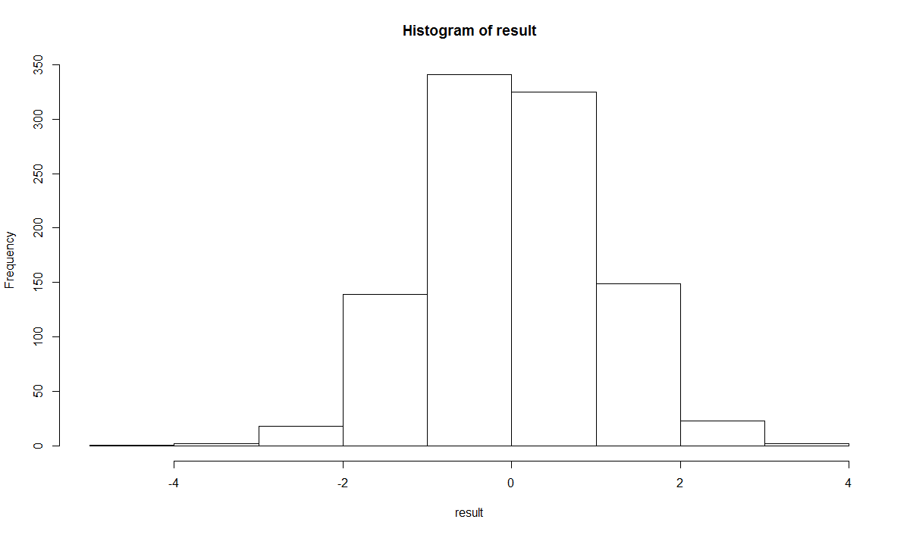

- runif() : 균등분포(연속형)의 난수 생성

```R
> result <- runif(n, min = 0, max = 10)
> head(result, 20)
 [1] 8.1753782 5.8291444 6.7212318 2.0157604 3.2903694
 [6] 5.5888540 8.0137782 0.9782179 8.2441125 0.2824835
[11] 5.4977279 9.8901502 3.3468943 6.0172200 0.2476788
[16] 9.5190639 5.8527703 2.5428218 8.6997189 1.2743121
> hist(result)
```


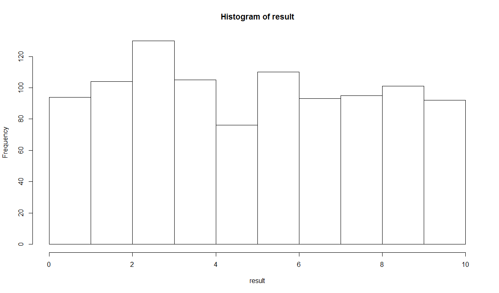


- rbinom() : 이산변량(정수형)을 갖는 정규분포의 난수 생성

```R
> #rbinom은 독립적인 반복 횟수와 변량의 크기, 확률을 적용하여 이산형(정수형) 난수를 생성
> 
> n <- 20
> rbinom(n, 1, prob = 1/2) #0, 1의 이산변량을 0.5 확률로 20개 생성
 [1] 0 1 1 0 1 1 0 1 1 0 1 0 1 1 1 0 1 0 1 1
> 
> rbinom(n, 2, prob = 1/2) #0,1,2의 이산변량을 0.5 확률로 20개 생성
 [1] 0 1 2 0 1 1 1 2 0 0 2 1 1 2 1 2 0 1 2 2
> 
> rbinom(n, 10, prob = 1/2) #0 ~ 10의 이산변량을 0.5 확률로 20개 생성
 [1] 4 5 4 7 7 5 4 7 6 7 6 7 5 4 7 7 3 8 6 7
> 
> n <- 1000
> result <- rbinom(n, 5, prob = 1/6)
> hist(result)
```


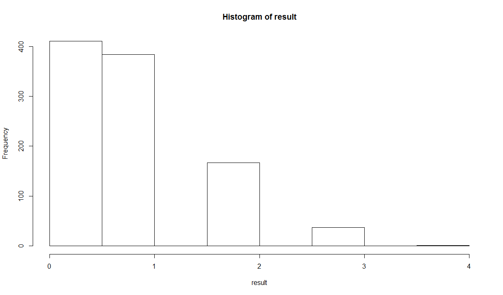


- seed값을 지정하면 동일한 난수를 발생시킬 수 있다

```R
> rnorm(5, mean = 0, sd = 1)
[1] -0.089253655 -0.455611241  0.000363634
[4]  0.986873011  1.773360015
> rnorm(5, mean = 0, sd = 1)
[1] -0.1289201  0.8672963 -1.1189922  0.1992270
[5]  1.5446581
> set.seed(123)
> rnorm(5, mean = 0, sd = 1)
[1] -0.56047565 -0.23017749  1.55870831  0.07050839
[5]  0.12928774
> set.seed(123)
> rnorm(5, mean = 0, sd = 1)
[1] -0.56047565 -0.23017749  1.55870831  0.07050839
[5]  0.12928774
> rnorm(5, mean = 0, sd = 1) #종자값이 동일하면 항상 동일한 난수 발생
[1]  1.7150650  0.4609162 -1.2650612 -0.6868529
[5] -0.4456620
> rnorm(5, mean = 0, sd = 1)
[1]  1.2240818  0.3598138  0.4007715  0.1106827
[5] -0.5558411
> rnorm(5, mean = 0, sd = 1)
[1]  1.7869131  0.4978505 -1.9666172  0.7013559
[5] -0.4727914
> set.seed(123)
> rnorm(5, mean = 0, sd = 1)
[1] -0.56047565 -0.23017749  1.55870831  0.07050839
[5]  0.12928774
> set.seed(123)
> rnorm(5, mean = 0, sd = 1) #종자값이 동일하면 항상 동일한 난수 발생
[1] -0.56047565 -0.23017749  1.55870831  0.07050839
[5]  0.12928774
```


### 수학 관련 내장 함수

- abs(x)
- sqrt(x)
- ceiling(x), floor(x), round()
- factorial(x)
- which.min(x) / which.max(x) : 벡터 내 최소값과 최대값의 인덱스를 구하는 함수
- pmin(x) /pmax(x) : 여러 벡터에서의 원소 단위 최소값과 최대값
- prod() : 벡터의 원소들의 곱을 구하는 함수
- cumsum() / cumprod() : 벡터의 원소들의 누적합과 누적곱을 구하는 함수
- cos(x), sin(x), tan(x)  : 삼각함수
- log(x) : 자연로그
- log10(x) : 10을 밑으로 하는 일반로그 함수
- exp(x) : 지수함수


### 행렬연산 관련 내장 함수

* ncol(x) : x의 열(컬럼) 수를 구하는 함수
* nrow(x) : x의 행 수를 구하는 함수
* t(x) : x 대상의 전치행렬을 구하는 함수
* cbind(...) : 열을 추가할 때 이용되는 함수
* rbind(...) : 행을 추가할 때 이용되는 함수
* diag(x) : x의 대각행렬을 구하는 함수
* det(x) : x의 행렬식을 구하는 함수
* apply(x, m, fun) :  행 또는 열에 지정된 함수를 적용하는 함수
* solve(x) : x의 역행렬을 구하는 함수
* eigen(x) : 정방행렬을 대상으로 고유값을 분해하는 함수
* svd(x) : m x n 행렬을 대상으로 특이값을 분해하는 함수
* x %*% y : 두 행렬의 곱을 구하는 수식


### 데이터 분석 시각화


- 데이터 분석의 도입부에서는 전체적인 데이터의 구조를 분석하거나 분석 방향을 제시
- 데이터 분석의 중반부에서는 잘못된 처리 결과를 확인
- 데이터 분석의 후반부에서는 분석결과를 도식화하여 의사결정에 반영하기 위해서 데이터를 시각화
- 이산변수로 구성된 데이터 셋을 이용하여 막대, 점, 원형 차트를 그릴 수 있다.
- 연속변수로 구성된 데이터프레임을 대상으로 히스토그램과 산점도를 그릴 수 있다.
- 데이터 분석의 도입부에서 전체적인 데이터의 구조를 살펴보기 위해서 시각화 도구를 사용한다.
- 숫자형 컬럼 1개 시각화 도구 - hist, plot, barplot
- 범주형 컬럼 1개 시각화 도구 - pie, barplot
- 숫자형 컬럼 2개 시각화 도구 - plot, abline, boxplot
- 숫자형 컬럼 3개 시각화 도구 - scatterplot3d(3차원 산점도)
- n개의 컬럼 시각화 도구 - pairs(산점도 매트릭스)

```R
chart_data <- c(305, 450, 320, 440, 330, 480, 380, 520)
> names(chart_data) <- c("2014 1분기", "2015 1분기", "2014 2분기", "2015 2분기" , "2014 3분기", "2015 3분기" , "2014 4분기", "2015 4분기")
> print(chart_data)
2014 1분기 2015 1분기 2014 2분기 2015 2분기 
       305        450        320        440 
2014 3분기 2015 3분기 2014 4분기 2015 4분기 
       330        480        380        520 
> str(chart_data)
 Named num [1:8] 305 450 320 440 330 480 380 520
 - attr(*, "names")= chr [1:8] "2014 1분기" "2015 1분기" "2014 2분기" "2015 2분기" ...
> 
> 
> barplot(chart_data, ylim=c(0, 600), col=rainbow(8),
+         main="2014년도 VS 2015년도 분기별 매출현황 비교",
+         ylab="매출액(단위:만원)", xlab="년도별 분기 현황")
> 
```


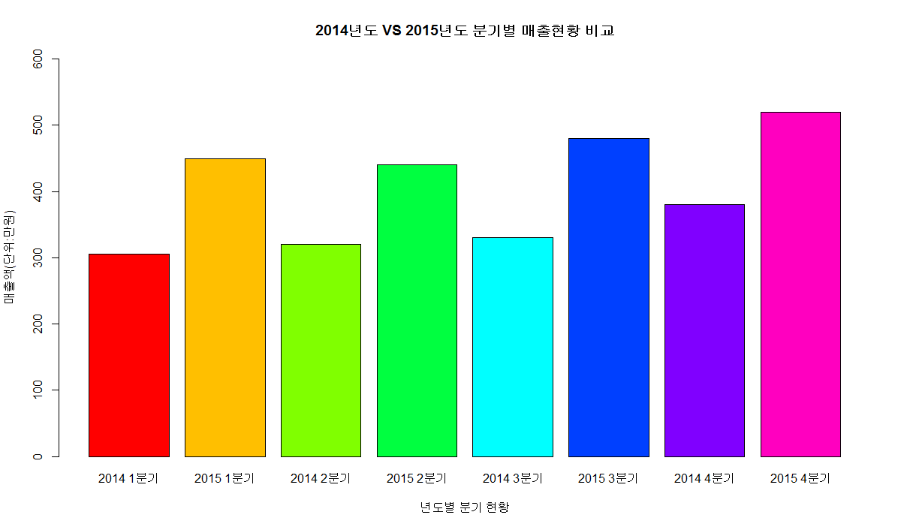


### 가로 막대 차트 : horiz=TRUE


```R
barplot(chart_data, xlim=c(0, 600), horiz=TRUE,  col=rainbow(8), 
        main="2014년도 VS 2015년도 분기별 매출현황 비교",
        ylab="매출액(단위:만원)", xlab="년도별 분기현황")

```

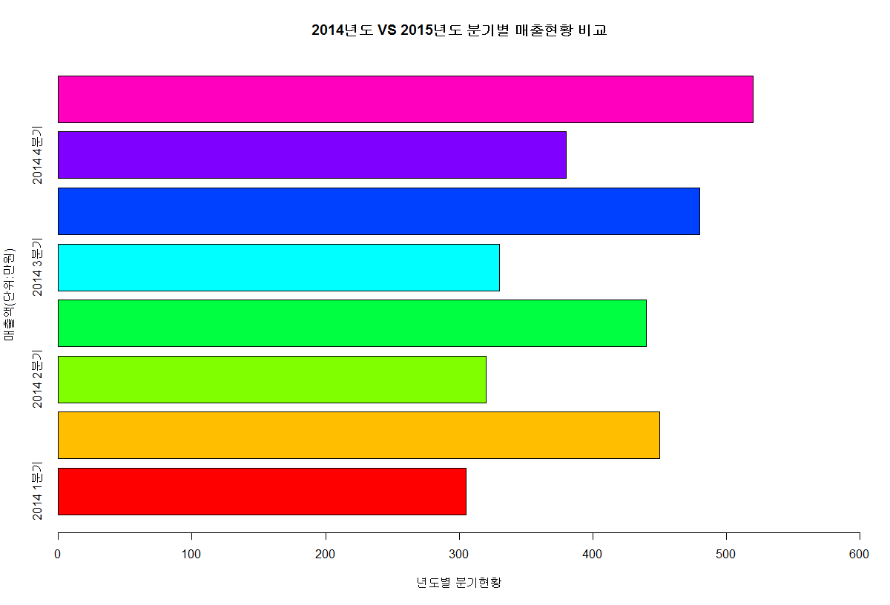

### 막대의 굵기와 간격, 축 이름, 색상


- 막대의 굵기와 간격 지정 : space (값이 클수록 막대의 굵기는 작아지고, 간격은 넓어진다)
- 축 이름 크기 설정 : cex.names
- 색상 index값 : 검은색(1), 빨간색(2), 초록색(3), 파란색(4), 하늘색(5), 자주색(6), 노란색(7)

```R
#막대의 굵기와 간격 지정 : space (값이 클수록 막대의 굵기는 작아지고, 간격은 넓어진다)
#축 이름 크기 설정 : cex.names
barplot(chart_data, xlim=c(0, 600), horiz=TRUE, 
        main="2014년도 VS 2015년도 분기별 매출현황 비교",
        ylab="매출액(단위:만원)", xlab="년도별 분기현황"
        , space=2, cex.names=0.8, col=rep(c(2, 4), 4))

#색상 index값 : 검은색(1), 빨간색(2), 초록색(3), 파란색(4), 하늘색(5), 자주색(6), 노란색(7)
```

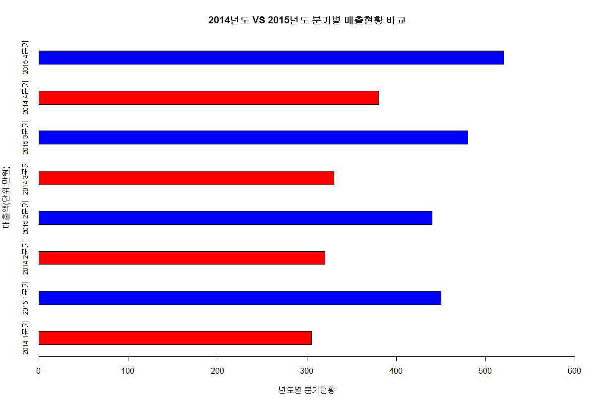


```R
barplot(chart_data, xlim=c(0, 600), horiz=TRUE, 
        main="2014년도 VS 2015년도 분기별 매출현황 비교",
        ylab="매출액(단위:만원)", xlab="년도별 분기현황"
        , space=5, cex.names=0.5, col=rep(c(1, 7), 4))
```

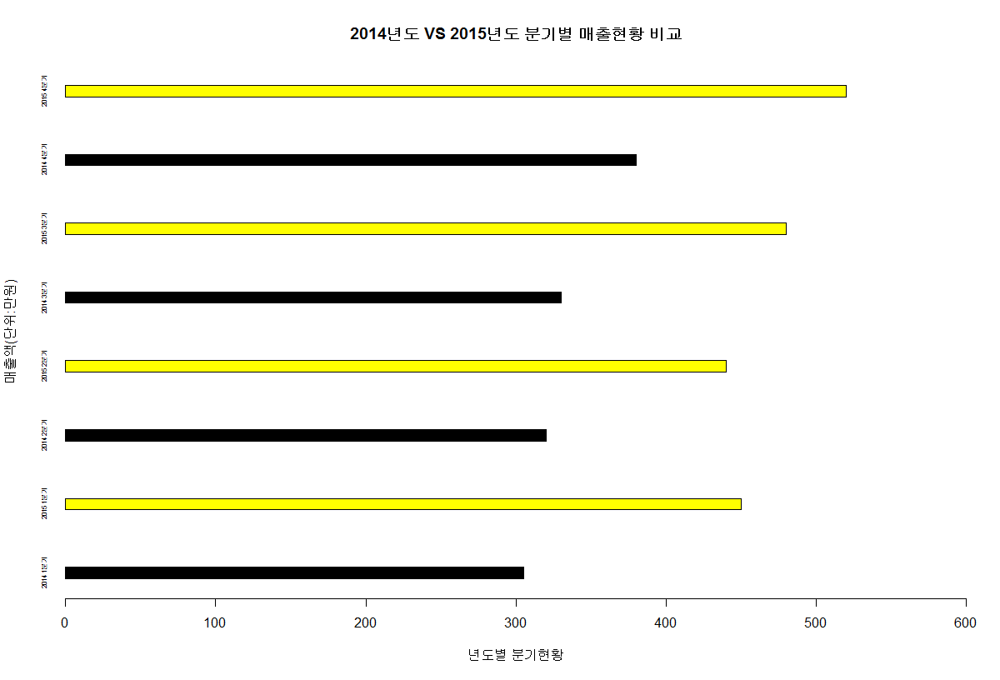


### 연습) VADeaths


```R
> data(VADeaths)
> str(VADeaths) #5행 4열
 num [1:5, 1:4] 11.7 18.1 26.9 41 66 8.7 11.7 20.3 30.9 54.3 ...
 - attr(*, "dimnames")=List of 2
  ..$ : chr [1:5] "50-54" "55-59" "60-64" "65-69" ...
  ..$ : chr [1:4] "Rural Male" "Rural Female" "Urban Male" "Urban Female"
> class(VADeaths) #matrix
[1] "matrix"
> mode(VADeaths) #numeric
[1] "numeric"
> head(VADeaths, 10)
      Rural Male Rural Female Urban Male Urban Female
50-54       11.7          8.7       15.4          8.4
55-59       18.1         11.7       24.3         13.6
60-64       26.9         20.3       37.0         19.3
65-69       41.0         30.9       54.6         35.1
70-74       66.0         54.3       71.1         50.0
> #VADeaths 데이터셋은 1940년 미국 버지니아주의 하위계층 사망비율

> par(mfrow=c(1, 2))
> barplot(VADeaths, beside = T, col = rainbow(5),
+         main="미국 버지니아주의 하위계층 사망비율")
> 
> #범례 출력
> legend(19,71, c("50-54", "55-59", "60-64", "65-69", "70-74"),
+        cex=0.8, fil=rainbow(5))
> 
> #누적막대 차트
> barplot(VADeaths, beside = F, col = rainbow(5) )
>       title( main="미국 버지니아주의 하위계층 사망비율", font.main=7)
>       legend(19,71, c("50-54", "55-59", "60-64", "65-69", "70-74"),cex=0.8, fil=rainbow(5))

#beside=T/F : X축 값이 측면으로 배열, F이면 하나의 막대에 누적
#font.main : 제목 글꼴 지정
#legend() : 범례 위치, 이름, 글자 크기, 색상 지정
#title() : 차트 제목, 차트 글꼴 지정


```


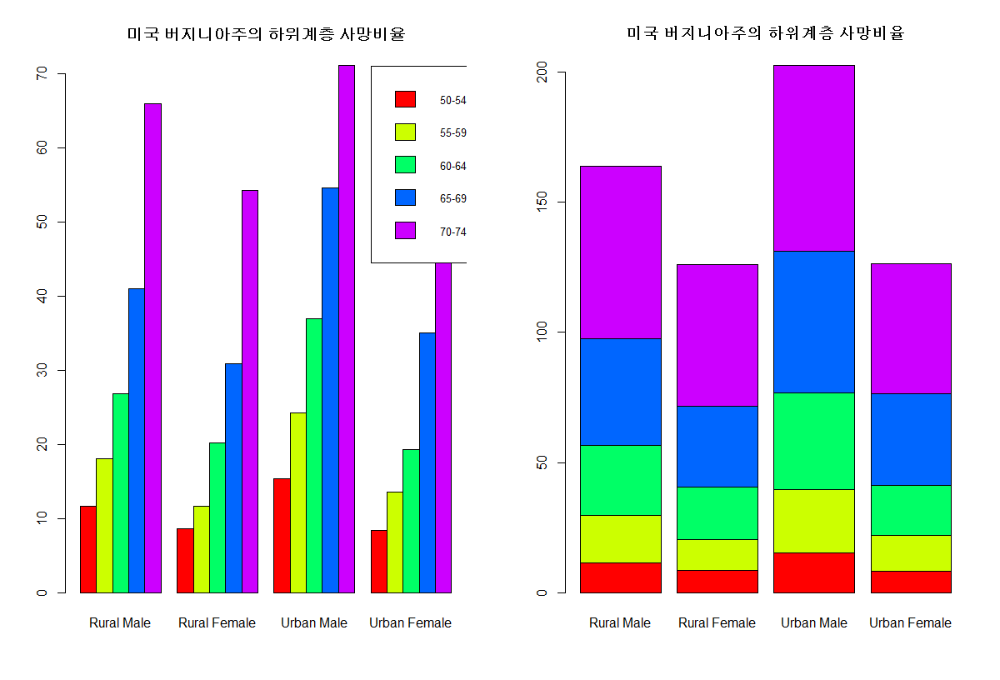


### 그래프 디자인 설정

- plot - 점의 모양, 색상 설정 가능
- labels : 점에 대한 설명문
- cex : 점의 확대
- pch : 점 모양
- color : 점 색상
- lcolor : 선 색상


### 점도표(dotchart)

```R
par(mfrow=c(1, 1))
dotchart(chart_data, color = c("blue", "red"), lcolor = "black",
         pch = 1:2, labels = names(chart_data), xlab = "매출액",
         main = "2014년도 VS 2015년도 분기별 매출현황 비교", cex = 1.2)
```


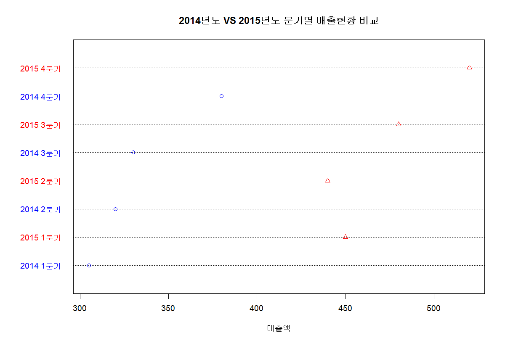


### 원그래프(pie)

```R
par(mfrow=c(1, 1))
pie(chart_data, col = rainbow(8), 
         pch = 1:2, labels = names(chart_data),
         main = "2014년도 VS 2015년도 분기별 매출현황 비교", cex = 1.2)
```


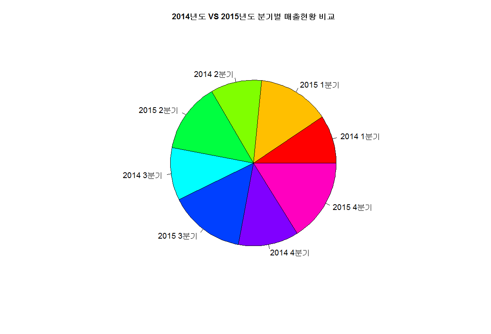


### 박스-플롯 그래프(boxplot)

- 연속변수(Continuous quantitative data)는 시간, 길이 등과 같이 연속성을 가진 변수
- boxplot은 요약 정보를 시각화하는데 효과적
- 데이터의 분포 정도와 이상치 발견을 목적으로 하는 경우 유용하게 사용된다.


```R
boxplot(VADeaths, range=0) #컬럼의 최대값과 최속밧을 점선으로 연결
```

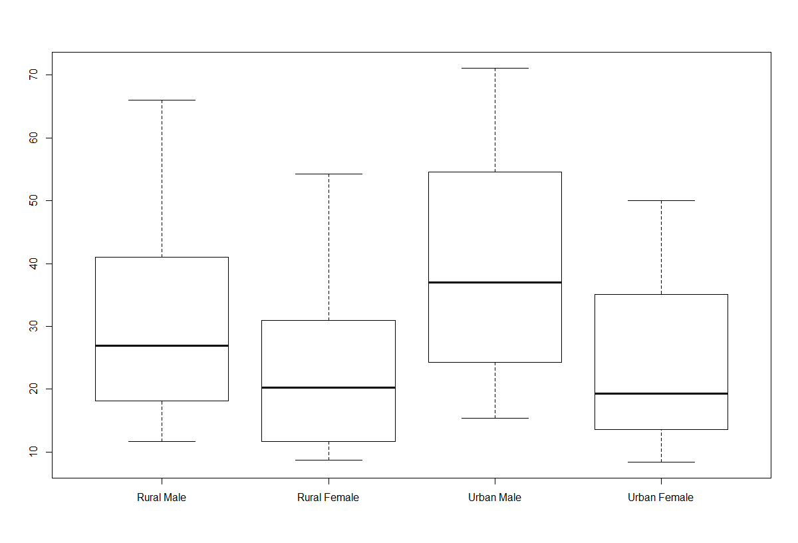


notch=T : 중위수(허리선) 비교

```R
boxplot(VADeaths, range=0, notch=T )
```


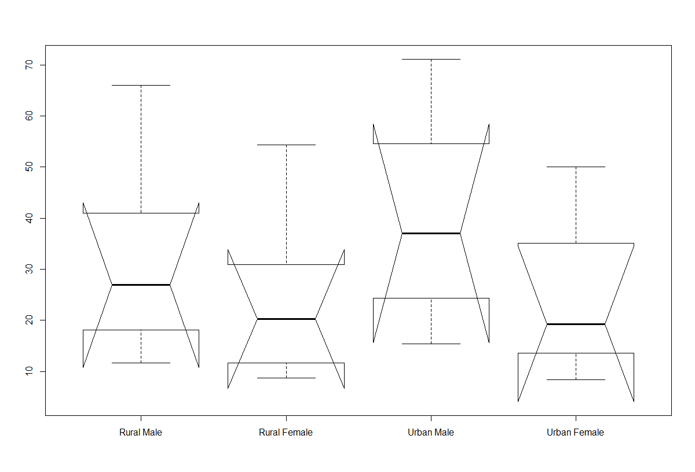


### 히스토그램

- 히스토그램 -  측정값의 범위(구간)를 그래프의 x축으로 놓고, 범위에 속하는 측정값의 출현 빈도수를 y축으로 나타낸 그래프 형태

- 히스토그램의 도수의 값을 선으로 연결하면 분포곡선을 얻을 수 있다


```R
> data(iris)
> names(iris)
[1] "Sepal.Length" "Sepal.Width"  "Petal.Length"
[4] "Petal.Width"  "Species"     
> str(iris) 
'data.frame':	150 obs. of  5 variables:
 $ Sepal.Length: num  5.1 4.9 4.7 4.6 5 5.4 4.6 5 4.4 4.9 ...
 $ Sepal.Width : num  3.5 3 3.2 3.1 3.6 3.9 3.4 3.4 2.9 3.1 ...
 $ Petal.Length: num  1.4 1.4 1.3 1.5 1.4 1.7 1.4 1.5 1.4 1.5 ...
 $ Petal.Width : num  0.2 0.2 0.2 0.2 0.2 0.4 0.3 0.2 0.2 0.1 ...
 $ Species     : Factor w/ 3 levels "setosa","versicolor",..: 1 1 1 1 1 1 1 1 1 1 ...
> head(iris)
  Sepal.Length Sepal.Width Petal.Length Petal.Width
1          5.1         3.5          1.4         0.2
2          4.9         3.0          1.4         0.2
3          4.7         3.2          1.3         0.2
4          4.6         3.1          1.5         0.2
5          5.0         3.6          1.4         0.2
6          5.4         3.9          1.7         0.4
  Species
1  setosa
2  setosa
3  setosa
4  setosa
5  setosa
6  setosa

#붓꽃 3종류의 관측 데이터 -Sepal.length, Sepal.Width(꽃받침)
Petal.length, Petal.Width(꽃잎)
> summary(iris$Sepal.Length)
   Min. 1st Qu.  Median    Mean 3rd Qu.    Max. 
  4.300   5.100   5.800   5.843   6.400   7.900 
> hist(iris$Sepal.Length, xlab="iris$Sepal.Length", 
     col="magenta", main="꽃받침 길이 histogram" , xlim=c(4.3, 7.9))
```

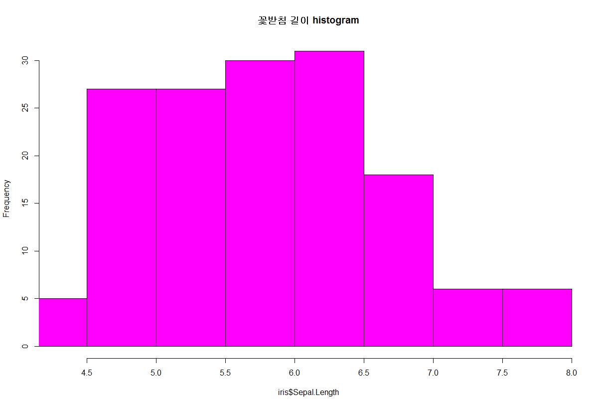


#### 빈도수로 히스토그램 그리기

```R

par(mfrow=c(1,2))
hist(iris$Sepal.Width, xlab="iris$Sepal.Width", 
     col="green", main="꽃받침 넓이 histogram" , xlim=c(2.0, 4.5))
```

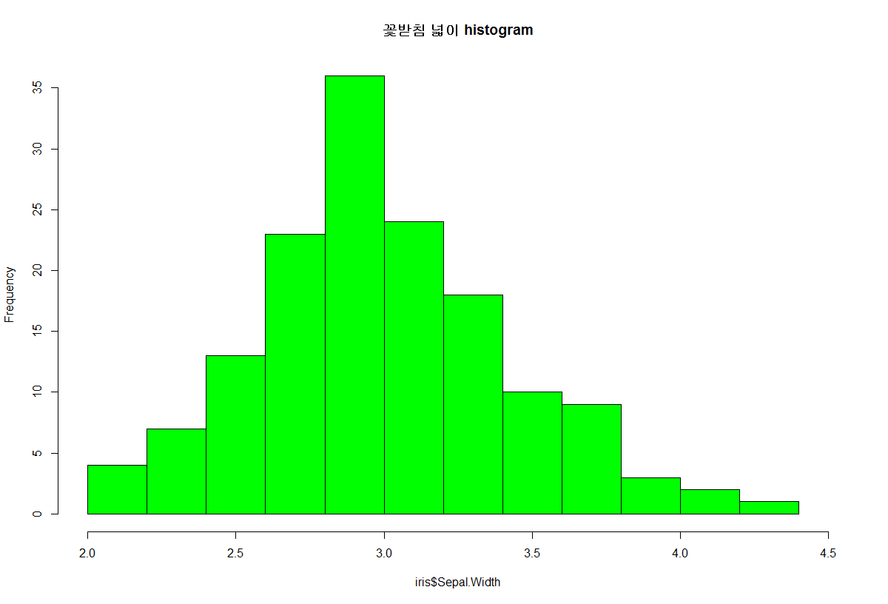


#### 확률 밀도로 히스토그램 그리기

```R
hist(iris$Sepal.Width, xlab="iris$Sepal.Width", 
     col="mistyrose", freq=F,
     main="꽃받침 넓이 histogram" , xlim=c(2.0, 4.5)) 
#밀도를 기준으로 분포 곡선 추가
lines(density(iris$Sepal.Width), color="red") 
#정규분포 추정 곡선 추가
x<-seq(20, 4.5, 0.1)
curve(dnorm(x, mean=mean(iris$Width), sd=sd(iris$Width)), 
      col="blue", add=T)
```

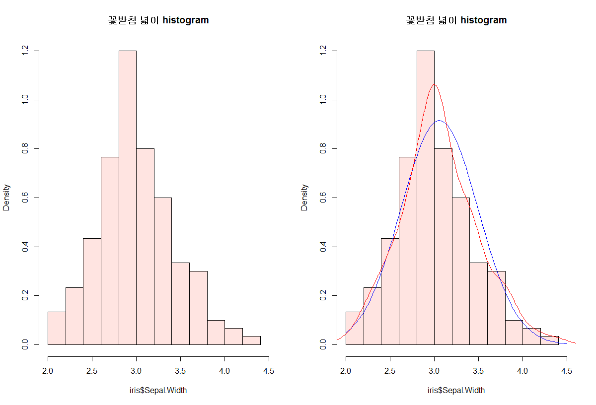


