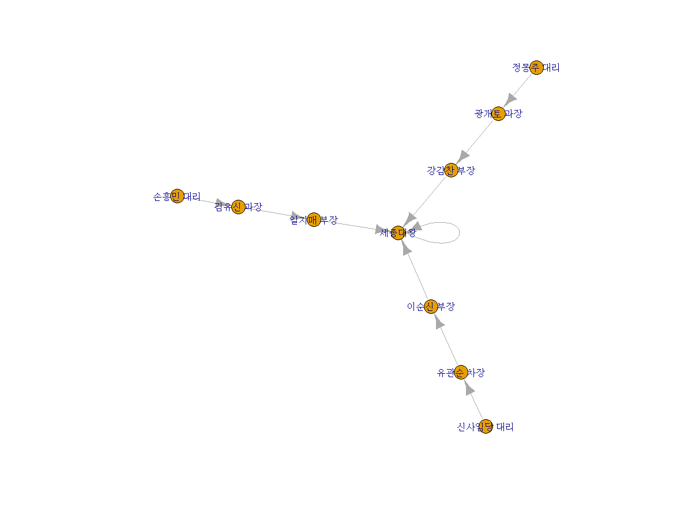

#### 복습

산점도(scatter plot) : 두 개 이상의 변수들 사이의 분포를 점으로 표시한 차트
두 변수의 관계를 시각적으로 분석할 때 유용


```R
price <- runif(10, min=1, max=100)
print(price)
plot(price, col="red")
par(new=T) #차트 추가
line_chart=1:100
#x축은 생성된 난수의 순서,  y축은 
plot(line_chart, type="l", col="red", axes=F, ann=F) #대각선 추가 

```


**좌표평면상의 점 등을 선으로 연결**

```R
#좌표평면상의 점 등을 선으로 연결
par(mfrow=c(2, 2))
plot(price, type="l")  #실선
plot(price, type="o")  #원형과 실선
plot(price, type="h")  #직선
plot(price, type="s")  #꺽은선
```


**중복된 데이터의 수만큼 plot점 크기 확대**

```R
#중복된 데이터의 수만큼 plot점 크기 확대
x<-c(1, 2, 3, 4, 2, 4)
y<-rep(2, 6)
table(x, y)  #빈도수


par(mfrow=c(1, 1))
plot(x, y)

```


```R
> xy.df <- as.data.frame(table(x, y))
> xy.df
  x y Freq
1 1 2    1
2 2 2    2
3 3 2    1
4 4 2    2
> 
> plot(x, y, pch='@', col='blue', cex=0.5*xy.df$Freq, 
+      xlab="x벡터 원소", ylab="y벡터 원소")
```


**child컬럼, parent컬럼을 대상으로 교차테이블을 생성 결과를 데이터프레임으로 생성**

```R
#child컬럼, parent컬럼을 대상으로 교차테이블을 생성 결과를 데이터프레임으로 생성
galtondf <- as.data.frame(table(galton$child, galton$parent))
head(galtondf)
str(galtondf)

> names(galtondf) <- c("child", "parent", "freq")
> head(galtondf)
  child parent freq
1  61.7     64    1
2  62.2     64    0
3  63.2     64    2
4  64.2     64    4
5  65.2     64    1
6  66.2     64    2
> parent <- as.numeric(galtondf$parent)
> child <- as.numeric(galtondf$child)
> 
> plot(parent, child, pch=21, col="blue", bg="green", 
+      cex=0.2*galtondf$freq, xlab="parent", ylab="child")


```


===============================================================================

# R


## 그래프, 차트

### pairs()

pairs() : 변수 간의 관계를 차트로 그릴 수 있다


- pairs() : 변수 간의 관계를 차트로 그릴 수 있다
- graphics패키지에서 제공하는 paris()는 matrix 또는 data.frame의  numeric 컬럼을 대상으로 변수들 사이의 비교 결과를 행렬구조의 분산된 그래프로 제공합니다.
  

```R

> attributes(iris)  #
$names
[1] "Sepal.Length" "Sepal.Width"  "Petal.Length"
[4] "Petal.Width"  "Species"     

$class
[1] "data.frame"

$row.names
  [1]   1   2   3   4   5   6   7   8   9  10  11  12
 [13]  13  14  15  16  17  18  19  20  21  22  23  24
 [25]  25  26  27  28  29  30  31  32  33  34  35  36
 [37]  37  38  39  40  41  42  43  44  45  46  47  48
 [49]  49  50  51  52  53  54  55  56  57  58  59  60
 [61]  61  62  63  64  65  66  67  68  69  70  71  72
 [73]  73  74  75  76  77  78  79  80  81  82  83  84
 [85]  85  86  87  88  89  90  91  92  93  94  95  96
 [97]  97  98  99 100 101 102 103 104 105 106 107 108
[109] 109 110 111 112 113 114 115 116 117 118 119 120
[121] 121 122 123 124 125 126 127 128 129 130 131 132
[133] 133 134 135 136 137 138 139 140 141 142 143 144
[145] 145 146 147 148 149 150

> 
> pairs(iris[, 1:4])
```


### **3차원 산점도**

```R
install.packages("scatterplot3d")
library(scatterplot3d)
levels(iris$Species)
iris_setosa = iris[iris$Species=='setosa', ]

iris_versicolor = iris[iris$Species=='versicolor', ]
iris_virginica = iris[iris$Species=='virginica', ]
d3 <- scatterplot3d(iris$Petal.Length, iris$Sepal.Length,
                    iris$Sepal.Width, type='n')  #type='n'은 기본 산점도를 표시하지 않음
d3$points3d(iris_setosa$Petal.Length, iris_setosa$Sepal.Length ,
            iris_setosa$Sepal.Width, bg="orange", pch=21)

d3$points3d(iris_versicolor$Petal.Length, iris_versicolor$Sepal.Length ,
            iris_versicolor$Sepal.Width, bg="blue", pch=23)

d3$points3d(iris_virginica$Petal.Length, iris_virginica$Sepal.Length ,
            iris_virginica$Sepal.Width, bg="green", pch=25)
```


## 데이터 전처리


- 데이터 분석 프로젝트에서는 70%이상의 시간을 데이터 변환과  조작, 필터링 등 전처리 작업에 소요됩니다.
- 데이터 전처리에 사용되는 유용한 패키지 : plyr, dplyr, reshape, reshape2패키지


### plyr


plyr 패키지는 두개 이상의 데이터프레임을 대상으로 key값을 이용하여 merge, 함수적용 , 요약 집계등의 기능을 제공합니다.

```R
install.packages("plyr")
library(plyr)

> x <- data.frame(id = c(1, 2, 3, 4, 5),
+                 height = c(160, 171, 173, 162, 165))
> 
> y <- data.frame(id = c(5, 1, 3, 2, 4),
+                 weight = c(55, 73, 60, 57, 75))
> 
> # join() : 두데이터프레임을 merge
> xyjoin <- join(x, y, by="id")
> xyjoin
  id height weight
1  1    160     73
2  2    171     57
3  3    173     60
4  4    162     75
5  5    165     55
> 
> x <- data.frame(id = c(1, 2, 3, 4, ,6),
+                 height = c(160, 171, 173, 162, 165))
Error in c(1, 2, 3, 4, , 6) : argument 5 is empty
> 
> leftjoin <- join(x, y, by="id") #왼쪽 데이터 프레임의 키값을 기준으로 merge
> leftjoin    #키에 join할 데이터가 없으면 NA로 출력
  id height weight
1  1    160     73
2  2    171     57
3  3    173     60
4  4    162     75
5  5    165     55
> 
> innerjoin <- join(x, y, by="id", type="inner")
> innerjoin   #innerjoin은 두 데이터프레임에서 키값이 있는 경우에만 조인을 수행
  id height weight
1  1    160     73
2  2    171     57
3  3    173     60
4  4    162     75
5  5    165     55
> 
> fulljoin <- join(x, y, by="id", type="full")
> fulljoin   #키 값이 존재하는 전체 관측치를 대상으로 조인 수행, 키에 join할 데이터가 없으면 NA로 출력
  id height weight
1  1    160     73
2  2    171     57
3  3    173     60
4  4    162     75
5  5    165     55


> x<-data.frame(key1=c(1,1, 2,2, 3), 
+               key2=c('a', 'b', 'c','d', 'e'),
+               val1 = c(10,20,30,40,50))
> 
> y<-data.frame(key1=c(3, 2, 2, 1, 1), 
+               key2=c('e', 'd', 'c','b', 'a'),
+               val1 = c(500,300,400,100,200))
> 
> xyjoin <- join (x, y, by=c('key1', 'key2'))
> xyjoin
  key1 key2 val1 val1
1    1    a   10  200
2    1    b   20  100
3    2    c   30  400
4    2    d   40  300
5    3    e   50  500

```


### apply


- apply(vec, func) - 결과는 벡터, 배열, 리스트
- lapply(vec|list, func)  - - 결과는  리스트
- sapply(vec, func) - 결과는 벡터, 배열, 행렬 반환
- tapply() - 데이터 셋에 집단 변수 (이산형 범주)를 대상으로 그룹별 함수 적용
- tapply(dataset, 집단변수, 함수)


#### tapply

```R
> names(iris)
[1] "Sepal.Length" "Sepal.Width"  "Petal.Length"
[4] "Petal.Width"  "Species"     
> unique(iris$Species)
[1] setosa     versicolor virginica 
Levels: setosa versicolor virginica
> tapply(iris$Sepal.Length, iris$Species, mean)
    setosa versicolor  virginica 
     5.006      5.936      6.588 
> tapply(iris$Sepal.Length, iris$Species, sd)
    setosa versicolor  virginica 
 0.3524897  0.5161711  0.6358796 
```


####  ddply

- ddply() - 데이터 셋에 집단 변수(이산형 범주)를 대상으로 그룹별 함수를 여러개  적용할 수 있습니다.
- ddply(데이터 셋, 집단변수, 요약집계, 컬럼명=함수(변수))


```R
> avg_df <- ddply(iris, .(Species), summarise, avg=mean(Sepal.Length))
> avg_df
     Species   avg
1     setosa 5.006
2 versicolor 5.936
3  virginica 6.588
> str(avg_df)
'data.frame':	3 obs. of  2 variables:
 $ Species: Factor w/ 3 levels "setosa","versicolor",..: 1 2 3
 $ avg    : num  5.01 5.94 6.59
```


#### dplyr 

- dplyr 패키지 -데이터 전처리( 조건 필터, 그룹핑,  함수적용, 변환, 집계연산, 정렬,.....)
- filter() 조건에 맞는 데이터셋 추출, 행추출
- filter(dataframe, 조건1, 조건2)
- select() 데이터 셋을 대상으로 컬럼을 선택하는 기능
- select(dataframe, 컬럼1, 컬럼2,...)
- mutate() 데이터 넷의 새로운 컬럼을 추가하는 기능
- mutate(dataframe, 컬럼명1=표현식, 컬럼명2=표현식, ...)
- arrange() 데이터 셋의 특정 컬럼으로 정렬하는 기능
- arrange(dataframe,컬럼, desc(컬럼), ...)
- summarise() 데이터 셋의 특정 컬럼으로 요약집계 기능
- tbl_df() 데이터셋에서 콘솔 창의 크기만큼 데이터 셋 추출 기능

```
exam.csv#################################################################
id,class,math,english,science
1,1,50,98,50
2,1,60,97,60
3,1,45,86,78
4,1,30,98,58
5,2,25,80,65
6,2,50,89,98
7,2,80,90,45
8,2,90,78,25
9,3,20,98,15
10,3,50,98,45
11,3,65,65,65
12,3,45,85,32
13,4,46,98,65
14,4,48,87,12
15,4,75,56,78
16,4,58,98,65
17,5,65,68,98
18,5,80,78,90
19,5,89,68,87
20,5,78,83,58
```


```R
install.packages("dplyr")
library("dplyr")

exam <- read.csv("./data/exam.csv")
print(exam)

# %>% 파이프 연산자 (다음 함수의 입력값으로 전달)
# class가 1인 record(행)추출
class1 <- exam %>% filter(class==1)
print(class1)

# class가 1을 제외한 record(행)추출
other_class <- exam %>% filter(class!=1)
print(other_class)

#class가 1이면서 수학점수는 50이상인 행을 추출
class1_math50 <- exam %>% filter(class==1 & math>50 )
print(class1_math50)

#class가 1,3,5인 행만 추출
odd_class <- exam %>% filter(class  %in% c(1, 3, 5) )
print(odd_class)

#영어점수 컬럼값만 추출
e_jumsu <- exam %>% select(english)
print(e_jumsu)

#수학점수 제외하고 모든 컬럼 추출
all_column <- exam %>% select(-math)
print(all_column)

#class가 1이면서 영어점수 컬럼값만 1행에서~3행까지 출력
print(exam %>% filter(class==1)  %>% select(english) %>% head(3))
  
#수학점수를 기준으로 오름차순 정렬된 결과를 변수에 저장하고 출력
asc_math <- exam  %>%  arrange(math) 
print(asc_math)

#수학점수를 기준으로 내림차순 정렬된 결과를 변수에 저장하고 출력
desc_math <- exam  %>%  arrange(desc(math))
print(desc_math)

# 1차 정렬은 class의 오름차순, 2차 정렬은 수학점수의 내림차순으로 정렬
order_math <- exam  %>%  arrange(class, desc(math))
print(order_math)

#총점(수학+영어+과학) 열을 추가
new_exam <- exam %>% mutate(total= math+english+science) 
print( new_exam )

#평균 열 추가
avg_exam <- exam  %>% mutate(total= math+english+science, 
                      mean=(math+english+science)/3 ) 
print( avg_exam )


#pass이름의 열을 추가 (평균이 60점이상이면 "pass"값, 
                      60점미만이면 "fail"값을 가짐)
pass <-  exam  %>% mutate(mean=(math+english+science)/3)   
           %>% mutate(pass=ifelse(mean >= 60 , "pass", "fail" ) ) 
print( pass )


#추가된 평균 컬럼으로 내림차순 정렬

avg_desc_exam <-  exam  %>% mutate(mean=(math+english+science)/3)  %>% arrange(mean)
print( avg_desc_exam)


> summary_exam <- exam %>% summarise(mean_math=mean(math), 
+                                    sum_math=sum(math),
+                                    median_math =median(math),
+                                    sd_math=sd(math),
+                                    min_math=min(math),
+                                    max_math=max(math),
+                                    n=n()) 
> print(summary_exam)
  mean_math sum_math median_math  sd_math min_math
1     57.45     1149          54 20.29901       20
  max_math  n
1       90 20


> #그룹핑 : group_by()
> #클래스별로 기초통계값을 출력
> group_summary  <- exam %>% group_by(class) %>% summarise(mean_math=mean(math), 
+                                                          sum_math=sum(math),
+                                                          median_math =median(math),
+                                                          sd_math=sd(math),
+                                                          min_math=min(math),
+                                                          max_math=max(math),
+                                                          n=n())
> print(group_summary)
# A tibble: 5 x 8
  class mean_math sum_math median_math sd_math
  <int>     <dbl>    <int>       <dbl>   <dbl>
1     1      46.2      185        47.5   12.5 
2     2      61.2      245        65     29.5 
3     3      45        180        47.5   18.7 
4     4      56.8      227        53     13.3 
5     5      78        312        79      9.90
# ... with 3 more variables: min_math <int>,
#   max_math <int>, n <int>


```


#### 연습문제

**hflights데이터셋으로부터 1월의 2일 모든 비행기의 이착률 정보 추출**

```R
filter(hflights, Month ==1 & DayofMonth ==2)
```


**hflights데이터셋을 년, 월, 출발시간, 도착시간순으로 오름차순 정렬**

```R
arrange(hflights, Year, Month, DepTime, ArrTime)
```


**hflights데이터셋을 년(오름차순), 월(오름차순), 출발시간(내림차순), 도착시간(오름차순) 정렬**

```R
arrange(hflights, Year, Month, desc(DepTime), ArrTime)
```


**hflights데이터셋으로부터 년, 월, 출발시간, 도착시간 컬럼만 검색**

```R
select(hflights,Year, Month, DepTime, ArrTime)
```


**hflights데이터셋으로부터 출발지연시간과 도착지연시간과의 차리를 계산한 컬럼 추가**

```R

```


**hflights데이터셋으로부터 도착 시간에 대한 평균, 표준편차 계산**


```R
> summarise(hflights, cnt=n(), delay=mean(AirTime, na.rm=T))
     cnt    delay
1 227496 108.1423
> summarise(hflights, arrTimeSd = sd(AirTime, na.rm=T),
+           arrTimeVar = var(AirTime, na.rm=T))
  arrTimeSd arrTimeVar
1  56.55523   3198.494
```


**Quiz> 회사별로 분리, suv 추출, 통합 연비(도시연비+고속도로 연비) 변수 생성,  통합 연비 평균 산출, 내림차순 정렬, 1~5위까지 출력**

```R
install.packages("ggplot2")
library(ggplot2)
#자동차 배기량에 따라 고속도록 연비 ...데이터 셋
mpg <- as.data.frame(ggplot2::mpg)
print(mpg)
str(mpg)
#displ 배기량
#manufaturer 제조사
#cty 도시연비
#hwy 고속도로 연비
#class차종
library(dplyr)

> mpg %>% group_by(manufacturer) %>% filter(class=="suv")%>% mutate(tot=(cty+hwy)/2) %>% summarise(mean_tot=mean(tot))%>% arrange(desc(mean_tot)) %>% head(5)
# A tibble: 5 x 2
  manufacturer mean_tot
  <chr>           <dbl>
1 subaru           21.9
2 toyota           16.3
3 nissan           15.9
4 mercury          15.6
5 jeep             15.6
```


**Quiz> 어떤 회사에서 "compact"(경차) 차종을 가장 많이 생산하는지 알아보려고 합니다.** 
**각 회사별로 "compact" 차종을 내림차순으로 정렬해 출력하세요**

```R
> result <- mpg %>% filter(class=="compact") %>% group_by(manufacturer)%>% summarise(count=n()) 
> result %>% arrange(desc(count))
# A tibble: 5 x 2
  manufacturer count
  <chr>        <int>
1 audi            15
2 volkswagen      14
3 toyota          12
4 subaru           4
5 nissan           2
```


### JDBC

- OracleDB로부터 R실행환경(메모리)로 데이터 가져오기
- RJDBC::JDBC("driver이름", "driver가 존재하는 클래스경로", "DB에서 문자열 처리")
- dbConnect(driver객체, DB_Url, user, password)
- dbGetQuery(connection객체,  select sql문장)


```R
install.packages("RJDBC")
library(RJDBC)
drv <- JDBC("oracle.jdbc.OracleDriver",
            classPath="C:/app/student/product/11.2.0/dbhome_1/jdbc/lib/ojdbc6.jar",
            identifier.quote="'")

con <- dbConnect(drv, "jdbc:oracle:thin:@localhost:1521:orcl", "hr", "oracle")
rs <- dbGetQuery(con, "select tname from tab")
View(rs)

```


### 관계도

관계도 : igraph()


```R
install.packages("igraph")
library(igraph)
g1 <- graph(c(1, 2, 2, 3, 2, 4, 1, 4, 5, 5, 3, 6))
print(g1)
plot(g1)
str(g1)


name<-c("세종대왕", "일지매 부장", "김유신 과장", "손흥민 대리",
        "이순신 부장", "유관순 차장", "신사임당 대리", "강감찬 부장"
        , "광개토 과장", "정몽주 대리")
pemp <- c("세종대왕", "세종대왕", "일지매 부장" , "김유신 과장", 
          "세종대왕",  "이순신 부장", "유관순 차장",  "세종대왕" , "강감찬 부장"
          , "광개토 과장")

emp <- data.frame(이름=name, 상사이름=pemp)
print(emp)
g <- graph.data.frame(emp, direct=T)
plot(g, layout=layout.fruchterman.reingold,
       vertex.size=8, edge.arrow.size=0.5)


```





### reshape 패키지

- reshape 패키지
- 데이터 셋의 구성이 구분변수(identifier variable)에 의해서 특정 변수가 분류된 경우 
- 데이터 셋의 모댱을 변경하는 패키지
- 구분변수(identifier variable) : 데이터 셋에 1개 이상으로 분류되는 집단변수
- 측정변수(measured variable): 구분변수에 의해서 구분되는 변수
- 데이터 파일을 가져오는 경우 컬럼명이 없으면 기본적으로 V1, V2, V3...
  형식으로 기본 컬럼명이 적용되므로 데이터 셋의 컬럼명을 변경하려면
  rename() 함수를 사용합니다.
- #reshape(), melt() : 구분변수를 기분으로 측정변수를 분류하여 새로운 컬럼을 생성
- reshape(data.frame, varying="반복되는 측정 색인",
          v.names="반복되는 측정값", timevar="반복되는 측정 시간",
          idvar="1개 이상의 값으로 분류되는 변수", direct="wide/long")
  #wide는 기준변수와 관련 변수가 1:n 관계로 관측치가 구성
  #long은 기준변수와 관련 변수가 1:1 관계로 관측치가 구성

```R
install.packages("reshape")
library(reshape)
#데이터 파일을 가져오는 경우 컬럼명이 없으면 기본적으로 V1, V2, V3... 형식으로 기본 컬럼명이 적용되므로 데이터 셋의 컬럼명을 변경하려면
rename() 함수를 사용합니다.

> data('Indometh')  #항염증제에 대한 약물동태학에 관한 데이터 셋
> str(Indometh)  #생체내에서 약물의 흡수, 분포, 비축, 대사, 배설의 과정을 연구
Classes ‘nfnGroupedData’, ‘nfGroupedData’, ‘groupedData’ and 'data.frame':	66 obs. of  3 variables:
 $ Subject: Ord.factor w/ 6 levels "1"<"4"<"2"<"5"<..: 1 1 1 1 1 1 1 1 1 1 ...
 $ time   : num  0.25 0.5 0.75 1 1.25 2 3 4 5 6 ...
 $ conc   : num  1.5 0.94 0.78 0.48 0.37 0.19 0.12 0.11 0.08 0.07 ...
 - attr(*, "formula")=Class 'formula'  language conc ~ time | Subject
  .. ..- attr(*, ".Environment")=<environment: R_EmptyEnv> 
 - attr(*, "labels")=List of 2
  ..$ x: chr "Time since drug administration"
  ..$ y: chr "Indomethacin concentration"
 - attr(*, "units")=List of 2
  ..$ x: chr "(hr)"
  ..$ y: chr "(mcg/ml)"
> #Subject(실험대상), time(약물 투여시간:hr), conc(농도:ml/mcg)
> Indometh   #long형식
   Subject time conc
1        1 0.25 1.50
2        1 0.50 0.94
3        1 0.75 0.78
4        1 1.00 0.48
5        1 1.25 0.37
6        1 2.00 0.19
7        1 3.00 0.12
8        1 4.00 0.11
9        1 5.00 0.08
10       1 6.00 0.07
11       1 8.00 0.05
12       2 0.25 2.03
13       2 0.50 1.63
14       2 0.75 0.71
15       2 1.00 0.70
16       2 1.25 0.64
17       2 2.00 0.36
18       2 3.00 0.32
19       2 4.00 0.20
20       2 5.00 0.25
21       2 6.00 0.12
22       2 8.00 0.08
23       3 0.25 2.72
#...
59       6 1.00 0.84
60       6 1.25 0.64
61       6 2.00 0.42
62       6 3.00 0.24
63       6 4.00 0.17
64       6 5.00 0.13
65       6 6.00 0.10
66       6 8.00 0.09
> wide <- reshape(Indometh, v.names="conc", timevar="time", idvar="Subject", direction="wide")
> # 기준변수 : timevar="time", idvar="Subject"
> # 관측변수 : v.names="conc"
> wide
   Subject conc.0.25 conc.0.5 conc.0.75 conc.1
1        1      1.50     0.94      0.78   0.48
12       2      2.03     1.63      0.71   0.70
23       3      2.72     1.49      1.16   0.80
34       4      1.85     1.39      1.02   0.89
45       5      2.05     1.04      0.81   0.39
56       6      2.31     1.44      1.03   0.84
   conc.1.25 conc.2 conc.3 conc.4 conc.5 conc.6
1       0.37   0.19   0.12   0.11   0.08   0.07
12      0.64   0.36   0.32   0.20   0.25   0.12
23      0.80   0.39   0.22   0.12   0.11   0.08
34      0.59   0.40   0.16   0.11   0.10   0.07
45      0.30   0.23   0.13   0.11   0.08   0.10
56      0.64   0.42   0.24   0.17   0.13   0.10
   conc.8
1    0.05
12   0.08
23   0.08
34   0.07
45   0.06
56   0.09

> smiths
     subject time age weight height
1 John Smith    1  33     90   1.87
2 Mary Smith    1  NA     NA   1.54
> #기준변수 ("subject", "time")를 이용하여 측정변수 분류
> melt(smiths, id=c("subject", "time"), measured=c("age")) 
     subject time variable value
1 John Smith    1      age 33.00
2 Mary Smith    1      age    NA
3 John Smith    1   weight 90.00
4 Mary Smith    1   weight    NA
5 John Smith    1   height  1.87
6 Mary Smith    1   height  1.54
> 
> melt(smiths, id=c("subject", "time"), measured=c("age", "weight", "height")) 
     subject time variable value
1 John Smith    1      age 33.00
2 Mary Smith    1      age    NA
3 John Smith    1   weight 90.00
4 Mary Smith    1   weight    NA
5 John Smith    1   height  1.87
6 Mary Smith    1   height  1.54
> 
> melt(smiths, id=c(1:2), na.rm=T)
     subject time variable value
1 John Smith    1      age 33.00
2 John Smith    1   weight 90.00
3 John Smith    1   height  1.87
4 Mary Smith    1   height  1.54

#cast() : 측정변수에 집합함수를 적용
#cast(data, 포뮬러 식 , ~측정변수, 집합함수)


> smithsm <- melt(smiths, id=c(1:2))
> smithsm
     subject time variable value
1 John Smith    1      age 33.00
2 Mary Smith    1      age    NA
3 John Smith    1   weight 90.00
4 Mary Smith    1   weight    NA
5 John Smith    1   height  1.87
6 Mary Smith    1   height  1.54
> 
> cast(smithsm, subject= ~ variable) #subject와 time 변수를 이용하여 측정변수(age, weight, height)를 분류
     subject time age weight height
1 John Smith    1  33     90   1.87
2 Mary Smith    1  NA     NA   1.54

#Indometh 데이터셋으로부터 subject와 time을 구분변수로 long 형식으로 변환


#Indometh 데이터셋으로부터 subject구분변수로 특정변수 농도의 합계 통계량 계산


#Indometh 데이터셋으로부터 subject구분변수로 특정변수 농도의 평균, 최소값~최대값 범위를 계산
```


#### 연습문제


```R
dau <- read.csv("./game/dau.csv", header = T, stringsAsFactors = F)
head(dau)
dpu <- read.csv("./game/dpu.csv", header = T, stringsAsFactors = F)
head(dpu)
install <- read.csv("./game/install.csv", header = T, stringsAsFactors= F)
head(install)
```


- DAU 데이터에 Install 데이터를 결합시키기 (merge함수)
  기준변수 ("user_id", "app_name")

  ```R
  > dau.install <- merge(dau, install, by = c("user_id", "app_name"))
  > head(dau.install)
    user_id app_name   log_date install_date
  1       1  game-01 2013-06-03   2013-04-15
  2       1  game-01 2013-06-14   2013-04-15
  3       1  game-01 2013-07-09   2013-04-15
  4       1  game-01 2013-06-10   2013-04-15
  5       1  game-01 2013-06-08   2013-04-15
  6       1  game-01 2013-06-05   2013-04-15
  ```

  

- 1차결합된 데이터에 DPU 데이터를 결합시키기 (merge함수)
  기준변수 (("log_date", "app_name", "user_id") 

  ```R
  > dau.install.payment <- merge(dau.install, dpu, 
  +                              by = c("log_date","app_name", "user_id"), 
  +                              all.x = T)
  > head(dau.install.payment, 20)
       log_date app_name user_id install_date payment
  1  2013-06-01  game-01       1   2013-04-15      NA
  2  2013-06-01  game-01       3   2013-04-15      NA
  3  2013-06-01  game-01       6   2013-04-15      NA
  4  2013-06-01  game-01      11   2013-04-15      NA
  5  2013-06-01  game-01      17   2013-04-15      NA
  6  2013-06-01  game-01      18   2013-04-15      NA
  7  2013-06-01  game-01      19   2013-04-15    1620
  8  2013-06-01  game-01      28   2013-04-16      NA
  9  2013-06-01  game-01      33   2013-04-16      NA
  10 2013-06-01  game-01      34   2013-04-16      NA
  11 2013-06-01  game-01      35   2013-04-16      NA
  12 2013-06-01  game-01      37   2013-04-16      NA
  13 2013-06-01  game-01      47   2013-04-16      NA
  14 2013-06-01  game-01      50   2013-04-16      NA
  15 2013-06-01  game-01      57   2013-04-16      NA
  16 2013-06-01  game-01      71   2013-04-16      NA
  17 2013-06-01  game-01      75   2013-04-16      NA
  18 2013-06-01  game-01      89   2013-04-16      NA
  19 2013-06-01  game-01      92   2013-04-16      NA
  20 2013-06-01  game-01      94   2013-04-16      NA
  > head(na.omit(dau.install.payment))
        log_date app_name user_id install_date payment
  7   2013-06-01  game-01      19   2013-04-15    1620
  81  2013-06-01  game-01     351   2013-04-18   13330
  84  2013-06-01  game-01     364   2013-04-18    5710
  186 2013-06-01  game-01    1359   2013-04-23     810
  271 2013-06-01  game-01    3547   2013-04-27    5710
  797 2013-06-01  game-01    9757   2013-05-20   13330
  ```

  

- 비과금 유저의 과금액에 0을 넣기 ( data[row,col]<-0)
  데이터객체[is.na(데이터객체$컬럼명)] <- 0

  ```R
  > dau.install.payment$payment[is.na(dau.install.payment$payment)] <- 0
  > head(dau.install.payment, 20)
       log_date app_name user_id install_date payment
  1  2013-06-01  game-01       1   2013-04-15       0
  2  2013-06-01  game-01       3   2013-04-15       0
  3  2013-06-01  game-01       6   2013-04-15       0
  4  2013-06-01  game-01      11   2013-04-15       0
  5  2013-06-01  game-01      17   2013-04-15       0
  6  2013-06-01  game-01      18   2013-04-15       0
  7  2013-06-01  game-01      19   2013-04-15    1620
  8  2013-06-01  game-01      28   2013-04-16       0
  9  2013-06-01  game-01      33   2013-04-16       0
  10 2013-06-01  game-01      34   2013-04-16       0
  11 2013-06-01  game-01      35   2013-04-16       0
  12 2013-06-01  game-01      37   2013-04-16       0
  13 2013-06-01  game-01      47   2013-04-16       0
  14 2013-06-01  game-01      50   2013-04-16       0
  15 2013-06-01  game-01      57   2013-04-16       0
  16 2013-06-01  game-01      71   2013-04-16       0
  17 2013-06-01  game-01      75   2013-04-16       0
  18 2013-06-01  game-01      89   2013-04-16       0
  19 2013-06-01  game-01      92   2013-04-16       0
  20 2013-06-01  game-01      94   2013-04-16       0
  
  ```

  

- 월 항목 추가   (data.frame객체$새컬럼변수 <- 추가될 데이터, mutate, cbind 등 이용)

  ```R
  > dau.install.payment$log_month <-substr(dau.install.payment$log_date, 1, 7)
  > dau.install.payment$install_month <- substr(dau.install.payment$install_date, 1, 7)
  > head(dau.install.payment, 20)
       log_date app_name user_id install_date payment
  1  2013-06-01  game-01       1   2013-04-15       0
  2  2013-06-01  game-01       3   2013-04-15       0
  3  2013-06-01  game-01       6   2013-04-15       0
  4  2013-06-01  game-01      11   2013-04-15       0
  5  2013-06-01  game-01      17   2013-04-15       0
  6  2013-06-01  game-01      18   2013-04-15       0
  7  2013-06-01  game-01      19   2013-04-15    1620
  8  2013-06-01  game-01      28   2013-04-16       0
  9  2013-06-01  game-01      33   2013-04-16       0
  10 2013-06-01  game-01      34   2013-04-16       0
  11 2013-06-01  game-01      35   2013-04-16       0
  12 2013-06-01  game-01      37   2013-04-16       0
  13 2013-06-01  game-01      47   2013-04-16       0
  14 2013-06-01  game-01      50   2013-04-16       0
  15 2013-06-01  game-01      57   2013-04-16       0
  16 2013-06-01  game-01      71   2013-04-16       0
  17 2013-06-01  game-01      75   2013-04-16       0
  18 2013-06-01  game-01      89   2013-04-16       0
  19 2013-06-01  game-01      92   2013-04-16       0
  20 2013-06-01  game-01      94   2013-04-16       0
     log_month install_month
  1    2013-06       2013-04
  2    2013-06       2013-04
  3    2013-06       2013-04
  4    2013-06       2013-04
  5    2013-06       2013-04
  6    2013-06       2013-04
  7    2013-06       2013-04
  8    2013-06       2013-04
  9    2013-06       2013-04
  10   2013-06       2013-04
  11   2013-06       2013-04
  12   2013-06       2013-04
  13   2013-06       2013-04
  14   2013-06       2013-04
  15   2013-06       2013-04
  16   2013-06       2013-04
  17   2013-06       2013-04
  18   2013-06       2013-04
  19   2013-06       2013-04
  20   2013-06       2013-04
  ```

  

- 추가된 월 항목으로 그룹핑후 과금액 집계 (ddply, aggregate, dplyr::group_by등 이용)

  ```R
  > mau.payment <- ddply(dau.install.payment,
  +                      .(log_month, user_id, install_month), # 그룹화
  +                      summarize, # 집계 명령
  +                      payment = sum(payment) # payment 합계
  + )
  > 
  > head(mau.payment, 10)
     log_month user_id install_month payment
  1    2013-06       1       2013-04       0
  2    2013-06       2       2013-04       0
  3    2013-06       3       2013-04  149940
  4    2013-06       4       2013-04       0
  5    2013-06       6       2013-04       0
  6    2013-06       7       2013-04       0
  7    2013-06       8       2013-04       0
  8    2013-06      10       2013-04       0
  9    2013-06      11       2013-04   19370
  10   2013-06      15       2013-04       0
  ```

  

- 신규 유저인지 기존 유저인지 구분하는 항목의 새 컬럼변수 추가

  ```R
  > mau.payment$user.type <-  ifelse(mau.payment$install_month == mau.payment$log_month, "new", "old")
  > head(mau.payment, 10)
     log_month user_id install_month payment user.type
  1    2013-06       1       2013-04       0       old
  2    2013-06       2       2013-04       0       old
  3    2013-06       3       2013-04  149940       old
  4    2013-06       4       2013-04       0       old
  5    2013-06       6       2013-04       0       old
  6    2013-06       7       2013-04       0       old
  7    2013-06       8       2013-04       0       old
  8    2013-06      10       2013-04       0       old
  9    2013-06      11       2013-04   19370       old
  10   2013-06      15       2013-04       0       old
  ```

  

- 그래프로 데이터 시각화 

  ```R
  
  ```

  


