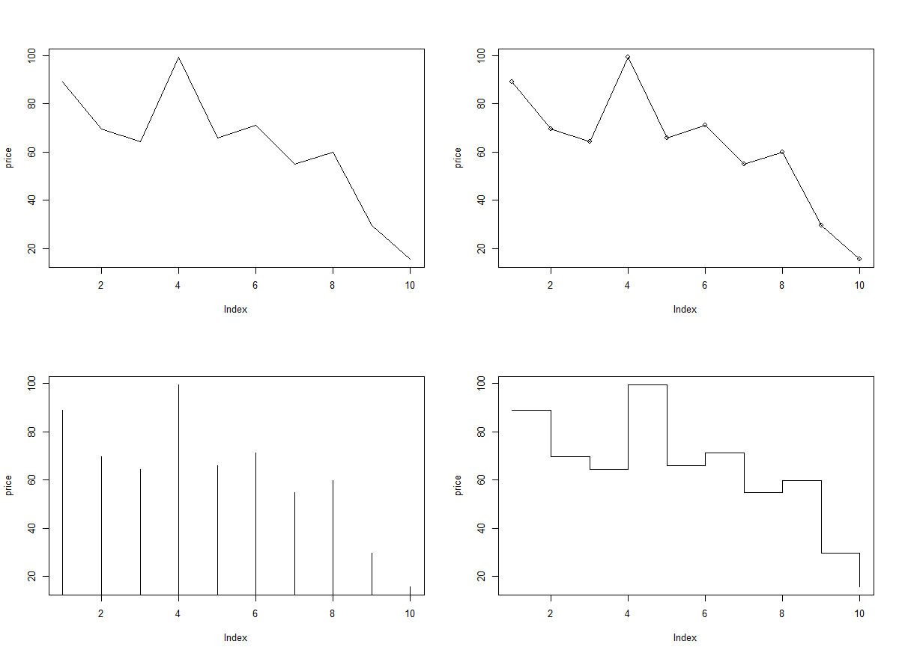

#### 복습

산점도(scatter plot) : 두 개 이상의 변수들 사이의 분포를 점으로 표시한 차트
두 변수의 관계를 시각적으로 분석할 때 유용


```R
price <- runif(10, min=1, max=100)
print(price)
plot(price, col="red")
par(new=T) #차트 추가
line_chart=1:100
#x축은 생성된 난수의 순서,  y축은 
plot(line_chart, type="l", col="red", axes=F, ann=F) #대각선 추가 

```


**좌표평면상의 점 등을 선으로 연결**

```R
#좌표평면상의 점 등을 선으로 연결
par(mfrow=c(2, 2))
plot(price, type="l")  #실선
plot(price, type="o")  #원형과 실선
plot(price, type="h")  #직선
plot(price, type="s")  #꺽은선
```




**중복된 데이터의 수만큼 plot점 크기 확대**

```R
#중복된 데이터의 수만큼 plot점 크기 확대
x<-c(1, 2, 3, 4, 2, 4)
y<-rep(2, 6)
table(x, y)  #빈도수


par(mfrow=c(1, 1))
plot(x, y)

```


```R
> xy.df <- as.data.frame(table(x, y))
> xy.df
  x y Freq
1 1 2    1
2 2 2    2
3 3 2    1
4 4 2    2
> 
> plot(x, y, pch='@', col='blue', cex=0.5*xy.df$Freq, 
+      xlab="x벡터 원소", ylab="y벡터 원소")
```


**child컬럼, parent컬럼을 대상으로 교차테이블을 생성 결과를 데이터프레임으로 생성**

```R
#child컬럼, parent컬럼을 대상으로 교차테이블을 생성 결과를 데이터프레임으로 생성
galtondf <- as.data.frame(table(galton$child, galton$parent))
head(galtondf)
str(galtondf)

> names(galtondf) <- c("child", "parent", "freq")
> head(galtondf)
  child parent freq
1  61.7     64    1
2  62.2     64    0
3  63.2     64    2
4  64.2     64    4
5  65.2     64    1
6  66.2     64    2
> parent <- as.numeric(galtondf$parent)
> child <- as.numeric(galtondf$child)
> 
> plot(parent, child, pch=21, col="blue", bg="green", 
+      cex=0.2*galtondf$freq, xlab="parent", ylab="child")


```


===============================================================================

# R


## 그래프, 차트

### pairs()

pairs() : 변수 간의 관계를 차트로 그릴 수 있다


- pairs() : 변수 간의 관계를 차트로 그릴 수 있다
- graphics패키지에서 제공하는 paris()는 matrix 또는 data.frame의  numeric 컬럼을 대상으로 변수들 사이의 비교 결과를 행렬구조의 분산된 그래프로 제공합니다.
  

```R

> attributes(iris)  #
$names
[1] "Sepal.Length" "Sepal.Width"  "Petal.Length"
[4] "Petal.Width"  "Species"     

$class
[1] "data.frame"

$row.names
  [1]   1   2   3   4   5   6   7   8   9  10  11  12
 [13]  13  14  15  16  17  18  19  20  21  22  23  24
 [25]  25  26  27  28  29  30  31  32  33  34  35  36
 [37]  37  38  39  40  41  42  43  44  45  46  47  48
 [49]  49  50  51  52  53  54  55  56  57  58  59  60
 [61]  61  62  63  64  65  66  67  68  69  70  71  72
 [73]  73  74  75  76  77  78  79  80  81  82  83  84
 [85]  85  86  87  88  89  90  91  92  93  94  95  96
 [97]  97  98  99 100 101 102 103 104 105 106 107 108
[109] 109 110 111 112 113 114 115 116 117 118 119 120
[121] 121 122 123 124 125 126 127 128 129 130 131 132
[133] 133 134 135 136 137 138 139 140 141 142 143 144
[145] 145 146 147 148 149 150

> 
> pairs(iris[, 1:4])
```


### **3차원 산점도**

```R
install.packages("scatterplot3d")
library(scatterplot3d)
levels(iris$Species)
iris_setosa = iris[iris$Species=='setosa', ]

iris_versicolor = iris[iris$Species=='versicolor', ]
iris_virginica = iris[iris$Species=='virginica', ]
d3 <- scatterplot3d(iris$Petal.Length, iris$Sepal.Length,
                    iris$Sepal.Width, type='n')  #type='n'은 기본 산점도를 표시하지 않음
d3$points3d(iris_setosa$Petal.Length, iris_setosa$Sepal.Length ,
            iris_setosa$Sepal.Width, bg="orange", pch=21)

d3$points3d(iris_versicolor$Petal.Length, iris_versicolor$Sepal.Length ,
            iris_versicolor$Sepal.Width, bg="blue", pch=23)

d3$points3d(iris_virginica$Petal.Length, iris_virginica$Sepal.Length ,
            iris_virginica$Sepal.Width, bg="green", pch=25)
```


## 데이터 전처리


- 데이터 분석 프로젝트에서는 70%이상의 시간을 데이터 변환과  조작, 필터링 등 전처리 작업에 소요됩니다.
- 데이터 전처리에 사용되는 유용한 패키지 : plyr, dplyr, reshape, reshape2패키지


### plyr


plyr 패키지는 두개 이상의 데이터프레임을 대상으로 key값을 이용하여 merge, 함수적용 , 요약 집계등의 기능을 제공합니다.

```R
install.packages("plyr")
library(plyr)

> x <- data.frame(id = c(1, 2, 3, 4, 5),
+                 height = c(160, 171, 173, 162, 165))
> 
> y <- data.frame(id = c(5, 1, 3, 2, 4),
+                 weight = c(55, 73, 60, 57, 75))
> 
> # join() : 두데이터프레임을 merge
> xyjoin <- join(x, y, by="id")
> xyjoin
  id height weight
1  1    160     73
2  2    171     57
3  3    173     60
4  4    162     75
5  5    165     55
> 
> x <- data.frame(id = c(1, 2, 3, 4, ,6),
+                 height = c(160, 171, 173, 162, 165))
Error in c(1, 2, 3, 4, , 6) : argument 5 is empty
> 
> leftjoin <- join(x, y, by="id") #왼쪽 데이터 프레임의 키값을 기준으로 merge
> leftjoin    #키에 join할 데이터가 없으면 NA로 출력
  id height weight
1  1    160     73
2  2    171     57
3  3    173     60
4  4    162     75
5  5    165     55
> 
> innerjoin <- join(x, y, by="id", type="inner")
> innerjoin   #innerjoin은 두 데이터프레임에서 키값이 있는 경우에만 조인을 수행
  id height weight
1  1    160     73
2  2    171     57
3  3    173     60
4  4    162     75
5  5    165     55
> 
> fulljoin <- join(x, y, by="id", type="full")
> fulljoin   #키 값이 존재하는 전체 관측치를 대상으로 조인 수행, 키에 join할 데이터가 없으면 NA로 출력
  id height weight
1  1    160     73
2  2    171     57
3  3    173     60
4  4    162     75
5  5    165     55


> x<-data.frame(key1=c(1,1, 2,2, 3), 
+               key2=c('a', 'b', 'c','d', 'e'),
+               val1 = c(10,20,30,40,50))
> 
> y<-data.frame(key1=c(3, 2, 2, 1, 1), 
+               key2=c('e', 'd', 'c','b', 'a'),
+               val1 = c(500,300,400,100,200))
> 
> xyjoin <- join (x, y, by=c('key1', 'key2'))
> xyjoin
  key1 key2 val1 val1
1    1    a   10  200
2    1    b   20  100
3    2    c   30  400
4    2    d   40  300
5    3    e   50  500

```


### apply


- apply(vec, func) - 결과는 벡터, 배열, 리스트
- lapply(vec|list, func)  - - 결과는  리스트
- sapply(vec, func) - 결과는 벡터, 배열, 행렬 반환
- tapply() - 데이터 셋에 집단 변수 (이산형 범주)를 대상으로 그룹별 함수 적용
- tapply(dataset, 집단변수, 함수)


#### tapply

```R
> names(iris)
[1] "Sepal.Length" "Sepal.Width"  "Petal.Length"
[4] "Petal.Width"  "Species"     
> unique(iris$Species)
[1] setosa     versicolor virginica 
Levels: setosa versicolor virginica
> tapply(iris$Sepal.Length, iris$Species, mean)
    setosa versicolor  virginica 
     5.006      5.936      6.588 
> tapply(iris$Sepal.Length, iris$Species, sd)
    setosa versicolor  virginica 
 0.3524897  0.5161711  0.6358796 
```


####  ddply

- ddply() - 데이터 셋에 집단 변수(이산형 범주)를 대상으로 그룹별 함수를 여러개  적용할 수 있습니다.
- ddply(데이터 셋, 집단변수, 요약집계, 컬럼명=함수(변수))


```R
> avg_df <- ddply(iris, .(Species), summarise, avg=mean(Sepal.Length))
> avg_df
     Species   avg
1     setosa 5.006
2 versicolor 5.936
3  virginica 6.588
> str(avg_df)
'data.frame':	3 obs. of  2 variables:
 $ Species: Factor w/ 3 levels "setosa","versicolor",..: 1 2 3
 $ avg    : num  5.01 5.94 6.59
```


#### dplyr 

- dplyr 패키지 -데이터 전처리( 조건 필터, 그룹핑,  함수적용, 변환, 집계연산, 정렬,.....)
- filter() 조건에 맞는 데이터셋 추출, 행추출
- select() 데이터 셋을 대상으로 컬럼을 선택하는 기능
- mutate() 데이터 넷의 새로운 컬럼을 추가하는 기능
- arrange() 데이터 셋의 특정 컬럼으로 정렬하는 기능
- summarise() 데이터 셋의 특정 컬럼으로 요약집계 기능


```
exam.csv#################################################################
id,class,math,english,science
1,1,50,98,50
2,1,60,97,60
3,1,45,86,78
4,1,30,98,58
5,2,25,80,65
6,2,50,89,98
7,2,80,90,45
8,2,90,78,25
9,3,20,98,15
10,3,50,98,45
11,3,65,65,65
12,3,45,85,32
13,4,46,98,65
14,4,48,87,12
15,4,75,56,78
16,4,58,98,65
17,5,65,68,98
18,5,80,78,90
19,5,89,68,87
20,5,78,83,58
```


```R
install.packages("dplyr")
library("dplyr")

exam <- read.csv("./data/exam.csv")
print(exam)

# %>% 파이프 연산자 (다음 함수의 입력값으로 전달)
# class가 1인 record(행)추출
class1 <- exam %>% filter(class==1)
print(class1)

# class가 1을 제외한 record(행)추출
other_class <- exam %>% filter(class!=1)
print(other_class)

#class가 1이면서 수학점수는 50이상인 행을 추출
class1_math50 <- exam %>% filter(class==1 & math>50 )
print(class1_math50)

#class가 1,3,5인 행만 추출
odd_class <- exam %>% filter(class  %in% c(1, 3, 5) )
print(odd_class)

#영어점수 컬럼값만 추출
e_jumsu <- exam %>% select(english)
print(e_jumsu)

#수학점수 제외하고 모든 컬럼 추출
all_column <- exam %>% select(-math)
print(all_column)

#class가 1이면서 영어점수 컬럼값만 1행에서~3행까지 출력
print(exam %>% filter(class==1)  %>% select(english) %>% head(3))
  
#수학점수를 기준으로 오름차순 정렬된 결과를 변수에 저장하고 출력
asc_math <- exam  %>%  arrange(math) 
print(asc_math)

#수학점수를 기준으로 내림차순 정렬된 결과를 변수에 저장하고 출력
desc_math <- exam  %>%  arrange(desc(math))
print(desc_math)

# 1차 정렬은 class의 오름차순, 2차 정렬은 수학점수의 내림차순으로 정렬
order_math <- exam  %>%  arrange(class, desc(math))
print(order_math)

#총점(수학+영어+과학) 열을 추가
new_exam <- exam %>% mutate(total= math+english+science) 
print( new_exam )

#평균 열 추가
avg_exam <- exam  %>% mutate(total= math+english+science, 
                      mean=(math+english+science)/3 ) 
print( avg_exam )


#pass이름의 열을 추가 (평균이 60점이상이면 "pass"값, 
                      60점미만이면 "fail"값을 가짐)
pass <-  exam  %>% mutate(mean=(math+english+science)/3)   
           %>% mutate(pass=ifelse(mean >= 60 , "pass", "fail" ) ) 
print( pass )


#추가된 평균 컬럼으로 내림차순 정렬

avg_desc_exam <-  exam  %>% mutate(mean=(math+english+science)/3)  %>% arrange(mean)
print( avg_desc_exam)


```

