# R

## 워드클라우드

워드 클라우드(word cloud) : 특정 주제와 관련된 키워드의 색상과 크기, 글자모음 형태를 활용해 주제를 쉽고 빠르게 인식할 수 있는 시각화 기법


### 애국가 형태소 분석 및  워드클라우드

```R
install.packages("KoNLP")
install.packages("wordcloud2")


# #워드 클라우드시작
require(KoNLP)
useNIADic()

word_data<-readLines("./data/애국가(가사).txt")
word_data

word_data2 <- sapply(word_data,extractNoun,USE.NAMES = F)
word_data2

undata <-unlist(word_data2)
undata

word_table <-table(undata)
word_table

undata2 <-Filter(function(x) {nchar(x)>=2},undata)

word_table2 <- table(undata2)
word_table2

sort(word_table2,decreasing = T)

require(wordcloud2)

wordcloud2(word_table2)
wordcloud2(word_table2,color = "random-light",backgroundColor = "black")
wordcloud2(word_table2,fontFamily ="맑은 고딕",size =1.2 , color="random-light",
           backgroundColor = "black",shape="star")

# 워드 클라우드 끝

#검색 API 사용 시작

# Client ID
# 3lKLkVlNmzu_kAdOc3WW
# 
# Client Secret
# 898stULjB6

urlStr <- "https://openapi.naver.com/v1/search/blog.xml?"
searchString <- "query=코타키나발루"
#UTF-8 인코딩
searchString <- iconv(searchString, to="UTF-8")
#URL 인코딩
searchString <- URLencode(searchString )
searchString

etcString <- "&display=100&start=1&sort=sim"

reqUrl <- paste(urlStr, searchString, etcString, sep="")
reqUrl

library(httr)
# clientID <- "3lKLkVlNmzu_kAdOc3WW"
# clientSecret <- "898stULjB6"

clientsID <- '3lKLkVlNmzu_kAdOc3WW'
clientSecret <- '898stULjB6'

apiResult <- GET(reqUrl, add_headers("X-Naver-Client-ID"=clientsID, "X-Naver-Client-Secret"=clientSecret))
apiResult

apiResult$content

result <- rawToChar(apiResult$content)
result

Encoding(result) <- "UTF-8"
result
###############################################
refinedStr <- result
refinedStr <- gsub("[<(/;&)>]"," ", refinedStr)
refinedStr
#단락을 표현하는 불필요한 문자를 공란으로 치환
refinedStr <- gsub("[[:punct:]]", " ", refinedStr)
refinedStr
#영어 소문자를 공란으로 치환
refinedStr <- gsub("[a-z]", " ", refinedStr)
refinedStr

#API 사용끝 

#검색결과 워드 클라우드 적용

word_data2 <- sapply(refinedStr,extractNoun,USE.NAMES = F)
word_data2

undata <-unlist(word_data2)
undata

word_table <-table(undata)
word_table

undata2 <-Filter(function(x) {nchar(x)>=2},undata)

word_table2 <- table(undata2)
word_table2

sort(word_table2,decreasing = T)

wordcloud2(word_table2)

wordcloud2(word_table2,fontFamily ="맑은 고딕",size =1.2 , color="random-light",
           backgroundColor = "black",shape="star")

wordcloud2(word_table2,figPath = "./data/peace.png")
```


### 영문서 형태소 분석 및  워드클라우드


```R
# Install
install.packages("tm")  # 텍스트 마이닝을 위한 패키지
install.packages("SnowballC") # 어간추출을 위한 패키지
#install.packages("wordcloud") # word-cloud generator 
install.packages("RColorBrewer") # color palettes
# Load
library("tm")
library("SnowballC")
#library("wordcloud")
library("RColorBrewer")

> filePath <- "http://www.sthda.com/sthda/RDoc/example-files/martin-luther-king-i-have-a-dream-speech.txt"
> text <- readLines(filePath)
> str(text)
 chr [1:46] "" ...

> docs <- Corpus(VectorSource(text))
> head(docs)
<<SimpleCorpus>>
Metadata:  corpus specific: 1, document level (indexed): 0
Content:  documents: 6

# 텍스트의 특수 문자 등을 대체하기 위해 tm_map () 함수를 사용하여 변환이 수행됩니다.
# “/”,“@”및“|”을 공백으로 바꿉니다.

> toSpace <- content_transformer(function (x , pattern ) gsub(pattern, " ", x))
> docs <- tm_map(docs, toSpace, "/")
Warning message:
In tm_map.SimpleCorpus(docs, toSpace, "/") : transformation drops documents
> docs <- tm_map(docs, toSpace, "@")
Warning message:
In tm_map.SimpleCorpus(docs, toSpace, "@") : transformation drops documents
> docs <- tm_map(docs, toSpace, "\\|")
Warning message:
In tm_map.SimpleCorpus(docs, toSpace, "\\|") :
  transformation drops documents
> head(docs)
<<SimpleCorpus>>
Metadata:  corpus specific: 1, document level (indexed): 0
Content:  documents: 6
docs <- Corpus(VectorSource(text))
# 텍스트의 특수 문자 등을 대체하기 위해 tm_map () 함수를 사용하여 변환이 수행됩니다.
# “/”,“@”및“|”을 공백으로 바꿉니다.
toSpace <- content_transformer(function (x , pattern ) gsub(pattern, " ", x))
docs <- tm_map(docs, toSpace, "/")
docs <- tm_map(docs, toSpace, "@")
docs <- tm_map(docs, toSpace, "\\|")
head(docs)

# 소문자로 변환
docs <- tm_map(docs, content_transformer(tolower))
# 수치 데이터 제거
docs <- tm_map(docs, removeNumbers)
# 영어 불용어 제거
docs <- tm_map(docs, removeWords, stopwords("english"))

# 벡터 구조로 사용자가 직접 불용어  설정 , 제거
docs <- tm_map(docs, removeWords, c("blabla1", "blabla2")) 

# 문장 부호 punctuations
docs <- tm_map(docs, removePunctuation)

# 공백 제거
docs <- tm_map(docs, stripWhitespace)

# 텍스트 형태소 분석
docs <- tm_map(docs, stemDocument)

> dtm <- TermDocumentMatrix(docs)
> m <- as.matrix(dtm)
> v <- sort(rowSums(m),decreasing=TRUE)
> d <- data.frame(word = names(v),freq=v)
> head(d, 10)
           word freq
will       will   17
freedom freedom   13
ring       ring   12
dream     dream   11
day         day   11
let         let   11
everi     everi    9
one         one    8
abl         abl    8
togeth   togeth    7
> 
> library(wordcloud)
> 
> set.seed(1234)
> wordcloud(words = d$word, freq = d$freq, min.freq = 1,
+           max.words=200, random.order=FALSE, rot.per=0.35, 
+           colors=brewer.pal(8, "Dark2"))

```


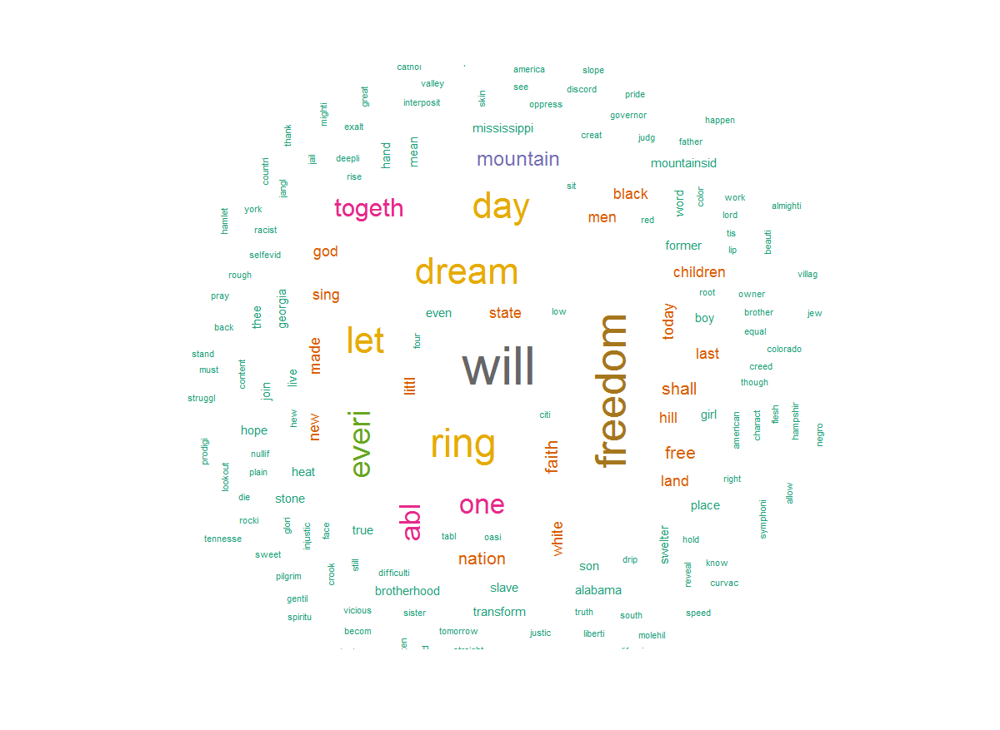

## 오픈API이용하기


```R
#기본 URLrlStr <- "https://openapi.naver.com/v1/search/blog.xml?"
u
#검색어 설정 및 UTF-8 URL 인코딩
searchString <- "query=코타키나발루"
#UTF-8 인코딩
searchString <- iconv(searchString, to="UTF-8")
#URL 인코딩
searchString <- URLencode(searchString )
searchString

#나머지 요청 변수 : 조회 개수 100개, 시작페이지 1, 유사도순 정렬
etcString <- "&display=100&start=1&sort=sim"

#URL조합
reqUrl <- paste(urlStr, searchString, etcString, sep="")
reqUrl


library(httr)
clientsID <- '아이디'
clientSecret <- 'Secret'

apiResult <- GET(reqUrl, add_headers("X-Naver-Client-ID"=clientsID, "X-Naver-Client-Secret"=clientSecret))
apiResult

str(apiResult)

apiResult$content
str(apiResult$content)

result <- rawToChar(apiResult$content)
result

Encoding(result) <- "UTF-8"
result


refinedStr <- result
#XML 태그를 공란으로 치환
refinedStr <- gsub("<\\/?)(\\w+)*([^<>]*)>", " ", refinedStr)
refinedStr <- gsub("[<(/;&)>]"," ", refinedStr)
refinedStr
#단락을 표현하는 불필요한 문자를 공란으로 치환
refinedStr <- gsub("[[:punct:]]", " ", refinedStr)
refinedStr
#영어 소문자를 공란으로 치환
refinedStr <- gsub("[a-z]", " ", refinedStr)
refinedStr

#숫자를 공란으로 치환
refinedStr <- gsub("[0-9]", " ", refinedStr)
refinedStr

#여러 공란은 한 개의 공란으로 변경
refinedStr <- gsub(" +", " ", refinedStr)
refinedStr 

```


## ggplot2


### ggplot

```R
> library(ggplot2)

다음의 패키지를 부착합니다: ‘ggplot2’

The following object is masked _by_ ‘.GlobalEnv’:

    mpg

The following object is masked from ‘package:NLP’:

    annotate

> str(airquality)
'data.frame':	153 obs. of  6 variables:
 $ Ozone  : int  41 36 12 18 NA 28 23 19 8 NA ...
 $ Solar.R: int  190 118 149 313 NA NA 299 99 19 194 ...
 $ Wind   : num  7.4 8 12.6 11.5 14.3 14.9 8.6 13.8 20.1 8.6 ...
 $ Temp   : int  67 72 74 62 56 66 65 59 61 69 ...
 $ Month  : int  5 5 5 5 5 5 5 5 5 5 ...
 $ Day    : int  1 2 3 4 5 6 7 8 9 10 ...


> ggplot(airquality, aes(x = Day, y = Temp))
#x축은 Day열, y축은 Temp열로 맵핑
```

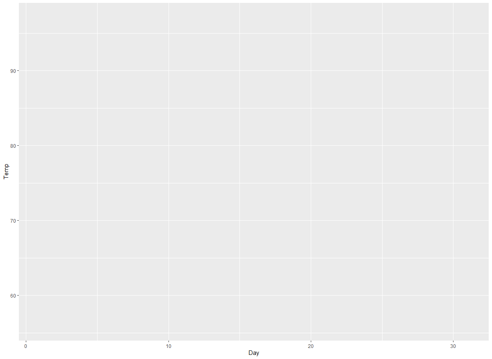


### 산점도, geom_point

```R
#x축은 Day열, y축은 Temp열로 맵핑
ggplot(airquality, aes(x = Day, y = Temp)) + geom_point()
```

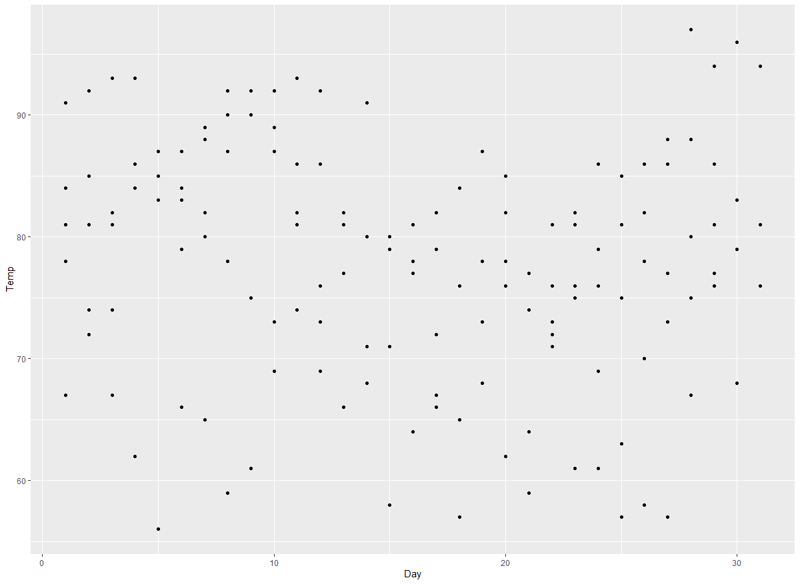


```R
> ggplot(airquality, aes(x = Day, y = Temp)) + geom_point(size = 3, color = "red")
```

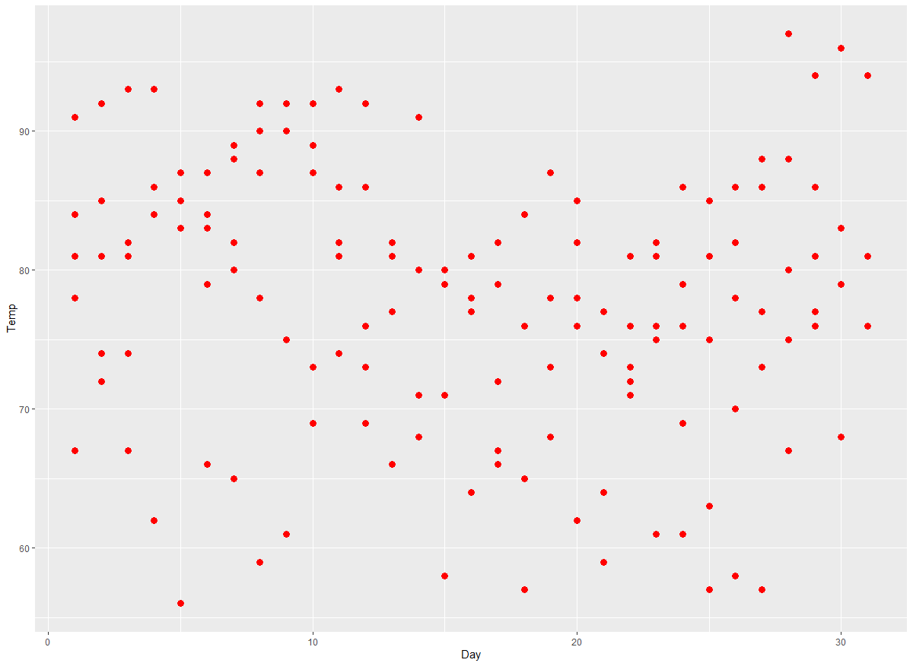


### 꺾은선 그래프, geom_line()

```R
#x축은 Day열, y축은 Temp열로 맵핑 후 꺾은선 그래프 그리기
> ggplot(airquality, aes(x = Day, y = Temp)) + geom_line()
```

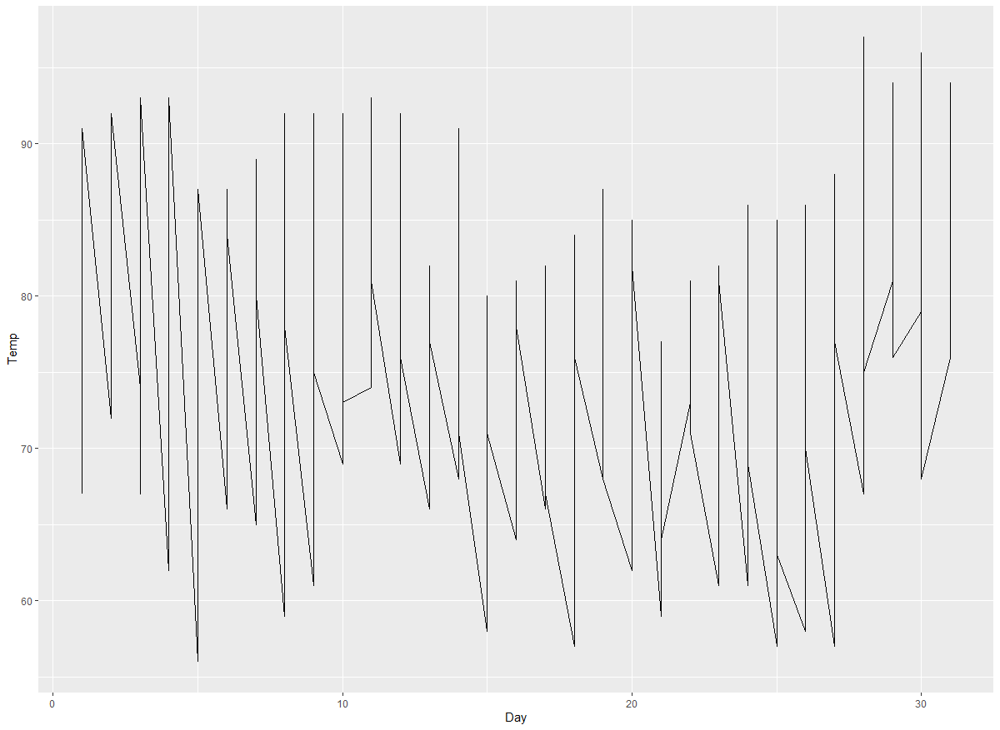


### 그래프에 그래프 더하기

```R
#x축은 Day열, y축은 Temp열로 맵핑 후 꺾은선 그래프와 산점도 그리기
> ggplot(airquality, aes(x = Day, y = Temp))+ geom_point() + geom_line()
```

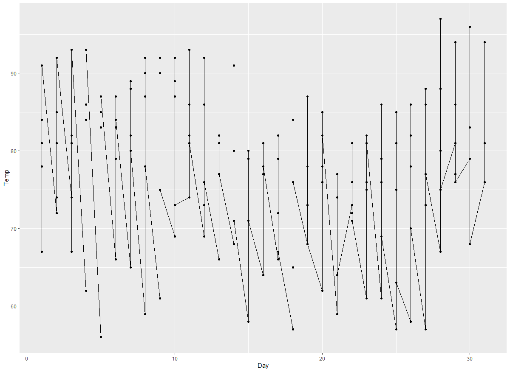


### 막대그래프

```R
#mtcars에서 cyl 종류별 빈도수 확인
ggplot(mtcars, aes(x=cyl)) + geom_bar(width = 0.5)
```

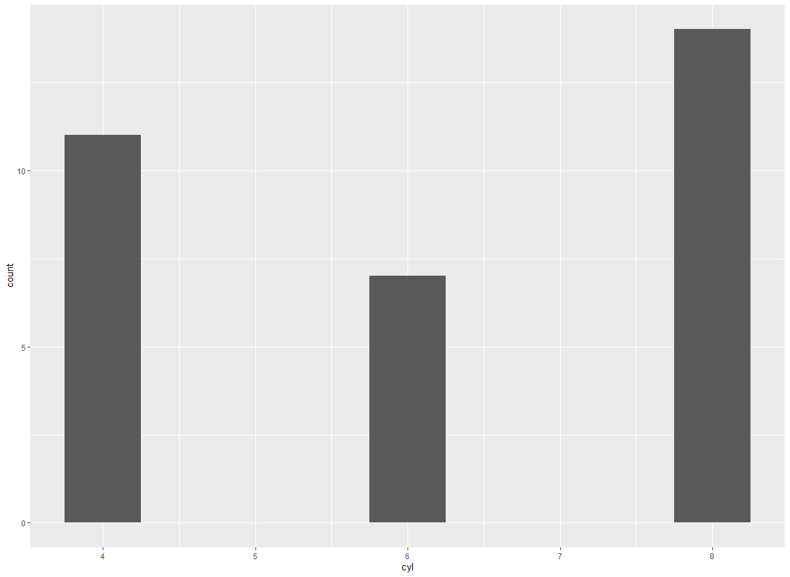


```R
# 빈 범주를 제외하고 cyl 종류별 빈도수 확인
ggplot(mtcars, aes(x=factor(cyl)) + geom_bar(width = 0.5)
```

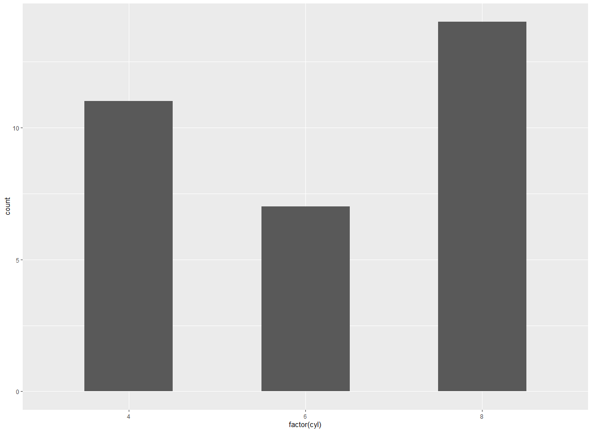


### 누적막대그래프

```R
#cyl 종류별 gear 빈도 누적 막대그래프
> ggplot(mtcars, aes(x=factor(cyl))) + geom_bar(aes(fill = factor(gear)))
```

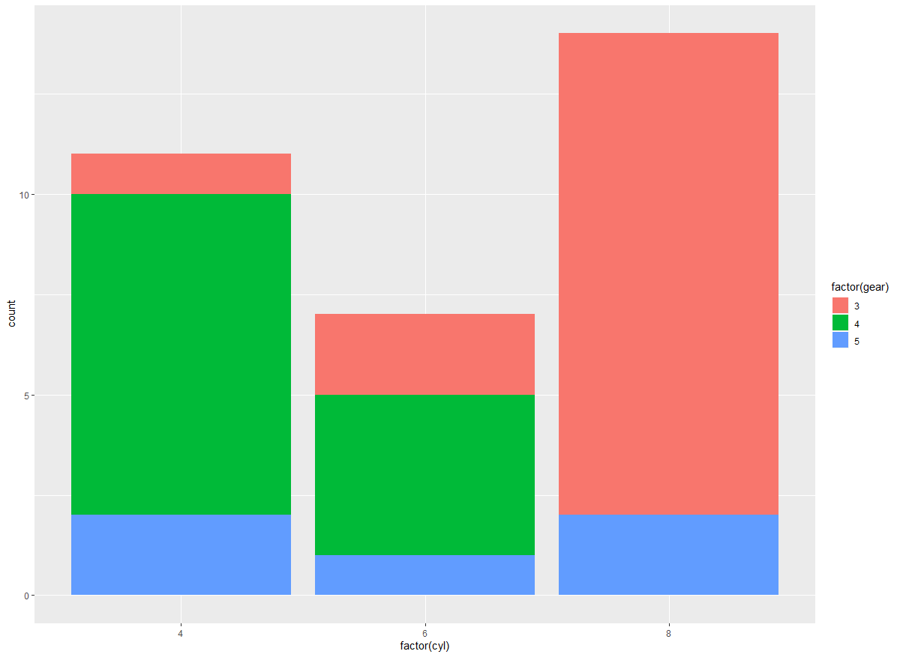


#### 누적막대그래프로 선버스트 차트그리기


```R
> ggplot(mtcars, aes(x=factor(cyl))) + geom_bar(aes(fill = factor(gear))) + coord_polar()
```

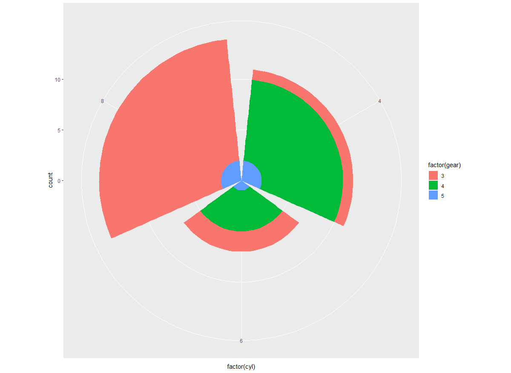


### 상자그림 & 히스토그램

```R
#airquality에서 Day 열을 그륩 지어, 날짜별 온도 상자 그림을 그림
> ggplot(airquality, aes(x = Day, y = Temp, group = Day)) + geom_boxplot()
```

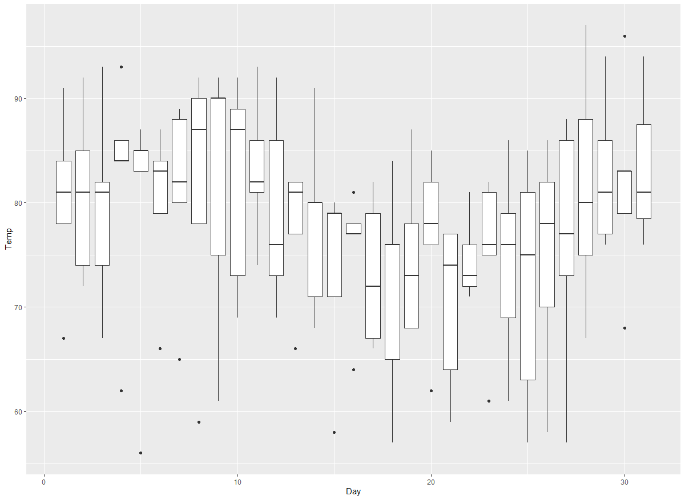


### 히스토그램

```R
#airquality에서 Temp의 히스토그램
> ggplot(airquality, aes(Temp)) + geom_histogram()
`stat_bin()` using `bins = 30`. Pick better value
with `binwidth`.

#폭이 넓어 자동 조정을 한다.
#폭을 지정하려면 geom_histogram(binwidth = 1)
```

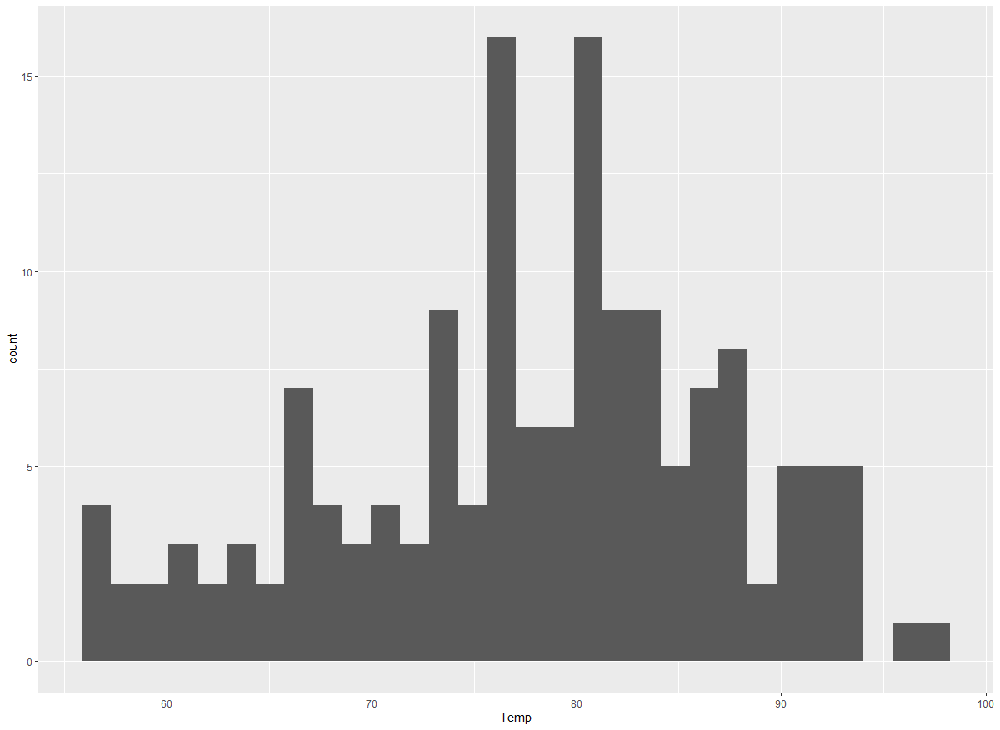


### 직선 그리기

데이터

```R
> str(economics)
Classes ‘spec_tbl_df’, ‘tbl_df’, ‘tbl’ and 'data.frame':	574 obs. of  6 variables:
 $ date    : Date, format: "1967-07-01" ...
 $ pce     : num  507 510 516 512 517 ...
 $ pop     : num  198712 198911 199113 199311 199498 ...
 $ psavert : num  12.6 12.6 11.9 12.9 12.8 11.8 11.7 12.3 11.7 12.3 ...
 $ uempmed : num  4.5 4.7 4.6 4.9 4.7 4.8 5.1 4.5 4.1 4.6 ...
 $ unemploy: num  2944 2945 2958 3143 3066 ...

```


#### 꺾은그래프에 사선 그리기

```R
> ggplot(economics, aes(x = date, y = psavert)) + geom_line() + geom_abline(intercept = 12.18671, slope = -0.0005444)
```

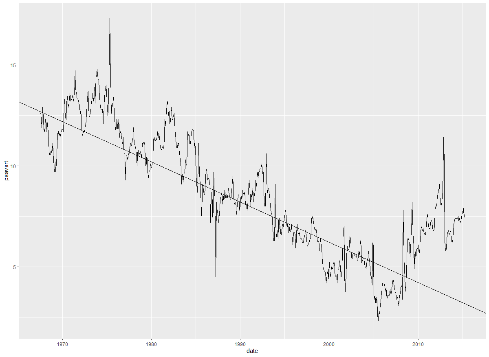


#### 평행선

```R
> ggplot(economics, aes(x = date, y = psavert)) + geom_line() + geom_hline(yintercept = mean(economics$psavert))
```

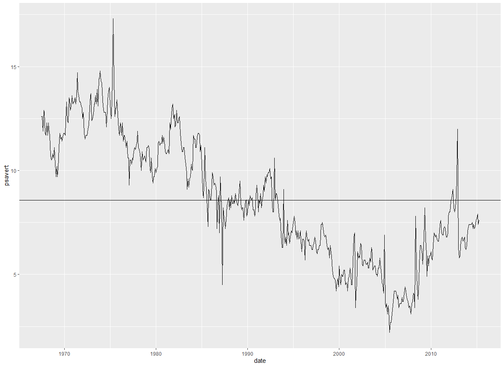


#### 수직선

```R
> library(dplyr)

다음의 패키지를 부착합니다: ‘dplyr’

The following objects are masked from ‘package:stats’:

    filter, lag

The following objects are masked from ‘package:base’:

    intersect, setdiff, setequal, union

> x_inter <- filter(economics, psavert == min(economics$psavert))$date
ggplot(economics, aes(x = date, y = psavert)) +  # x축을 date, y축을 psarvert로 맵핑
  geom_line() + #꺾은선그래프 그리기
  geom_vline(xintercept = x_inter) #x_inter  변수 값으로 수직선 그리기

```


### 텍스트 입력 및 도형 그리기


```R

```


## 크롤링


- read_html() : url에서 html 파일을 읽어오고 저장한다.
-  html_table() :  테이블추출
-  html_node()는 매칭되는 한 요소만 반환하고, 
-  html_nodes()는 모든 요소를 반환한다.
-  id를 찾을 경우에는 html_node()를 사용하면 되고, tag, class로 같은 요소를 모두 추출하고자 할 경우에는 html_nodes()를 사용하면 된다
-  html_names()는 attribute의 이름을 가져온다.    
   ex) 
- html_chidren() 해당 요소의 하위 요소를 읽어온다.
- html_tag() tag이름 추출한다.
- html_attrs() attribute을 추출한다.


### 웹 사이트로부터  HTML code 읽기 

```R
install.packages('rvest')

library(rvest)

#스크래핑할 웹 사이트 URL을 변수에 저장
url <- 'http://www.imdb.com/search/title?count=100&release_date=2016,2016&title_type=feature'

#웹 사이트로부터  HTML code 읽기
webpage <- read_html(url)   
webpage
```


#### 랭킹

##### 랭킹이 포함된 CSS selector를 찾아서 R 코드로 가져오기

```R
> rank_data_html <- html_nodes(webpage,'.text-primary')
```


##### 랭킹 데이터를 텍스트로 가져오기

```R
rank_data <- html_text(rank_data_html)
> head(rank_data)
[1] "1." "2." "3." "4." "5." "6."
```


##### 랭킹 데이터를 수치형 데이터로 변환

```R
> rank_data <- as.numeric(rank_data)
Warning message:
In mget(objectNames, envir = ns, inherits = TRUE) :
  strings not representable in native encoding will be translated to UTF-8
> head(rank_data)
[1] 1 2 3 4 5 6
```


#### 제목

##### 제목의 영역의 CSS selector 스크래핑

```R
> title_data_html <- html_nodes(webpage,'.lister-item-header a')
```


##### 제목 데이터 텍스트로 가져오기

```R
> title_data_html <- html_nodes(webpage,'.lister-item-header a')
> title_data <- html_text(title_data_html)
> head(title_data)
[1] "Suicide Squad"     "London Has Fallen"
[3] "X-Men: Apocalypse" "Deadpool"         
[5] "Split"             "Rogue One"        
```


#### description

##### 영역의 CSS selectors 스크래핑

```R
> description_data_html <- html_nodes(webpage,'.rating-bar+ .text-muted')
```


##### 데이터 텍스트로 가져오기

```R
> description_data <- html_text(description_data_html)
```


##### '\n' 제거 데이터 처리

```R
> description_data_html <- html_nodes(webpage,'.ratings-bar+ .text-muted')
> description_data <- html_text(description_data_html)
> description_data <- gsub("\n", "",description_data)
> description_data <- str_trim(description_data)
> head(description_data)
[1] "A secret government agency recruits some of the most dangerous incarcerated super-villains to form a defensive task force. Their first mission: save the world from the apocalypse."
[2] "In London for the Prime Minister's funeral, Mike Banning is caught up in a plot to assassinate all the attending world leaders."                                                    
[3] "In the 1980s the X-Men must defeat an ancient all-powerful mutant, En Sabah Nur, who intends to thrive through bringing destruction to the world."                                  
[4] "A wisecracking mercenary gets experimented on and becomes immortal but ugly, and sets out to track down the man who ruined his looks."                                              
[5] "Three girls are kidnapped by a man with a diagnosed 23 distinct personalities. They must try to escape before the apparent emergence of a frightful new 24th."                      
[6] "The daughter of an Imperial scientist joins the Rebel Alliance in a risky move to steal the Death Star plans."                    
```


#### 영화 상영시간

#####  CSS selectors 스크래핑

```R
> runtime_data_html <- html_nodes(webpage,'.text-muted .runtime')
```


#### 

##### 데이터 텍스트로 가져오기

```R
> runtime_data <- html_text(runtime_data_html)
> head(runtime_data)
[1] "123 min" "99 min"  "144 min" "108 min" "117 min"
[6] "133 min"

```


##### min(분) 문자열 제거 후 수치형 데이터로 변환 데이터 처리


```R
> runtime_data <- gsub(" min","",runtime_data)
> runtime_data <- as.numeric(runtime_data)
> head(runtime_data)
[1] 123  99 144 108 117 133

```


#### 영화장르 

##### 영역 CSS selectors 스크래핑

```R
> genre_data_html <- html_nodes(webpage,'.text-muted .genre')
```


##### 데이터 텍스트로 가져오기

```R
> genre_data <- html_text(genre_data_html)
> head(genre_data)
[1] "\nAction, Adventure, Fantasy            "
[2] "\nAction, Thriller            "          
[3] "\nAction, Adventure, Sci-Fi            " 
[4] "\nAction, Adventure, Comedy            " 
[5] "\nHorror, Thriller            "          
[6] "\nAction, Adventure, Sci-Fi            " 
```


##### \n 제거 데이터 처리

```R
> genre_data<-gsub("\n","",genre_data)
```


##### 1개이상의 공백을 제거하는 데이터 처리

```R
> genre_data<-gsub(" ","",genre_data)
```


##### 첫번째 장르문자열만 남기고 모두 제거

```R
> genre_data<-gsub(",.*","",genre_data)
```


##### 문자열 데이터를 범주형 데이터로 변환 처리

```R
> head(genre_data) 
[1] Action Action Action Action Horror Action
8 Levels: Action Adventure Animation ... Horror
```


#### IMDB rating

##### IMDB rating 영역의 CSS selectors를 이용한 스크래핑

```R
> rating_data_html <- html_nodes(webpage,'.ratings-imdb-rating strong')

```


##### IMDB rating 데이터 text로 가져오기


```R
> rating_data <- html_text(rating_data_html)
> head(rating_data) 
[1] "6.0" "5.9" "6.9" "8.0" "7.3" "7.8"
```


##### IMDB rating 데이터를 numerical으로 변환 데이터 처리

```R
> rating_data<-as.numeric(rating_data)
> head(rating_data)
[1] 6.0 5.9 6.9 8.0 7.3 7.8
```


#### votes 

##### votes 영역의 CSS selectors를 이용한 스크래핑

```R
> votes_data_html <- html_nodes(webpage,'.sort-num_votes-visible span:nth-child(2)')
```


##### votes 데이터 text로 가져오기

```R
> votes_data <- html_text(votes_data_html)
> head(votes_data)
[1] "544,063" "128,895" "365,202" "836,191" "371,465"
[6] "487,689"
```


##### 콤마(,) 제거 데이터 처리

```R
> votes_data<-gsub(",","",votes_data)
```


##### votes 데이터를 numerical으로 변환 데이터 처리

```R
> votes_data<-as.numeric(votes_data) 
> head(votes_data)
[1] 544063 128895 365202 836191 371465 487689
```


#### 감독

##### 감독 영역의 CSS selectors를 이용한 스크래핑 

```R
> directors_data_html <- html_nodes(webpage,
+                                   '.text-muted+ p a:nth-child(1)')
```


##### 감독 데이터 text로 가져오기 

```R
> directors_data <- html_text(directors_data_html)
> head(directors_data)
[1] "David Ayer"         "Babak Najafi"      
[3] "Bryan Singer"       "Tim Miller"        
[5] "M. Night Shyamalan" "Gareth Edwards"  
```


##### 감독 데이터 문자열을  범주형 데이터로 변환 처리

```R
> directors_data<-as.factor(directors_data)
```


#### 배우

##### 배우 영역의 CSS selectors를 이용한 스크래핑

```R
> actors_data_html <- html_nodes(webpage, '.lister-item-content .ghost+ a')
```


##### 배우 데이터 text로 가져오기

```R
> actors_data<-html_text(actors_data_html)
```


##### 배우 데이터 문자열을  범주형 데이터로 변환 처리

```R
> actors_data<-as.factor(actors_data)
> head(actors_data)
[1] Will Smith     Gerard Butler  James McAvoy  
[4] Ryan Reynolds  James McAvoy   Felicity Jones
90 Levels: Aamir Khan Adam Driver ... Zac Efron
```


#### metascore 

##### metascore 영역의 CSS selectors를 이용한 스크래핑

```R
> meta_data_html <- html_nodes(webpage, '.ratings-metascore .metascore')
```


##### metascore 데이터 text로 가져오기

```R
> meta_data<-html_text(meta_data_html)
> head(meta_data)
[1] "40        " "28        " "52        "
[4] "65        " "62        " "65        "
```


##### 1개 이상의 공백 제거

```R
> meta_data<-gsub(" ","",meta_data)
> head(meta_data)
[1] "40" "28" "52" "65" "62" "65"
```

