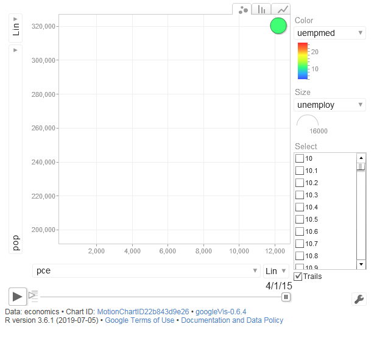

# R

## 크롤링

### 스크래핑

#### 가격 비교를 위한 스크래핑

- rvest 패키지 : 웹 페이지에서 필요한 정보를 추출하는데 유용한 패키지
- selectr패키지, xml2 패키지가 의존 패키지이므로 함께 설치
- read_html(url) : 지정된 url에서 html 컨텐츠를 가져옵니다.
- jsonline 패키지 : json 파서/생성기가 웹용으로 최적화되어 있는 패키지
  


##### 제목, 가격정보 가져오기

```R
install.packages("jsonlite")
libary(jsonlite)
libary(xml2)
libary(rvest)
libary(stringr)

url <- 'https://www.amazon.in/OnePlus-Mirror-Black-64GB-Memory/dp/B0756Z43QS?tag=googinhydr18418-21&tag=googinkenshoo-21&ascsubtag=aee9a916-6acd-4409-92ca-3bdbeb549f80'

#제목 정보의 태그 가져오기
webpage <- read_html(url)
title_html <- html_nodes(webpage, 'h1#title')
title <- html_text(title_html)
head(title)

#모든 공백과 줄 바꿈 제거
str_replace_all(title, "[\r\n]", "")


#가격정보 태그 가져오기
price_html <- html_nodes(webpage, 'span#priceblock_ourprice')
price <- html_text(price_html)
#모든 공백과 줄 바꿈 제거
price <- str_replace_all(price, "[\r\n]", "")
head(price)


```


##### 상세정보 불러오기

```R

```


##### 등급 정보 태그 가져오기

```R
> rate_html <- html_nodes(webpage, 'span#acrPopover')
> rate <- html_text(rate_html)
> rate <- str_replace_all(rate, "[\r\n]", "")
> rate <- str_trim(rate)
> head(rate)
[1] "4.6 out of 5 stars"

```


##### 크기 정보 가져오기

```R

> size_html <- html_nodes(webpage, 'div#variation_size_name')
> size_html <- html_nodes(size_html, 'span.selection')
> size <- html_text(size_html)
> size <-str_trim(size)
> head(size)
[1] "64 GB"
```


##### 색상 정보 가져오기

```R
> color_html <- html_nodes(webpage, 'div#variation_color_name')
> color_html<- html_nodes(color_html, 'span.selection')
> color <- html_text(color_html)
> color <-str_trim(color)
> head(color)
[1] "black"
```


#### data.frame객체로 생성


```R

```


## 데이터

### 데이터 샘플 추출하기

```R
> library(dplyr)
> sample_n(mtcars, 10)
    mpg cyl  disp  hp drat    wt  qsec vs am gear
1  30.4   4  75.7  52 4.93 1.615 18.52  1  1    4
2  17.8   6 167.6 123 3.92 3.440 18.90  1  0    4
3  10.4   8 472.0 205 2.93 5.250 17.98  0  0    3
4  21.5   4 120.1  97 3.70 2.465 20.01  1  0    3
5  19.7   6 145.0 175 3.62 2.770 15.50  0  1    5
6  15.0   8 301.0 335 3.54 3.570 14.60  0  1    5
7  21.4   6 258.0 110 3.08 3.215 19.44  1  0    3
8  15.5   8 318.0 150 2.76 3.520 16.87  0  0    3
9  14.7   8 440.0 230 3.23 5.345 17.42  0  0    3
10 15.2   8 275.8 180 3.07 3.780 18.00  0  0    3
   carb
1     2
2     4
3     4
4     1
5     6
6     8
7     1
8     2
9     4
10    3
```


## googleVis

### 움직이는 차트 생성하기

```R
> library(googleVis)
> library(ggplot2)
> motion <- gvisMotionChart(economics, idvar = "psavert", timevar = "date")
> plot(motion)
```





