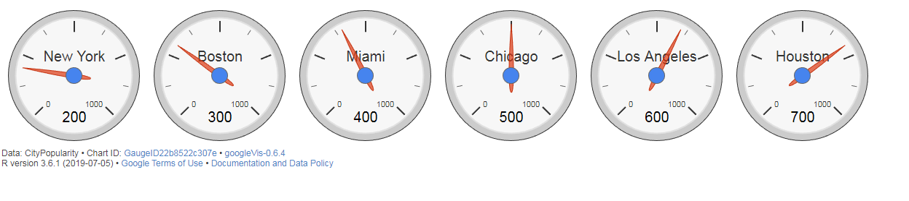
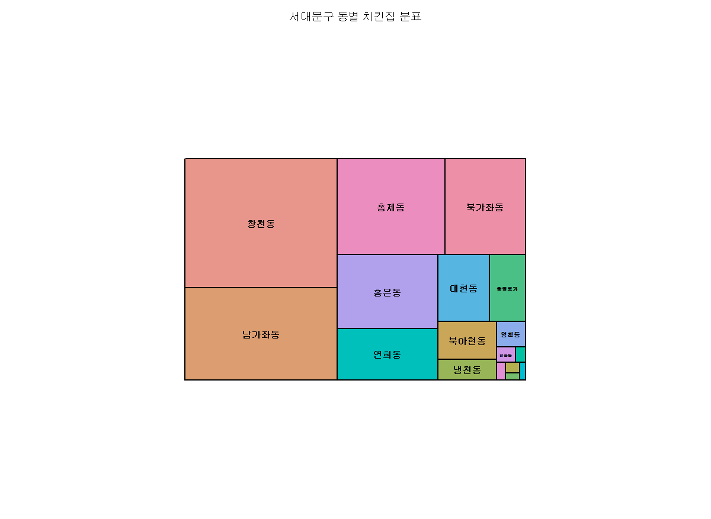
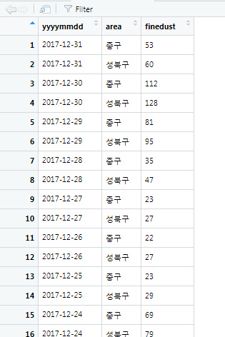
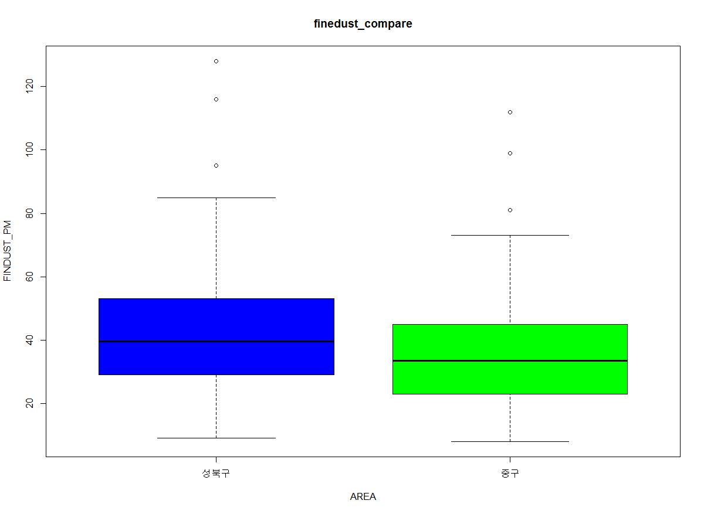

# R

## 크롤링

### 스크래핑

#### 가격 비교를 위한 스크래핑

- rvest 패키지 : 웹 페이지에서 필요한 정보를 추출하는데 유용한 패키지
- selectr패키지, xml2 패키지가 의존 패키지이므로 함께 설치
- read_html(url) : 지정된 url에서 html 컨텐츠를 가져옵니다.
- jsonline 패키지 : json 파서/생성기가 웹용으로 최적화되어 있는 패키지
  


##### 제목, 가격정보 가져오기

```R
install.packages("jsonlite")
libary(jsonlite)
libary(xml2)
libary(rvest)
libary(stringr)

url <- 'https://www.amazon.in/OnePlus-Mirror-Black-64GB-Memory/dp/B0756Z43QS?tag=googinhydr18418-21&tag=googinkenshoo-21&ascsubtag=aee9a916-6acd-4409-92ca-3bdbeb549f80'

#제목 정보의 태그 가져오기
webpage <- read_html(url)
title_html <- html_nodes(webpage, 'h1#title')
title <- html_text(title_html)
head(title)

#모든 공백과 줄 바꿈 제거
str_replace_all(title, "[\r\n]", "")


#가격정보 태그 가져오기
price_html <- html_nodes(webpage, 'span#priceblock_ourprice')
price <- html_text(price_html)
#모든 공백과 줄 바꿈 제거
price <- str_replace_all(price, "[\r\n]", "")
head(price)


```


##### 상세정보 불러오기

```R

```


##### 등급 정보 태그 가져오기

```R
> rate_html <- html_nodes(webpage, 'span#acrPopover')
> rate <- html_text(rate_html)
> rate <- str_replace_all(rate, "[\r\n]", "")
> rate <- str_trim(rate)
> head(rate)
[1] "4.6 out of 5 stars"

```


##### 크기 정보 가져오기

```R

> size_html <- html_nodes(webpage, 'div#variation_size_name')
> size_html <- html_nodes(size_html, 'span.selection')
> size <- html_text(size_html)
> size <-str_trim(size)
> head(size)
[1] "64 GB"
```


##### 색상 정보 가져오기

```R
> color_html <- html_nodes(webpage, 'div#variation_color_name')
> color_html<- html_nodes(color_html, 'span.selection')
> color <- html_text(color_html)
> color <-str_trim(color)
> head(color)
[1] "black"
```


#### data.frame객체로 생성


```R

```


## 데이터

### 데이터 샘플 추출하기

```R
> library(dplyr)
> sample_n(mtcars, 10)
    mpg cyl  disp  hp drat    wt  qsec vs am gear
1  30.4   4  75.7  52 4.93 1.615 18.52  1  1    4
2  17.8   6 167.6 123 3.92 3.440 18.90  1  0    4
3  10.4   8 472.0 205 2.93 5.250 17.98  0  0    3
4  21.5   4 120.1  97 3.70 2.465 20.01  1  0    3
5  19.7   6 145.0 175 3.62 2.770 15.50  0  1    5
6  15.0   8 301.0 335 3.54 3.570 14.60  0  1    5
7  21.4   6 258.0 110 3.08 3.215 19.44  1  0    3
8  15.5   8 318.0 150 2.76 3.520 16.87  0  0    3
9  14.7   8 440.0 230 3.23 5.345 17.42  0  0    3
10 15.2   8 275.8 180 3.07 3.780 18.00  0  0    3
   carb
1     2
2     4
3     4
4     1
5     6
6     8
7     1
8     2
9     4
10    3
```


## googleVis

### 움직이는 차트 생성하기

```R
> library(googleVis)
> library(ggplot2)
> motion <- gvisMotionChart(economics, idvar = "psavert", timevar = "date")
> plot(motion)
```


### 게이지 차트 생성하기

```R
> gauge <- gvisGauge(CityPopularity, labelvar = "City", numvar = "Popularity", options = list(min = 0, max = 1000))
> plot(gauge)
```




## ggmap

```R
library(devtools)
install_github("dkahle/ggmap")
library(ggmap)

googleAPIkey = ""

gg_seoul <- get_googlemap("seoul", maptype = "terrain")

ggmap(gg_seoul)
```


## 데이터 가공  및 트리 맵 표현


### 서울에 있는 치킨집 찾기

#### 소재지 주소 가공하기

```R
> library("readxl")
> ck <- read_excel(file.choose())
> head(ck)
# A tibble: 6 x 2
  소재지전체주소                        사업장명      
  <chr>                                 <chr>         
1 서울특별시 서대문구 창천동 52-20번지 2층~ 쪼리375       
2 서울특별시 서대문구 창천동 53-83번지 (지상1층)~ 고향          
3 서울특별시 서대문구 창천동 53-3번지 2층~ 찬수씨, 싼술을부탁해~
4 서울특별시 서대문구 남가좌동 377번지 삼성아파트 상가동 101호~ 케리홈치킨    
5 서울특별시 서대문구 연희동 134-28번지 지하1층~ 연희38애비뉴  
6 서울특별시 서대문구 창천동 62-53번지 1층 일부~ 닭꼬치야    


> #소재지전체주소 열에서 11번째 글자부터 16번째 앞까지 추출
> addr <- substr(ck$소재지전체주소, 11, 16)
> head(addr) # addr 확인
[1] " 창천동 5"  " 창천동 5"  " 창천동 5" 
[4] " 남가좌동 " " 연희동 1"  " 창천동 6"


> addr_num <- gsub("[0-9]", "", addr) #숫자 제거
> addr_trim <- gsub(" ", "", addr_num) #공백 제거
> head(addr_trim)
[1] "창천동"   "창천동"   "창천동"   "남가좌동"
[5] "연희동"   "창천동"  

```


#### 동별 업소 개수 확인하기


```R
> library(dplyr)
> #도수분포표 작성 후 데이터 프레임으로 변환
> addr_count <- addr_trim %>% table() %>% data.frame()
> head(addr_count)
         . Freq
1 남가좌동  282
2   냉천동   24
3   대신동    3
4   대현동   69
5   미근동    6
6 북가좌동  155
```


#### 트리 맵으로 표현

```R
> library(treemap)
> treemap(addr_count, index = ".", vSize = "Freq", title = "서대문구 동별 치킨집 분표")
```




#### 내림차순으로 데이터 확인

```R
> library(treemap)
> treemap(addr_count, index = ".", vSize = "Freq", title = "서대문구 동별 치킨집 분표")
> arrange(addr_count, desc(Freq)) %>% head()
         . Freq
1   창천동  395
2 남가좌동  282
3   홍제동  209
4 북가좌동  155
5   홍은동  150
6   연희동  104
```


## 상자그림으로 시각화 및 t검정


### 데이터 추출

```R
> library(readxl)
> dustdata <- read_excel(file.choose())
> View(dustdata)
> str(dustdata)
Classes ‘tbl_df’, ‘tbl’ and 'data.frame':	3173 obs. of  3 variables:
 $ yyyymmdd: chr  "전체" "2017-12-31" "2017-12-31" "2017-12-31" ...
 $ area    : chr  "평균" "평균" "종로구" "중구" ...
 $ finedust: num  38 63 54 53 60 62 63 69 67 60 ...
```


### 비교할 지역 데이터만 추출

```R
> library(dplyr)
> dustdata_anal <- dustdata %>% filter(area %in% c("성북구", "중구"))
> View(dustdata_anal)
```




### 데이터 현황 파악하기

```R
> #dustdata_anal 데이터 세트에 yyyymmdd에 따른 데이터 수 파악
> count(dustdata_anal, yyyymmdd) %>% arrange(desc(n))
# A tibble: 122 x 2
   yyyymmdd       n
   <chr>      <int>
 1 2017-09-01     2
 2 2017-09-02     2
 3 2017-09-03     2
 4 2017-09-04     2
 5 2017-09-05     2
 6 2017-09-06     2
 7 2017-09-07     2
 8 2017-09-08     2
 9 2017-09-09     2
10 2017-09-10     2
# ... with 112 more rows
> #dustdata_anal 데이터 세트에 area 따른 데이터 수 파악
> count(dustdata_anal, area) %>% arrange(desc(n))
# A tibble: 2 x 2
  area       n
  <chr>  <int>
1 성북구   122
2 중구     122

> #area 값이 성북구인 데이터 dust_anal_area_sb에 할당
> dustdata_anal_sb <- subset(dustdata_anal, area == "성북구")
> #area 값이 중구인 데이터 dust_anal_area_jg에 할당
> dustdata_anal_jg <- subset(dustdata_anal, area == "중구")
> dustdata_anal_sb
# A tibble: 122 x 3
   yyyymmdd   area   finedust
   <chr>      <chr>     <dbl>
 1 2017-12-31 성북구       60
 2 2017-12-30 성북구      128
 3 2017-12-29 성북구       95
 4 2017-12-28 성북구       47
 5 2017-12-27 성북구       27
 6 2017-12-26 성북구       27
 7 2017-12-25 성북구       29
 8 2017-12-24 성북구       79
 9 2017-12-23 성북구      116
10 2017-12-22 성북구       63
# ... with 112 more rows
> dustdata_anal_jg
# A tibble: 122 x 3
   yyyymmdd   area  finedust
   <chr>      <chr>    <dbl>
 1 2017-12-31 중구        53
 2 2017-12-30 중구       112
 3 2017-12-29 중구        81
 4 2017-12-28 중구        35
 5 2017-12-27 중구        23
 6 2017-12-26 중구        22
 7 2017-12-25 중구        23
 8 2017-12-24 중구        69
 9 2017-12-23 중구        99
10 2017-12-22 중구        55
# ... with 112 more rows

> #성북구의 미세먼지량에 대한 기초 통계량 도출
> describe(dustdata_anal_sb$finedust)
   vars   n  mean    sd median trimmed   mad min max
X1    1 122 42.75 20.14   39.5   40.34 17.05   9 128
   range skew kurtosis   se
X1   119 1.41     2.93 1.82
> #중구의 미세먼지량에 대한 기초 통계량 도출
> describe(dustdata_anal_jg$finedust)
   vars   n  mean    sd median trimmed   mad min max
X1    1 122 35.91 17.44   33.5   34.12 15.57   8 112
   range skew kurtosis   se
X1   104 1.33     2.88 1.58
```


### 분포 확인 및 가설 검정

```R
> boxplot(dustdata_anal_sb$finedust, dustdata_anal_jg$finedust,
+         main = "finedust_compare", xlab = "AREA", names = c("성북구", "중구"),
+         ylab = "FINDUST_PM", col = c("blue", "green"))

```




### t-검정

```R
> t.test(data = dustdata_anal, finedust ~ area, var.equal = T)

	Two Sample t-test

data:  finedust by area
t = 2.8347, df = 242, p-value = 0.004975
alternative hypothesis: true difference in means is not equal to 0
95 percent confidence interval:
  2.085657 11.586474
sample estimates:
mean in group 성북구   mean in group 중구 
            42.74590             35.90984 
```


## 트위터 크롤링

