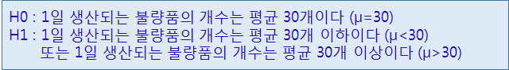
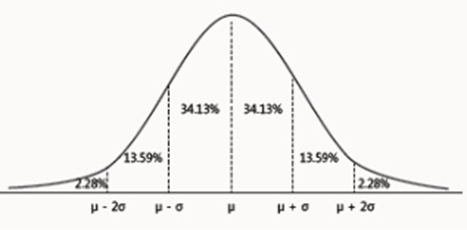

# R

## Sql

### Fruits데이터로 sqldf


#### 전체 데이터 불러오기

```R
> sqldf('select * from Fruits')
    Fruit Year Location Sales Expenses Profit
1  Apples 2008     West    98       78     20
2  Apples 2009     West   111       79     32
3  Apples 2010     West    89       76     13
4 Oranges 2008     East    96       81     15
5 Bananas 2008     East    85       76      9
6 Oranges 2009     East    93       80     13
7 Bananas 2009     East    94       78     16
8 Oranges 2010     East    98       91      7
9 Bananas 2010     East    81       71     10
        Date
1 2008-12-31
2 2009-12-31
3 2010-12-31
4 2008-12-31
5 2008-12-31
6 2009-12-31
7 2009-12-31
8 2010-12-31
9 2010-12-31

```


#### Apple 데이터 행만 추출

```R
> sqldf("select * from Fruits where Fruit = 'Apples'")
   Fruit Year Location Sales Expenses Profit
1 Apples 2008     West    98       78     20
2 Apples 2009     West   111       79     32
3 Apples 2010     West    89       76     13
        Date
1 2008-12-31
2 2009-12-31
3 2010-12-31
```


#### 처음부터 3개의 행만 추출

```R
> sqldf('select * from Fruits limit 3')
   Fruit Year Location Sales Expenses Profit
1 Apples 2008     West    98       78     20
2 Apples 2009     West   111       79     32
3 Apples 2010     West    89       76     13
        Date
1 2008-12-31
2 2009-12-31
3 2010-12-31
```


#### Sales 컬럼변수값으로 내림차순 정렬

```R
> sqldf('select * from Fruits order by Sales desc')
    Fruit Year Location Sales Expenses Profit
1  Apples 2009     West   111       79     32
2  Apples 2008     West    98       78     20
3 Oranges 2010     East    98       91      7
4 Oranges 2008     East    96       81     15
5 Bananas 2009     East    94       78     16
6 Oranges 2009     East    93       80     13
7  Apples 2010     West    89       76     13
8 Bananas 2008     East    85       76      9
9 Bananas 2010     East    81       71     10
        Date
1 2009-12-31
2 2008-12-31
3 2010-12-31
4 2008-12-31
5 2009-12-31
6 2009-12-31
7 2010-12-31
8 2008-12-31
9 2010-12-31
```


#### Sales 컬럼의 누적합, 최솟값, 최댓값, 평균

```R
> sqldf('select sum(Sales), min(Sales), max(Sales), avg(Sales) from Fruits')
  sum(Sales) min(Sales) max(Sales) avg(Sales)
1        845         81        111   93.88889
```


#### Fruit 과일 종류별  Sales 컬럼의 누적합, 최소값, 최대값, 평균, 행개수

```R
> sqldf('select sum(Sales), min(Sales), max(Sales), avg(Sales) 
+ from Fruits  group by Fruit' ) 
  sum(Sales) min(Sales) max(Sales) avg(Sales)
1        298         89        111   99.33333
2        260         81         94   86.66667
3        287         93         98   95.66667
```


### 자동차 배기량 데이터로 sqldf


#### 데이터 불러오기

```R
library(ggplot2)

mpg <- as.data.frame(ggplot2::mpg)
mpg

#displ 배기량
#manufaturer 제조사
#cty 도시연비
#hwy 고속도로 연비
#class 차종
```


#### 회사별로 분리, suv 추출, 통합 연비(도시연비, 고속도로 연비) 변수 생성,  통합 연비 평균 산출, 내림차순 정렬, 1~5위까지 출력

```R
> result <-sqldf( "select class, (cty+hwy)/2 as tot , avg((cty+hwy)/2) mean_tot
+                 from mpg
+                 where class='suv'
+                 group by manufacturer 
+                 order by 3 desc") 
> head(result, 5) 
  class tot mean_tot
1   suv  21 21.66667
2   suv  17 16.12500
3   suv  15 15.75000
4   suv  15 15.50000
5   suv  14 15.22222
```


#### 어떤 회사에서 "compact"(경차) 차종을 가장 많이 생산하는지 알아보려고 합니다.  각 회사별로 "compact" 차종을 내림차순으로 정렬해 출력하세요

```R
> sqldf("select class, count(*)
+  from mpg
+  where class='compact'
+  group by manufacturer
+  order by 2")
    class count(*)
1 compact        2
2 compact        4
3 compact       12
4 compact       14
5 compact       15
```


## 기초 통계

- 데이터에 대한 통계적 자료분석에 앞서 데이터의 대략적인 통계적 수치를 계산해 봄으로써 데이터에 대한 대략적인 이해와 앞으로 진행될 분석에 대한 insight 얻기 위한 분석방법이다.


### 변수

- 수집된 자료에서 관심의 대상이 되는 특성이나 관측된 결과로서 주어지는 특성


#### 변수의  유형

- 질적변수(Qualitative Variable) 또는 범주형 변수(Categorial Variable)

  특성을 범주로 구분해서 나타내는 변수

  예> 성별구분(남자:1 , 여자 :2) ,  소득수준 (상, 중, 하)

- 양적변수(Quantative Variable) – 연속형 변수(continuous Variable), 이산형 변수(Discrete Variable)

  양적변수 :  관심대상이 되는 특성을 수치로 나타내는 변수

  예> 몸무게, 키, 환자의 나이

- 독립변수 : 다른 변수에 영향을 주는 변수 (원인변수, 설명변수, 예측변수)

- 종속변수 : 다른 변수에 영향을 받는 변수 (결과변수, 피설명변수, 피예측변수)

- 예> '흡연은 폐암을 유발한다'에서  흡연은 독립변수, 폐암은 종속변수

  

#### 척도


## 빅데이터

- 기존 데이터 규모에서 불가능했던 데이터 집합체를 대상으로 다양한 분석기법을 적용하여 새로운 통찰이나 새로운 가치를 발견하고 예측하는 일련의 과정
- 기존의 사실에 대한 객관적인 근거를 제시하고, 다변화된 현대 사회를 정확하게 예측 및 대응하며, 정치, 사회, 경제, 문화, 과학, 기술 등 전 영역에 거쳐서 인류에게 가치 있는 정보를 제공한다

### 분석 절차

1. 가설 설정

2. 유의 수준 결정

3. 측정도구 선정

4. 데이터 수집(설문지, 웹, SNS)

5. 데이터 코딩/프로그래밍

6. 통계분석 수행(R, SPSS, SAS)

7. 결과 분석(논문/보고서 작성)


### 연구조사

1. 연구문제 선정 단계 - 연구의 독창성, 검증 가능성, 결과의 실용성, 구체성, 경제성(소모비용, 노력)을 고려해야 한다
2.  예비조사 단계 – 연구 문제에 대한 사전지식을 수집하고, 중요 변수를 규명하며, 가설을 도출하기 위한 과정으로 문헌 조사나 전문가조사, 사례 조사방법 등이 있다 (사전조사는 측정도구(설문지))를 작성한뒤에 실시한다.
3. 연구 모형 설계 단계 – 변수와 개념을 식별하여 영향을 미치는 변수와 영향을 받은 변수를 식별하고, 이들 변수 간의 관계를 설계하는 과정 


### 가설

- 실증적인 증명에 앞서 세우는 잠정적인 진술
- 나중에 논리적으로 검증될 수 있는 명제
- 통계 분석을 통해서 채택 또는 기각될 수 있다


### 가설유형

#### 귀무가설(영가설) 

‘두 변수 간의 관계가 없다‘ 또는 ‘차이가 없다＇라는 부정적 형태로 진술하는 기설로 ‘H0’으로 표시한다. (예: 교육수준이 높은 집단과 낮은 집단 간에는 국가 정책에 대한 비판적 태도에서 차이가 없다)

#### 연구가설(대립가설) 

검정할 가설의 내용에는 ‘차이가 있다’ 또는 ‘효과가 있다＇라고 진술하는 가설 ‘H1’로 표시한다. 연구가설은 검정하고자 하는 현상에 관한 예측이며 대립가설 혹은 대체가설이라고 한다. (예: 신약A는 A암 치료에 효과가 있다)


```
연구자들은 귀무가설을 내세워서 자신이 내세운 귀무가설이 틀렸음을 통계적인 분석 과정을 통해서 입증함으로써 귀무가설과 대립관계에 있는 연구가설을 채택하고 궁극적으로 연구가설이 사실임을 주장하고자 한다.
귀무가설이 거짓임을 입증하기가 훨씬 쉽기 때문이다.
```


### 가설의 요건

- 검증성 : 이론적으로 검증 가능해야 한다
- 한정성 :  한정적, 특정적이어야 한다.
- 측성화 : 변수 관계를 경험적 사실에 근거하여 측정 가능해야 한다.
- 계량화 : 계량적 형태를 취하거나 계량화할 수 있어야 한다.
- 명백성 : 가설의 표현은 간단. 명료해야 한다.
- 입증성 : 명백하게 입증할 수 있어야 한다.
- 연관성 : 동일 연구 분야, 다른 가설이나 이론과 연관이 있어야 한다.


### 유의수준 결정


- 연구가설의 채택 또는 기각은 유의수준(Significant level)을 기준으로 하여 가설 채택 여부가 결정된다.
- 분석 결과가 유의수준 내에 들어가면 가설은 채택되고, 그렇지 않으면 기각된다.
- 유의수준은  α 또는 P(probability : 확률)로 표시한다.
- 사회과학 분야에서는  α=0.05 또는 p<0.05를 기준으로 한다. (오차가 5%이며, 표본통계치가 신뢰도가 95%라는 것을 의미한다.)
- 일반적으로 유의수준은 0.1, 0.05, 0.01 등의 값을 적용하고 있다.
- 생명을 다루는 분야는 오차범위를 최소화하기 위해 α=0.01 또는 p<0.01을 기준으로 99% 신뢰도를 확보하고 1% 오차만 인정하는 임계치를 정하기도 한다. 


### 유의확률(p)


- 귀무가설을 기각할 수 있는 최소의 유의수준을 의미한다.
- 유의확률이 유의수준보다 작은 경우 (p< α) 귀무가설을 기각한다.
- 유의확률이 유의수준보다 큰 경우 (p > α) 귀무가설을 채택한다.
- 유의확률이 유의수준보다 작다는 것은 관측치가 귀무가설 기각역에 있다는 것을 의미한다.


### 객체

연구 대상의 단위로 여러 개의 속성으로 구성된다.


### 속성(Attribute)

변수 또는 변인


### 변수의 유형

- 독립변수(Independent variable) : 종속변수에 영향을 주는 변수(설명변수)
- 종속변수(dependent variable) : 독립변수의 영향을 받아 변화될 것으로 예측되는 변수(반응변수)
- 매개변수(Intervening) : 두 변수를 중간에서 연결해주는 변수
- 조절변수(Control variable) :  독립변수와 종속변수 사이의 관계 강도를 조절해주는 변수
- 외생변수(Extraneous) : 독립변수가 아니면서 종속변수에 영향을 미치는 변수


### 척도

- 연구 대상을 측정하기 위한 측정도구
- 응답다가 변인의 값을 선택할 수 있도록 일련의 기호 또는 숫자로 나타내어 변수를 측정하게 하는 단위
- 측정수준
- 측정 : 추상적인 개념이나 변수를 일정한 규칙에 따라 수치를 부여하여 구체적인 지표로 나타내는 것


### 척도 구성의 기본 원칙

- 분류된 범주는 다른 범주와의 관계에서 상호배타적이어야 한다.
- 응답범주들이 응답 가능한 모든 상황을 포함해야 한다.
- 응답 범주들이 논리적인 일관성을 가지고 있어야 한다.
- 여러 개의 문항 간에는 상호 내적 일관성을 가져야 한다


### 척도(Scale)의 분류


- 명목척도(Nominal scale) : 단순히 속성을 분류할 목적으로 명목상 숫자를 부여한 척도로 연산은 불가능한 변수이다. (연산은 가능하지만 의미가 없다)
  **예) 성별(1=남자, 2=여자), 연령별, 학력, 종료, 취미등**

  

- 서열척도(Ordinal scale) : 측정 대상 간의 크고 적음, 양의 많고 적음, 선호도의 높고 낮음 등과 같이 순서 관계를 밝혀주는 척도로 연산은 불가능한 변수

  

- 등간척도(Interval scale) : 측정 대상의 속성에 대한 각 수준 간의 간격이 동일한 척도로 간격이 일정하여 덧셈과 뺄셈 연산이 가능한 변수이다. 또한 절대 원점(0)을 가지고 있지 않기 때문에 0이 아묵서도 없는 것을 의미하지 않기 때문에 몇 배라고 이야기할 수 없는 척도이다.
  측정도구 작성에 가장 많이 이용되는 척도이다.
  **예) 시각(년도, 시각, 월), 섭씨온도, 화씨온도**

  

- 비율척도(Ratio) : 척도의 수가 등간이며, 절대 원점(0)을 가지고 있는 척도를 말한다. 즉 속성이 0을 기준으로 한 수치로 되어있기 때문에 사칙연산이 모두 가능한 변수로 등간척도와 함께 많이 이용되는 척도이다.
  **예) 성적, 키, 무게, 인구수, 수량, 길이 금액등**

  


### 정성적-질적 척도(범주형 변수)와 정량적-양적 척도(연속형 변수) 분류


### 데이터 수집

- 선정된 측정 도구를 이용하여 설문 문항을 작성하고, 오프라인과 온라인(웹, SNS)을 통해서 데이터를 수집하는 단계 


### 데이터 코딩

- 데이터의 수집을 통해서 획득한 데이터를 통계 분석 프로그램(R, Python, SPSS, SAS, Excel)을 이용하여 데이터를 입력(코딩)하는 단계
- 사용자의 응답 결과를 숫자나 기호 등을 이용하여 데이터를 입력하는 과정


#### 코딩시 주의사항

- 응답이 부실한 설문자와 무성의하게 응답한 설문지를 선별하여 제거한다. 
- 설문지 앞면에 일련번호를 순서대로 기입하여 데이터 입력 손실을 막는다.
- 가능하면 모든 항목을 숫자로 입력해야 분석이 용이하다
- ‘무응답＇과 같은 결측치(Missing Values) 항목에 대해서는 분석 도구에 맞게 NA(R), NAN(Python), 999(SPSS, SAS)등을 부호화한다.
- 숫자나 문자를 직접 입력하는 자유 형식은 입력될 수 있는 가장 큰 값을 고려하여 폭(Width)를 배정한다.
- 개방형보다 폐쇄형(고정형식)으로 코딩하는 것이 바람직하다.(예: 거주지를 기입하는 방식보다 선택항목중 하나를 선택하도록 한다)


### 통계 분석 방법과 변수 척도 관계


### 분석 결과 제시

연구 목적과 연구가설에 대한 검증을 중심으로 분석하는 단계이다. 단순한 통계 결과 제시보다는 인구 통계학적 특성을 시작으로 결과의 의미를 해석하고, 연구자의 개인적인 의견을 기술하여 분석 결과를 제시한다.

- [단계 1] 연구목적과 연구가설에 대한 분석 및 검증 단계
- [단계 2] 인구통계학적 특성 변수 제시 단계
- [단계 3] 주요 변인에 대한 기술 통계량 제시 단계
- [단계 4] 연구가설에 대한 통계량 검정 및 해석 단계
- [단계 5] 연구자 의견 기술 및 논문/보고서 마무리 단계 


## 통계학(Statistics)

논리적사고와 객관적인 사실에 따르며, 일반적이고 확률적 결정론에 따라서 인과관계를 규명한다.

### 이용 분야에 따른 통계학의 구분 


### 전수조사

- 모집단 내에 있는 모든 대상을 조사하는 방법
- 예) 전 국민을 대상으로 한 인구조사
- 정체를 대상으로 실시하기 때문에 모집단의 특성을 정확히 반영할 수 있다
- 시간과 비용이 많이 소요되는 단점


### 표본조사

- 모집단으로부터 추출된 표본을 대상으로 분석을 실시하기 때문에 전수 조사의 단점을 보완할 수 있다

- 모집단의 특성을 반영하는 표본이 추출되지 못하는 경우 수집된 자료가 무용지물이 될 수 있다

  **예) 선거 여론조사, 마케팅조사, 산업현창의안전성 검사, 의.생명 분야 임상 실험**

### 모집단(Population)

통계적 관찰 대상이 되는 개체의 전체집합


### 표본

모집단에서 조사대상으로 추출된 부분집합


### 모수와통계량 표기 방법 


### 통계적 추정

모집단의 특성을 파악하기 위해서 모집단의 특성을 대표하는 표본을 추출하고, 이러한 표본을 이용하여 모집단의 특성을 나타내는 각종 모두(모평균, 모분산 등)를 예측하는 방법

#### 통계적 추정 방법 


#### 구간추정 주요 용어

- 신뢰수준(Confidence Level) : 계산된 구간이 모두를 포함할 확률을 의미하며, 통상 90%, 95%, 99%등으로 표현한다
- 신뢰구간(Confidence Interval) : 신뢰수준하에서 모두를 구간으로 (하한값, 상한값)의 형식으로 표현한다.
- 표본오차(Sampling Error) : 모집단에서 추출한 표본이 모집단의 특성과 정확히 일치하지 않아서 발생하는 확률의 차이를 의미한다.


#### 표본 오차

- 표본 오차를 줄이기 위해서는 정확한 표본추출 과정을 통해서 가능한 한 모집단의 가치를 최대한 반영해야 한다.
- 표본의 수를 최대한 늘리는 방법도 고려해 볼 수 있다.
- 표본오차와 표본 크기는 일반적으로 반비례 관계를 갖는다.


#### 기각역 (Critical region)

- 귀무가설이 타당하면 귀무가설을 채택(Accept)하고, 연구가설이 타당하면 귀무가설을 기각(Reject)하게 된다.
- 기각되는 범위
- 확률분포에서 귀무가설을 기각하는 영역
- 기각역에 검정통계량이 위치하면 귀무가설을 기각한다.
- 양측검정인 경우 기각역은 유의수준 / 2 이고, 단측검정인 경우 기각역은 유의수준과 같다.


#### 신뢰구간

신뢰수준에 포함되는 x값 구간을 말한다.


#### 임계값(Critical value) 

- 귀무가설을 채택하거나 기각하는 기준
- 신뢰구간에서 기각역으로 넘어가는 기준이 되는 x값을 말한다.


#### 채택역(Acceptance region)

- 임계값을 기준으로 채택되는 범위


#### 양측검정(Sig.(2-sided))

- 귀무가설을 기각하는 영역이 양쪽에 있는 검정을 말한다.

- 대립가설이 000가 아니다(크거나 작다) 라면 양측검정을 사용한다

  **예) ‘성별에 따라 만족도에 차이가 없다’와 같은 형식으로 방향성이 없는 경우 적용하는 검정방법**


#### 단측검정(Sig.(1-sided))

- 귀무가설을 기각하는 영역이 한쪽 끝에 있는 검정을 말한다.
- 대립가설이 000 보다 작다 또는 크다 인 경우 단측검정을 사용한다. 
- 어느 한쪽이 많거나 적은 가설인 경우헤 해당한다




#### 좌측검정

- 단측검정 중 하나로, 귀무가설을 기각하는 영역이 왼쪽에 있는 검정을 말한다.

- 대립가설이 000 보다 작다 인 경우 좌측검정을 사용한다.


#### 우측검정

- 단측검정 중 하나로, 귀무가설을 기각하는 영역이 오른쪽에 있는 검정을 말한다.
- 대립가설이 000 보다 크다 인 경우 우측검정을 사용한다.


#### 가설 검정 오류

- 제1종 오류 – 귀무가설이 참인데도 불구하고 귀무가설을 기각하는 오류
- 제2종 오류 – 귀무가설이 거짓인데도 불구하고 귀무가설을 채택하는 오류


- 제1종 오류를 범할 확률은 α 로 표현하고 , 제2종 오류를 범할 확률은 β로 표현
- 제1종 오류를 범할 확률 α는 유의수준(Significant level)
- 제2종 오류를 범하지 않을 확률 1- β는 검정력(Power of the test)
- 귀무가설의 채택역을 크게 하면 제1종 오류는 적어지나 제2종 오류는 커지고, 귀무가설의 채택역을 작게 하면 제2종 오류는 적어지나 제1종 오류가 커진다.


#### 검정력(Power of the test)

- 대립가설이 맞을 때 귀무가설을 기각할 확률

#### 검정 통계랑(Test statistic)

- 가설을 검정하기 위해 수집된 데이터로부터 계산된 통계량
- 가설 검정에서 기각역을 결정하는 기준이 되는 통계량
- 검정 통계량은 유의수준 α의 값과 비교하여 귀무가설 기각 혹은 채택 여부를 결정하게 된다.
- 검정 통계량은 분석 방법에 따라서 달라지는데 상관분석은 r 값, 회귀분석은 t값, T검정은 t값, 분산분석은 F값, 카이제곱은 X2  값 등으로 나타난다. 


#### 정규분포(Normal Distribution)


- 도수분포곡선이 평균값을 중앙으로 하여 좌우대칭인 종 모양(Bell-shape)
- 가우스분포, 가우스곡선
- 정규분포는 평균과 표준편차에 의해서 그래프의 모양과 위치가 결정된다.
- 데이터의 분포가 평균을 중심으로 많은 데이터가  모여 있는 특성을 보인다.
- ‘중심 극한의 정리’에 의해서 데이터의 수가 많아질수록 정규분포를 따른다고 할 수 있다
  - 중심극한정리(The Central Limit Theorem) 표본의 크기가 커질수록 근사적으로 표본의 평균이 모평균과 같고, 분산이 모분산과 같은 정규분포를 취한다는 이론  (일반적으로 n≥30 인 경우)
- 정규성을 전제로 하는 분석기법을 적용하기 위해서는 정규성 검증을 수행해야 한다.
- 정규분포의 확률을 구하기 위해서 평균을 0, 표준편차를 1로 고정하여 표준화한 결과를 표준정규분포하고 한다


#### 모수(Parametric)와 비모수 검정

- 모두(Parametric) 검정은 관측값이 어느 특정한 확률분포(정규분포, 이항분포)를 따른다고 전제한 후 그 분포의 모수에 대한 검정을 실시하는 방법
- 비모수(Non-Parametric) 검정은 그 관측값이 어느 특정한 확률분포를 따른다고 전제할 수 없는 경우에 실시하는 검정 방법
- 일반적으로 케이스의 수가 30개 이상이면 “중심극한정리(The Central Limit Theorem)”에 의해서 정규분포를 따른다고는 전제하에 모수 검정을 적용


#### 정규성 검정 방법

- 히스토그램과 Q-Q 플롯(Plot)을 이용한다


#### 정규성 검정에 따른 모수와 비모수 검정 


#### 표준 정규 분포

- 평균과 분산이 다른 정규분포를 표준화한 것
- 정규분포의 근간이 되는 평균과 표준편차를 0과 1로 고정하는 과정
- 정규분포의 확률(신뢰구간)을 구할 때 이용한다


#### 표준화 변수 Z

- 정규분포의 확률변수 X를 구하기 위해서 표준정규분포로 바꾸는 변수  


#### 표준정규분포 표

- 표준 정규분포에서 Z값에 해당하는 확률값을 나타내는 표

- 행은 Z값의 소수점 첫째 자리 이상을 나타내고, 열은 소수점 둘째 자리를 나타낸다. 


#### Z값과 확률 구간

- 확률변수 X값이 범위가 커질수록 확률값은 커지는 결과를 볼 수 있다.

- ```
  정규분포의 평균은 75점, 표준편차는 5점, 확률변수 X는 70점과 80점이 된다.
  
  Z = (70-75)/5 와 Z = (80-75)/5 
  
  Z값의 확률 구간은 P(-1<Z<1)이 된다.
  P(-1<Z<1) 인 경우 확률은 0.6826이 된다.
  
  평균이 75점, 표준편차가 5점일 때 어느 학생의 점수가 70~80점 사이일 확률은 약 68.3%가 된다
  
  어느 학생이 65~85점 사이의 확률은 P(Z = (65-75)/5 < Z < Z = (85-75)/5  = 95.4%가 된다
  
  어느 학생이 60~90점 사이의 확률은 P(Z = (60-75)/5 < Z < Z = (90-75)/5  = 99.7%가 된다
  
  ```


#### 평균과 표준편차에 의해서 산출된 Z값과 표준정규분포의 확률 

 


#### 신뢰수준과 Z값 


#### 표본 오차

- 표본오차는 표본에서 계산된 추측값과 모집단의 실제값과의 차이
- 허용 오차를 백분율로 나타낸 것 

 Z : 표준화 변수,  n : 표본수,  p : 확률


#### 왜도

- 왜도(Skewness) – 평균을 중심으로 한 확률분포의 비대칭 정도를 나타내는 지표
- 분포의 기울어진 방향과 정도를 나타내는 양
- 왜도의 값이 0보다 크면 분포의 오른쪽 방향으로 비대칭 꼬리가 치우치고, 왜도의 값이 0보다 작으면 왼쪽 방향으로 비대칭 꼬리가 치우친다.
- 음의 비대칭도 : 평균 < 중위수 < 최빈수 , 왜도 < 0
- 양의 비대칭도 : 평균> 중위수 > 최빈수 , 왜도 > 0
- 정규분포 : =  최빈수


#### 첨도

- 표준정규분포와 비교하여 얼마나 뾰족한지를 측정하는 지표
- 첨도가 0(또는 3)이면 정규분포 곡선을 이루고, 첨도가 0(또는 3)보다 작으면 정규분포보다 완만한 형태의 곡선을 그린다.
- 첨도가 -0.828인 통계량으로 나타나는 경우는 정규분포보다 
   낮고 완만한 곡선을 그린다


