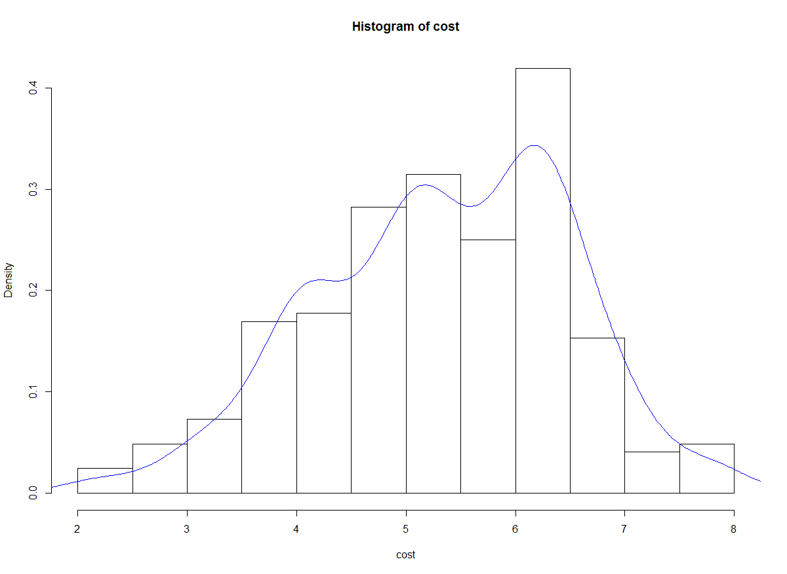

# R

## 기술통계 분석

### 연습문제

```
Q1> 다음 중 가설이 갖추어야 할 요건이 아닌 것은? 4
① 가설은 경험적으로 검증할 수 있어야 한다.
②가설은 계량적인 형태를 취하든가 계량화 할 수 있어야 한다.
③가설의 표현은 간단명료해야 한다.
④가설은 동일 분야의 다른 가설과 연관을 가져서는 안된다.

Q2> 다음 중 과학적 연구절차에 기초한 올바른 이론 구축 과정은? 1
① 연구문제 - 개념화 - 가설검정 - 자료수집- 자료분석
② 개념화-연구문제-가설검정- 자료수집- 자료분석
③ 연구문제 -가설검정 -개념화 - 자료수집- 자료분석
④ 개념화 -가설검정 -연구문제 -자료수집- 자료분석

Q3> 가설 검정에 관한 설명으로 옳은 것은?  1
① 검정 통계량은 확률변수이다.
② 대립가설은 사전에 알고 있는 값이다.
③ 유의수준 α를 작게 할수록 좋은 검정법이다.
④ 가설이 틀렸을 때 틀렸다고 판정할 확률을 유의수준이라 한다. 

Q4> '남녀 월급액수에는 차이가 있다'라는 주장을 검증하기 위하여 사회조사를 시행하였다.
조사결과 남자집단의 평균액수는 μ1, 여자집단의 μ2라고 한다면, 귀무가설은? 2
①  μ1 > μ2
②  μ1 = μ2
③  μ1 < μ2
④  μ1 ≠ μ2


Q5> 가설구성 시 고려할 사항이 아닌 것은? 4
① 경험적 검증이 가능하여야 한다.
② 다른 가설 및 이론과의 연관성을 가져야 한다.
③ 두 개 이상의 변수 간의 관계로 서술되어야 한다.
④ 한 가설에 독립변수나 종속변수 수가 많아지도록 한다.

Q6> 가설의 특성이라고 할 수 없는 것은? 1 4
① 문제를 해결해 줄 수 있어야 한다. 
② 변수로 구성되며, 그들 간의 관계를 나타내고 있어야 한다.
③ 검증될 수 있어야 한다.
④ 매개변수가 있어야 한다.

Q7> 유의확률(p-value)의 설명이 틀린 것은? 2
①  검정 통계량이 실제 관측된 값보다 대립가설을 지지하는 방항으로 더욱 치우칠 확률로서 귀무가설 하에서 계산된 값이다
② 주어진 데이터와는 직접적으로 관계가 없다.
③ 유의확률이 낮을 수록 반증이 강한 것을 뜻한다.
④ 귀무가설에 대한 반증의 강도에 대하여 기준값을 미리 정해놓고 p-value값을 그 기준값과 비교한다.

Q8> 다음 내용에 대한 가설형태로 옳은 것은? 2
기존의 진통제는 진통효과가 지속되는 시간이 평균 30분이고, 표준편차는 5분이라고 한다. 
새로운 진통제를 개발하였는데, 개발팀은 이 진통제의 진통 효과가 30분 이상이라고 주장한다.
① H0 : μ<30, H1: μ=30
② H0 : μ=30, H1: μ>30
③ H0 : μ>30, H1: μ=30
④ H0 : μ=30, H1: μ≠30

Q9> 모집단의 회귀계수β에 대한 표본 회귀계수가 0.23일 경우, 독립변수가 종속변수에 의미 있는
영향을 미치는지를 알기 위해 모집단 회귀계수에 대한 가설 검정을 하려고 할때 귀무가설과 대립가설은? 3 1
① H0 : β= 0, H1: β≠ 0
② H0 : β≠ 0, H1: β= 0
③ H0 : β= 0.23, H1: β≠ 0.23
④ H0 : β≠ 0.23, H1: β= 0.23


Q11> 통계적 검증 오류중 제 1종 오류에 해당하는 것은? 1
① 귀무가설이 참임에도 불구하고 이를 기각
② 귀무가설이 참이므로 이를 채택
③ 귀무가설이 거짓이므로 채택
④ 귀무가설이 거짓임에도 이를 기각


Q12> 통계적 가설의 기각 여부를 판정하는 가설 검정에 대한 설명으로 맞는 것은? 4
① 표본으로부터 확실한 근거에 의하여 입증하고자 하는 가설을 귀무가설이라 한다.
② 유의수준은 제2종 오류를 범할 확률의 최대허용한계이다.
③ 대립가설을 채택하게 하는 검정 통계량의 영역을 채택역이라 한다.
④ 대립가설이 옳은데도 귀무가설을 채택함으로써 범하게 되는 오류를 제2종 오류라 한다.


Q13> 통계적 가설 검정을 위한 검정 통계값에 대한 유의확률(p-value)이 주어졌을 때, 귀무가설을 유의수준 α
로 기각할 수 있는 경우는? 2
①  p-value >  α
② p-value <  α
③ p-value =  α
④ p-value >  2α


Q14> 정규분포의 특성에 대한 설명으로 틀린 것은? 2 4 ?
① 평균, 중위수, 최빈수가 모두 일치한다.
② X=μ에 관해 종 모양의 좌우대칭이고, 이 점에서 확률 밀도함수가 최대값 1/0을 갖는다.
③ 분포의 기울어진 방향과 정도를 나타내는 왜도이다.
④ 분포의 봉우리가 얼마나 뾰족한가를 관측하는 첨도이다.


15> 보험가입액의 모평균이 1억 원이라고 볼 수 있는가를 검정하고자 한다. 이에 대한 t-검정 통계량이 1.201이고, 유의확률이 0.239이었다. 2  
① '유의확률 >유의수준'이므로 모평균이 1억 원이라는 가설을 기각하지 못한다.
② '유의확률 >유의수준'이므로 모평균이 1억 원이라는 가설을 기각한다.
③ '검정 통계량 1.201 >유의수준'이므로 모평균이 1억 원이라는 가설을 기각하지 못한다.
④ '검정 통계량 1.201 >유의수준'이므로 모평균이 1억 원이라는 가설을 기각한다.

16> '표본의 크기가 충분히 크다면, 표본의 평규은 0에 가까워진다.'는 이론은?
 중심극한정리
Q17> 표준화 변환을 하면 변환된 자료의 평균과 표준편차의 값은? 1
① 평균 = 0, 표준편차 = 1
② 평균 = 1, 표준편차 = 1
③ 평균 = 1, 표준편차 = 0
④ 평균 = 0, 표준편차 = 0


Q18> 신뢰수준에 대한 설명으로 틀린 것은? 4
① 신뢰구간에 확신하는 정도를 의미한다.
② 신뢰수준은 연구자가 결정한다.
③ 신뢰수준이 95%라는 의미는 표본오차가 ±5%라는 의미이다.
④ 신뢰수준 높이면 신뢰구간은 넓어진다.


Q19> A회사에서 만든 제품의 수명의 표준편차는 50이라고 한다. 새로운 공정
에 의해 제품 100개를 생산하여 실험한 결과 수명의 평균이 280이었다.
모 평균에 대한 95% 오차 한계는? 1
①  9.8
②  12.9
③   98
④  129

Q20> 크기가 n표본으로 신뢰수준 95%를 갖도록 모평균을 추정하였더니 
신뢰구간의 길이가 10이었다. 동일한 조건 아래 표본의 크기만을 1/4로 줄이면
신뢰구간의 길이는? 4
①  1/4로 줄어든다
②  1/2로 줄어든다
③  2배로 늘어난다.
④  4배로 늘어난다.

Q21> 어느 고등학교 1학년 1,000명의 성적분포가 평균 80점, 표준편차 20점인 정규분포로 나타났다.
이경우에 60점 이상 100점 이하의 점수를 얻은 학생은 대략 몇 명인가? 2 
①  350
②  680
③  790
④  850


```


### 기술통계량(Descriptive Statistics)

- 자료를 요약하는 기초적인 통계량으로 데이터 분석 전에 전체적인 데이터 분포의 이해와 통계적 수치를 제공
  모집단의 특성을 유추하는데 이용할 수 있다.
- 설문조사를 시행한 논문에서는 응답자의 일반적인 특성을 반드시 제시하여야 한다.
  논문에서는 “표분의 일반적 특성” 또는 “표본의 인구 통계적 특성”으로 표현한다.
- 인구 통계적 특성을 제시하는데 주로 이용되는 분석 : 빈도분석과 기초통계량


### 빈도분석 (Frequence analysis)

- 설문조자 결과에 대한 가장 기초적인 정보를 제공해주는 분석 방법으로 광범위하게 이용된다.

- 성별이나 직급을 수치화하는 명목척도나 서열척도 같은 범주형 데이터를 대상으로 비율을 측정하는데 주로 사용된다
  - 예) 전체 응답자 중에서 특정 변수값의 범주에 속한 응답자가 차지하는 비율(%)을 알아보고자 할때 주로 이용 – 특정 선거 후보가 얼마만큼의 지지율(%)을 받고 있는가? 응답자 중에서 남자의 비율(%)과 여자의 비율(%)은 ? 연령대별로 차지하는 비율(%)


```R
data <- read.csv("./data4/descriptive.csv", header = TRUE)
head(data)
str(data)
#resident(거주지역)
#gender(성별)
#level(학력수준-서열 1, 2, 3)
#cost(생활비 - 비율)
#type(학교유형 - 명목 1, 2)
#survey(만족도 - 등간척도 5점)
#pass(합격여부 - 명목 1, 2)

> dim(data)
[1] 300   8
> length(data) #변수갯수
[1] 8
> fivenum(data)
[1] -457.2    1.0    2.0    4.7  675.0
> summary(data) #컬럼단위로 최소값, 최댓값, 평균, 1, 3분위수,결측값,중위수
    resident         gender          age       
 Min.   :1.000   Min.   :0.00   Min.   :40.00  
 1st Qu.:1.000   1st Qu.:1.00   1st Qu.:48.00  
 Median :2.000   Median :1.00   Median :53.00  
 Mean   :2.233   Mean   :1.42   Mean   :53.88  
 3rd Qu.:3.000   3rd Qu.:2.00   3rd Qu.:60.00  
 Max.   :5.000   Max.   :5.00   Max.   :69.00  
 NA's   :21                                    
     level            cost               type     
 Min.   :1.000   Min.   :-457.200   Min.   :1.00  
 1st Qu.:1.000   1st Qu.:   4.425   1st Qu.:1.00  
 Median :2.000   Median :   5.400   Median :1.00  
 Mean   :1.836   Mean   :   8.752   Mean   :1.27  
 3rd Qu.:2.000   3rd Qu.:   6.300   3rd Qu.:2.00  
 Max.   :3.000   Max.   : 675.000   Max.   :2.00  
 NA's   :13      NA's   :30         NA's   :26    
     survey          pass      
 Min.   :1.00   Min.   :1.000  
 1st Qu.:2.00   1st Qu.:1.000  
 Median :3.00   Median :1.000  
 Mean   :2.61   Mean   :1.432  
 3rd Qu.:3.00   3rd Qu.:2.000  
 Max.   :5.00   Max.   :2.000  
 NA's   :113    NA's   :20     
> length(data$gender) #관측치 확인
[1] 300
> summary(data$gender)
   Min. 1st Qu.  Median    Mean 3rd Qu.    Max. 
   0.00    1.00    1.00    1.42    2.00    5.00 
> table(data$gender) #각 성별의 빈도수

  0   1   2   5 
  2 173 124   1 

> data <- subset(data, data$gender==1 | data$gender==2)
> x <- table(data$gender) #빈도수에 따른 분할표
> barplot(x) #범주형 데이터 시각화 -> 막대차트


```


```R
> y <- prop.table(x) #비율계산
> 
> round(y*100, 2) #백분률로 변환

    1     2 
58.87 41.13 
> 
> #서열척도 기술 통계량
> summary(data$level) #명목척도는 최솟값, 최댓값, 평균등 의미없음
   Min. 1st Qu.  Median    Mean 3rd Qu.    Max. 
  1.000   1.000   2.000   1.847   2.000   3.000 
   NA's 
     12 
> table(data$level)  #1. 고졸, 2. 대졸, 3. 대학원

 1  2  3 
93 86 57 
> 
> 
> x1 <- table(data$level) 
> barplot(x1)

```


```R
> #등간 척도 기술 통계량
> survey <- data$survey
> survey
  [1]  1  2  1  4  3  3 NA NA  1  2  2  2  2 NA NA NA
 [17] NA NA NA  2  2  1  3  3  2 NA NA NA NA NA NA  2
 [33]  2  3  3  2  3  4  5  4  2 NA  2  3  4  3 NA NA
 [49] NA NA NA NA NA  3  3  3  2  2  3  3 NA NA  2  2
 [65]  2 NA  2  3 NA NA  3  3  3  3  3  3  3  1  4 NA
 [81] NA NA  4 NA NA NA  3  3 NA NA  3 NA  2 NA  2  2
 [97]  5  2 NA  3 NA NA NA NA NA NA NA NA  2  2  3  4
[113]  3  3  3 NA NA  2  2  2  2  1 NA NA NA NA  3  3
[129]  3  3  4 NA  4  2  2  2  2  2 NA NA NA NA  3  3
[145]  2 NA  2  3  3  3  3  4  3  4 NA  3  3  4  2  1
[161]  2  4  3  3  2  5  2  2  2  2  1  2  4 NA  2  2
[177]  1  1  1  2 NA NA NA NA NA NA NA NA  2  3  4  5
[193]  3  3  4 NA  2  1  2  1  2  2  1  2  2 NA NA  3
[209]  5  3 NA  3  4  5  2  3 NA  2  1 NA  2  3 NA  3
[225]  4  3  4  3  4 NA NA  2 NA NA NA NA  1  2 NA NA
[241] NA  1  2  3 NA NA NA NA
> 
> summary(survey) #등간척도에서 평균 통계량은 어느 정도 의미가 있다
   Min. 1st Qu.  Median    Mean 3rd Qu.    Max. 
  1.000   2.000   3.000   2.612   3.000   5.000 
   NA's 
     88 
> 
> x2 <- table(survey) #빈도수는 의미 있음
> hist(survey) #등간척도 시각화(히스토그램)
> pie(x2) #빈도수를 이용한 시각화 - 파이 차트
```


```R
> ####비율 척도 기술 통계량
> length(data$cost)
[1] 248
> summary(data$cost) #요약 통계 - 의미 있음
   Min. 1st Qu.  Median    Mean 3rd Qu.    Max. 
  2.100   4.600   5.400   5.354   6.200   7.900 
> 
> plot(data$cost) #이상치 발견
> data <- subset(data, data$cost >=2 & data$cost <=10)
> x3 <- data$cost
> mean(x3)
[1] 5.354032
> median(x3) #평균이 극단치에 영향을 받는경우 중위수로 대체 하는것이 좋다.
[1] 5.4


```


```R
> quantile(x3, 1/4) #1사분위수
25% 
4.6 
> quantile(x3, 2/4) #중앙값과 동일
50% 
5.4 
> quantile(x3, 3/4) #3사분위수
75% 
6.2 
> quantile(x3, 4/4)
100% 
 7.9 
> max(table(x3))
[1] 18
> x3.t
x3
2.1 2.3   3 3.3 3.4 3.5 3.8 3.9   4 4.1 4.2 4.3 4.4 
  1   2   6   2   2   5   3   3  15   9   3   5   4 
4.5 4.6 4.7 4.8 4.9   5 5.1 5.2 5.3 5.4 5.5 5.6 5.7 
  1   5   6   2   4  18  10   9   7   5   8   4   6 
5.8 5.9   6 6.1 6.2 6.3 6.4 6.5 6.7 6.8 6.9   7 7.1 
  5   2  14   8  13  16  11   4   8   4   4   3   3 
7.2 7.7 7.9 
  2   4   2 

> x3.m
     2.1 2.3 3 3.3 3.4 3.5 3.8 3.9  4 4.1 4.2 4.3 4.4
x3.t   1   2 6   2   2   5   3   3 15   9   3   5   4
     4.5 4.6 4.7 4.8 4.9  5 5.1 5.2 5.3 5.4 5.5 5.6
x3.t   1   5   6   2   4 18  10   9   7   5   8   4
     5.7 5.8 5.9  6 6.1 6.2 6.3 6.4 6.5 6.7 6.8 6.9 7
x3.t   6   5   2 14   8  13  16  11   4   8   4   4 3
     7.1 7.2 7.7 7.9
x3.t   3   2   4   2


```


### 산포도


- 자료가 대표값으로부터 얼마나 흩어져 분포하고 있는가의 정도를 나타내는 척도

- 분산(Variance)과 표준편차(Standard Deviation)를 통계량으로 사용된다.

- 분산(Variance) – 평균으로부터 떨어진 거리들의 평균

- 표준편차(Standard Deviation) – 분산의 양의 제곱근


- 모집단의분산(Variance)과 표준편차(Standard Deviation)를 추정하는데 표본분산(S2)과 표본 표준편차(S)를 이용한다.

   


### 표본분산과 표본 표준편차


- 계산된 표준오차는 표본과 실제 모집단 간의 차이를 나타내는 값으로 표본의 수가 커지면 표준오차는 작아지는 특성을 나타내고 있다.

  


- 분산은평균으로부터 얼마나 흩어져 있는가의 정도를 타나내는 척도를 의미하고, 표준편차는 분산의 양의 제곱근으로 대부분 표준편차를 이용하여 산포도를 해석하며, 일반 통계학에서도 분산보다 표준편차를 주로 이용한다.


### 변도계수(Cofficient of variation)

- 산포도는 흩어져 있는 정도가 동일하지만, 서로 다른 분산과 표준편차를 나타내는 약점을을 가지고 있고 이러한 약점을 보완하기 위해서 변동계수의 개념을 도입
- 변동계수 = 표준편차 / 평균


### 비율척도의 빈도 분석

#### 비율척도의 범주화(리코딩)

```R
> table(data$cost)

2.1 2.3   3 3.3 3.4 3.5 3.8 3.9   4 4.1 4.2 4.3 4.4 
  1   2   6   2   2   5   3   3  15   9   3   5   4 
4.5 4.6 4.7 4.8 4.9   5 5.1 5.2 5.3 5.4 5.5 5.6 5.7 
  1   5   6   2   4  18  10   9   7   5   8   4   6 
5.8 5.9   6 6.1 6.2 6.3 6.4 6.5 6.7 6.8 6.9   7 7.1 
  5   2  14   8  13  16  11   4   8   4   4   3   3 
7.2 7.7 7.9 
  2   4   2 
> hist(data$cost)
```


### 연속형 변수 범주화

```R
> data$cost2[data$cost >=1 & data$cost <=3] <- 1
> data$cost2[data$cost >=4 & data$cost <=6] <- 2
> data$cost2[data$cost >=7] <- 3
> table(data$cost2)

  1   2   3 
  9 142  14 
> barplot(table(data$cost2))
> pie(table(data$cost2))
```


### 정규 분포를 갖는지 확인 - 왜도, 첨도 

```R
> skewness(data$cost) #왜도 반환 0보다 크면, 0보다 작으면
[1] -0.297234
> kurtosis(cost) #첨도 반환 (정규분포의 첨도는 3)
[1] 2.674163
> hist(cost)
```


```R
> hist(cost, freq=F) #히스토그램의 계급을 확률 밀도로 표현
> > hist(cost)
```


```R
lines(density(cost), col = 'blue') #cost의 밀도 분포곡선
```




