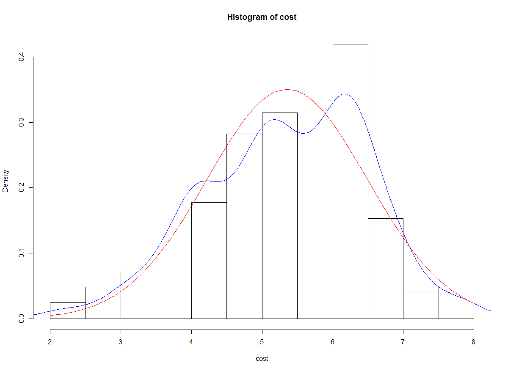

R

## 기술통계 분석

### 연습문제

```
Q1> 다음 중 가설이 갖추어야 할 요건이 아닌 것은? 4
① 가설은 경험적으로 검증할 수 있어야 한다.
②가설은 계량적인 형태를 취하든가 계량화 할 수 있어야 한다.
③가설의 표현은 간단명료해야 한다.
④가설은 동일 분야의 다른 가설과 연관을 가져서는 안된다.

Q2> 다음 중 과학적 연구절차에 기초한 올바른 이론 구축 과정은? 1
① 연구문제 - 개념화 - 가설검정 - 자료수집- 자료분석
② 개념화-연구문제-가설검정- 자료수집- 자료분석
③ 연구문제 -가설검정 -개념화 - 자료수집- 자료분석
④ 개념화 -가설검정 -연구문제 -자료수집- 자료분석

Q3> 가설 검정에 관한 설명으로 옳은 것은?  1
① 검정 통계량은 확률변수이다.
② 대립가설은 사전에 알고 있는 값이다.
③ 유의수준 α를 작게 할수록 좋은 검정법이다.
④ 가설이 틀렸을 때 틀렸다고 판정할 확률을 유의수준이라 한다. 

Q4> '남녀 월급액수에는 차이가 있다'라는 주장을 검증하기 위하여 사회조사를 시행하였다.
조사결과 남자집단의 평균액수는 μ1, 여자집단의 μ2라고 한다면, 귀무가설은? 2
①  μ1 > μ2
②  μ1 = μ2
③  μ1 < μ2
④  μ1 ≠ μ2


Q5> 가설구성 시 고려할 사항이 아닌 것은? 4
① 경험적 검증이 가능하여야 한다.
② 다른 가설 및 이론과의 연관성을 가져야 한다.
③ 두 개 이상의 변수 간의 관계로 서술되어야 한다.
④ 한 가설에 독립변수나 종속변수 수가 많아지도록 한다.

Q6> 가설의 특성이라고 할 수 없는 것은? 1 4
① 문제를 해결해 줄 수 있어야 한다. 
② 변수로 구성되며, 그들 간의 관계를 나타내고 있어야 한다.
③ 검증될 수 있어야 한다.
④ 매개변수가 있어야 한다.

Q7> 유의확률(p-value)의 설명이 틀린 것은? 2
①  검정 통계량이 실제 관측된 값보다 대립가설을 지지하는 방항으로 더욱 치우칠 확률로서 귀무가설 하에서 계산된 값이다
② 주어진 데이터와는 직접적으로 관계가 없다.
③ 유의확률이 낮을 수록 반증이 강한 것을 뜻한다.
④ 귀무가설에 대한 반증의 강도에 대하여 기준값을 미리 정해놓고 p-value값을 그 기준값과 비교한다.

Q8> 다음 내용에 대한 가설형태로 옳은 것은? 2
기존의 진통제는 진통효과가 지속되는 시간이 평균 30분이고, 표준편차는 5분이라고 한다. 
새로운 진통제를 개발하였는데, 개발팀은 이 진통제의 진통 효과가 30분 이상이라고 주장한다.
① H0 : μ<30, H1: μ=30
② H0 : μ=30, H1: μ>30
③ H0 : μ>30, H1: μ=30
④ H0 : μ=30, H1: μ≠30

Q9> 모집단의 회귀계수β에 대한 표본 회귀계수가 0.23일 경우, 독립변수가 종속변수에 의미 있는
영향을 미치는지를 알기 위해 모집단 회귀계수에 대한 가설 검정을 하려고 할때 귀무가설과 대립가설은? 3 1
① H0 : β= 0, H1: β≠ 0
② H0 : β≠ 0, H1: β= 0
③ H0 : β= 0.23, H1: β≠ 0.23
④ H0 : β≠ 0.23, H1: β= 0.23


Q11> 통계적 검증 오류중 제 1종 오류에 해당하는 것은? 1
① 귀무가설이 참임에도 불구하고 이를 기각
② 귀무가설이 참이므로 이를 채택
③ 귀무가설이 거짓이므로 채택
④ 귀무가설이 거짓임에도 이를 기각


Q12> 통계적 가설의 기각 여부를 판정하는 가설 검정에 대한 설명으로 맞는 것은? 4
① 표본으로부터 확실한 근거에 의하여 입증하고자 하는 가설을 귀무가설이라 한다.
② 유의수준은 제2종 오류를 범할 확률의 최대허용한계이다.
③ 대립가설을 채택하게 하는 검정 통계량의 영역을 채택역이라 한다.
④ 대립가설이 옳은데도 귀무가설을 채택함으로써 범하게 되는 오류를 제2종 오류라 한다.


Q13> 통계적 가설 검정을 위한 검정 통계값에 대한 유의확률(p-value)이 주어졌을 때, 귀무가설을 유의수준 α
로 기각할 수 있는 경우는? 2
①  p-value >  α
② p-value <  α
③ p-value =  α
④ p-value >  2α


Q14> 정규분포의 특성에 대한 설명으로 틀린 것은? 2 4 ?
① 평균, 중위수, 최빈수가 모두 일치한다.
② X=μ에 관해 종 모양의 좌우대칭이고, 이 점에서 확률 밀도함수가 최대값 1/0을 갖는다.
③ 분포의 기울어진 방향과 정도를 나타내는 왜도이다.
④ 분포의 봉우리가 얼마나 뾰족한가를 관측하는 첨도이다.


15> 보험가입액의 모평균이 1억 원이라고 볼 수 있는가를 검정하고자 한다. 이에 대한 t-검정 통계량이 1.201이고, 유의확률이 0.239이었다. 2  
① '유의확률 >유의수준'이므로 모평균이 1억 원이라는 가설을 기각하지 못한다.
② '유의확률 >유의수준'이므로 모평균이 1억 원이라는 가설을 기각한다.
③ '검정 통계량 1.201 >유의수준'이므로 모평균이 1억 원이라는 가설을 기각하지 못한다.
④ '검정 통계량 1.201 >유의수준'이므로 모평균이 1억 원이라는 가설을 기각한다.

16> '표본의 크기가 충분히 크다면, 표본의 평규은 0에 가까워진다.'는 이론은?
 중심극한정리
Q17> 표준화 변환을 하면 변환된 자료의 평균과 표준편차의 값은? 1
① 평균 = 0, 표준편차 = 1
② 평균 = 1, 표준편차 = 1
③ 평균 = 1, 표준편차 = 0
④ 평균 = 0, 표준편차 = 0


Q18> 신뢰수준에 대한 설명으로 틀린 것은? 4
① 신뢰구간에 확신하는 정도를 의미한다.
② 신뢰수준은 연구자가 결정한다.
③ 신뢰수준이 95%라는 의미는 표본오차가 ±5%라는 의미이다.
④ 신뢰수준 높이면 신뢰구간은 넓어진다.


Q19> A회사에서 만든 제품의 수명의 표준편차는 50이라고 한다. 새로운 공정
에 의해 제품 100개를 생산하여 실험한 결과 수명의 평균이 280이었다.
모 평균에 대한 95% 오차 한계는? 1
①  9.8
②  12.9
③   98
④  129

Q20> 크기가 n표본으로 신뢰수준 95%를 갖도록 모평균을 추정하였더니 
신뢰구간의 길이가 10이었다. 동일한 조건 아래 표본의 크기만을 1/4로 줄이면
신뢰구간의 길이는? 4
①  1/4로 줄어든다
②  1/2로 줄어든다
③  2배로 늘어난다.
④  4배로 늘어난다.

Q21> 어느 고등학교 1학년 1,000명의 성적분포가 평균 80점, 표준편차 20점인 정규분포로 나타났다.
이경우에 60점 이상 100점 이하의 점수를 얻은 학생은 대략 몇 명인가? 2 
①  350
②  680
③  790
④  850


```


### 기술통계량(Descriptive Statistics)

- 자료를 요약하는 기초적인 통계량으로 데이터 분석 전에 전체적인 데이터 분포의 이해와 통계적 수치를 제공
  모집단의 특성을 유추하는데 이용할 수 있다.
- 설문조사를 시행한 논문에서는 응답자의 일반적인 특성을 반드시 제시하여야 한다.
  논문에서는 “표분의 일반적 특성” 또는 “표본의 인구 통계적 특성”으로 표현한다.
- 인구 통계적 특성을 제시하는데 주로 이용되는 분석 : 빈도분석과 기초통계량


### 빈도분석 (Frequence analysis)

- 설문조자 결과에 대한 가장 기초적인 정보를 제공해주는 분석 방법으로 광범위하게 이용된다.

- 성별이나 직급을 수치화하는 명목척도나 서열척도 같은 범주형 데이터를 대상으로 비율을 측정하는데 주로 사용된다
  - 예) 전체 응답자 중에서 특정 변수값의 범주에 속한 응답자가 차지하는 비율(%)을 알아보고자 할때 주로 이용 – 특정 선거 후보가 얼마만큼의 지지율(%)을 받고 있는가? 응답자 중에서 남자의 비율(%)과 여자의 비율(%)은 ? 연령대별로 차지하는 비율(%)


```R
data <- read.csv("./data4/descriptive.csv", header = TRUE)
head(data)
str(data)
#resident(거주지역)
#gender(성별)
#level(학력수준-서열 1, 2, 3)
#cost(생활비 - 비율)
#type(학교유형 - 명목 1, 2)
#survey(만족도 - 등간척도 5점)
#pass(합격여부 - 명목 1, 2)

> dim(data)
[1] 300   8
> length(data) #변수갯수
[1] 8
> fivenum(data)
[1] -457.2    1.0    2.0    4.7  675.0
> summary(data) #컬럼단위로 최소값, 최댓값, 평균, 1, 3분위수,결측값,중위수
    resident         gender          age       
 Min.   :1.000   Min.   :0.00   Min.   :40.00  
 1st Qu.:1.000   1st Qu.:1.00   1st Qu.:48.00  
 Median :2.000   Median :1.00   Median :53.00  
 Mean   :2.233   Mean   :1.42   Mean   :53.88  
 3rd Qu.:3.000   3rd Qu.:2.00   3rd Qu.:60.00  
 Max.   :5.000   Max.   :5.00   Max.   :69.00  
 NA's   :21                                    
     level            cost               type     
 Min.   :1.000   Min.   :-457.200   Min.   :1.00  
 1st Qu.:1.000   1st Qu.:   4.425   1st Qu.:1.00  
 Median :2.000   Median :   5.400   Median :1.00  
 Mean   :1.836   Mean   :   8.752   Mean   :1.27  
 3rd Qu.:2.000   3rd Qu.:   6.300   3rd Qu.:2.00  
 Max.   :3.000   Max.   : 675.000   Max.   :2.00  
 NA's   :13      NA's   :30         NA's   :26    
     survey          pass      
 Min.   :1.00   Min.   :1.000  
 1st Qu.:2.00   1st Qu.:1.000  
 Median :3.00   Median :1.000  
 Mean   :2.61   Mean   :1.432  
 3rd Qu.:3.00   3rd Qu.:2.000  
 Max.   :5.00   Max.   :2.000  
 NA's   :113    NA's   :20     
> length(data$gender) #관측치 확인
[1] 300
> summary(data$gender)
   Min. 1st Qu.  Median    Mean 3rd Qu.    Max. 
   0.00    1.00    1.00    1.42    2.00    5.00 
> table(data$gender) #각 성별의 빈도수

  0   1   2   5 
  2 173 124   1 

> data <- subset(data, data$gender==1 | data$gender==2)
> x <- table(data$gender) #빈도수에 따른 분할표
> barplot(x) #범주형 데이터 시각화 -> 막대차트


```


```R
> y <- prop.table(x) #비율계산
> 
> round(y*100, 2) #백분률로 변환

    1     2 
58.87 41.13 
> 
> #서열척도 기술 통계량
> summary(data$level) #명목척도는 최솟값, 최댓값, 평균등 의미없음
   Min. 1st Qu.  Median    Mean 3rd Qu.    Max. 
  1.000   1.000   2.000   1.847   2.000   3.000 
   NA's 
     12 
> table(data$level)  #1. 고졸, 2. 대졸, 3. 대학원

 1  2  3 
93 86 57 
> 
> 
> x1 <- table(data$level) 
> barplot(x1)

```


```R
> #등간 척도 기술 통계량
> survey <- data$survey
> survey
  [1]  1  2  1  4  3  3 NA NA  1  2  2  2  2 NA NA NA
 [17] NA NA NA  2  2  1  3  3  2 NA NA NA NA NA NA  2
 [33]  2  3  3  2  3  4  5  4  2 NA  2  3  4  3 NA NA
 [49] NA NA NA NA NA  3  3  3  2  2  3  3 NA NA  2  2
 [65]  2 NA  2  3 NA NA  3  3  3  3  3  3  3  1  4 NA
 [81] NA NA  4 NA NA NA  3  3 NA NA  3 NA  2 NA  2  2
 [97]  5  2 NA  3 NA NA NA NA NA NA NA NA  2  2  3  4
[113]  3  3  3 NA NA  2  2  2  2  1 NA NA NA NA  3  3
[129]  3  3  4 NA  4  2  2  2  2  2 NA NA NA NA  3  3
[145]  2 NA  2  3  3  3  3  4  3  4 NA  3  3  4  2  1
[161]  2  4  3  3  2  5  2  2  2  2  1  2  4 NA  2  2
[177]  1  1  1  2 NA NA NA NA NA NA NA NA  2  3  4  5
[193]  3  3  4 NA  2  1  2  1  2  2  1  2  2 NA NA  3
[209]  5  3 NA  3  4  5  2  3 NA  2  1 NA  2  3 NA  3
[225]  4  3  4  3  4 NA NA  2 NA NA NA NA  1  2 NA NA
[241] NA  1  2  3 NA NA NA NA
> 
> summary(survey) #등간척도에서 평균 통계량은 어느 정도 의미가 있다
   Min. 1st Qu.  Median    Mean 3rd Qu.    Max. 
  1.000   2.000   3.000   2.612   3.000   5.000 
   NA's 
     88 
> 
> x2 <- table(survey) #빈도수는 의미 있음
> hist(survey) #등간척도 시각화(히스토그램)
> pie(x2) #빈도수를 이용한 시각화 - 파이 차트
```


```R
> ####비율 척도 기술 통계량
> length(data$cost)
[1] 248
> summary(data$cost) #요약 통계 - 의미 있음
   Min. 1st Qu.  Median    Mean 3rd Qu.    Max. 
  2.100   4.600   5.400   5.354   6.200   7.900 
> 
> plot(data$cost) #이상치 발견
> data <- subset(data, data$cost >=2 & data$cost <=10)
> x3 <- data$cost
> mean(x3)
[1] 5.354032
> median(x3) #평균이 극단치에 영향을 받는경우 중위수로 대체 하는것이 좋다.
[1] 5.4


```


```R
> quantile(x3, 1/4) #1사분위수
25% 
4.6 
> quantile(x3, 2/4) #중앙값과 동일
50% 
5.4 
> quantile(x3, 3/4) #3사분위수
75% 
6.2 
> quantile(x3, 4/4)
100% 
 7.9 
> max(table(x3))
[1] 18
> x3.t
x3
2.1 2.3   3 3.3 3.4 3.5 3.8 3.9   4 4.1 4.2 4.3 4.4 
  1   2   6   2   2   5   3   3  15   9   3   5   4 
4.5 4.6 4.7 4.8 4.9   5 5.1 5.2 5.3 5.4 5.5 5.6 5.7 
  1   5   6   2   4  18  10   9   7   5   8   4   6 
5.8 5.9   6 6.1 6.2 6.3 6.4 6.5 6.7 6.8 6.9   7 7.1 
  5   2  14   8  13  16  11   4   8   4   4   3   3 
7.2 7.7 7.9 
  2   4   2 

> x3.m
     2.1 2.3 3 3.3 3.4 3.5 3.8 3.9  4 4.1 4.2 4.3 4.4
x3.t   1   2 6   2   2   5   3   3 15   9   3   5   4
     4.5 4.6 4.7 4.8 4.9  5 5.1 5.2 5.3 5.4 5.5 5.6
x3.t   1   5   6   2   4 18  10   9   7   5   8   4
     5.7 5.8 5.9  6 6.1 6.2 6.3 6.4 6.5 6.7 6.8 6.9 7
x3.t   6   5   2 14   8  13  16  11   4   8   4   4 3
     7.1 7.2 7.7 7.9
x3.t   3   2   4   2


```


### 산포도


- 자료가 대표값으로부터 얼마나 흩어져 분포하고 있는가의 정도를 나타내는 척도

- 분산(Variance)과 표준편차(Standard Deviation)를 통계량으로 사용된다.

- 분산(Variance) – 평균으로부터 떨어진 거리들의 평균

- 표준편차(Standard Deviation) – 분산의 양의 제곱근


- 모집단의분산(Variance)과 표준편차(Standard Deviation)를 추정하는데 표본분산(S2)과 표본 표준편차(S)를 이용한다.

   


### 표본분산과 표본 표준편차


- 계산된 표준오차는 표본과 실제 모집단 간의 차이를 나타내는 값으로 표본의 수가 커지면 표준오차는 작아지는 특성을 나타내고 있다.

  


- 분산은평균으로부터 얼마나 흩어져 있는가의 정도를 타나내는 척도를 의미하고, 표준편차는 분산의 양의 제곱근으로 대부분 표준편차를 이용하여 산포도를 해석하며, 일반 통계학에서도 분산보다 표준편차를 주로 이용한다.


### 변도계수(Cofficient of variation)

- 산포도는 흩어져 있는 정도가 동일하지만, 서로 다른 분산과 표준편차를 나타내는 약점을을 가지고 있고 이러한 약점을 보완하기 위해서 변동계수의 개념을 도입
- 변동계수 = 표준편차 / 평균


### 비율척도의 빈도 분석

#### 비율척도의 범주화(리코딩)

```R
> table(data$cost)

2.1 2.3   3 3.3 3.4 3.5 3.8 3.9   4 4.1 4.2 4.3 4.4 
  1   2   6   2   2   5   3   3  15   9   3   5   4 
4.5 4.6 4.7 4.8 4.9   5 5.1 5.2 5.3 5.4 5.5 5.6 5.7 
  1   5   6   2   4  18  10   9   7   5   8   4   6 
5.8 5.9   6 6.1 6.2 6.3 6.4 6.5 6.7 6.8 6.9   7 7.1 
  5   2  14   8  13  16  11   4   8   4   4   3   3 
7.2 7.7 7.9 
  2   4   2 
> hist(data$cost)
```


### 연속형 변수 범주화

```R
> data$cost2[data$cost >=1 & data$cost <=3] <- 1
> data$cost2[data$cost >=4 & data$cost <=6] <- 2
> data$cost2[data$cost >=7] <- 3
> table(data$cost2)

  1   2   3 
  9 142  14 
> barplot(table(data$cost2))
> pie(table(data$cost2))
```


### 정규 분포를 갖는지 확인 - 왜도, 첨도 

```R
> skewness(data$cost) #왜도 반환 0보다 크면, 0보다 작으면
[1] -0.297234
> kurtosis(cost) #첨도 반환 (정규분포의 첨도는 3)
[1] 2.674163
> hist(cost)
```


```R
> hist(cost, freq=F) #히스토그램의 계급을 확률 밀도로 표현
> > hist(cost)
```


```R
lines(density(cost), col = 'blue') #cost의 밀도 분포곡선
> result <- cost[!is.na(cost)]
> result
  [1] 5.1 4.2 4.7 3.5 5.0 5.4 4.1 4.4 4.9 2.3 4.2 6.7
 [13] 4.3 5.7 4.6 5.1 2.1 5.1 6.2 5.1 4.1 4.1 2.3 5.0
 [25] 5.2 4.7 4.4 5.2 6.3 4.0 5.3 4.2 4.1 5.0 7.1 4.0
 [37] 3.8 5.3 4.7 5.3 6.2 7.0 6.4 5.1 5.5 6.4 4.7 6.3
 [49] 3.9 4.1 4.1 5.0 3.5 6.0 3.3 6.3 5.6 6.2 6.2 6.3
 [61] 3.4 6.3 3.5 6.4 3.0 6.8 3.5 5.2 5.5 6.1 5.8 6.1
 [73] 5.4 6.0 6.7 5.2 5.6 5.1 5.5 6.1 5.0 4.0 5.7 5.7
 [85] 6.3 7.1 5.0 6.5 4.9 6.2 4.6 7.2 6.5 6.4 6.8 5.5
 [97] 5.8 4.0 6.0 6.7 7.7 4.3 5.0 4.0 6.7 5.4 6.2 5.9
[109] 4.9 4.3 5.7 4.0 5.1 3.8 4.1 5.1 5.0 5.2 4.7 5.1
[121] 4.4 5.2 5.0 4.0 3.9 4.0 4.1 5.0 5.0 4.0 4.0 3.8
[133] 6.0 3.0 5.3 5.0 7.0 6.4 6.2 5.5 4.3 4.7 4.8 3.9
[145] 6.0 4.1 5.0 4.0 6.0 3.3 5.6 5.3 6.2 4.6 3.4 6.3
[157] 6.3 6.4 3.0 6.8 5.0 4.0 5.2 5.5 3.0 5.8 6.3 5.4
[169] 6.0 6.7 5.2 5.6 4.6 5.5 6.1 5.3 5.0 6.0 5.7 4.6
[181] 5.7 6.3 6.3 7.1 5.2 6.5 4.9 6.2 4.0 7.2 6.5 6.4
[193] 6.8 5.0 5.8 6.0 3.0 6.7 7.7 6.9 4.0 7.7 5.3 6.7
[205] 4.8 6.2 6.0 6.4 5.1 7.9 6.4 6.3 6.1 6.3 6.0 6.9
[217] 4.3 6.7 5.4 7.0 6.0 6.2 6.1 5.0 5.8 4.0 3.0 5.0
[229] 6.0 6.2 6.4 7.9 6.4 6.3 6.1 6.3 6.0 6.9 6.2 5.9
[241] 6.9 7.7 6.3 4.5 3.5 6.1 5.5 4.4
> x<-seq(0, 8, 0.1)   #0~8범위의 0.1씩 증가하는 데이터 벡터 생성
> curve(dnorm(x, mean(result), sd(result)), col='red', add=T)  #정규분포 확률 밀도
```





### arrach()/detach() 함수


```R
> attach(data) #'데이터셋$' 생략할 수 있도록 설정
The following objects are masked _by_ .GlobalEnv:

    cost, survey

> length(cost) # na.rm옵션
[1] 248
> summary(cost)
   Min. 1st Qu.  Median    Mean 3rd Qu.    Max. 
  2.100   4.600   5.400   5.354   6.200   7.900 
> mean(cost)
[1] 5.354032
> min(cost)
[1] 2.1
> range(cost)
[1] 2.1 7.9
> sort(cost, decreasing = T)
  [1] 7.9 7.9 7.7 7.7 7.7 7.7 7.2 7.2 7.1 7.1 7.1 7.0
 [13] 7.0 7.0 6.9 6.9 6.9 6.9 6.8 6.8 6.8 6.8 6.7 6.7
 [25] 6.7 6.7 6.7 6.7 6.7 6.7 6.5 6.5 6.5 6.5 6.4 6.4
 [37] 6.4 6.4 6.4 6.4 6.4 6.4 6.4 6.4 6.4 6.3 6.3 6.3
 [49] 6.3 6.3 6.3 6.3 6.3 6.3 6.3 6.3 6.3 6.3 6.3 6.3
 [61] 6.3 6.2 6.2 6.2 6.2 6.2 6.2 6.2 6.2 6.2 6.2 6.2
 [73] 6.2 6.2 6.1 6.1 6.1 6.1 6.1 6.1 6.1 6.1 6.0 6.0
 [85] 6.0 6.0 6.0 6.0 6.0 6.0 6.0 6.0 6.0 6.0 6.0 6.0
 [97] 5.9 5.9 5.8 5.8 5.8 5.8 5.8 5.7 5.7 5.7 5.7 5.7
[109] 5.7 5.6 5.6 5.6 5.6 5.5 5.5 5.5 5.5 5.5 5.5 5.5
[121] 5.5 5.4 5.4 5.4 5.4 5.4 5.3 5.3 5.3 5.3 5.3 5.3
[133] 5.3 5.2 5.2 5.2 5.2 5.2 5.2 5.2 5.2 5.2 5.1 5.1
[145] 5.1 5.1 5.1 5.1 5.1 5.1 5.1 5.1 5.0 5.0 5.0 5.0
[157] 5.0 5.0 5.0 5.0 5.0 5.0 5.0 5.0 5.0 5.0 5.0 5.0
[169] 5.0 5.0 4.9 4.9 4.9 4.9 4.8 4.8 4.7 4.7 4.7 4.7
[181] 4.7 4.7 4.6 4.6 4.6 4.6 4.6 4.5 4.4 4.4 4.4 4.4
[193] 4.3 4.3 4.3 4.3 4.3 4.2 4.2 4.2 4.1 4.1 4.1 4.1
[205] 4.1 4.1 4.1 4.1 4.1 4.0 4.0 4.0 4.0 4.0 4.0 4.0
[217] 4.0 4.0 4.0 4.0 4.0 4.0 4.0 4.0 3.9 3.9 3.9 3.8
[229] 3.8 3.8 3.5 3.5 3.5 3.5 3.5 3.4 3.4 3.3 3.3 3.0
[241] 3.0 3.0 3.0 3.0 3.0 2.3 2.3 2.1
> detach(data) #'데이터셋$' 생략할 수 없도록 설정, attach() 해제
> length(pass) #오류
Error: object 'pass' not found
> length(data$pass)
[1] 300
```


### Hmisc 패키지

```R
> library(Hmisc)
> describe(data)
data 

 8  Variables      300  Observations
------------------------------------------------------
resident 
       n  missing distinct     Info     Mean      Gmd 
     279       21        5    0.881    2.233    1.553 
                                        
Value          1     2     3     4     5
Frequency    132    55    31    17    44
Proportion 0.473 0.197 0.111 0.061 0.158
------------------------------------------------------
gender 
       n  missing distinct     Info     Mean      Gmd 
     300        0        4    0.738     1.42    0.521 
                                  
Value          0     1     2     5
Frequency      2   173   124     1
Proportion 0.007 0.577 0.413 0.003
------------------------------------------------------
age 
       n  missing distinct     Info     Mean      Gmd 
     300        0       26    0.995    53.88    7.735 
     .05      .10      .25      .50      .75      .90 
      45       46       48       53       60       64 
     .95 
      65 

lowest : 40 42 44 45 46, highest: 63 64 65 68 69
------------------------------------------------------
level 
       n  missing distinct     Info     Mean      Gmd 
     287       13        3    0.875    1.836   0.8548 
                            
Value          1     2     3
Frequency    117   100    70
Proportion 0.408 0.348 0.244
------------------------------------------------------
cost 
       n  missing distinct     Info     Mean      Gmd 
     270       30       55    0.999    8.751     28.3 
     .05      .10      .25      .50      .75      .90 
   3.000    3.800    4.425    5.400    6.300    6.900 
     .95 
   7.700 

-458 (1, 0.004), -346 (1, 0.004), -236 (2, 0.007),
-74 (1, 0.004), -6 (2, 0.007), -4 (1, 0.004), 2 (9,
0.033), 4 (69, 0.256), 6 (161, 0.596), 8 (12, 0.044),
76 (2, 0.007), 86 (2, 0.007), 116 (2, 0.007), 226 (1,
0.004), 258 (1, 0.004), 336 (2, 0.007), 674 (1,
0.004)
------------------------------------------------------
type 
       n  missing distinct     Info     Mean      Gmd 
     274       26        2    0.591     1.27   0.3957 
                    
Value         1    2
Frequency   200   74
Proportion 0.73 0.27
------------------------------------------------------
survey 
       n  missing distinct     Info     Mean      Gmd 
     187      113        5    0.901     2.61    1.052 
                                        
Value          1     2     3     4     5
Frequency     20    72    63    25     7
Proportion 0.107 0.385 0.337 0.134 0.037
------------------------------------------------------
pass 
       n  missing distinct     Info     Mean      Gmd 
     280       20        2    0.736    1.432   0.4925 
                      
Value          1     2
Frequency    159   121
Proportion 0.568 0.432
------------------------------------------------------


```


### prettyR 패키지


```R
> library(prettyR)


> freq(data)

Frequencies for resident 
        1    2    5    3    4   NA
      132   55   44   31   17   21
%      44 18.3 14.7 10.3  5.7    7 
%!NA 47.3 19.7 15.8 11.1  6.1 


Frequencies for gender 
        1    2    0    5   NA
      173  124    2    1    0
%    57.7 41.3  0.7  0.3    0 
%!NA 57.7 41.3  0.7  0.3 


Frequencies for age 
       48   49   47   65   55   45   63   51   54   46   58   60   64   50   56   57   61   59   52   62   53   69   40   42   44   68   NA
       34   30   24   24   23   19   18   13   13   12   11   10   10    9    9    9    8    6    4    4    3    3    1    1    1    1    0
%    11.3   10    8    8  7.7  6.3    6  4.3  4.3    4  3.7  3.3  3.3    3    3    3  2.7    2  1.3  1.3    1    1  0.3  0.3  0.3  0.3    0 
%!NA 11.3   10    8    8  7.7  6.3    6  4.3  4.3    4  3.7  3.3  3.3    3    3    3  2.7    2  1.3  1.3    1    1  0.3  0.3  0.3  0.3 


Frequencies for level 
        1    2    3   NA
      117  100   70   13
%      39 33.3 23.3  4.3 
%!NA 40.8 34.8 24.4 


Frequencies for cost 
          5    6.3      4      6    6.2    5.1    6.4    4.1    5.2    5.5    6.1    6.7    5.3      3    4.7    5.7    3.5    4.3    4.6    5.4    5.8    4.4    4.9    5.6    6.5    6.8    6.9    7.1    7.7    3.8    3.9    4.2      7 -235.8   -5.9    2.3    3.3    3.4    4.8    5.9    7.2    7.9   75.1   85.1  115.7  336.5 -457.2 -345.6    -75   -4.8    2.1    4.5  225.8  257.8    675     NA
       18   16   15   14   13   11   11    9    9    9    8    8    7    6    6    6    5    5    5    5    5    4    4    4    4    4    4    4    4    3    3    3    3    2    2    2    2    2    2    2    2    2    2    2    2    2    1    1    1    1    1    1    1    1    1   30
%       6  5.3    5  4.7  4.3  3.7  3.7    3    3    3  2.7  2.7  2.3    2    2    2  1.7  1.7  1.7  1.7  1.7  1.3  1.3  1.3  1.3  1.3  1.3  1.3  1.3    1    1    1    1  0.7  0.7  0.7  0.7  0.7  0.7  0.7  0.7  0.7  0.7  0.7  0.7  0.7  0.3  0.3  0.3  0.3  0.3  0.3  0.3  0.3  0.3   10 
%!NA  6.7  5.9  5.6  5.2  4.8  4.1  4.1  3.3  3.3  3.3    3    3  2.6  2.2  2.2  2.2  1.9  1.9  1.9  1.9  1.9  1.5  1.5  1.5  1.5  1.5  1.5  1.5  1.5  1.1  1.1  1.1  1.1  0.7  0.7  0.7  0.7  0.7  0.7  0.7  0.7  0.7  0.7  0.7  0.7  0.7  0.4  0.4  0.4  0.4  0.4  0.4  0.4  0.4  0.4 


Frequencies for type 
        1    2   NA
      200   74   26
%    66.7 24.7  8.7 
%!NA   73   27 


Frequencies for survey 
        2    3    4    1    5   NA
       72   63   25   20    7  113
%      24   21  8.3  6.7  2.3 37.7 
%!NA 38.5 33.7 13.4 10.7  3.7 


Frequencies for pass 
        1    2   NA
      159  121   20
%      53 40.3  6.7 
%!NA 56.8 43.2 
```


#### Quize > 거주지역 변수, 리코딩 후 비율 계산

```R
#범주화 : 1은 특별시  , 2~4 광역시, 5는 시군구   
> data$resident[data$resident == 1] <- "특별시"        
> data$resident[data$resident >= 2 & data$resident <=4] <- "광역시"        
> data$resident[data$resident == 5] <- "시군구"   


#빈도수, 비율, 백분율

> x.resident <- table(data$resident) #빈도수에 따른 분할표
> y.resident <- prop.table(x.resident)
> x.resident

광역시 시군구 특별시 
   103     44    132 
> y.resident <- prop.table(x.resident)
> y.resident

   광역시    시군구    특별시 
0.3691756 0.1577061 0.4731183 
> round(y.resident*100, 2) #백분률로 변환

광역시 시군구 특별시 
 36.92  15.77  47.31 


```


#### Quiz> 성별 변수 리코딩 후 비율 계산

```R
> data$gender[data$gender == 1] <- "남자"        
> data$gender[data$gender == 2] <- "여자" 
> gender <- table(data$gender) #빈도수에 따른 분할표
> gender

남자 여자 
 146  102 

> y.gender <- prop.table(x.gender)
> y.gender

     남자      여자 
0.5887097 0.4112903 
> round(y.gender*100, 2) #백분률로 변환

 남자  여자 
58.87 41.13 


```


#### Quiz> 나이변수 리코딩 후 비율 계산

```R
#범주화 : <=45 중년층,  46~59는 장년층, >=60 노년층
data$age[data$age <= 45] <- "중년층"
data$age[data$age >= 46  & data$age <=59] <- "장년층"
data$age[data$age >= 60 & data$age <=100] <- "노년층"

#빈도수, 비율, 백분율

> x.age <- table(data$age) #빈도수에 따른 분할표
> x.age

노년층 장년층 중년층 
    78    200     22 


> y.age <- prop.table(x.age)
> y.age

    노년층     장년층     중년층 
0.26000000 0.66666667 0.07333333 
> round(y.age*100, 2) #백분률로 변환

노년층 장년층 중년층 
 26.00  66.67   7.33 

data$pass[data$pass == 1] <- "합격"        
data$pass[data$pass == 2] <- "불합격" 
```


```R
> freq(data)

Frequencies for resident 
     특별시 광역시 시군구     NA
      132  103   44   21
%      44 34.3 14.7    7 
%!NA 47.3 36.9 15.8 


Frequencies for gender 
     남자 여자    0    5   NA
      173  124    2    1    0
%    57.7 41.3  0.7  0.3    0 
%!NA 57.7 41.3  0.7  0.3 


Frequencies for age 
     장년층 노년층 중년층     NA
      200   78   22    0
%    66.7   26  7.3    0 
%!NA 66.7   26  7.3 


Frequencies for level 
        1    2    3   NA
      117  100   70   13
%      39 33.3 23.3  4.3 
%!NA 40.8 34.8 24.4 


Frequencies for cost 
          5    6.3      4      6    6.2    5.1    6.4    4.1    5.2    5.5    6.1    6.7    5.3      3    4.7    5.7    3.5    4.3    4.6    5.4    5.8    4.4    4.9    5.6    6.5    6.8    6.9    7.1    7.7    3.8    3.9    4.2      7 -235.8   -5.9    2.3    3.3    3.4    4.8    5.9    7.2    7.9   75.1   85.1  115.7  336.5 -457.2 -345.6    -75   -4.8    2.1    4.5  225.8  257.8    675     NA
       18   16   15   14   13   11   11    9    9    9    8    8    7    6    6    6    5    5    5    5    5    4    4    4    4    4    4    4    4    3    3    3    3    2    2    2    2    2    2    2    2    2    2    2    2    2    1    1    1    1    1    1    1    1    1   30
%       6  5.3    5  4.7  4.3  3.7  3.7    3    3    3  2.7  2.7  2.3    2    2    2  1.7  1.7  1.7  1.7  1.7  1.3  1.3  1.3  1.3  1.3  1.3  1.3  1.3    1    1    1    1  0.7  0.7  0.7  0.7  0.7  0.7  0.7  0.7  0.7  0.7  0.7  0.7  0.7  0.3  0.3  0.3  0.3  0.3  0.3  0.3  0.3  0.3   10 
%!NA  6.7  5.9  5.6  5.2  4.8  4.1  4.1  3.3  3.3  3.3    3    3  2.6  2.2  2.2  2.2  1.9  1.9  1.9  1.9  1.9  1.5  1.5  1.5  1.5  1.5  1.5  1.5  1.5  1.1  1.1  1.1  1.1  0.7  0.7  0.7  0.7  0.7  0.7  0.7  0.7  0.7  0.7  0.7  0.7  0.7  0.4  0.4  0.4  0.4  0.4  0.4  0.4  0.4  0.4 


Frequencies for type 
        1    2   NA
      200   74   26
%    66.7 24.7  8.7 
%!NA   73   27 


Frequencies for survey 
        2    3    4    1    5   NA
       72   63   25   20    7  113
%      24   21  8.3  6.7  2.3 37.7 
%!NA 38.5 33.7 13.4 10.7  3.7 


Frequencies for pass 
       합격 불합격     NA
      159  121   20
%      53 40.3  6.7 
%!NA 56.8 43.2 
```


### 복원, 비복원 추출

```R
> # 벡터 데이터 1~10 로부터 5개 샘플 추출 복원 추출
> sample(1:10, 5, replace=TRUE)
[1] 1 5 4 2 7
> # 벡터 데이터 1~10 로부터 5개 샘플 추출 비복원 추출
> sample(1:10, 5)
[1]  2  5  6  3 10

> library(sampling)

다음의 패키지를 부착합니다: ‘sampling’

The following objects are masked from ‘package:survival’:

    cluster, strata

> head(iris)
  Sepal.Length Sepal.Width Petal.Length Petal.Width
1          5.1         3.5          1.4         0.2
2          4.9         3.0          1.4         0.2
3          4.7         3.2          1.3         0.2
4          4.6         3.1          1.5         0.2
5          5.0         3.6          1.4         0.2
6          5.4         3.9          1.7         0.4
  Species
1  setosa
2  setosa
3  setosa
4  setosa
5  setosa
6  setosa

>result <- strata(c("Species"), size = c(3, 3, 3), method = "srswor", data = iris)
       Species ID_unit Prob Stratum
16      setosa      16 0.06       1
39      setosa      39 0.06       1
41      setosa      41 0.06       1
71  versicolor      71 0.06       2
74  versicolor      74 0.06       2
94  versicolor      94 0.06       2
125  virginica     125 0.06       3
129  virginica     129 0.06       3
143  virginica     143 0.06       3

#srswor : 비복원 단순 임의 추출
#srswr : 복원 단순 임의 추출
#poisson : 포아송 추출
#systematic : 계통 추출

> result
> getdata(iris, result)
```


### 계통추출


- 계통 추출은 모집단의 임의 위치에서 시작해 매 k번째 항목을 표본으로 추출하는 방법이다
- 단순 임의 추출 방법과 동일한 효과를 보이고, 데이터가 순서대로 나열된 순서 모집단Ordered Population(예를 들면, 1, 2, 3, …, 10과 같이 순서대로 나열된 모집단)의 경우 단순 임의 추출보다 좋은 표본을 추출한다
- doBy 패키지의 sampleBy(formula, frac=0.1, replace=FALSE, data=parent.frame( ), systematic=FALSE) 함수를 사용하여 수행
- sampleBy( )의 첫 번째 인자는 ‘~ 1’이다. 그 이유는 첫 번째 인자가 표본을 추출할 그룹을 지정하는 포뮬러기 때문
- 표본으로부터 평균을 계산하여 모집단의 평균을 추정할 때 표본 평균의 기댓값이 모집단의 평균과 다르다면 편향되었다고 말한다.

```R
> library(doBy)
> x <- data.frame(x=1:10)
> sampleBy(~1, frac=.3, data=x, systematic = TRUE)
  [,1] [,2] [,3]
1    1    4    7
```


### 분할표

- 명목형Categorical 또는 순서형Ordinal 데이터의 도수frequency를 표 형태로 기록한 것이다
- 기계 학습으로 데이터의 양성Positive, 음성Negative을 예측하는 경우 사용
- 이메일 텍스트를 보고 해당 이메일이 스팸인지 아닌지를 예측하는 경우 사용
- 분할표를 작성하는 함수 -  table( ), xtabs( )
- xtabs( )는 포뮬러를 사용해 데이터를 지정할 수 있다


```R
> table(c("a", "b", "b", "b", "c", "c", "d"))

a b c d 
1 3 2 1 
> d <- data.frame(x=c("1", "2", "2", "1"),  y=c("A", "B", "A", "B"),   num=c(3, 5, 8, 7))
> (xtabs(num ~ x + y, data=d))
   y
x   A B
  1 3 7
  2 8 5
> (d2 <- data.frame(x=c("A", "A", "A", "B", "B")))
  x
1 A
2 A
3 A
4 B
5 B
> #각 관찰 결과가 서로 다른 행으로 표현되어 있다면 ‘~ 변수 + 변수 …’ 형태로 포뮬러를 작성한다
> (xtabs(~ x, d2))
x
A B 
3 2 


> xt <- xtabs(num ~ x + y, data = d)
> xt
   y
x   A B
  1 3 7
  2 8 5
> margin.table(xt, 1)  # 3 + 7 = 10, 8 + 5 = 13
x
 1  2 
10 13 
> margin.table(xt, 2)  # 3 + 8 = 11, 7 + 5 = 12
y
 A  B 
11 12 
> margin.table(xt)     # 3 + 7 + 8 + 5 = 23
[1] 23


> prop.table(xt, 1) 
   y
x           A         B
  1 0.3000000 0.7000000
  2 0.6153846 0.3846154
> prop.table(xt, 2) 
   y
x           A         B
  1 0.2727273 0.5833333
  2 0.7272727 0.4166667
> prop.table(xt)    
   y
x           A         B
  1 0.1304348 0.3043478
  2 0.3478261 0.2173913

```


### 교차분석

- 범주형 자료(명목척도 또는 서열척도)를 대상으로 두개 이상의 변수들에 대한 관련성을 알아보기 위해서 결합
- 부포를 나타내는 교차 분할표를 작성하고 이를 통해서 변수 상호 간의 관련성 여부를 분석하는 방법
- 빈도분석의 특성별 차이를 분석하기 위해 수행하는 분석방법으로 빈도분석결과에 대한 보충자료를 제시하는데 효과적
- 교차분석은 빈도분석과 함께 고급통계 분석의 기초 정보를 제공한다.
- gmodels 패키지 
- CrossTable() : 교차 분할표 생성,  ‘chisq=TRUE’ 속성을 적용하면 카이제곱검정 결과를 볼수 있다.
-  교차분할표의 첫번째 줄은 관측치, 두번째 줄은 카이제곱의 결과(기대치 비율), 세번째 줄은 현재 행의 비율, 네번째는 현재 열의 비율, 마지막 줄은 전체 비율에서 현재 셀의 값이 차지하는 비율 교차 분할표에서 기대비율은 카이 제곱에 의해서 구해진 결과이다.
- 
- 카이제곱식에서 기대값은 (현재 셀의 행 합 X 현재 셀의 열 합) / 전체합


````R
data <- read.csv("./data4/cleanDescriptive.csv", header=TRUE)
data
str(data)
#부모의 학력수준이 자녀의 대학진학 여부와 관련이 있는지를 분석하기 위해 학력수준 변수는 독립변수
> x <- data$level2
> y <- data$pass2
> result <- data.frame(Level=x, Pass=y)
> dim(result)
[1] 248   2

> #교차분석을 위한 분할표 생성
> table(result)
          Pass
Level      실패 합격
  고졸       40   49
  대졸       27   55
  대학원졸   23   31

> library(gmodels)
> library(ggplot2)

> CrossTable(x=result$Level, y=result$Pass)

 
   Cell Contents
|-------------------------|
|                       N |
| Chi-square contribution |
|           N / Row Total |
|           N / Col Total |
|         N / Table Total |
|-------------------------|

 
Total Observations in Table:  225 

 
             | result$Pass 
result$Level |      실패 |      합격 | Row Total | 
-------------|-----------|-----------|-----------|
        고졸 |        40 |        49 |        89 | 
             |     0.544 |     0.363 |           | 
             |     0.449 |     0.551 |     0.396 | 
             |     0.444 |     0.363 |           | 
             |     0.178 |     0.218 |           | 
-------------|-----------|-----------|-----------|
        대졸 |        27 |        55 |        82 | 
             |     1.026 |     0.684 |           | 
             |     0.329 |     0.671 |     0.364 | 
             |     0.300 |     0.407 |           | 
             |     0.120 |     0.244 |           | 
-------------|-----------|-----------|-----------|
    대학원졸 |        23 |        31 |        54 | 
             |     0.091 |     0.060 |           | 
             |     0.426 |     0.574 |     0.240 | 
             |     0.256 |     0.230 |           | 
             |     0.102 |     0.138 |           | 
-------------|-----------|-----------|-----------|
Column Total |        90 |       135 |       225 | 
             |     0.400 |     0.600 |           | 
-------------|-----------|-----------|-----------|


> head(diamonds)
# A tibble: 6 x 10
  carat cut      color clarity depth table price     x
  <dbl> <ord>    <ord> <ord>   <dbl> <dbl> <int> <dbl>
1 0.23  Ideal    E     SI2      61.5    55   326  3.95
2 0.21  Premium  E     SI1      59.8    61   326  3.89
3 0.23  Good     E     VS1      56.9    65   327  4.05
4 0.290 Premium  I     VS2      62.4    58   334  4.2 
5 0.31  Good     J     SI2      63.3    58   335  4.34
6 0.24  Very Go~ J     VVS2     62.8    57   336  3.94
# ... with 2 more variables: y <dbl>, z <dbl>
> str(diamonds)
Classes ‘tbl_df’, ‘tbl’ and 'data.frame':	53940 obs. of  10 variables:
 $ carat  : num  0.23 0.21 0.23 0.29 0.31 0.24 0.24 0.26 0.22 0.23 ...
 $ cut    : Ord.factor w/ 5 levels "Fair"<"Good"<..: 5 4 2 4 2 3 3 3 1 3 ...
 $ color  : Ord.factor w/ 7 levels "D"<"E"<"F"<"G"<..: 2 2 2 6 7 7 6 5 2 5 ...
 $ clarity: Ord.factor w/ 8 levels "I1"<"SI2"<"SI1"<..: 2 3 5 4 2 6 7 3 4 5 ...
 $ depth  : num  61.5 59.8 56.9 62.4 63.3 62.8 62.3 61.9 65.1 59.4 ...
 $ table  : num  55 61 65 58 58 57 57 55 61 61 ...
 $ price  : int  326 326 327 334 335 336 336 337 337 338 ...
 $ x      : num  3.95 3.89 4.05 4.2 4.34 3.94 3.95 4.07 3.87 4 ...
 $ y      : num  3.98 3.84 4.07 4.23 4.35 3.96 3.98 4.11 3.78 4.05 ...
 $ z      : num  2.43 2.31 2.31 2.63 2.75 2.48 2.47 2.53 2.49 2.39 ...


> #5만4천개의 다이아몬드 속성 데이터 셋
> #price, carat, cut(커팅품질), color, clarity(선명도),.....
> CrossTable(x=diamonds$color, y=diamonds$cut)

 
   Cell Contents
|-------------------------|
|                       N |
| Chi-square contribution |
|           N / Row Total |
|           N / Col Total |
|         N / Table Total |
|-------------------------|

 
Total Observations in Table:  53940 

 
               | diamonds$cut 
diamonds$color |      Fair |      Good | Very Good |   Premium |     Ideal | Row Total | 
---------------|-----------|-----------|-----------|-----------|-----------|-----------|
             D |       163 |       662 |      1513 |      1603 |      2834 |      6775 | 
               |     7.607 |     3.403 |     0.014 |     9.634 |     5.972 |           | 
               |     0.024 |     0.098 |     0.223 |     0.237 |     0.418 |     0.126 | 
               |     0.101 |     0.135 |     0.125 |     0.116 |     0.132 |           | 
               |     0.003 |     0.012 |     0.028 |     0.030 |     0.053 |           | 
---------------|-----------|-----------|-----------|-----------|-----------|-----------|
             E |       224 |       933 |      2400 |      2337 |      3903 |      9797 | 
               |    16.009 |     1.973 |    19.258 |    11.245 |     0.032 |           | 
               |     0.023 |     0.095 |     0.245 |     0.239 |     0.398 |     0.182 | 
               |     0.139 |     0.190 |     0.199 |     0.169 |     0.181 |           | 
               |     0.004 |     0.017 |     0.044 |     0.043 |     0.072 |           | 
---------------|-----------|-----------|-----------|-----------|-----------|-----------|
             F |       312 |       909 |      2164 |      2331 |      3826 |      9542 | 
               |     2.596 |     1.949 |     0.333 |     4.837 |     0.049 |           | 
               |     0.033 |     0.095 |     0.227 |     0.244 |     0.401 |     0.177 | 
               |     0.194 |     0.185 |     0.179 |     0.169 |     0.178 |           | 
               |     0.006 |     0.017 |     0.040 |     0.043 |     0.071 |           | 
---------------|-----------|-----------|-----------|-----------|-----------|-----------|
             G |       314 |       871 |      2299 |      2924 |      4884 |     11292 | 
               |     1.575 |    23.708 |    20.968 |     0.473 |    30.745 |           | 
               |     0.028 |     0.077 |     0.204 |     0.259 |     0.433 |     0.209 | 
               |     0.195 |     0.178 |     0.190 |     0.212 |     0.227 |           | 
               |     0.006 |     0.016 |     0.043 |     0.054 |     0.091 |           | 
---------------|-----------|-----------|-----------|-----------|-----------|-----------|
             H |       303 |       702 |      1824 |      2360 |      3115 |      8304 | 
               |    12.268 |     3.758 |     0.697 |    26.432 |    12.390 |           | 
               |     0.036 |     0.085 |     0.220 |     0.284 |     0.375 |     0.154 | 
               |     0.188 |     0.143 |     0.151 |     0.171 |     0.145 |           | 
               |     0.006 |     0.013 |     0.034 |     0.044 |     0.058 |           | 
---------------|-----------|-----------|-----------|-----------|-----------|-----------|
             I |       175 |       522 |      1204 |      1428 |      2093 |      5422 | 
               |     1.071 |     1.688 |     0.090 |     1.257 |     2.479 |           | 
               |     0.032 |     0.096 |     0.222 |     0.263 |     0.386 |     0.101 | 
               |     0.109 |     0.106 |     0.100 |     0.104 |     0.097 |           | 
               |     0.003 |     0.010 |     0.022 |     0.026 |     0.039 |           | 
---------------|-----------|-----------|-----------|-----------|-----------|-----------|
             J |       119 |       307 |       678 |       808 |       896 |      2808 | 
               |    14.772 |    10.427 |     3.823 |    11.300 |    45.486 |           | 
               |     0.042 |     0.109 |     0.241 |     0.288 |     0.319 |     0.052 | 
               |     0.074 |     0.063 |     0.056 |     0.059 |     0.042 |           | 
               |     0.002 |     0.006 |     0.013 |     0.015 |     0.017 |           | 
---------------|-----------|-----------|-----------|-----------|-----------|-----------|
  Column Total |      1610 |      4906 |     12082 |     13791 |     21551 |     53940 | 
               |     0.030 |     0.091 |     0.224 |     0.256 |     0.400 |           | 
---------------|-----------|-----------|-----------|-----------|-----------|-----------|

 
````


#### 교차분석 고려사항

- 교차분석에 사용되는 변수는 값이 10 미만인 범주형 변수(명목 척도, 서열 척도)이어야 한다.
- 비율척도인 경우는 코딩변경(리코딩)을 통해서 범주형 자료로 변화해야 한다.
  - 예) 연령대 10~19세는 1, 20~29세는 2, 30~39세는 3등으로 범주화하여 변경한다.


- 교차 분할표를 작성하기 위해서는 연구 환경에서 해당 변수를 화긴(독립 변수와 종속변수)하여 모델링한 후 범주형 데이터로 변환하는 리코딩 과정을 거친 후에 대상 변수를 데이터 프레임으로 생성한다.


#### 변수 모델

- 특정 객체를 대상으로 분석할 속성(변수)을 선택하여 속성 간의 관계를 설정하는 일련의 과정 


### 카이제곱 검정(chi-square test)

- 범주별로 관측빈도와 기대빈도의 차이를 통해서 확률 모형이 데이터를 얼마나 잘 설명하는지를 검정하는 통계방법
- 교차분석으로 얻어진 분할표를 대상으로 유의확률을 적용하여 변수 간의 독립성(관련성) 여부를 검정하는 분석 방법으로 사용한다
- 교차분석은 카이제곱검정 통계량을 사용하기 때문에 교차분석을 카이제곱검정이라고 한다.


#### 카이제곱 검정(chi-square test) 유형

- 적합도 검정
- 독립성 검정
- 동질성 검정


#### 카이제곱 검정(chi-square test) 중요사항

- 카이제곱검정을 위해서는 교차분석과 동일하게 범주형 변수를 대상으로 한다
- 집단별로 비율이 같은지를 검정(비율에 대한 검정)하여 독립성 여부를 검정한다
- 유의확률에 의해서 집단 간의 ‘차이가 있는가?’ 또는 ‘차이가 없는가?’로 가설을 검정한다.


#### 카이제곱 검정(chi-square test) 해석

- 귀무가설 : 두 변인은 서로 독립적이다.
- 대립가설 : 두 변인은 서로 독립적이지 않다


#### 부모의 학력수준과 자녀의 진학여부와 관련성이 있는지 독립성 검정

```R
#연구가설(H1) :  부모의 학력수준과 자녀의 진학여부와 관련성 있다
#귀무가설(H0) : 부모의 학력수준과 자녀의 진학여부와 관련성이 없다

> str(data)

> #부모의 학력수준이 자녀의 대학진학 여부와 관련이 있는지를 분석하기 위해
> #학력수준 변수는 독립변수
> #대학진학 여부 변수는 종속변수
> x<- data$level2  
> y<- data$pass2
> 
> result <- data.frame(Level=x, Pass=y)
> CrossTable(x=result$Level, y=result$Pass)

 
   Cell Contents
|-------------------------|
|                       N |
| Chi-square contribution |
|           N / Row Total |
|           N / Col Total |
|         N / Table Total |
|-------------------------|

 
Total Observations in Table:  225 

 
             | result$Pass 
result$Level |      실패 |      합격 | Row Total | 
-------------|-----------|-----------|-----------|
        고졸 |        40 |        49 |        89 | 
             |     0.544 |     0.363 |           | 
             |     0.449 |     0.551 |     0.396 | 
             |     0.444 |     0.363 |           | 
             |     0.178 |     0.218 |           | 
-------------|-----------|-----------|-----------|
        대졸 |        27 |        55 |        82 | 
             |     1.026 |     0.684 |           | 
             |     0.329 |     0.671 |     0.364 | 
             |     0.300 |     0.407 |           | 
             |     0.120 |     0.244 |           | 
-------------|-----------|-----------|-----------|
    대학원졸 |        23 |        31 |        54 | 
             |     0.091 |     0.060 |           | 
             |     0.426 |     0.574 |     0.240 | 
             |     0.256 |     0.230 |           | 
             |     0.102 |     0.138 |           | 
-------------|-----------|-----------|-----------|
Column Total |        90 |       135 |       225 | 
             |     0.400 |     0.600 |           | 
-------------|-----------|-----------|-----------|

 
> 
> chisq.test(x=result$Level, y=result$Pass)

	Pearson's Chi-squared test

data:  result$Level and result$Pass
X-squared = 2.767, df = 2, p-value =  0.2507

#해석 : 유의확률(p-value) 0.2507 이 유의수준(α= 0.05) 보다 크므로 귀무가설 채택 부모의 학력수준과 자녀의 진학여부와 관련성이 없다

#카이제곱 검정통계량 : 2.767, 자유도 : 2
#임계값 : 5.99, 기각값(X^2 >= 5.99) 이면 귀무가설을 기각할 수 있다.
#X^2= 2.767 < 5.99 이므로 귀무가설을 기각 할 수 없다
```


#### 일원 카이제곱 검정  

- 교차 분할표를 이용하지 않는 카이제곱검정으로 한 개의 변인(집단 또는 범주)를 대상으로 검정을 수행한다.
- 관찰도수가 기대도수와 일치하는지를 검정하는 적합도 검정(test for goodness of fit)과 선호도 분석에서 주로 이용된다.


#### 적합도 검정(test for goodness of fit)  

- chisq.test()
- 관찰빈도와 기대빈도 일치 여부를 검정한다


- 유의확률로 해석하는 방법 
- 검정 통계량으로 해석하는 방법 


##### 선호도 검정 

- 일원 카이제곱 검정, 한 개의 변인(집단 또는 범주)를 대상으로 검정을 수행, 관찰도수가 기대도수와 일치하는지를 검정


```R
> data <- textConnection("스포츠음료종류     관측도수
+                     1   41
+                     2   30
+                     3   51
+                     4   71
+                     5   61")
> data
A connection with                                                                                                                                                                                              
description "\"스포츠음료종류     관측도수\\n                    1   41\\n                    2   30\\n                    3   51\\n                    4   71\\n                    5   61\""
class       "textConnection"                                                                                                                                                                  
mode        "r"                                                                                                                                                                               
text        "text"                                                                                                                                                                            
opened      "opened"                                                                                                                                                                          
can read    "yes"                                                                                                                                                                             
can write   "no"                                                                                                                                                                              
> x <- read.table(data, header = T)
> x
  스포츠음료종류 관측도수
1              1       41
2              2       30
3              3       51
4              4       71
5              5       61
> str(x)
'data.frame':	5 obs. of  2 variables:
 $ 스포츠음료종류: int  1 2 3 4 5
 $ 관측도수      : int  41 30 51 71 61
> chisq.test(x$관측도수)

	Chi-squared test for given probabilities

data:  x$관측도수
X-squared = 20.488, df = 4, p-value = 0.0003999

#해석 : 유의확률(p-value)  0.0003999 이 유의수준(α= 0.05) 보다 작으므로 귀무가설을 기각할 수 있다 연구가설 채택 됨 (스포츠음료에 대한 선호도에 차이가 있다)

#카이제곱검정통계량 20.88 > 9.49 귀무가설을 기각할 수 있다


```


#### 이원 카이제곱 검정  

- 교차 분할표를 이용하는 카이제곱검정으로 한 개 이상의 변인(집단 또는 범주)를 대상으로 검정을 수행한다.
- 분석 대상의 집단 수에 의해서 독립성 검정과 동질성 검정으로 나누어 진다.


##### 동질성 검정 

- 이원 카이제곱검정 방법, 두 집단의 분포가 동일한지 여부 검정


```R
> data <- read.csv("./data4/homogenity.csv", header=TRUE)
> head(data)
  no method survey
1  1      1      1
2  2      2      2
3  3      3      3
4  4      1      4
5  5      2      5
6  6      3      2
> str(data)
'data.frame':	150 obs. of  3 variables:
 $ no    : int  1 2 3 4 5 6 7 8 9 10 ...
 $ method: int  1 2 3 1 2 3 1 2 3 1 ...
 $ survey: int  1 2 3 4 5 2 3 4 5 2 ...

#method 방법 1, 2, 3
#survey 만족도  1:매우만족 ~ 5:매우 불만족

#귀무가설 : 교육방법에 따라 만족도가 차이가 없다.
#대립가설 : 교욱방법에 따라 만족도가 차이가 있다.

> data <- subset(data, !is.na(survey), c(method, survey))
> data$method2[data$method==1] <- "방법1"
> data$method2[data$method==2] <- "방법2"
> data$method2[data$method==3] <- "방법3"
> data$survey2[data$survey==1] <- "매우만족"
> data$survey2[data$survey==1] <- "매우만족"
> data$survey2[data$survey==2] <- "만족"
> data$survey2[data$survey==3] <- "보통"
> data$survey2[data$survey==4] <- "불만족"
> data$survey2[data$survey==5] <- "매우불만족"
> table(data$method2, data$survey2) #table(행, 열)
       
        만족 매우만족 매우불만족 보통 불만족
  방법1    8        5          6   15     16
  방법2   14        8          6   11     11
  방법3    7        8          9   11     15


#동질성 검정
> chisq.test(data$method2, data$survey2)

	Pearson's Chi-squared test

data:  data$method2 and data$survey2
X-squared = 6.5447, df = 8, p-value = 0.5865


#유의확률(p-value)   0.5865 이 유의수준(α= 0.05) 보다 크므로 귀무가설을 기각할 수 없다
#귀무가설 채택 됨 (교육방법에 따라 만족도가 차이가 없다.)

#카이제곱검정통계량 6.545 < 15.51 귀무가설을 기각할 수 없다

```


##### 실습 연습문제


```R
Quiz01>
 교육수준(education)과 흡연율(smoking) 간의 관련성을 분석하기 위한 연구가설을 수
립하고, 각 단계별로 가설을 검정하시오. [독립성 검정]
귀무가설(H0) :  교육수준과 흡연율은 차이가 없다. 
연구가설(H1) :   교육수준과 흡연율은 차이가 있다.

smoke <- read.csv("./data/smoke.csv", header=TRUE)
head(smoke)

education : 1:대졸, 2:고졸, 3:중졸
smoke : 1:과다흡연, 2:보통흡연, 3:비흡연

> smoke$smoking2[smoke$smoking==1] <- "과다흡연"
> smoke$smoking2[smoke$smoking==2] <- "보통흡연"
> smoke$smoking2[smoke$smoking==3] <- "비흡연"
> table(smoke$education2, smoke$smoking2) #table(행, 열)
      
       과다흡연 보통흡연 비흡연
  고졸       22       21      9
  대졸       51       92     68
  중졸       43       28     21
> chisq.test(smoke$education2, smoke$smoking2)

	Pearson's Chi-squared test

data:  smoke$education2 and smoke$smoking2
X-squared = 18.911, df = 4, p-value = 0.0008183


#유의확률(p-value)   0.0008183 이 유의수준(α= 0.05) 보다 작으므로 귀무가설을 기각 할 수 없다.
#귀무가설 채택 됨 (교육수준과 흡연율은 차이가 없다.)

#카이제곱검정통계량 18.911 > 9.49 귀무가설을 기각할 수 없다.

```


 

```R
Quiz02>
나이(age3)와 직위(position) 간의 관련성을 단계별로 분석하시오. [독립성 검정]

귀무가설(H0) :  나이와 직위는 관계없다.
연구가설(H1) : 나이와 직위는 관계있다.

data <- read.csv("./data/cleanData.csv", header=TRUE)
head(data)


data <- read.csv("./data4/cleanData.csv", header=TRUE)
head(data)
data <- subset(data, !is.na(position), c(age2, position))

data

> chisq.test(data$age2, data$position)

	Pearson's Chi-squared test

data:  data$age2 and data$position
X-squared = 287.9, df = 8, p-value < 2.2e-16

#유의확률(p-value)  2.2e-16 이 유의수준(α= 0.05) 보다 작으므로 귀무가설을 기각 할 수 없다.
#귀무가설 채택 됨 (교육수준과 흡연율은 차이가 없다.)

#카이제곱검정통계량 287.9 > 15.51 귀무가설을 기각할 수 없다.
```


```R
Quiz03>
직업유형에 따른 응답정도에 차이가 있는가를 단계별로 검정하시오.[동질성 검정]

귀무가설(H0) :  직업유형과 응답정도는 관계 없다.
연구가설(H1) : 직업유형과 응답정도는 관계 있다.

response <- read.csv("/data/response.csv", header=TRUE)
head(response) 

job : 1:학생, 2:직장인, 3:주부
response : 1:무응답, 2:낮음, 3:높음


> response$job2[response$job==1] <- "학생"
> response$job2[response$job==2] <- "직장인"
> response$job2[response$job==3] <- "주부"
> response$response2[response$response==1] <- "무응답"
> response$response2[response$response==2] <- "낮음"
> response$response2[response$response==3] <- "높음"
> table(response$job2, response$response2) #table(행, 열)
        
         낮음 높음 무응답
  주부     41   59      5
  직장인   62   53     10
  학생     37    8     25
> chisq.test(response$job2, response$response2)

	Pearson's Chi-squared test

data:  response$job2 and response$response2
X-squared = 58.208, df = 4, p-value = 6.901e-12


#유의확률(p-value) 6.901e-12 이 유의수준(α= 0.05) 보다 작으므로 귀무가설을 기각 할 수 없다.
#귀무가설 채택 됨 (교육수준과 흡연율은 차이가 없다.)

#카이제곱검정통계량 58.208 >  9.49 귀무가설을 기각할 수 없다.


```

