# R

## 추정과 검정

- 모집단으로부터 추출된 표본으로부터 모수와 관련된 통계량(statistics)들의 값을 계산하고, 이것을 이용하여 모집단의 특성(모수)을 알아내는 과정
- 모집단으로부터 추출한 표본으로부터 얻은 정보를 이용하여 모집단의 특성을 나타내는 값을 확률적으로 추측하는 추정(estimation)
- 유의수준과 표본의 검정 통계량을 비교하여 통계적 가설의 진위를 입증하는 가설 검정(hypotheses testing)


### 점추정

- 하나의 값을 제시하여 모두의 참값을 추측


### 구간추정

- 하한값과 상한값의 신뢰구간을 지정하여 모수의 참값을 추정하는 방식


- 점 추정은 하나의 값과 표본에 의한 검정 통계량을 직접 비교하여 일치하면 귀무가설이 기각되지만, 일치하지 않으면 귀무가설이 채택된다.  - 점 추정 방식에 의한 가설 검정은 귀무가설의 기각률이 낮다고 볼 수 있다 또한 검정 통계량과 모수의 참값 사이의 오차범위를 확인 할 수 없다.
- 구간 추정 방식으로 가설을 검정할 경우 오차범위에 의해서 결정된 하한값과 상한값의 신뢰구간과 검정 통계량을 비교하여 가설을 검정 – 추론 통계 분석에서는 구간 추정 방식을 더 많이 이용, 오차범위는 모표준편차가 알려지지 않은 경우 표본의 표준편차(S)를 이용하여 추정한다.


### 모평균의 구간 추정  

- 모집단으로부터 추출된 표본으로부터 모수와 관련된 통계량(statistics)들의 값을 계산하고, 이것을 이용하여 모집단의 특성(모수)을 알아내는 과정
- 모집단으로부터 추출한 표본으로부터 얻은 정보를 이용하여 모집단의 특성을 나타내는 값을 확률적으로 추측하는 추정(estimation)
- 유의수준과 표본의 검정 통계량을 비교하여 통계적 가설의 진위를 입증하는 가설 검정(hypotheses testing)


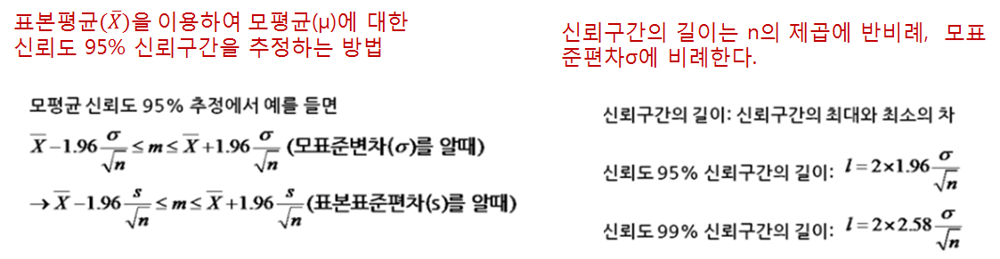

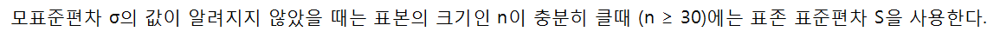


```R
> N <- 10000
> X <- 165.1
> S <- 2
> low <- X-1.96 * S/sqrt(N) #신뢰구간의 하한값
> high <- X+1.96 * S/sqrt(N) #신뢰구간의 상한값
> low;high
[1] 165.0608
[1] 165.1392
> N <- 10000
> X <- 165.1
> S <- 2
> low <- X-1.96 * S/sqrt(N)   #신뢰구간의 하한값
> high <- X+1.96 * S/sqrt(N)   #신뢰구간의 상한값
> low;high
[1] 165.0608
[1] 165.1392
> # 신뢰구간으로 표본 오차
> # 하한값-평균신장 , 상한값-평균신장 값을 백분율로 적용
> (low-X)  * 100
[1] -3.92
> (high-X) * 100
[1] 3.92
# 신뢰구간의 표본 오차는 ±3.92

#해석 : 우리나라  중학교 2학년 남학생의 평균 신장이 95%신뢰수준에서 표본 오차는 ±3.92 범위에서 
#평균 165.1cm로 조사되었다면 실제 평균키는 165.0608 ~165.1392 사이에 나나탈 수 있다


```


### 표본오차

- 표본이 모집단의 특성과 정확히 일치하지 않아서 발생하는 확률의 차이
- 신뢰구간의 하한값에서 평균을 빼고, 상한값에서 평균을 뺀 값을 백분율로 적용

### 모 비율의 구간 추정

- 모비율(p) : 모집단에서 어떤 사건에 대한 비율  예) 제품의 불량율, 대선 후보 지지율 
- 모비율 추정 : 모집단으로부터 임의추출한 표본에서 어떤 사건에 대한 비율인 표본비율(𝑝 ̂)을 이용하여 모비율을 추정


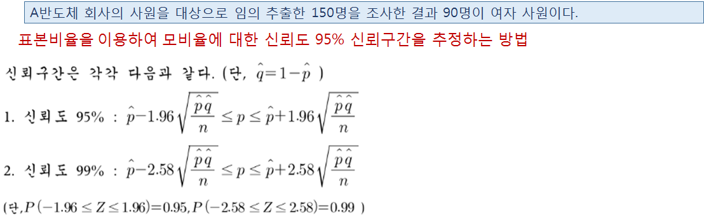


```R
##########표본의 비율로부터 모집단의 비율 구간 추정  ###################
#A반도체 회사의 사원을 대상으로 임의 추출한 150명을 조사한 결과 90명이 여자 사원이다
#표본 크기(n) : 150 
n <- 150
# 표본비율(????)  : 90/150 = 0.6
p <- 90/150
# 전체 여자 사원 비율 (모비율) 

> p-1.96 * sqrt(p*(1-p)/n)
[1] 0.5216
> p+1.96 * sqrt(p*(1-p)/n)
[1] 0.6784

#모집단의 비율 구간은 다음과 같습니다.  
0.5216 ≤ 모비율(P) ≤ 0.6784


```


### 단일 집단 검정

- 한 개의 집단과 기존 집단과의 비율 차이 검정은 기술 통계량으로 빈도수에 대한 비율에 의미가 있으며, 평균
  차이 검정은 표본 평균에 의미가 있다.


### 단일 집단 비율 검정   

- 단일 집단의 비율이 어떤 특정한 값과 같은지를 검정하는 방법
- 데이터 전처리 (이상치와 결측치 제거) -> 기술통계량(빈도분석) -> binom.test() -> 검정통계량 분석
- 비율 차이 검정 통계량을 바탕으로 귀무가설의 기각 여부를 결정한다


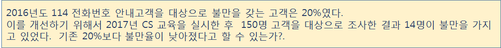


### 이항분포 비율 검정  

- 명목척도의 비율을 바탕으로 binom.test()를 이용하여 이항분포의 양측 검정을 통해서 검정 통계량을 구한 후 이를 이용하여 가설을 검정
- 이항분포는 이산변량이며, 그래프는 좌우대칭인 종 모양의 곡선 형태를 갖는다.


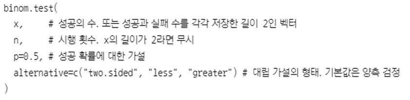


- alternative=“two.sided”은 양측 검정을 의미
- conf.level=0.95는 95% 신뢰수준을 의미
- 귀무가설이 모평균=상수 일때와 모 평균 = 상수가 아닐때 양측가설 검정을 수행하고 방향성이 있는 경우 단측가설 검정을 수행
- alternative=“greater”은 방향성을 갖는 연구가설을 검정할 경우 이용된다.


### 양측검정

```R
> data <- read.csv(file.choose(), header = TRUE)
> head(data)
  no gender survey time
1  1      2      1  5.1
2  2      2      0  5.2
3  3      2      1  4.7
4  4      2      1  4.8
5  5      2      1  5.0
6  6      2      1  5.4
> str(data)
'data.frame':	150 obs. of  4 variables:
 $ no    : int  1 2 3 4 5 6 7 8 9 10 ...
 $ gender: int  2 2 2 2 2 2 2 2 2 1 ...
 $ survey: int  1 0 1 1 1 1 1 1 0 1 ...
 $ time  : num  5.1 5.2 4.7 4.8 5 5.4 NA 5 4.4 4.9 ...

> #변수 : 번호, 성별, 만족도(명목척도), 시간

> x <- data$survey
> x
  [1] 1 0 1 1 1 1 1 1 0 1 1 1 1 1 1 1 1 1 1 1 1 0 1 1
 [25] 1 1 0 1 1 1 1 1 1 1 0 1 1 1 1 1 1 0 1 1 1 1 1 1
 [49] 1 0 1 1 1 1 1 1 0 1 1 1 1 1 1 1 1 1 1 1 1 0 1 1
 [73] 1 1 1 1 1 1 0 1 1 1 1 1 1 1 1 0 1 1 1 1 1 1 1 1
 [97] 1 1 1 0 1 1 1 1 1 1 1 1 1 1 1 1 1 0 1 1 1 1 1 1
[121] 1 1 1 1 1 1 1 1 1 1 1 1 1 1 1 1 0 1 1 1 1 1 1 1
[145] 1 1 1 1 1 1
> summary(x)
   Min. 1st Qu.  Median    Mean 3rd Qu.    Max. 
 0.0000  1.0000  1.0000  0.9067  1.0000  1.0000 
> length(x)
[1] 150
> table(x) #0:불만족, 1:만족
x
  0   1 
 14 136 


> library(prettyR)
> freq(x) #결측치 확인

Frequencies for x 
        1    0   NA
      136   14    0
%    90.7  9.3    0 
%!NA 90.7  9.3

> #만족도(명목척도)의 비율을 바탕으로 binom.test() 이항분포 양측검정 수행 -> 검정 통계량 -> 가설 검정
> binom.test(c(136,14), p=0.8)

	Exact binomial test

data:  c(136, 14)
number of successes = 136, number of trials =
150, p-value = 0.0006735
alternative hypothesis: true probability of success is not equal to 0.8
95 percent confidence interval:
 0.8483615 0.9480298
sample estimates:
probability of success 
             0.9066667 


> binom.test(c(136,14), p=0.8, alternative = "two.sided", conf.level = 0.95)

	Exact binomial test

data:  c(136, 14)
number of successes = 136, number of trials =
150, p-value = 0.0006735
alternative hypothesis: true probability of success is not equal to 0.8
95 percent confidence interval:
 0.8483615 0.9480298
sample estimates:
probability of success 
             0.9066667 

#해석 : p-value 유의확률 0.0006735로 유의수준 0.05보다 작기 때문에 기존 만족률(80%)과 차이가 있다


```


### 단측검정

```R
#방향성을 갖는 단측 검정 수행 (더 큰 비율인가? 검정)
> binom.test(c(136,14), p=0.8, alternative = "greater", conf.level = 0.95)

	Exact binomial test

data:  c(136, 14)
number of successes = 136, number of trials =
150, p-value = 0.0003179
alternative hypothesis: true probability of success is greater than 0.8
95 percent confidence interval:
 0.8579426 1.0000000
sample estimates:
probability of success 
             0.9066667 

#해석 : p-value 유의확률 0.0003179로 유의수준 0.05보다 작기 때문에 기존 만족률 80%  이상의 효과를 얻을 수 있다 
 #CS 교육후에 고객의 불만율은 낮아졌다고 할 수 있습니다. 귀무가설은 기각이고 연구가설이 채택되므로 CS교육에 효과가 있다.

> #불만율 기준 비율 검정
> #불만율 기준 비율 검정
> binom.test(c(14, 136), p=0.2)

	Exact binomial test

data:  c(14, 136)
number of successes = 14, number of trials =
150, p-value = 0.0006735
alternative hypothesis: true probability of success is not equal to 0.2
95 percent confidence interval:
 0.05197017 0.15163853
sample estimates:
probability of success 
            0.09333333 

> binom.test(c(14, 136), p=0.2,  alternative="less", conf.level=0.95)

	Exact binomial test

data:  c(14, 136)
number of successes = 14, number of trials =
150, p-value = 0.0003179
alternative hypothesis: true probability of success is less than 0.2
95 percent confidence interval:
 0.0000000 0.1420574
sample estimates:
probability of success 
            0.09333333 

> binom.test(c(14, 136), p=0.2,  alternative="less", conf.level=0.95)

	Exact binomial test

data:  c(14, 136)
number of successes = 14, number of trials =
150, p-value = 0.0003179
alternative hypothesis: true probability of success is less than 0.2
95 percent confidence interval:
 0.0000000 0.1420574
sample estimates:
probability of success 
            0.09333333 


```


### 단일집단  평균 검정  


- 단일집단의 평균이 어떤 특정한 집단의 평균과 차이가 있는지를 검정하는 방법

- 데이터 전처리 (이상치와 결측치 제거) -> 기술통계량(평균) -> 정규분포( shapiro.test()) -> t.test() 또는 wilcox.test()  -> 검정통계량 분석

- 모수 검정인 경우 T검정을 수행

- 비모수 검정인 경우 Wilcox 검정을 수행


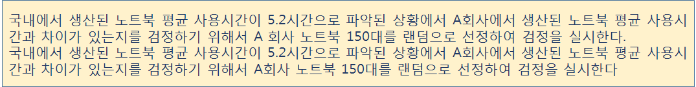


#### 단일표본 t-test

```R
> head(data)
  no gender survey time
1  1      2      1  5.1
2  2      2      0  5.2
3  3      2      1  4.7
4  4      2      1  4.8
5  5      2      1  5.0
6  6      2      1  5.4
> str(data)
'data.frame':	150 obs. of  4 variables:
 $ no    : int  1 2 3 4 5 6 7 8 9 10 ...
 $ gender: int  2 2 2 2 2 2 2 2 2 1 ...
 $ survey: int  1 0 1 1 1 1 1 1 0 1 ...
 $ time  : num  5.1 5.2 4.7 4.8 5 5.4 NA 5 4.4 4.9 ...
> x <- data$time
> summary(x)
   Min. 1st Qu.  Median    Mean 3rd Qu.    Max. 
  3.000   5.000   5.500   5.557   6.200   7.900 
   NA's 
     41 
> length(x)
[1] 150
> mean(x, na.rm = T)
[1] 5.556881
> x1 <- na.omit(x)
> mean(x1)
[1] 5.556881


hist(x1)  
#stats패키지에서 정규성 검정 - qqnorm(), qqline()는 정규분포 시각화
install.packages("stats")
library(stats)
qqnorm(x1)
qqline(x1, lty=1, col='blue')
```

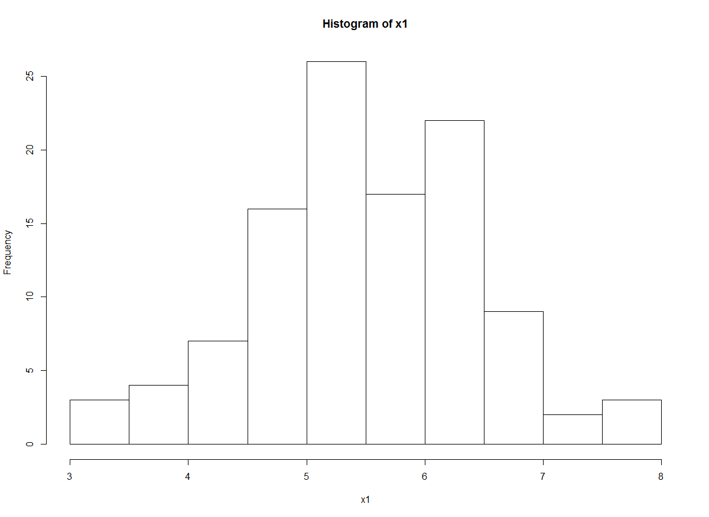

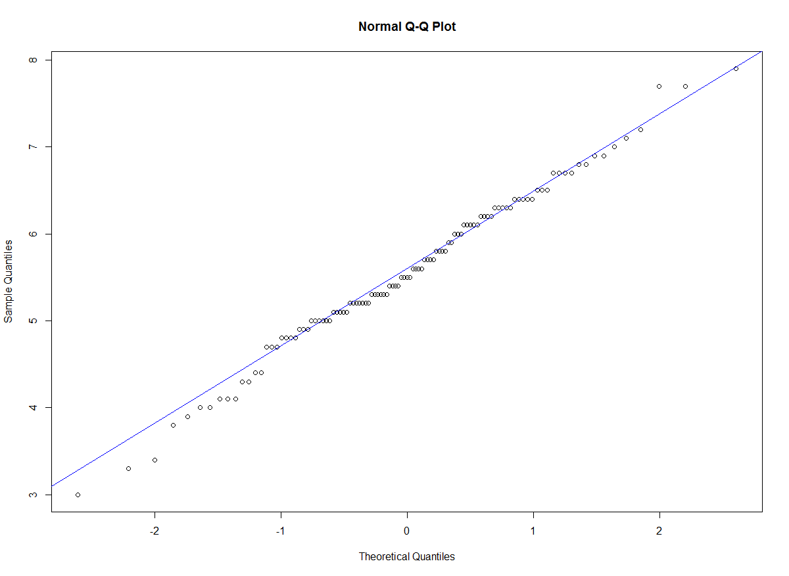


```R
> # 모수 검정 :T-검정 
> t.test(x1, mu=5.2)  #x1객체와 기존 모집단의 평균 5.2시간 비교

	One Sample t-test

data:  x1
t = 3.9461, df = 108, p-value = 0.0001417
alternative hypothesis: true mean is not equal to 5.2
95 percent confidence interval:
 5.377613 5.736148
sample estimates:
mean of x 
 5.556881 

> t.test(x1, mu=5.2, alter="two.side", conf.level=0.95)

	One Sample t-test

data:  x1
t = 3.9461, df = 108, p-value = 0.0001417
alternative hypothesis: true mean is not equal to 5.2
95 percent confidence interval:
 5.377613 5.736148
sample estimates:
mean of x 
 5.556881 

#해석 : 검정 통계량 p-value 값은 0.0001417 로 유의수준 0.05보다 작기 때문에
#국내에서 생산된 노트북과 A회사에서 생산된 노트북의 평균 사용시간에 차이가 있다
#x1의 평균은 5.55688(점추정)는 신뢰구간에 포함되고
#A회사에서 생산된 노트북의 평균 사용시간 5.2는 신뢰구간을 벗어나므로 귀무가설이 기각된다

> #방향성을 갖는 단측 검정
> t.test(x1, mu=5.2, alter="greater", conf.level=0.95)

	One Sample t-test

data:  x1
t = 3.9461, df = 108, p-value = 7.083e-05
alternative hypothesis: true mean is greater than 5.2
95 percent confidence interval:
 5.406833      Inf
sample estimates:
mean of x 
 5.556881 

#연구가설 : '국내에서 생산된 노트북 평균 사용시간이  A회사에서 생산된 노트북의 평균 사용시간보다 더 길다'
#해석 : 검정 통계량 p-value 값은 7.083e-6로 유의수준 0.05보다 매우 작기 때문에 
#귀무가설 :'A회사에서 생산된 노트북의 평균 사용시간이 국내에서 생산된 노트북 평균 사용시간보다 더 길다'고 할 수 있다.


> qt(7.083e-6, 108) 
[1] -4.549031
> #귀무가설 임계값 계산 qt(p-value, df)
> #귀무가설을 기각할 수 있는 임계값  
> qt(7.083e-6, 108) 
[1] -4.549031
> 
> #계산 결과


> #두 집단의 비율 차이 검정
> #prop.test ('pt교육 만족도와 코딩교육 만족도', '교육방법에 대한 변량-시행횟수')
> prop.test(c(110, 135), c(150, 150))

	2-sample test for equality of proportions with
	continuity correction

data:  c(110, 135) out of c(150, 150)
X-squared = 12.824, df = 1, p-value = 0.0003422
alternative hypothesis: two.sided
95 percent confidence interval:
 -0.25884941 -0.07448392
sample estimates:
   prop 1    prop 2 
0.7333333 0.9000000 

> prop.test(c(110, 135), c(150, 150), alter="two.sided", conf.level=0.95)

	2-sample test for equality of proportions with
	continuity correction

data:  c(110, 135) out of c(150, 150)
X-squared = 12.824, df = 1, p-value = 0.0003422
alternative hypothesis: two.sided
95 percent confidence interval:
 -0.25884941 -0.07448392
sample estimates:
   prop 1    prop 2 
0.7333333 0.9000000 


#해석 : 검정 통계량 p-value 값은 0.0003422로 유의수준 0.05보다 작기 때문에 두 교육방법 간의 만족도에 차이가 있다 (연구가설 채택)
#검정 통계량 X-squared로 가설 검정을 수행하면 df 1일때 기각역은 3.84이고 X-squared 12.82..가 더 크기 때문에 귀무가설을 기각할 수 있다


```


### 두 집단 평균 검정(독립표본 T검정)


```R
> #기술통계량(평균)
> length(ascore)
[1] 227
> a <- subset(result, method == 1)
> b <- subset(result, method == 2)
> ascore <- a$score
> bscore <- b$score
> #기술통계량(평균)
> length(ascore)
[1] 109
> length(bscore)
[1] 118

> mean(ascore)
[1] 5.556881
> mean(bscore)
[1] 5.80339
> #분산의 동질성 검정
> var.test(ascore, bscore)

	F test to compare two variances

data:  ascore and bscore
F = 1.2158, num df = 108, denom df = 117,
p-value = 0.3002
alternative hypothesis: true ratio of variances is not equal to 1
95 percent confidence interval:
 0.8394729 1.7656728
sample estimates:
ratio of variances 
          1.215768 


#해석 : 검정 통계량 p-value 값은 0.3002 로 유의수준 0.05보다 크기 때문에 
#두 집단 간의 분포 형태가 동일하다고 볼 수 있다.


> t.test(ascore, bscore)

	Welch Two Sample t-test

data:  ascore and bscore
t = -2.0547, df = 218.19, p-value = 0.0411
alternative hypothesis: true difference in means is not equal to 0
95 percent confidence interval:
 -0.48296687 -0.01005133
sample estimates:
mean of x mean of y 
 5.556881  5.803390 

> # 두 집단 평균 차이 검정
> t.test(ascore, bscore)

	Welch Two Sample t-test

data:  ascore and bscore
t = -2.0547, df = 218.19, p-value = 0.0411
alternative hypothesis: true difference in means is not equal to 0
95 percent confidence interval:
 -0.48296687 -0.01005133
sample estimates:
mean of x mean of y 
 5.556881  5.803390 

> t.test(ascore, bscore, alter="two.sided", conf.int=TRUE, conf.level=0.95)

	Welch Two Sample t-test

data:  ascore and bscore
t = -2.0547, df = 218.19, p-value = 0.0411
alternative hypothesis: true difference in means is not equal to 0
95 percent confidence interval:
 -0.48296687 -0.01005133
sample estimates:
mean of x mean of y 
 5.556881  5.803390 

#해석 : 검정 통계량 p-value 값은 0.0411로 유의수준 0.05보다 작기 때문에
#두 집단간의 평균에 차이가 있다

> #단측 가설 검정 (ascore가 기준으로 비교 -> ascore보다 bscore가 더 큰지 여부)
> t.test(ascore, bscore, alter="greater", conf.int=TRUE, conf.level=0.95)

	Welch Two Sample t-test

data:  ascore and bscore
t = -2.0547, df = 218.19, p-value = 0.9794
alternative hypothesis: true difference in means is greater than 0
95 percent confidence interval:
 -0.4446915        Inf
sample estimates:
mean of x mean of y 
 5.556881  5.803390 

#해석 : 검정 통계량 p-value 값은 0.9794로 유의수준 0.05보다 크기 때문에
#pt교육보다 코딩교육의 실기 점수 평균이 더 크다


> t.test(ascore, bscore, alter="less", conf.int=TRUE, conf.level=0.95)

	Welch Two Sample t-test

data:  ascore and bscore
t = -2.0547, df = 218.19, p-value = 0.02055
alternative hypothesis: true difference in means is less than 0
95 percent confidence interval:
        -Inf -0.04832672
sample estimates:
mean of x mean of y 
 5.556881  5.803390 

#해석 : 검정 통계량 p-value 값은 0.02055로 유의수준 0.05보다 작기 때문에
#pt교육이 코딩교육의 실기 점수 평균이 더 낮다

```


### 대응 두 집단 평균 검정(대응 표본 T검정)


```R
> data <- read.csv("./data4/paired_sample.csv", header=TRUE)
> head(data)
  no before after
1  1    5.1   6.3
2  2    5.2   6.3
3  3    4.7   6.5
4  4    4.8   5.9
5  5    5.0   6.5
6  6    5.4   7.3
> str(data)  
'data.frame':	100 obs. of  3 variables:
 $ no    : int  1 2 3 4 5 6 7 8 9 10 ...
 $ before: num  5.1 5.2 4.7 4.8 5 5.4 5 5 4.4 4.9 ...
 $ after : num  6.3 6.3 6.5 5.9 6.5 7.3 5.9 6.2 6 7.2 ...


data <- read.csv("./data4/paired_sample.csv", header=TRUE)
head(data)
str(data)  

result <- subset(data, !is.na(after), c(before, after))

> length(result$before)  #결측치 4개 제외됨
[1] 96
> length(result$after)
[1] 96


> x <- result$before
> y <- result$after
> mean(x)
[1] 5.16875
> mean(y)
[1] 6.220833


> var.test(x, y, paired = TRUE)

	F test to compare two variances

data:  x and y
F = 1.0718, num df = 95, denom df = 95, p-value
= 0.7361
alternative hypothesis: true ratio of variances is not equal to 1
95 percent confidence interval:
 0.7151477 1.6062992
sample estimates:
ratio of variances 
          1.071793 

> #평균 차이 검정
> t.test(x, y, paired=TRUE, alter="two.sided", conf.int=TRUE, conf.level=0.95)

	Paired t-test

data:  x and y
t = -13.642, df = 95, p-value < 2.2e-16
alternative hypothesis: true difference in means is not equal to 0
95 percent confidence interval:
 -1.205184 -0.898983
sample estimates:
mean of the differences 
              -1.052083 

#해석 : 검정 통계량 p-value 값은  2.2e-16 로 유의수준 0.05보다 매우 작기 때문에
#두 집단간의 평균에 차이가 있다 

> t.test(x, y, paired=TRUE, alter="less", conf.int=TRUE, conf.level=0.95)

	Paired t-test

data:  x and y
t = -13.642, df = 95, p-value < 2.2e-16
alternative hypothesis: true difference in means is less than 0
95 percent confidence interval:
       -Inf -0.9239849
sample estimates:
mean of the differences 
              -1.052083 

#해석 : 검정 통계량 p-value 값은 2.2e-16 로 유의수준 0.05보다 매우 작기 때문에
#x 집단 평균이 y집단의 평균보다 작다고 할 수 있다


```


### 세집단 검정 

- 비율 차이 검정은 기술 통계량으로 빈도수에 대한 비율에 의미가 있으며, 세 집단의 평균 차이 검정은 분산 분석이라고 한다.


### 세집단 비율검정

- 데이터 전처리 -> 세 집단  subset 작성 -> prop.test()  -> 검정통계량 분석


```R
> data <- read.csv("./data4/three_sample.csv", header=TRUE)
> head(data)
  no method survey score
1  1      1      1   3.2
2  2      2      0    NA
3  3      3      1   4.7
4  4      1      0    NA
5  5      2      1   7.8
6  6      3      1   5.4
> str(data)
'data.frame':	150 obs. of  4 variables:
 $ no    : int  1 2 3 4 5 6 7 8 9 10 ...
 $ method: int  1 2 3 1 2 3 1 2 3 1 ...
 $ survey: int  1 0 1 0 1 1 0 0 1 0 ...
 $ score : num  3.2 NA 4.7 NA 7.8 5.4 NA 8.4 4.4 2.8 ...


> method <- data$method
> survey <- data$survey
> table(method, useNA = "ifany")
method
 1  2  3 
50 50 50 
> table(method, survey, useNA = "ifany") #교차분할표
      survey
method  0  1
     1 16 34
     2 13 37
     3 11 39
> #prop.test((교육방법에 대한 만족 빈도수), (변량의 길이))
> prop.test(c(34,37,39), c(50,50,50))

	3-sample test for equality of proportions
	without continuity correction

data:  c(34, 37, 39) out of c(50, 50, 50)
X-squared = 1.2955, df = 2, p-value = 0.5232
alternative hypothesis: two.sided
sample estimates:
prop 1 prop 2 prop 3 
  0.68   0.74   0.78 


#해석 : 검정 통계량 p-value 값은  0.5232로 유의수준 0.05보다
#세 교육방법 간의 만족도에 차이가 없다 (귀무가설 채택)

#X-squared 검정 통계량 1.2955는 df 2의 기각값은 5.991보다 작기 때문에 귀무가설을 기각할 수 없다


```


### 분산분석 (F 검정)


- 분산분석(ANOVA  Analysis)-  T 검정과 동일하게 평균에 의한 차이 검정 방법
- 두 집단 이상의 평균 차이를 검정
  - 예) 의학연구 분야에서 개발된 3가지 치료제가 있다고 가정할 때, 이 3가지 치료제의 효과에 차이가 있는지를 검정
- 분산분석은 가설 검정을 위해 F 분포를 따른 F 통계량을  검정 통계량으로 사용하기 때문에 F검정이라고 한다.
-  데이터 전처리 -> 각 집단 subset 작성 -> 기술 통계량(평균)  ->  동질성분포 (barlett.test()) -> aov() 또는 kruskal.test() -> TukeyHSD()

- 분석에서 집단 간의 동질성 여부를 검정하기 위해서는 bartlett.test()를 이용

- 집단 간의 분포가 동질한 경우 분산분석을 수행하는  aov() 함수를 이용

- 비모수 검정 방법인 kruskal.test() 를 이용하여 분석을 수행하고, 

- 마지막으로 TukeyHSD() 함수를 이용하여 사후 검정을 수행한다

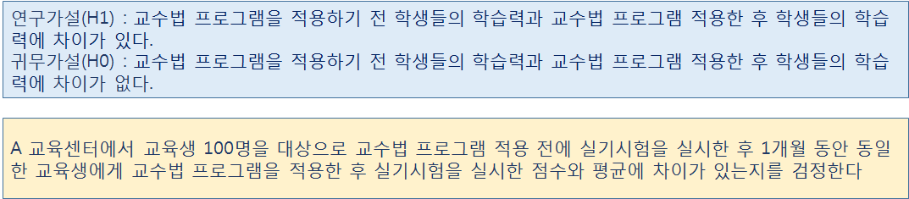


##### 세 집단의 평균 차이 분석

````R
> data <- read.csv("./data4/three_sample.csv", header=TRUE)
> head(data)
  no method survey score
1  1      1      1   3.2
2  2      2      0    NA
3  3      3      1   4.7
4  4      1      0    NA
5  5      2      1   7.8
6  6      3      1   5.4
> str(data) #method, score
'data.frame':	150 obs. of  4 variables:
 $ no    : int  1 2 3 4 5 6 7 8 9 10 ...
 $ method: int  1 2 3 1 2 3 1 2 3 1 ...
 $ survey: int  1 0 1 0 1 1 0 0 1 0 ...
 $ score : num  3.2 NA 4.7 NA 7.8 5.4 NA 8.4 4.4 2.8 ...

> data <- subset(data, !is.na(score), c(method, score))  #결측치 제거
> head(data)
  method score
1      1   3.2
3      3   4.7
5      2   7.8
6      3   5.4
8      2   8.4
9      3   4.4


> plot(data$score) #산점도

````

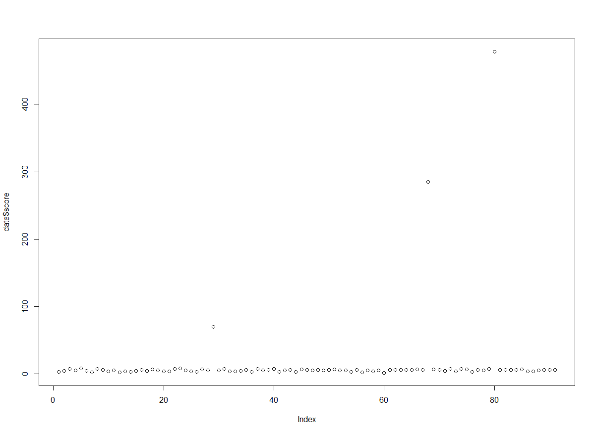


```R
> barplot(data$score)
```

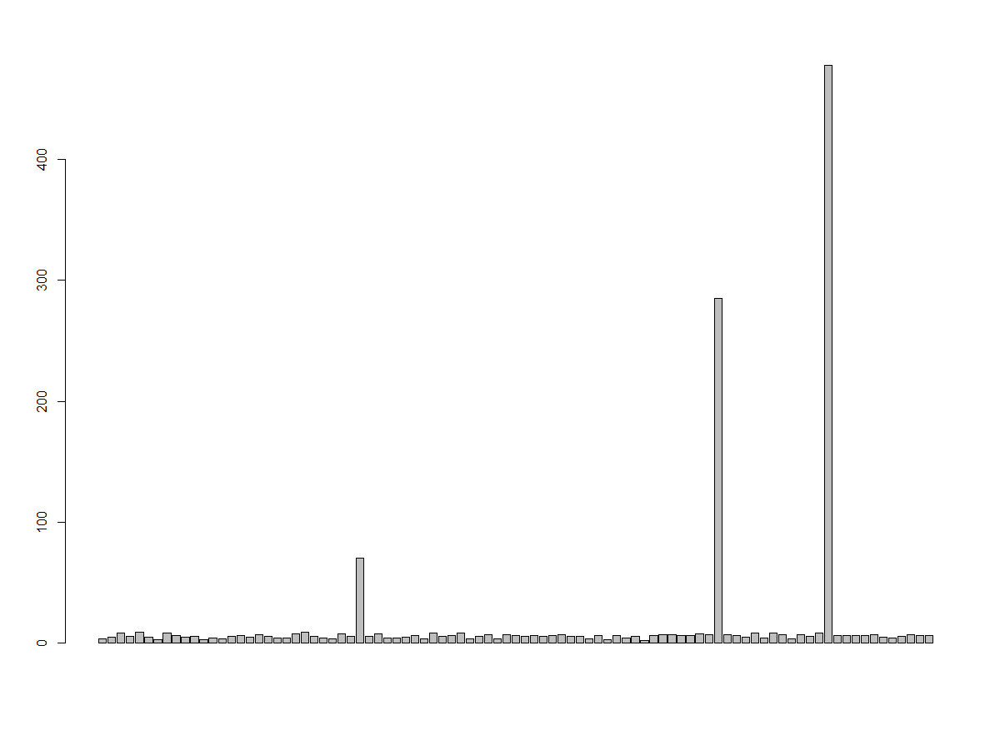


```R
> mean(data$score)
[1] 14.44725

> length(data$score) #이상치 제거 전 데이터 개수 : 91
[1] 91

> data2 <- subset(data, score<=14)
> length(data2$score)   # 이상치 제거 개수 :88
[1] 88


> x <- data2$score
> boxplot(x)

```

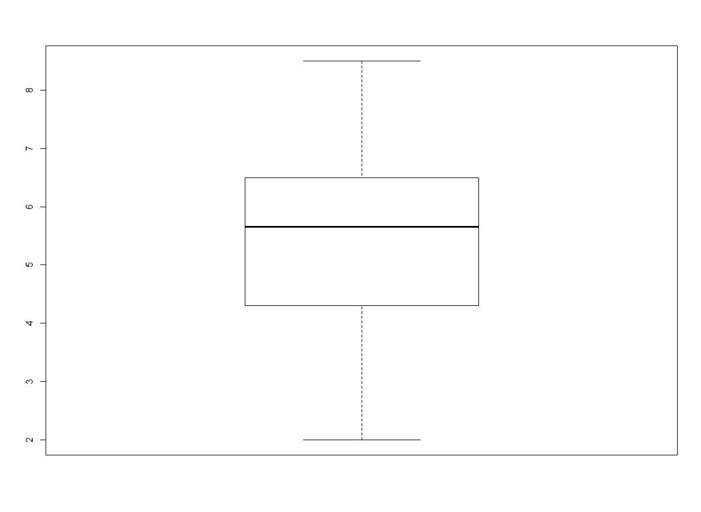

##### 

```R
#교육방법에 따른 세 집단의 subset 생성

> data2$method2[data2$method==1] <- "방법1"
> data2$method2[data2$method==2] <- "방법2"
> data2$method2[data2$method==3] <- "방법3"

#교육방법에 따른 빈도수
> mCnt <- table(data2$method2)
> mAvg <- tapply(data2$score, data2$method2, mean)

> df <- data.frame(교육방법 = mCnt, 성적 = mAvg)
> df
      교육방법.Var1 교육방법.Freq     성적
방법1         방법1            31 4.187097
방법2         방법2            27 6.800000
방법3         방법3            30 5.610000


> #세 집단의 동질성 검정
> #bartlett.test(종속변수 ~ 독립변수, data = 데이터셋)
> bartlett.test(score ~ method, data = data2)

	Bartlett test of homogeneity of variances

data:  score by method
Bartlett's K-squared = 3.3157, df = 2, p-value
= 0.1905


#해석 : 검정 통계량 p-value 값은 0.1905 로 유의수준 0.05보다 크기 때문에 세 집단 간으 분포 형태가 동질하다고 볼 수 있다.

#세 집단의 평균 차이 검정 : aov()
help(aov) #aov(종속변수 ~ 독립변수, data = 데이터 셋)
> result <- aov(score ~ method2, data = data2)
> names(result)
 [1] "coefficients"  "residuals"     "effects"      
 [4] "rank"          "fitted.values" "assign"       
 [7] "qr"            "df.residual"   "contrasts"    
[10] "xlevels"       "call"          "terms"        
[13] "model"        
> summary(result)
            Df Sum Sq Mean Sq F value   Pr(>F)    
method2      2  99.37   49.68   43.58 9.39e-14 ***
Residuals   85  96.90    1.14                     
---
Signif. codes:  
0 ‘***’ 0.001 ‘**’ 0.01 ‘*’ 0.05 ‘.’ 0.1 ‘ ’ 1

#해석 : 검정 통계량 p-value 값은 9.39e-14 로 유의수준 0.05보다 매우 작기 때문에
#교육방법에 따른 세 집단 간의 실기시험 평균에 차이가 있다 (연구가설 채택)

#F 검정 통계량 43.58은  -1.96 ~ +1.96 범위의 귀무가설의 채택역에 해당하지 않으므로
#귀무가설을 기각할 수 있다 (귀무가설을 기각하고 연구가설 채택)


#집단간의 평균의 차에 대한 비교 => 사후 검정 수행
 
> TukeyHSD(result)  #분산분석 결과로 사후 검정
  Tukey multiple comparisons of means
    95% family-wise confidence level

Fit: aov(formula = score ~ method2, data = data2)

$method2
                 diff        lwr        upr     p adj
방법2-방법1  2.612903  1.9424342  3.2833723 0.0000000
방법3-방법1  1.422903  0.7705979  2.0752085 0.0000040
방법3-방법2 -1.190000 -1.8656509 -0.5143491 0.0001911


> #diff 폭(평균의 차이)의 크기
#lwr, upr은 신뢰구간의 하한값과 상한값
> plot(TukeyHSD(result))

```

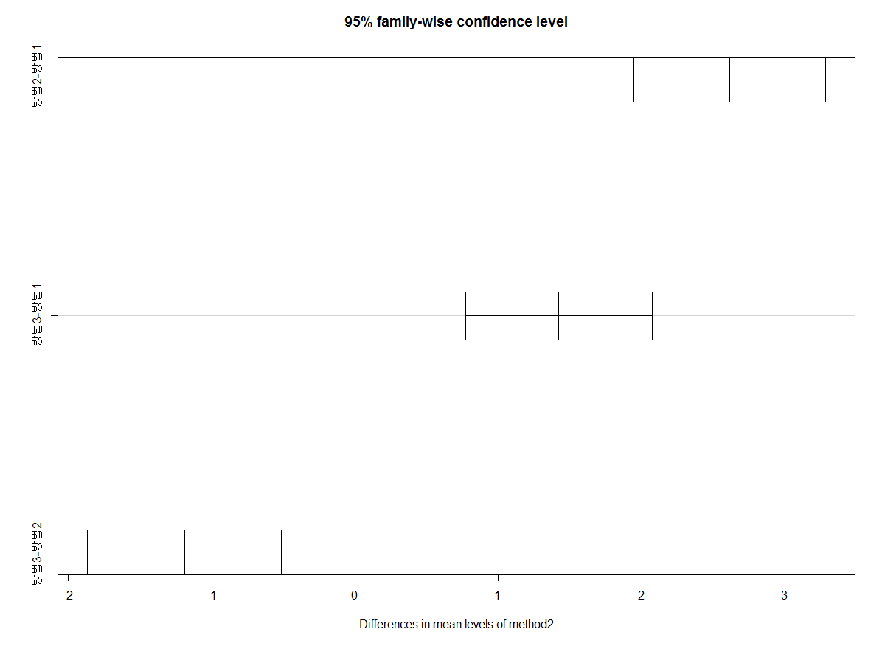


```R
#결론 :교육방법에 따른 세 집단 간의 실기시험 평균에 차이가 있으며 세 교육방법에 따른 분석 결과 방법2와 방법1의 차이가 가장 높다
```


### 연습문제

#### 연습문제01>

```R
연습문제01>
중소기업에서 생산한 HDTV 판매율을 높이기 위해서 프로모션을 진행한 결과 기존 구
매비율 보다 15% 향상되었는지를 각 단계별로 분석을 수행하여 검정하시오.
연구가설(H1) : 기존 구매비율과 차이가 있다.
귀무가설(H0) : 기존 구매비율과 차이가 없다.
조건) 구매여부 변수 : buy (1: 구매하지 않음, 2: 구매)
hdtv <- read.csv("hdtv.csv", header=TRUE)


> binom.test(c(40,10), p=0.15)

	Exact binomial test

data:  c(40, 10)
number of successes = 40, number of trials =
50, p-value < 2.2e-16
alternative hypothesis: true probability of success is not equal to 0.15
95 percent confidence interval:
 0.6628169 0.8996978
sample estimates:
probability of success 
                   0.8 


#해설> 귀무가설 채택 : 기존 구매비율(15%)과 차이가 없다.


> #  방향성이 있는 단측가설 검정
> binom.test(c(10,40), p=0.15, alternative="greater", conf.level=0.95)

	Exact binomial test

data:  c(10, 40)
number of successes = 10, number of trials =
50, p-value = 0.2089
alternative hypothesis: true probability of success is greater than 0.15
95 percent confidence interval:
 0.1127216 1.0000000
sample estimates:
probability of success 
                   0.2 

> #p-value=0.2089
> binom.test(c(10,40), p=0.15, alternative="less", conf.level=0.95) #p-value =0.8801

	Exact binomial test

data:  c(10, 40)
number of successes = 10, number of trials =
50, p-value = 0.8801
alternative hypothesis: true probability of success is less than 0.15
95 percent confidence interval:
 0.0000000 0.3155961
sample estimates:
probability of success 
                   0.2 
#해설> 방향성이 잇는 단측가설은 모두 기각된다.


> binom.test(c(10,40), p=0.11, alternative="greater", conf.level=0.95)

	Exact binomial test

data:  c(10, 40)
number of successes = 10, number of trials =
50, p-value = 0.04345
alternative hypothesis: true probability of success is greater than 0.11
95 percent confidence interval:
 0.1127216 1.0000000
sample estimates:
probability of success 
                   0.2 


#해설> 구매비율은 11%을 넘지 못한다.

```


#### 연습문제02>

```R

우리나라 전체 중학교 2학년 여학생 평균 키가 148.5cm로 알려져 있는 상태에서 A중
학교 2학년 전체 500명을 대상으로 10%인 50명을 표본으로 선정하여 표본평균신장을
계산하고 모집단의 평균과 차이가 있는지를 각 단계별로 분석을 수행하여 검정하시오.
단계1: 데이터셋 가져오기 
read.csv("student_height.csv", header=TRUE)
기술 통계량 평균 계산
정규성 검정
가설 검정


> t.test(data$height, mu=148.5)

	One Sample t-test

data:  data$height
t = 1.577, df = 49, p-value = 0.1212
alternative hypothesis: true mean is not equal to 148.5
95 percent confidence interval:
 148.2531 150.5469
sample estimates:
mean of x 
    149.4 
 
#p-value = 0.1212 정규분포를 따른다고 할 수 있다.
#여학생 평균 키는 차이 없다.


```


#### 연습문제03>

```R

대학에 진학한 남학생과 여학생을 대상으로 진학한 대학에 대해서 만족도에 차이가 있
는가를 검정하시오. 
조건1) 파일명 : two_sample.csv
조건2, 변수명 : gender(1,2), survey(0,1)


> method <- data$method
> survey <- data$survey
> table(method, useNA = "ifany")
method
  1   2 
150 150 
> table(method, survey, useNA = "ifany")
      survey
method   0   1
     1  40 110
     2  15 135
> prop.test(c(110, 135), c(150,150))

	2-sample test for equality of proportions with
	continuity correction

data:  c(110, 135) out of c(150, 150)
X-squared = 12.824, df = 1, p-value = 0.0003422
alternative hypothesis: two.sided
95 percent confidence interval:
 -0.25884941 -0.07448392
sample estimates:
   prop 1    prop 2 
0.7333333 0.9000000 

#만족도는 차이 있다.

```


```R

연습문제04>
교육방법에 따라 시험성적에 차이가 있는지 검정하시오. 
조건1) 파일 : twomethod.csv
조건2) 변수 : method(교육방법), score(시험성적)
조건3) 모델 : 교육방법(명목) -> 시험성적(비율)
조건4) 전처리 : 결측치 제거 


x <- result$method
a <- subset(result, method == 1)
b <- subset(result, method == 2)
ascore <- a$score
bscore <- b$score
var.test(ascore, bscore)
t.test(ascore, bscore)

> t.test(ascore, bscore)

	Welch Two Sample t-test

data:  ascore and bscore
t = -5.6056, df = 43.705, p-value = 1.303e-06
alternative hypothesis: true difference in means is not equal to 0
95 percent confidence interval:
 -17.429294  -8.209667
sample estimates:
mean of x mean of y 
 16.40909  29.22857 


#해석 : 검정 통계량 p-value 값은 1.303e-06로 유의수준 0.05보다 작기 떄문에
#교육방법간의 차이가 있다.
```

