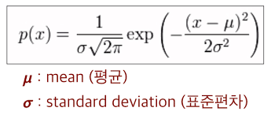

# 통계

## 표본조사

- 모집단 : 조사하고자 하는 대상 집단 전체
- 원소 : 모집단을 구성하는 개체
- 표본 : 조사하기 위해 추출된 모집단의 일부 원소
- 모수 : 모집단에 대한 정보

## 측정

### 질적척도

범주형자료, 숫자들의 크기 차이가 계산되지 않는 척도

- 명목척도 : 측정 대상이 어느 집단에 속하는지 분류할때 사용
  - 예) 성별, 출생지 구분
- 순서척도 : 측정 대상의 서열관계를 관측하는 척도 
  - 예) 만족도, 선호도, 학년, 신용등급

### 양적척도

수치형자료, 숫자들의 크기 차이를 계산 할 수 있는 척도

- 구간척도 : 측정 대상이 갖고 있는 속성의 양을 측정하는 것으로 구간이나 구간 사이의 간격이 의미가 있는 자료
  - 예) 온도, 지수
- 비율척도 : 간격에 대한 비율이 의미를 가지는 자료, 절대적인 기준인 0이 존재 하고 사칙연산이 가능하며 제일 많은 정보를 가지는 척도
  - 예) 무게, 나이, 시간, 거리

## 통계분석

### 기술통계

- 통계집단의 여러 특성을 수량화

### 통계적 추론

1. 모수추정 - 모수(평균, 분산 등)를 분석하여 모집단 추론
2. 가설검정 - 대상집단에 대해 특정한 가설을 설정한 후에 그 가설이 옳은지 그른지에 대한 채택여부를 결정하는 방법론
3. 예측 - 미래의 불확실성을 해결해 효율적인 의사결정을 하기위해 활용(예 : 회귀분석, 시계열 분석)

## 확률분포

### 이산형 확률변수

0이 아닌 확률값을 갖는 확률 변수를 셀 수 있는 경우(확률질량함수)

- 베르누이 확률분포
- 이항분포
- 기하분포
- 다항분포
- 포아송분포

### 연속형 확률변수

가능한 값이 실수의 어느 특정구간 전체에 해당하는 확률변수(확률밀도함수)

- 균일분포
- 정규분포
- 지수분포
- t - 분포
- χ2 - 분포
- F - 분포

# 기초통계분석

## 기술통계

### 중심위치의 측도

- 표본평균
- 중앙값

### 산포의 측도

- 분산
- 표준편차
- 사분위수(IQR)
- 백분위수
- 변동계수
- 평균의 표준오차

### 모수적 검정

### Z-검정

- 정규분포를 이용

- 정규분포식

- p - value는 정규분포식을 적분하면 된다. (너무 어렵다.)
- 그래서 z - 검정을 이용

