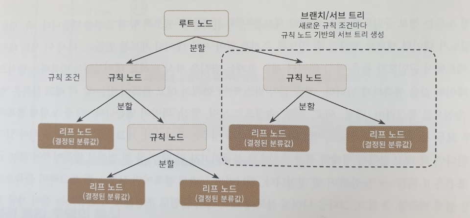
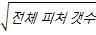
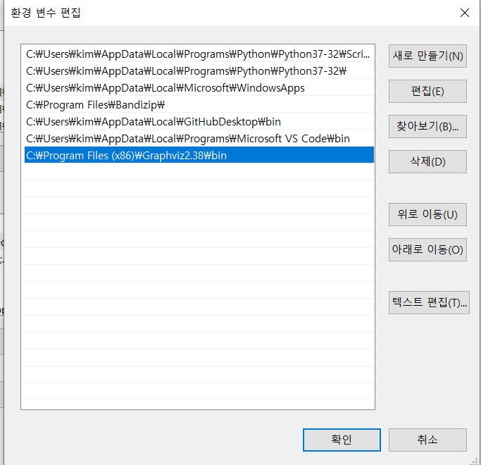
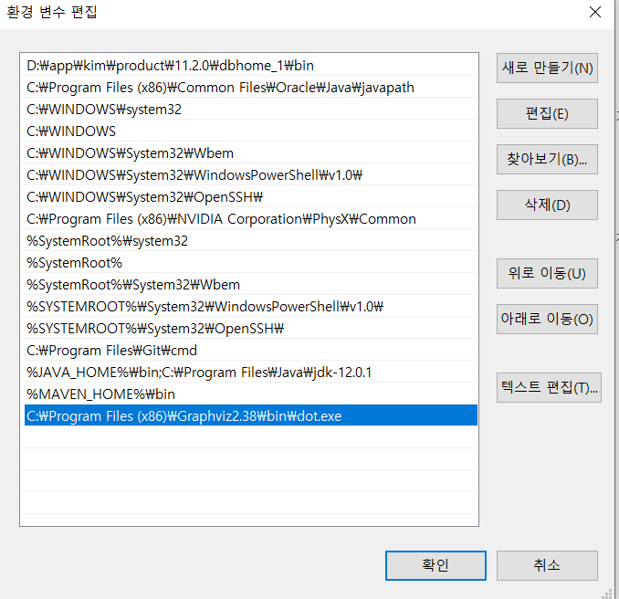
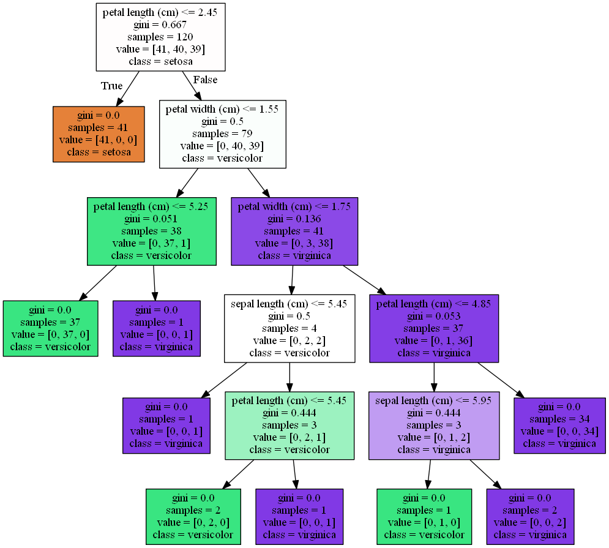

# 분류(Classification)

지도학습은 레이블(Lable), 즉 명시적인 정답이 있는 데이터가 주어진 상태에서 학습하는 머신러닝 방식이다. 지도학습의 대표적인 유형인 분류(Classification)는 학습 데이터로 주어진 데이터 피처와 레이블값(결정값, 클래스값)을 머신러닝 알고리즘으로 학습해 모델을 생성하고, 이렇게 생성된 모델에 새로운 데이터 값이 주어졌을 때 미지의 레이블 값을 예측한다.

## 분류 알고리즘

- 베이즈(Bayes) 통계와 생성 모델에 기반한 나이브 베이즈(Naive Bayes)
- 독립변수와 종속변수의 선형 관계성에 기반한 로지스틱 회귀(Logistic Regression)
- 데이터 균일도에 따른 규칙 기반의 결정 트리(Decision Tree)
- 개별 클래스 간의 최대 분류 마진을 효과적으로 찾아주는 서포트 벡터 머신(Support Vector Machin)
- 근접 거리를 기준으로 하는 최소 근접(Nearest Neighbor) 알고리즘
- 심층 연결 기반의 신경망(Neural Network)
- 서로 다른(또는 같은) 머신러닝 알고리즘을 결합한 앙상블(Ensemble)


## 결정 트리

결정 트리는 ML 알로리즘 중 직관적으로 이해하기 쉬운 알고리즘이다. 쉽게 생각하면 스무고개 게임과 유사하며 룰 기반의 프로그램에 적용되는 if, else를 자동으로 찾아내 예측을 위한 규칙을 만드는 알고리즘으로 이해하면 쉽다.



규칙 트리의 구조를 간단하게 나타낸 그림이다. 규칙노드(Decision Node)로 표시된 노드는 규칙 조건이 되는 것이고, 리프 노드(Leaf Node)로 표시된 노드는 결정된 클래스 값이다. 그리고 새로운 규칙 조건마다 서브 트리(Sub Tree)가 생성된다.


분류한 정보의 균일도를 측정하는 대표적인 방법으로 엔트로피를 이용한 정보 이득 지수와 지니 계수가 있다.

- 정보 이득 지수 : 엔트로피라는 개념을 기반으로 한다. 엔트로피는 주어진 데이터 집합의 혼잡도를 의미하는데, 서로 다른 값이 섞여 있으면 엔트로피가 높고, 같은 값이 섞여 있으면 엔트로피가 낮다. 정보 이득 지수는 1에서 엔트로피 지수를 뺀 값이다. 즉, 1-엔트로피 지수다. 결정 트리는 이 정보 이득 지수로 분할 기준을 정한다. 정보 이득이 높은 속성을 기준으로 분할한다.
- 지니 계수 : 원래 경제학에서 불평등 지수를 나타낼 때 사용하는 계수다. 경제학자인 코라도 지니의 이름에서 딴 계수로서 0이 가장 평등하고 1로 갈수록 불평등해진다. 머신러닝에 적용될 때는 의미론적으로 재해석돼 데이터가 다양한 값을 가질수록 평등하며 특정 값으로 쏠릴 경우에는 불평등한 값이 된다. 다양성이 낮을 수록 균일도가 높다는 의미로서, 1로 갈수록 균일도가 높으므로 지니 계수가 높은 속성을 기준으로 분할한다.


### 결정 트리 모델의 특징

| 결정 트리 장점                                               | 결정 트리 단점                                               |
| ------------------------------------------------------------ | ------------------------------------------------------------ |
| - 쉽다, 직관적이다.<br />- 피처의 스케일링이나 정규화 등의 사전 가공 영향도가 크지 않다.<br /> | - 과적합으로 알고리즘 성능이 떨어진다. 이를 극복하기 위해 트리의 크기를 사전에 제한하는 튜닝이 필요하다. |


### 결정 트리 파라미터

| 파라미터 명      | 설명                                                         |
| ---------------- | ------------------------------------------------------------ |
| min_sample_split | - 노드를 분할하기 위한 최소한의 샘플 데이터 수로 과적합을 제어하는 데 사용된다.<br />- 디폴트는 2개이고 작게 설정할수록 분할되는 노드가 많아져서 과적합 가능성 증가한다.<br />- 과적합을 제어. 1로 설정한 경우 분할되는 노드가 많아져서 과적합 가능성 증가한다. |
| min_sample_leaf  | - 말단 노드(Leaf)가 되기 위한 최소한의 샘플 데이터 수<br />- Min_sample_split와 유사하게 과적합 제어 용도. 그러나 비대칭적 데이터의 경우 특정 클래스의 데이터가 극도로 작을 수 있으므로 이 경우는 작게 설정 |
| max_features     | - 최적의 분할을 위해 고려할 최대 피처 개수. 디폴트는 None으로 데이터 세트의 모든 피처를 사용해 분할 수행<br />- int 형으로 지정하면 대상 피처의 개수, float 형으로 지정하면 전체 피처 중 대상 피처의 퍼센트임<br />- 'sqrt'는 전체 피처 중 sqrt(전체 피처 개수), 즉  만큼 선정<br />- 'auto'로 지정하면 sqrt와 동일<br />- 'log'는 전체 피처 중 log2(전체 피처 개수) 선정<br />- 'None'은 전체 피초 선정 |
| max_depth        | - 트리의 최대 깊이를 규정.<br />- 디폴트는 None, None으로 설정하면 완벽하게 클래스 결정 값이 될 때까지 깊이를 계속 키우며 분할하거나 노드가 가지는 데이터 개수가 min_samples_split보다 작아질 때까지 계속 깊이를 증가시킴<br />- 깊이가 깊어지면 min_samples_split 설정대로 최대 분할하여 과적합할 수 있으므로 적절한 값으로 제어 필요. |
| max_leaf_nodes   | - 말단 노트(Leaf)의 최대 개수                                |


## 결정 트리 시각화

### Graphviz

[다운로드](https://graphviz.gitlab.io/_pages/Download/Download_windows.html)

#### 인스톨

```bash
$ pip install graphviz
Collecting graphviz
  Downloading https://files.pythonhosted.org/packages/f5/74/dbed754c0abd63768d3a7a7b472da35b08ac442cf87d73d5850a6f32391e/graphviz-0.13.2-py2.py3-none-any.whl
Installing collected packages: graphviz
Successfully installed graphviz-0.13.2
```


#### 설정






다음과 같이 환경 변수에 축가 해준다.


### 데이터 학습

```python
import sklearn
from sklearn.tree import DecisionTreeClassifier, export_graphviz
from sklearn.datasets import load_iris
from sklearn.model_selection import train_test_split
import warnings
warnings.filterwarnings('ignore')
import graphviz

# DecisionTree Classifier 생성
dt_clf = DecisionTreeClassifier(random_state=156)

# 붓꽃 데이터를 로딩하고, 학습과 테스트 데이터 세트로 분리
iris_data = load_iris()
X_train, X_test, y_train, y_test = train_test_split(iris_data.data, iris_data.target, test_size=0.2, random_state=11)

# DecisionTreeClassifer 학습
dt_clf.fit(X_train, y_train)
```


### 시각화

```python
# 시각화
# export_graphviz()의 호출 결과로 out_file로 지정된 tree.dot 파일을 생성함.
export_graphviz(dt_clf, out_file='tree.dot', class_names=iris_data.target_names, feature_names=iris_data.feature_names, impurity=True, filled=True)

# 위에서 생성된 tree.dot 파일을 Graphviz가 읽어서 시각화
with open('tree.dot') as f:
    dot_graph = f.read()
graphviz.Source(dot_graph)
```




- petal length(cm) <= 2.45와 같이 피처의 조건이 있는 자식 노드를 만들기 위한 규칙 조건 이다. 이 조건이 없으면 리프 노드다.
- gini는 다음의 value=[]로 주어진 데이터 분포에서의 지니 계수다.
- samples는 현 규칙에 해당하는 데이터 건수다.
- value = []는 클래스 값 기반의 데이터 건수다. 붓꽃 데이터 세트는 클래스 값으로 0, 1, 2를 가지고 있으며, 0 : Setosa, 1 : Versicolor, 2 : Virginica 품종을 가리킨다. 만일 Value = [41, 40, 39] 라면 클래스 값의 순서로 Setosa 41개 , Versicolor 40개, Virginica 39개로 주어진 데이터가 구성돼 있다는 의미다.