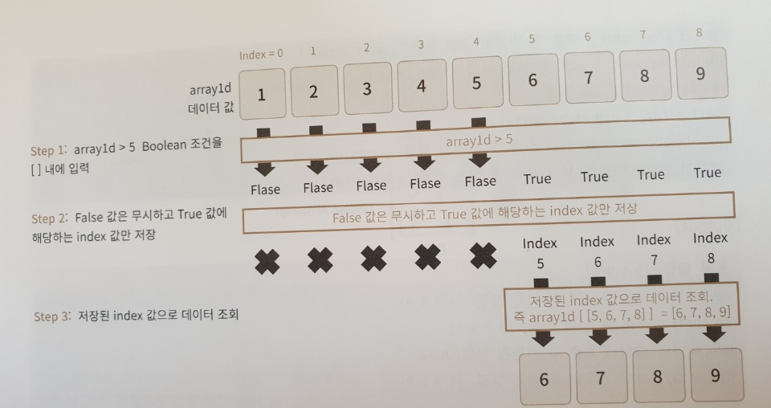

# Numpy

머신러닝의 주요 알고리즘은 선형대수와 통계이다. 선형대수는 수학뿐만 아니라 여러곳의 기본적으로 쓰이기떄문에 어려워도 배워보자. Numerical Python을 의미한다.


## ndarray


### 1차원 array

```python
import numpy as np #numpy import
array1 = np.array([1,2,3]) # 1차원 array에 3개 만든다.
print('array1 type:' , type(array1))
print('array1 array 형태:', array1.shape)
```

결과

```python
array1 type: <class 'numpy.ndarray'>
array1 array 형태: (3,)
```

array1은 [데이터]가 한개인 1차원 array이고 (3,)로 1차원 array임을 표현


###  2차원 array

```python
array2 = np.array([[1,2,3],
                 [2,3,4]])
print('array2 type:' , type(array2))
print('array2 array 형태:', array2.shape)
```

결과

```python
array2 type: <class 'numpy.ndarray'>
array2 array 형태: (2, 3)
```

array2는 [[데이터],[데이터]]로 이루어진 2차원 데이터로 2개의 로우와 3개의 칼럼으로 이루어져 있다.


```python
array3 = np.array([[1,2,3]])
print('array3 type:' , type(array3))
print('array3 array 형태:', array3.shape)
```


 결과

```python
array3 type: <class 'numpy.ndarray'>
array3 array 형태: (1, 3)
```

array3는 array1과 다를게 없다. 하지만 [[데이터]]로 2차원 배열로 생성했기때문에 (1,3)으로 표시된다.


### 3차원 array

```python
array4 = np.array([[[1,2,3]]])
print('array4 type:' , type(array4))
print('array4 array 형태:', array4.shape)
```

결과

```python
array4 type: <class 'numpy.ndarray'>
array4 array 형태: (1, 1, 3)
```

array4도 역시 array1과 다를것 없는 데이터지만 3차원으로 ([[[데이터]]]) 만들었기 때문에 (1,1,3)이라는 결과가 나온다.


이렇게 같은 데이터라도 차원이 다르면 오류가 발생할 수 있다. 이 경우 차원을 다루는법을 익혀 오류를 막을 수 있다.


## ndarray type

ndarray는 숫자, 문자, 불 값 등이 모두 가능하다.


### Integer

```python
import numpy as np

list1 = [1, 2, 3]
print(type(list1))
array1 = np.array(list1)
print(type(array1))
print(array1, array1.dtype)
```

결과

```python
<class 'list'>
<class 'numpy.ndarray'>
[1 2 3] int32
```


### String

```python
list2 = [1, 2, 'test']
array2 = np.array(list2)
print(array2, array2.dtype)
```


```python
['1' '2' 'test'] <U11
```

int 형과 string이 섞여있는   list2는  1,2 모두 문자열 값 '1','2'로 바뀌었다. 이처럼 데이터 값이 큰 쪽을 따른다.


## ndarray를 편리하게 생성

### arange()

range()와 유사한 기능

```python
sequence_array = np.arange(10)
print(sequence_array)
print(sequence_array.dtype, sequence_array.shape)
```


```python
[0 1 2 3 4 5 6 7 8 9]
int32 (10,)
```

0부터 9까지의 연속 숫자 값으로 구성된 1차원 ndarray를 생성한다.


### zeros()

튜플형태의 shape값을 입력하면 모든 값을 0으로 채운 해당 shape를 가진 ndarray를 반환합니다.

```python
zero_array = np.zeros((3,2), dtype='int32')
print(zero_array)
print(zero_array.dtype, zero_array.shape)

one_array = np.ones((3,2))
print(one_array)
print(one_array.dtype, one_array.shape)
```


```python
[[0 0]
 [0 0]
 [0 0]]
int32 (3, 2)
[[1. 1.]
 [1. 1.]
 [1. 1.]]
float64 (3, 2)
```

 type을 지정해주지 않으면 default값은 float64 형으로 채운다.


### reshape()

ndarray를 특정 차원 및 크기로 변환한다.

```python
array1 = np.arange(10)
print('array1:\n', array1)

array2 = array1.reshape(2,5)
print('array2:\n', array2)

array3 = array1.reshape(5,2)
print('array3:\n', array3)
```

```python
array1:
 [0 1 2 3 4 5 6 7 8 9]
array2:
 [[0 1 2 3 4]
 [5 6 7 8 9]]
array3:
 [[0 1]
 [2 3]
 [4 5]
 [6 7]
 [8 9]]
```


지정된 사이즈로는 변경 불가능하면 오류 발생한다. (10,)을 (4, 3)으로 변경할 수 없다.

```python
array4 = array1.reshape(3,3)
print('array4:\n', array4)
```

```python
Traceback (most recent call last):
  File "nparray_new.py", line 27, in <module>
    array4 = array1.reshape(3,3)
ValueError: cannot reshape array of size 10 into shape (3,3)
```


#### -1적용

-1인자를 사용하면 원래 ndarray와 호환되는 새로운 shape를 반환해준다.

```python
array1 = np.arange(10)
print(array1)

array2 = array1.reshape(-1, 5)
print('array2 shape:', array2.shape)

array3 = array1.reshape(5, -1)
print('array3 shape:', array3.shape)
```

```python
[0 1 2 3 4 5 6 7 8 9]
array2 shape: (2, 5)
array3 shape: (5, 2)
```

이렇게 5에 맞춰서 값을 알아서 맞춰준다.  결국 배수로 딱 떨어지는 숫자만 가능


```python
array1 = np.arange(8)
array3d = array1.reshape((2,2,2))
print('array3d:\n', array3d.tolist())

# 3차원 ndarray를 2차원 ndarray로 변환
array5 = array3d.reshape(-1, 1)
print('array5:\n', array5.tolist())
print('array5 shape:', array5.shape)

# 1차원 ndarray를 2차원 ndarray로 변환
array6 = array1.reshape(-1, 1)
print('array6:\n', array6.tolist())
print('array6 shape:', array6.shape)
```

```pyt
array3d:
 [[[0, 1], [2, 3]], [[4, 5], [6, 7]]]
array5:
 [[0], [1], [2], [3], [4], [5], [6], [7]]
array5 shape: (8, 1)
array6:
 [[0], [1], [2], [3], [4], [5], [6], [7]]
array6 shape: (8, 1)
```

 reshape(-1, 1)은 ndarray가 어떤 형태라도 2차원이고, 여러개의 로우를 가지되 반드시 1개의 칼럼을 가진 ndarray로 변환 시킬수 있다.


## Indexing

1. 특정한 데이터만 추출: 원하는 위치의 인덱스 값을 지정하면 해당 위치의 데이터가 반환한다.
2. 슬라이싱(Slicing): 슬라이싱은 연속된 인덱스상의 (ndarray)를 추출하는 방식이다. ':' 기호 사이에 시작 인덱스와 종료 인덱스를 표시하면 시작 인덱스에서 종료 인덱스 -1 위치에 있는 데이터의 ndarray를 반환한다. 1:5라고 하면 시작인덱스 1과 종료 인덱스 4까지 해당하는 ndarray를 반환한다.
3. 팬시 인덱싱(Fancy Indexing): 일정한 인덱싱 집합을 리스트 또는 ndarray 형태로 지정해 해당 위치에 있는 데이터의 ndarray를 반환한다.
4. 불린 인덱싱(Boolean Indexing): 특정 조건에 해당하는 여부인 True/False 값 인덱싱 집합을 기반으로 True에 해당하는 인덱스 위치에 있는 데이터의 ndarray를 반환합니다.


### 단일값 추출

```python
array1 = np.arange(start=1, stop=10)
print('array1:', array1)

value = array1[2]
print('value:', value)
print(type(value))
print('맨 뒤의 값:', array1[-1], '맨 뒤에서 두 번째 값:', array1[-2])
```

```python
array1: [1 2 3 4 5 6 7 8 9]
value: 3
<class 'numpy.int32'>
맨 뒤의 값: 9 맨 뒤에서 두 번째 값: 8
```


#### 수정

```python
array1[0] = 9
array1[8] = 0
print('array:', array1)
```

```python
array: [9 2 3 4 5 6 7 8 0]
```


#### 다차원 단일값

```python
array1d = np.arange(start=1, stop=10)
array2d = array1d.reshape(3, 3)
print(array2d)

print('(row=0, col=0) index 가리키는 값:', array2d[0, 0])
print('(row=0, col=1) index 가리키는 값:', array2d[0, 1])
print('(row=1, col=0) index 가리키는 값:', array2d[1, 0])
print('(row=2, col=2) index 가리키는 값:', array2d[2, 2])
```

```python
[[1 2 3]
 [4 5 6]
 [7 8 9]]
(row=0, col=0) index 가리키는 값: 1
(row=0, col=1) index 가리키는 값: 2
(row=1, col=0) index 가리키는 값: 4
(row=2, col=2) index 가리키는 값: 9
```


### 슬라이싱

':'기호를 이용해 연속한 데이터를 슬라이싱해서 추출할 수 있다.

1. ':' 기호 앞에 시작 인덱스를 생략하면 자동으로 맨 처음 인덱스인 0으로 간주한다.
2. ':' 기호 뒤에 종료 인덱스를 생략하면 자동으로 맨 마지막 인덱스로 간주한다.
3. ':' 기호 앞/뒤에 시작/종료 인덱스를 생략하면 자동으로 처음/맨 마지막 인덱스로 간주한다.


#### 1차원 슬라이싱

```python
array1 = np.arange(start=1, stop=10)
array4 = array1[:3]
print(array4)

array5 = array1[3:]
print(array5)

array6 = array1[:]
print(array6)
```

```python
[1 2 3]
[4 5 6 7 8 9]
[1 2 3 4 5 6 7 8 9]
```


#### 2차원 슬라이싱

```python
array1d = np.arange(start=1, stop=10)
array2d = array1d.reshape(3, 3)
print('array2d:\n', array2d)

print('array2d[0:2, 0:2] \n', array2d[0:2, 0:2])
print('array2d[1:3, 0:3] \n', array2d[1:3, 0:3])
print('array2d[1:3, :] \n', array2d[1:3, :])
print('array2d[:, :] \n', array2d[:, :])
print('array2d[:2, 1:] \n', array2d[:2, 1:])
print('array2d[:2, 0] \n', array2d[:2, 0])
```

```python
array2d:
 [[1 2 3]
 [4 5 6]
 [7 8 9]]
array2d[0:2, 0:2]
 [[1 2]
 [4 5]]
array2d[1:3, 0:3]
 [[4 5 6]
 [7 8 9]]
array2d[1:3, :]
 [[4 5 6]
 [7 8 9]]
array2d[:, :]
 [[1 2 3]
 [4 5 6]
 [7 8 9]]
array2d[:2, 1:]
 [[2 3]
 [5 6]]
array2d[:2, 0]
 [1 4]
```

 2차원 ndarray에서 뒤에 오는 인덱스를 없애면 1차원 ndarray를 반환한다.


### 팬시 인덱싱

리스트나 ndarray로 인덱스 집합을 지정하면 해당 위치의 인덱스에 해당하는 ndarray를 반환하는 방식이다.

```python
array1d = np.arange(start=1, stop=10)
array2d = array1d.reshape(3, 3)

array3 = array2d[[0, 1], 2]
print('array2d[[0, 1], 2] =>', array3.tolist())

array4 = array2d[[0, 1], 0:2]
print('array2d[[0, 1], 0:2] =>', array4.tolist())

array5 = array2d[[0, 1]]
print('array2d[[0, 1]] =>', array5.tolist())
```

```python
array2d[[0, 1], 2] => [3, 6]
array2d[[0, 1], 0:2] => [[1, 2], [4, 5]]
array2d[[0, 1]] => [[1, 2, 3], [4, 5, 6]]
```


### 불린 인덱싱

for loop/if else 문보다 간단하게 인덱스를 지정하는 조건문을 만들 수 있다.

```python
array1d = np.arange(start=1, stop=10)
# [ ] 안에 array1d > 5 Boolean indexing을 적용
array3 = array1d[array1d > 5]
print('array1d > 5 불린 인덱싱 결과 값 :', array3)
print(array1d > 5)
```

```python
array1d > 5 불린 인덱싱 결과 값 : [6 7 8 9]
[False False False False False  True  True  True  True]
```

True값만 반환한다.


1. arrayid > 5 와 같이 ndarray 필터링 조건을 []안에 기재
2. False 값은 무시하고 True 값에 해당하는 인덱스값만 저장(유의해야 할 사항은 True값 자체인 1을 지정하는것이 아니라 True값을 가진 인덱스를 저장한다.)
3. 저장된 인덱스 데이터 세트로 ndarray 조회




## 행렬의 정렬

### 행렬 정렬

- np.sort() : 원 행렬은 그대로 유지한 채 원행렬의 정렬된 행렬을 반환한다.
- ndarray.sort() : 원 행렬 자체를 정렬한 형태로 변환하며 변환 값은 None 이다.

```python
org_array = np.array([3, 1, 9, 5])
print('원본 행렬:', org_array)

# np.sort()로 정렬
sort_array1 = np.sort(org_array)
print('np.sort() 호출 후 반환된 정렬 행렬:', sort_array1)
print('np.sort() 호출 후 원본 행렬:', org_array)

#ndarray.sort()로 정렬
sort_array2 = org_array.sort()
print('org_array.sort() 호출 후 반환된 행렬:', sort_array2)
print('org_array.sort() 호출 후 원본 행렬:', org_array)
```

```python
원본 행렬: [3 1 9 5]
np.sort() 호출 후 반환된 정렬 행렬: [1 3 5 9]
np.sort() 호출 후 원본 행렬: [3 1 9 5]
org_array.sort() 호출 후 반환된 행렬: None
org_array.sort() 호출 후 원본 행렬: [1 3 5 9]
```


### 내림차순 정렬

```python
sort_array1_desc = np.sort(org_array)[::-1]
print('내림차순으로 정렬:', sort_array1_desc)
```

```python
내림차순으로 정렬: [9 5 3 1]
```


2차원 행렬 정렬

```python
array2d = np.array([[8, 12],[7, 1]])

sort_array2d_axis0 = np.sort(array2d, axis = 0)
print('로우 방향으로 정렬:\n', sort_array2d_axis0)

sort_array2d_axis1 = np.sort(array2d, axis = 1)
print('칼럼 방향으로 정렬:\n', sort_array2d_axis1)
```

```python
로우 방향으로 정렬:
 [[ 7  1]
 [ 8 12]]
칼럼 방향으로 정렬:
 [[ 8 12]
 [ 1  7]]
```


### 정렬된 행렬의 인덱스 반환하기

np.argsort() - 원본 행렬이 정렬되었을 때 기존 원본 행렬의 원소에 대한 인덱스를 필요 힐 때 이용한다.

```python
org_array = np.array([3, 1, 9, 5])
sort_indices = np.argsort(org_array)
print(type(sort_indices))
print('행렬 정렬 시 원본 행렬의 인덱스:', sort_indices)
```

```python
<class 'numpy.ndarray'>
행렬 정렬 시 원본 행렬의 인덱스: [1 0 3 2]
```


### 내림차순 정렬

```python
org_array = np.array([3, 1, 9, 5])
sort_indices_desc = np.argsort(org_array)[::-1]
print('행렬 내림차순 정렬 시 원본 행렬의 인덱스:', sort_indices_desc)
```

```python
행렬 내림차순 정렬 시 원본 행렬의 인덱스: [2 3 0 1]
```


## 선형대수 연산

### 행렬 내적(행렬 곱)

행렬 곱은 로우(행)와 칼럼(열)의 원소들을 순차적으로 곱한 뒤 그 결과를 모두 더한 값이다.


```python
A = np.array([[1, 2, 3],
            [4, 5, 6]])

B = np.array([[7, 8],
            [9, 10],
            [11, 12]])
dot_product = np.dot(A, B)
print('행렬 내적 결과:\n', dot_product)
```

```python
행렬 내적 결과:
 [[ 58  64]
 [139 154]]
```


### 전치 행렬

행과 열의 위치를 교환한 원소로 구성한 행렬이다. 

```python
A = np.array([[1,2],
            [3,4]])
transpose_mat = np.transpose(A)
print('A의 전치 행렬:\n', transpose_mat)
```

```python
A의 전치 행렬:
 [[1 3]
 [2 4]]
```


