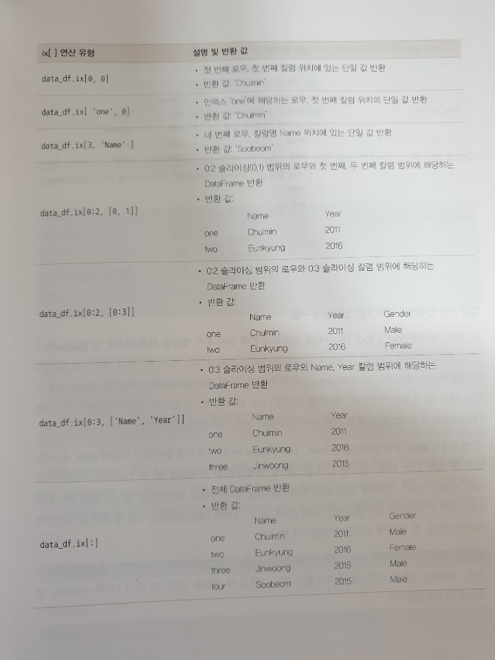
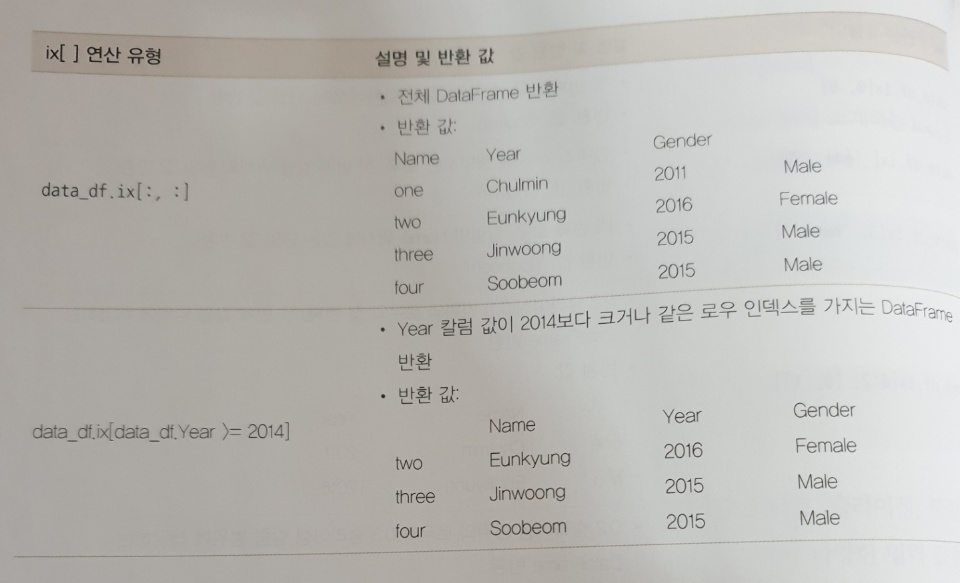
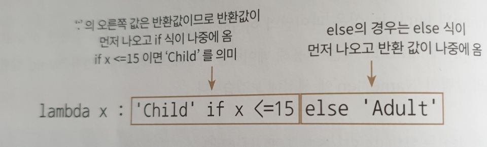

# Pandas

## Dataframe

### read_csv()

칼럼을 콤마(',')로 구분한 파일 포맷

```python
read_csv('파일명', sep='\t') #sep은 구분 문자 탭으로 구분해서 나눈다. 없으면 자동으로 ','로 설정
```


### data불러오기

```python
import pandas as pd

titanic_df = pd.read_csv(r'./data/train.csv')
print(titanic_df.head(3))
print('titanic 변수 type:', type(titanic_df))
print(titanic_df)
```

```bash
titanic 변수 type: <class 'pandas.core.frame.DataFrame'>
```


### data 크기

```python
print('DataFrame 크기:', titanic_df.shape)
```

```bash
DataFrame 크기: (891, 12)
```


### info()

```python
titanic_df.info()
```

```bash
<class 'pandas.core.frame.DataFrame'>
RangeIndex: 891 entries, 0 to 890
Data columns (total 12 columns):
PassengerId    891 non-null int64
Survived       891 non-null int64
Pclass         891 non-null int64
Name           891 non-null object
Sex            891 non-null object
Age            714 non-null float64
SibSp          891 non-null int64
Parch          891 non-null int64
Ticket         891 non-null object
Fare           891 non-null float64
Cabin          204 non-null object
Embarked       889 non-null object
dtypes: float64(2), int64(5), object(5)
memory usage: 66.2+ KB
```

info() 메서드를 통해서 총 데이터 건수와 데이터 타입, Null 건수를 알 수 있다.


### describe()

```python
print(titanic_df.describe())
```

```bash
       PassengerId    Survived      Pclass         Age       SibSp       Parch        Fare
count   891.000000  891.000000  891.000000  714.000000  891.000000  891.000000  891.000000
mean    446.000000    0.383838    2.308642   29.699118    0.523008    0.381594   32.204208
std     257.353842    0.486592    0.836071   14.526497    1.102743    0.806057   49.693429
min       1.000000    0.000000    1.000000    0.420000    0.000000    0.000000    0.000000
25%     223.500000    0.000000    2.000000   20.125000    0.000000    0.000000    7.910400
50%     446.000000    0.000000    3.000000   28.000000    0.000000    0.000000   14.454200
75%     668.500000    1.000000    3.000000   38.000000    1.000000    0.000000   31.000000
max     891.000000    1.000000    3.000000   80.000000    8.000000    6.000000  512.329200
```

개략적인 데이터 분포도를 확인할 수 있다.


### value_counts()

```python
value_counts = titanic_df['Pclass'].value_counts()
print(value_counts)
```

```bash
3    491
1    216
2    184
Name: Pclass, dtype: int64
```

min이 1, 25 ~ 75%가 2, max가 3으로 이루어져 있다. 많은 건수 순서로 정렬되어 값을 반환한다.


```python
titanic_pclass = titanic_df['Pclass']
print(type(titanic_pclass))
print(titanic_pclass.head())
```

```bash
<class 'pandas.core.series.Series'>
0    3
1    1
2    3
3    1
4    3
Name: Pclass, dtype: int64
```

Dataframed의 []연산자 내부에 칼럼명을 입력하면 해당 칼럼에 해당하는 Series 객체를 반환한다.


```python
value_counts = titanic_df['Pclass'].value_counts()
print(type(value_counts))
print(value_counts)
```

```bash
<class 'pandas.core.series.Series'>
3    491
1    216
2    184
Name: Pclass, dtype: int64
```


### ndarray를 DataFrame으로 바꾸기

```python
col_name1 = ['col1']
list1 = [1, 2, 3]
array1 = np.array(list1)
print('array1 shape:', array1.shape)
# 리스트를 이용해 DataFrame 생성.
df_list1 = pd.DataFrame(list1, columns=col_name1)
print('1차원 리스트로 만든 DataFrame:\n', df_list1)
# 넘파이 ndarray를 이용해 DataFrame 생성.
df_array1 = pd.DataFrame(array1, columns=col_name1)
print('1차원 ndarray로 만든 DataFrame:\n', df_array1)
```

```bash
array1 shape: (3,)
1차원 리스트로 만든 DataFrame:
    col1
0     1
1     2
2     3
1차원 ndarray로 만든 DataFrame:
    col1
0     1
1     2
2     3
```


### 2차원 리스트를 DataFrame으로 바꾸기

```python
# 3개의 칼럼명이 필요함
col_name2 = ['col1', 'col2', 'col3']

# 2행x3열 형태의 리스트와 ndarray 생성한 뒤 이를 DataFrame으로 변환
list2 = [[1, 2, 3],
        [11, 12, 13]]
array2 = np.array(list2)
print('array2 shape:', array2.shape)
df_list2 = pd.DataFrame(list2, columns=col_name2)
print('2차원 리스트로 만든 DataFrame:\n', df_list2)
df_array2 = pd.DataFrame(array2, columns=col_name2)
print('2차원 ndarray로 만든 DataFrame:\n', df_array2)
```

```bash
array2 shape: (2, 3)
2차원 리스트로 만든 DataFrame:
    col1  col2  col3
0     1     2     3
1    11    12    13
2차원 ndarray로 만든 DataFrame:
    col1  col2  col3
0     1     2     3
1    11    12    13
```


### 딕셔너리를 DataFrame으로 바꾸기

```python
# Key는 문자열 칼럼명으로 매핑, Value는 리스트 형(또는 ndarray) 칼럼 데이터로 매핑
dict = {'col1':[1, 11], 'col2':[2, 22], 'col3':[3, 33]}
df_dict = pd.DataFrame(dict)
print('딕셔너리로 만든 DataFrame:\n', df_dict)
```

```bash
딕셔너리로 만든 DataFrame:
    col1  col2  col3
0     1     2     3
1    11    22    33
```


### DataFrame을 ndarray로 바꾸기

```python
# DataFrame을 ndarray로 변환
array3 = df_dict.values
print('df_dict.values 타입:', type(array3), 'df_dict.values shape:', array3.shape)
print(array3)
```

```bash
df_dict.values 타입: <class 'numpy.ndarray'> df_dict.values shape: (2, 3)
[[ 1  2  3]
 [11 22 33]]
```


### DataFrame을 list로 바꾸기

```python
# DataFrame을 리스트로 변환
list3 = df_dict.values.tolist()
print('df_dict.values.tolist() 타입:', type(list3))
print(list3)
```

```bash
df_dict.values.tolist() 타입: <class 'list'>
[[1, 2, 3], [11, 22, 33]]
```


### DataFrame을 딕셔너리로 바꾸기

```python
# DataFrame을 딕셔너리로 변환
dict3 = df_dict.to_dict('list')
print('\n df_dict.to_dict() 타입:', type(dict3))
print(dict3)
```

```bash
 df_dict.to_dict() 타입: <class 'dict'>
{'col1': [1, 11], 'col2': [2, 22], 'col3': [3, 33]}
```


### DataFrame을 칼럼 데이터 세트 생성

```python
titanic_df['Age_0'] = 0
print('칼럼 데이터 생성:\n', titanic_df.head(3))
titanic_df['Age_by_10'] = titanic_df['Age']*10
titanic_df['Family_No'] = titanic_df['SibSp'] + titanic_df['Parch']+1
print('새로운 칼럼생성:\n', titanic_df.head(3))
titanic_df['Age_by_10'] = titanic_df['Age_by_10']+100
print('기존 칼럼 값 일괄적으로 계산:\n', titanic_df.head(3))
```

```bash
칼럼 데이터 생성:
    PassengerId  Survived  Pclass                                               Name  ...     Fare  Cabin  Embarked  Age_0
0            1         0       3                            Braund, Mr. Owen Harris  ...   7.2500    NaN         S      0
1            2         1       1  Cumings, Mrs. John Bradley (Florence Briggs Th...  ...  71.2833    C85         C      0
2            3         1       3                             Heikkinen, Miss. Laina  ...   7.9250    NaN         S      0

[3 rows x 13 columns]
새로운 칼럼생성:
    PassengerId  Survived  Pclass                                               Name  ... Embarked  Age_0  Age_by_10  Family_No
0            1         0       3                            Braund, Mr. Owen Harris  ...        S      0      220.0          2
1            2         1       1  Cumings, Mrs. John Bradley (Florence Briggs Th...  ...        C      0      380.0          2
2            3         1       3                             Heikkinen, Miss. Laina  ...        S      0      260.0          1

[3 rows x 15 columns]
기존 칼럼 값 일괄적으로 계산:
    PassengerId  Survived  Pclass                                               Name  ... Embarked  Age_0  Age_by_10  Family_No
0            1         0       3                            Braund, Mr. Owen Harris  ...        S      0      320.0          2
1            2         1       1  Cumings, Mrs. John Bradley (Florence Briggs Th...  ...        C      0      480.0          2
2            3         1       3                             Heikkinen, Miss. Laina  ...        S      0      360.0          1

[3 rows x 15 columns]
```


### DataFrame 데이터 삭제


```python
titanic_df['Age_0'] = 0
titanic_drop_df = titanic_df.drop('Age_0', axis = 1)
print(titanic_drop_df.head(3))
```

```bash
[3 rows x 15 columns]
   PassengerId  Survived  Pclass                                               Name  ... Cabin  Embarked  Age_by_10  Family_No
0            1         0       3                            Braund, Mr. Owen Harris  ...   NaN         S      320.0          2
1            2         1       1  Cumings, Mrs. John Bradley (Florence Briggs Th...  ...   C85         C      480.0          2
2            3         1       3                             Heikkinen, Miss. Laina  ...   NaN         S      360.0          1

[3 rows x 14 columns]
```


#### 여러개의 칼럼 삭제

```python
drop_result = titanic_df.drop(['Age_0', 'Age_by_10', 'Family_No'], axis=1, inplace=True)
print('inplace=True 로 drop 후 반횐된 값:', drop_result)
print(titanic_df.head(3))
```

```bash
inplace=True 로 drop 후 반횐된 값: None
   PassengerId  Survived  Pclass                                               Name  ...            Ticket     Fare  Cabin  Embarked
0            1         0       3                            Braund, Mr. Owen Harris  ...         A/5 21171   7.2500    NaN         S
1            2         1       1  Cumings, Mrs. John Bradley (Florence Briggs Th...  ...          PC 17599  71.2833    C85         C
2            3         1       3                             Heikkinen, Miss. Laina  ...  STON/O2. 3101282   7.9250    NaN         S

[3 rows x 12 columns]
```


#### 여러개의 로우 삭제

```python
pd.set_option('display.width', 1000)
pd.set_option('display.max_colwidth', 15)
print('##### before axis 0 drop ######')
print(titanic_df.head(3))
titanic_df.drop([0, 1, 2], axis = 0, inplace=True)

print('##### after axis 0 drop ######')
print(titanic_df.head(3))
```

```bash
##### before axis 0 drop ######
   PassengerId  Survived  Pclass            Name     Sex   Age  ...     Fare  Cabin Embarked  Age_0 Age_by_10 Family_No
0            1         0       3  Braund, Mr....    male  22.0  ...   7.2500    NaN        S      0     320.0         2
1            2         1       1  Cumings, Mr...  female  38.0  ...  71.2833    C85        C      0     480.0         2
2            3         1       3  Heikkinen, ...  female  26.0  ...   7.9250    NaN        S      0     360.0         1

[3 rows x 15 columns]
##### after axis 0 drop ######
   PassengerId  Survived  Pclass            Name     Sex   Age  SibSp  ...  Ticket     Fare  Cabin Embarked Age_0  Age_by_10  Family_No
3            4         1       1  Futrelle, M...  female  35.0      1  ...  113803  53.1000   C123        S     0      450.0
  2
4            5         0       3  Allen, Mr. ...    male  35.0      0  ...  373450   8.0500    NaN        S     0      450.0
  1
5            6         0       3  Moran, Mr. ...    male   NaN      0  ...  330877   8.4583    NaN        Q     0        NaN
  1

[3 rows x 15 columns]
```


- axis: DataFrame의 로우를 삭제할 때는 axis=0, 칼럼을 삭제할 때는 axis=1으로 설정한다.

- 원본 DataFrame은 유지하고 드롭된 DataFrame을 새롭게 객체 변수로 받고 싶다면 inplace=False로 설정한다(디폴트 값이 False).

  예: titanic_drop_df = titanic_df.drop('Age_0', axis=1, inplace=False)

- 원본 DataFrame에서 드롭된 결과를 적용할 경우에는 inplace=True를 적용한다.

  예:titanic_df.drop('Age_0', axis=1, inplace=True)

- 원본 DataFrame에서 드롭된 DataFrame을 다시 원본 DataFrame 객체 변수로 할당하면 원본 DataFrame에서 드롭된 결과를 적용할 경우와 같다.(단, 기존 원본  DataFrame 객체 변수는 메모리에서 추후 제거된다).

  예:titanic_df = titanic_df.drop('Age_0', axis=1, inplace=False)


## Index

판다스의 Index 객체는 RDBMS의 PK(Primary Key)와 유사하게 DataFrame, Series의 레코드를 고유하게 식별하는 객체이다.


### Index 객체 추출

```python
import pandas as pd

# 파일 로딩
titanic_df =pd.read_csv('./data/train.csv')

# Index 객체 추출
indexes = titanic_df.index
print(indexes)

# Index 객체를 실제 값 array로 변환
print('Index 객체 array값:\n', indexes.values)
```

```bash
RangeIndex(start=0, stop=891, step=1)
Index 객체 array값:
 [  0   1   2   3   4   5   6   7   8   9  10  11  12  13  14  15  16  17
  18  19  20  21  22  23  24  25  26  27  28  29  30  31  32  33  34  35
  36  37  38  39  40  41  42  43  44  45  46  47  48  49  50  51  52  53
  54  55  56  57  58  59  60  61  62  63  64  65  66  67  68  69  70  71
  72  73  74  75  76  77  78  79  80  81  82  83  84  85  86  87  88  89
  90  91  92  93  94  95  96  97  98  99 100 101 102 103 104 105 106 107
 108 109 110 111 112 113 114 115 116 117 118 119 120 121 122 123 124 125
 126 127 128 129 130 131 132 133 134 135 136 137 138 139 140 141 142 143
 144 145 146 147 148 149 150 151 152 153 154 155 156 157 158 159 160 161
 162 163 164 165 166 167 168 169 170 171 172 173 174 175 176 177 178 179
 180 181 182 183 184 185 186 187 188 189 190 191 192 193 194 195 196 197
 198 199 200 201 202 203 204 205 206 207 208 209 210 211 212 213 214 215
 216 217 218 219 220 221 222 223 224 225 226 227 228 229 230 231 232 233
 234 235 236 237 238 239 240 241 242 243 244 245 246 247 248 249 250 251
 252 253 254 255 256 257 258 259 260 261 262 263 264 265 266 267 268 269
 270 271 272 273 274 275 276 277 278 279 280 281 282 283 284 285 286 287
 288 289 290 291 292 293 294 295 296 297 298 299 300 301 302 303 304 305
 306 307 308 309 310 311 312 313 314 315 316 317 318 319 320 321 322 323
 324 325 326 327 328 329 330 331 332 333 334 335 336 337 338 339 340 341
 342 343 344 345 346 347 348 349 350 351 352 353 354 355 356 357 358 359
 360 361 362 363 364 365 366 367 368 369 370 371 372 373 374 375 376 377
 378 379 380 381 382 383 384 385 386 387 388 389 390 391 392 393 394 395
 396 397 398 399 400 401 402 403 404 405 406 407 408 409 410 411 412 413
 414 415 416 417 418 419 420 421 422 423 424 425 426 427 428 429 430 431
 432 433 434 435 436 437 438 439 440 441 442 443 444 445 446 447 448 449
 450 451 452 453 454 455 456 457 458 459 460 461 462 463 464 465 466 467
 468 469 470 471 472 473 474 475 476 477 478 479 480 481 482 483 484 485
 486 487 488 489 490 491 492 493 494 495 496 497 498 499 500 501 502 503
 504 505 506 507 508 509 510 511 512 513 514 515 516 517 518 519 520 521
 522 523 524 525 526 527 528 529 530 531 532 533 534 535 536 537 538 539
 540 541 542 543 544 545 546 547 548 549 550 551 552 553 554 555 556 557
 558 559 560 561 562 563 564 565 566 567 568 569 570 571 572 573 574 575
 576 577 578 579 580 581 582 583 584 585 586 587 588 589 590 591 592 593
 594 595 596 597 598 599 600 601 602 603 604 605 606 607 608 609 610 611
 612 613 614 615 616 617 618 619 620 621 622 623 624 625 626 627 628 629
 630 631 632 633 634 635 636 637 638 639 640 641 642 643 644 645 646 647
 648 649 650 651 652 653 654 655 656 657 658 659 660 661 662 663 664 665
 666 667 668 669 670 671 672 673 674 675 676 677 678 679 680 681 682 683
 684 685 686 687 688 689 690 691 692 693 694 695 696 697 698 699 700 701
 702 703 704 705 706 707 708 709 710 711 712 713 714 715 716 717 718 719
 720 721 722 723 724 725 726 727 728 729 730 731 732 733 734 735 736 737
 738 739 740 741 742 743 744 745 746 747 748 749 750 751 752 753 754 755
 756 757 758 759 760 761 762 763 764 765 766 767 768 769 770 771 772 773
 774 775 776 777 778 779 780 781 782 783 784 785 786 787 788 789 790 791
 792 793 794 795 796 797 798 799 800 801 802 803 804 805 806 807 808 809
 810 811 812 813 814 815 816 817 818 819 820 821 822 823 824 825 826 827
 828 829 830 831 832 833 834 835 836 837 838 839 840 841 842 843 844 845
 846 847 848 849 850 851 852 853 854 855 856 857 858 859 860 861 862 863
 864 865 866 867 868 869 870 871 872 873 874 875 876 877 878 879 880 881
 882 883 884 885 886 887 888 889 890]
```


### 단일 값 반환 및 슬라이싱

```python
# 단일 값 반환 및 슬라이싱
print(type(indexes.values))
print(indexes.values.shape)
print(indexes[:5].values)
print(indexes.values[:5])
print(indexes[6])
```

```bash
RangeIndex(start=0, stop=891, step=1)
<class 'numpy.ndarray'>
(891,)
[0 1 2 3 4]
[0 1 2 3 4]
6
```


한 번 만들어진 DataFrame 및 Series의 Index 객체는 함부로 변경할 수 없다.


### Series 객체

Series 객체는 Index 객체를 포함하지만 Series 객체에 연산 함수를 적용할 때 Index는 연산에서 제외된다. Index는 오직 식별용으로만 사용된다.

```python
series_fair = titanic_df['Fare']
print('Fare Series max 값:', series_fair.max())
print('Fare Series sum 값:', series_fair.sum())
print('sum() Fair Series:', sum(series_fair))
print('Fair Series + 3:\n', (series_fair + 3).head(3))
```

```bash
Fare Series max 값: 512.3292
Fare Series sum 값: 28693.9493
sum() Fair Series: 28693.949299999967
Fair Series + 3:
0    10.2500
1    74.2833
2    10.9250
Name: Fare, dtype: float64
```


#### reset_index()

이 메서드를 수행하면 인덱스에 연속 숫자 형으로 할당하며 기존 인덱스는 'index'라는 새로운 칼럼 명으로 추가한다.

```python
# reset_index()
titanic_reset_df = titanic_df.reset_index(inplace = False)
print(titanic_reset_df.head(3))
```

```bash
   index  PassengerId  Survived  Pclass  ...            Ticket     Fare  Cabin  Embarked
0      0            1         0       3  ...         A/5 21171   7.2500    NaN         S
1      1            2         1       1  ...          PC 17599  71.2833    C85         C
2      2            3         1       3  ...  STON/O2. 3101282   7.9250    NaN         S

[3 rows x 13 columns]
```


#### Index칼럼을 2개만들면

```python
print('### before reset_index ###')
value_counts = titanic_df['Pclass'].value_counts()
print(value_counts)
print('value_counts 객체 변수 타입:', type(value_counts))
new_value_counts = value_counts.reset_index(inplace = False)
print('### After reset_index ###')
print(new_value_counts)
print('new_value_counts 객체 변수 타입:', type(new_value_counts))
```

```bash
### before reset_index ###
3    491
1    216
2    184
Name: Pclass, dtype: int64
value_counts 객체 변수 타입: <class 'pandas.core.series.Series'>
### After reset_index ###
   index  Pclass
0      3     491
1      1     216
2      2     184
new_value_counts 객체 변수 타입: <class 'pandas.core.frame.DataFrame'>
```


Series에 reset_index()를 적용하면 새롭게 연속 숫자형 인덱스가 만들어지고 기존 인덱스는 'index'칼럼명으로 추가되면서 DataFrame으로 변환됨을 알 수 있다. reset_index()의 parameter 중 drop=True로 설정하면 기존 인덱스는 새로운 컬럼으로 추가되지 않고 삭제(drop)된다. 새로운 칼럼이 추가되지 않으므로 그대로 Series로 유지된다.


## Data 셀렉션 및 필터링


### DataFrame의 []연산자

```python
# 파일 로딩
titanic_df =pd.read_csv('./data/train.csv')

# DataFrame의 []연산자
print('단일 칼럼 데이터 추출:\n', titanic_df['Pclass'].head(3))
print('\n여러 칼럼의 데이터 추출:\n', titanic_df[['Survived','Pclass']].head(3))
print('[ ] 안에 숫자 index는 KeyError 오류 발생:\n',titanic_df[0])
```

```bash
단일 칼럼 데이터 추출:
 0    3
1    1
2    3
Name: Pclass, dtype: int64

여러 칼럼의 데이터 추출:
    Survived  Pclass
0         0       3
1         1       1
2         1       3

Traceback (most recent call last):
  File "C:\Users\kim\AppData\Local\Programs\Python\Python37-32\lib\site-packages\pandas\core\indexes\base.py", line 2897, in get_loc
    return self._engine.get_loc(key)
  File "pandas/_libs/index.pyx", line 107, in pandas._libs.index.IndexEngine.get_loc
  File "pandas/_libs/index.pyx", line 131, in pandas._libs.index.IndexEngine.get_loc
  File "pandas/_libs/hashtable_class_helper.pxi", line 1607, in pandas._libs.hashtable.PyObjectHashTable.get_item
  File "pandas/_libs/hashtable_class_helper.pxi", line 1614, in pandas._libs.hashtable.PyObjectHashTable.get_item
KeyError: 0

During handling of the above exception, another exception occurred:

Traceback (most recent call last):
  File "pandas_selection.py", line 9, in <module>
    print('[ ] 안에 숫자 index는 KeyError 오류 발생:\n',titanic_df[0])
  File "C:\Users\kim\AppData\Local\Programs\Python\Python37-32\lib\site-packages\pandas\core\frame.py", line 2995, in __getitem__
    indexer = self.columns.get_loc(key)
  File "C:\Users\kim\AppData\Local\Programs\Python\Python37-32\lib\site-packages\pandas\core\indexes\base.py", line 2899, in get_loc
    return self._engine.get_loc(self._maybe_cast_indexer(key))
  File "pandas/_libs/index.pyx", line 107, in pandas._libs.index.IndexEngine.get_loc
  File "pandas/_libs/index.pyx", line 131, in pandas._libs.index.IndexEngine.get_loc
  File "pandas/_libs/hashtable_class_helper.pxi", line 1607, in pandas._libs.hashtable.PyObjectHashTable.get_item
  File "pandas/_libs/hashtable_class_helper.pxi", line 1614, in pandas._libs.hashtable.PyObjectHashTable.get_item
KeyError: 0

```

판다스의 인덱스 형태로 변환 가능한 표현식은 [ ]내에 입력할 수 있다. 

2개의 데이터 추출

```python
print(titanic_df[0:2])
```

```bash
   PassengerId  Survived  Pclass                                               Name  ...     Ticket     Fare  Cabin  Embarked
0            1         0       3                            Braund, Mr. Owen Harris  ...  A/5 21171   7.2500    NaN         S
1            2         1       1  Cumings, Mrs. John Bradley (Florence Briggs Th...  ...   PC 17599  71.2833    C85         C

[2 rows x 12 columns]
```


Pclass 칼럼값이 3인 데이터 3개 추출

```python
print(titanic_df[titanic_df['Pclass'] == 3].head(3))
```

```bash
   PassengerId  Survived  Pclass                      Name     Sex   Age  SibSp  Parch            Ticket   Fare Cabin Embarked
0            1         0       3   Braund, Mr. Owen Harris    male  22.0      1      0         A/5 21171  7.250   NaN        S
2            3         1       3    Heikkinen, Miss. Laina  female  26.0      0      0  STON/O2. 3101282  7.925   NaN        S
4            5         0       3  Allen, Mr. William Henry    male  35.0      0      0            373450  8.050   NaN        S
```


### DataFrame ix[] 연산자

행 위치 지정으로 인덱스값 0, 열 위치 지정으로 칼럼 명인 'Pclass'를 입력해 원하는 위치의 데이터 추출할 수 있다.

```python
print('칼럼 위치 기반 인덱싱 데이터 추출:', titanic_df.ix[0, 2])
print('칼럼 명 기반 인덱싱 데이터 추출:', titanic_df.ix[0, 'Pclass'])
```

```bash
pandas_selection.py:16: FutureWarning:
.ix is deprecated. Please use
.loc for label based indexing or
.iloc for positional indexing

See the documentation here:
http://pandas.pydata.org/pandas-docs/stable/user_guide/indexing.html#ix-indexer-is-deprecated
  print('칼럼 위치 기반 인덱싱 데이터 추출:', titanic_df.ix[0, 2])
C:\Users\kim\AppData\Local\Programs\Python\Python37-32\lib\site-packages\pandas\core\indexing.py:961: FutureWarning:
.ix is deprecated. Please use
.loc for label based indexing or
.iloc for positional indexing

See the documentation here:
http://pandas.pydata.org/pandas-docs/stable/user_guide/indexing.html#ix-indexer-is-deprecated
  return getattr(section, self.name)[new_key]
칼럼 위치 기반 인덱싱 데이터 추출: 3
pandas_selection.py:17: FutureWarning:
.ix is deprecated. Please use
.loc for label based indexing or
.iloc for positional indexing

See the documentation here:
http://pandas.pydata.org/pandas-docs/stable/user_guide/indexing.html#ix-indexer-is-deprecated
  print('칼럼 명 기반 인덱싱 데이터 추출:', titanic_df.ix[0, 'Pclass'])
칼럼 명 기반 인덱싱 데이터 추출: 3
```

loc[] 또는 iloc[] 사용을 권한다.


#### ix[] 연산자 다양한 입력 값

데이터 생성

```python
data = {'Name':['Chulmin', 'Eunkyung', 'Jinwoong', 'Soobeom'],
        'Year':[2011, 2016, 2015, 2015],
        'Gender':['Male', 'Female', 'Male', 'Male']
        }
data_df = pd.DataFrame(data, index=['one', 'two', 'three', 'four'])
print(data_df)

```

```bash
           Name  Year  Gender
one     Chulmin  2011    Male
two    Eunkyung  2016  Female
three  Jinwoong  2015    Male
four    Soobeom  2015    Male
```


연산 유형








### DataFrame iloc[] 연산자

liocp[]는 위치 기반 인덱싱만 허용하기 때문에 행과 열 값으로 integer 또는 integer형의 슬라이싱, 팬시 리스트 값을 입력해줘야 한다.


```python
print(data_df.iloc[0, 0])
```

```bash
Chulmin
```


#### 위치기반이 아니면

```python
print(data_df.iloc[0, 'Name'])
```

```bash
Traceback (most recent call last):
  File "C:\Users\kim\AppData\Local\Programs\Python\Python37-32\lib\site-packages\pandas\core\indexing.py", line 235, in _has_valid_tuple
    self._validate_key(k, i)
  File "C:\Users\kim\AppData\Local\Programs\Python\Python37-32\lib\site-packages\pandas\core\indexing.py", line 2035, in _validate_key
    "a [{types}]".format(types=self._valid_types)
ValueError: Can only index by location with a [integer, integer slice (START point is INCLUDED, END point is EXCLUDED), listlike of
integers, boolean array]

During handling of the above exception, another exception occurred:

Traceback (most recent call last):
  File "pandas_selection.py", line 30, in <module>
    print(data_df.iloc[0, 'Name'])
  File "C:\Users\kim\AppData\Local\Programs\Python\Python37-32\lib\site-packages\pandas\core\indexing.py", line 1418, in __getitem__
    return self._getitem_tuple(key)
  File "C:\Users\kim\AppData\Local\Programs\Python\Python37-32\lib\site-packages\pandas\core\indexing.py", line 2092, in _getitem_tuple
    self._has_valid_tuple(tup)
  File "C:\Users\kim\AppData\Local\Programs\Python\Python37-32\lib\site-packages\pandas\core\indexing.py", line 239, in _has_valid_tuple
    "[{types}] types".format(types=self._valid_types)
ValueError: Location based indexing can only have [integer, integer slice (START point is INCLUDED, END point is EXCLUDED), listlike of integers, boolean array] types
```

> 오류가 출력된다.


### DataFrame loc[]연산자

loc[]는 명칭 기반으로 데이터를 출력한다.


인덱스 값이 'one'인 행의 칼럼 명이 'name'인 데이터를 추출한다.

```python
print(data_df.loc['one','Name'])
```

```bash
Chulmin
```


### ix, iloc, loc의 문제점과 주의할 점

1. 가장 중요한 것은 명칭 기반 인덱싱과 위치 기반 인덱싱의 차이를 이해해야 한다. DataFrame의 인덱스나 칼럼명으로 데이터에 접근하는 것은 명칭 기반 인덱싱이다. 0부터 시작하는 행, 열의 위치 좌표에만 의존하는 것이 위 기반 인덱싱이다.
2. ix[]는 명칭 기반 인덱싱과 위치 기반 인덱싱 모두 적용할 수 있다. DataFrame의 인덱스가 숫자 형일 경우 행 위치에 오는 숫자는 위치 기반 인덱싱이 아니라 명칭 기반 인덱싱의 DataFrame 인덱스를 가리킨다.
3. iloc[]는 위치 기반 인덱싱만 가능하다. 따라서 행과 열 위치 값으로 정수형 값을 지정해 원하는 데이터를 반환한다.
4. loc[]는 명칭 기반 인덱싱만 가능하다. 따라서 행 위치에 DataFrame 인덱스가 오며, 열 위치에는 칼럼 명을 지정해 원하는 데이터를 반환한다.
5. 명칭 기반 인덱싱에서 슬라이싱을 '시작점:종료점'으로 지저할 때 시작점에서 종료점을 포함한 위치에 있는 데이터를 반환한다.


### Boolean Indexing

```python
import pandas as pd

# 파일 로딩
titanic_df = pd.read_csv('./data/train.csv')

# boolean indexing
titanic_boolean = titanic_df[titanic_df['Age']>60]
print(type(titanic_boolean))

```

```bash
<class 'pandas.core.frame.DataFrame'>
     PassengerId  Survived  Pclass                                       Name  ...       Ticket      Fare        Cabin  Embarked
33            34         0       2                      Wheadon, Mr. Edward H  ...   C.A. 24579   10.5000          NaN         S
54            55         0       1             Ostby, Mr. Engelhart Cornelius  ...       113509   61.9792          B30         C
96            97         0       1                  Goldschmidt, Mr. George B  ...     PC 17754   34.6542           A5         C
116          117         0       3                       Connors, Mr. Patrick  ...       370369    7.7500          NaN         Q
170          171         0       1                  Van der hoef, Mr. Wyckoff  ...       111240   33.5000          B19         S
252          253         0       1                  Stead, Mr. William Thomas  ...       113514   26.5500          C87         S
275          276         1       1          Andrews, Miss. Kornelia Theodosia  ...        13502   77.9583           D7         S
280          281         0       3                           Duane, Mr. Frank  ...       336439    7.7500          NaN         Q
326          327         0       3                  Nysveen, Mr. Johan Hansen  ...       345364    6.2375          NaN         S
438          439         0       1                          Fortune, Mr. Mark  ...        19950  263.0000  C23 C25 C27         S
456          457         0       1                  Millet, Mr. Francis Davis  ...        13509   26.5500          E38         S
483          484         1       3                     Turkula, Mrs. (Hedwig)  ...         4134    9.5875          NaN         S
493          494         0       1                    Artagaveytia, Mr. Ramon  ...     PC 17609   49.5042          NaN         C
545          546         0       1               Nicholson, Mr. Arthur Ernest  ...          693   26.0000          NaN         S
555          556         0       1                         Wright, Mr. George  ...       113807   26.5500          NaN         S
570          571         1       2                         Harris, Mr. George  ...  S.W./PP 752   10.5000          NaN         S
625          626         0       1                      Sutton, Mr. Frederick  ...        36963   32.3208          D50         S
630          631         1       1       Barkworth, Mr. Algernon Henry Wilson  ...        27042   30.0000          A23         S
672          673         0       2                Mitchell, Mr. Henry Michael  ...   C.A. 24580   10.5000          NaN         S
745          746         0       1               Crosby, Capt. Edward Gifford  ...    WE/P 5735   71.0000          B22         S
829          830         1       1  Stone, Mrs. George Nelson (Martha Evelyn)  ...       113572   80.0000          B28       NaN
851          852         0       3                        Svensson, Mr. Johan  ...       347060    7.7750          NaN         S

[22 rows x 12 columns]
```


#### [] 연산자

```python
print(titanic_df[titanic_df['Age']>60][['Name', 'Age']].head(3))
```

```bash
                              Name   Age
33           Wheadon, Mr. Edward H  66.0
54  Ostby, Mr. Engelhart Cornelius  65.0
96       Goldschmidt, Mr. George B  71.0
```


#### loc[]

```python
print(titanic_df.loc[titanic_df['Age']>60, ['Name', 'Age']].head(3))
```

```bash
                              Name   Age
33           Wheadon, Mr. Edward H  66.0
54  Ostby, Mr. Engelhart Cornelius  65.0
96       Goldschmidt, Mr. George B  71.0
```


#### 조건문

1. and 조건이면 &
2. or 조건이면 |
3. Not 조건이면 ~


나이가 60세 이상이고, 선실 등급이 1등급이며, 성별이 여성인 승객 추출

```python
print(titanic_df[(titanic_df['Age']>60) & (titanic_df['Pclass']==1) & (titanic_df['Sex']=='female')])
```

```bash
     PassengerId  Survived  Pclass                                       Name     Sex  ...  Parch  Ticket     Fare Cabin  Embarked
275          276         1       1          Andrews, Miss. Kornelia Theodosia  female  ...      0   13502  77.9583    D7         S
829          830         1       1  Stone, Mrs. George Nelson (Martha Evelyn)  female  ...      0  113572  80.0000   B28       NaN

[2 rows x 12 columns]
```


개별 조건 결합

```python
cond1 = titanic_df['Age'] > 60
cond2 = titanic_df['Pclass']==1
cond3 = titanic_df['Sex']=='female'
print(titanic_df[cond1 & cond2 & cond3])
```

```bash
     PassengerId  Survived  Pclass                                       Name     Sex  ...  Parch  Ticket     Fare Cabin  Embarked
275          276         1       1          Andrews, Miss. Kornelia Theodosia  female  ...      0   13502  77.9583    D7         S
829          830         1       1  Stone, Mrs. George Nelson (Martha Evelyn)  female  ...      0  113572  80.0000   B28       NaN

[2 rows x 12 columns]
```


## 정렬, Aggregation 함수, GroupBy 적용

### sort_values()

Series의 정렬을 위해서는 sort_values() 메서드를 이용한다. RDBMS SQL의 order by 키워드와 유사하다.


```python
import pandas as pd

# 파일 로딩
titanic_df =pd.read_csv('./data/train.csv')

# sort_values()
titanic_sorted = titanic_df.sort_values(by=['Name'])
print(titanic_sorted.head(3))
```

```bash
     PassengerId  Survived  Pclass                              Name     Sex   Age  SibSp  Parch     Ticket   Fare Cabin Embarked
845          846         0       3               Abbing, Mr. Anthony    male  42.0      0      0  C.A. 5547   7.55   NaN        S
746          747         0       3       Abbott, Mr. Rossmore Edward    male  16.0      1      1  C.A. 2673  20.25   NaN        S
279          280         1       3  Abbott, Mrs. Stanton (Rosa Hunt)  female  35.0      1      1  C.A. 2673  20.25   NaN        S
```


#### 내림차순

```python
titanic_sorted = titanic_df.sort_values(by=['Pclass', 'Name'], ascending=False)
print(titanic_sorted.head(3))
```

```bash
     PassengerId  Survived  Pclass                             Name   Sex   Age  SibSp  Parch    Ticket  Fare Cabin Embarked
868          869         0       3      van Melkebeke, Mr. Philemon  male   NaN      0      0    345777   9.5   NaN        S
153          154         0       3  van Billiard, Mr. Austin Blyler  male  40.5      0      2  A/5. 851  14.5   NaN        S
282          283         0       3        de Pelsmaeker, Mr. Alfons  male  16.0      0      0    345778   9.5   NaN        S
```


### Aggregation 함수 적용

DataFrame에서  min(), max(), sum(), count() 와 같은 aggregation 함수의 적용은 RDBMS SQL의 aggregation  함수 적용과 유사하다. DataFrame의 경우 DataFrame에서 바로 aggregation을 호출할 경우 모든 칼럼에 해당 aggregation을 적용한다는 차이가 있다,


#### count()

```python
print(titanic_df.count())
```

```bash
PassengerId    891
Survived       891
Pclass         891
Name           891
Sex            891
Age            714
SibSp          891
Parch          891
Ticket         891
Fare           891
Cabin          204
Embarked       889
dtype: int64
```


#### mean()

```python
print(titanic_df[['Age', 'Fare']].mean())
```

```bash
Age     29.699118
Fare    32.204208
dtype: float64
```


### groupby() 적용

```python
titanic_groupby = titanic_df.groupby(by='Pclass')
print(type(titanic_groupby))
```

```bash
<class 'pandas.core.groupby.generic.DataFrameGroupBy'>
```


#### 칼럼 한개 호출

```python
titanic_groupby = titanic_df.groupby('Pclass').count()
print(titanic_groupby)
```

```bash
        PassengerId  Survived  Name  Sex  Age  SibSp  Parch  Ticket  Fare  Cabin  Embarked
Pclass
1               216       216   216  216  186    216    216     216   216    176       214
2               184       184   184  184  173    184    184     184   184     16       184
3               491       491   491  491  355    491    491     491   491     12       491
```


#### 여러개 칼럼 호출

```python
titanic_groupby = titanic_df.groupby('Pclass')[['PassengerId', 'Survived']].count()
print(titanic_groupby)
```

```bash
        PassengerId  Survived
Pclass
1               216       216
2               184       184
3               491       491
```


#### aggregation 함수 적용

```python
print(titanic_df.groupby('Pclass')['Age'].agg([max, min]))
```

```bash
         max   min
Pclass
1       80.0  0.92
2       70.0  0.67
3       74.0  0.42
```


#### 딕셔너리 형식

```python
agg_format={'Age':'max', 'SibSp':'sum', 'Fare':'mean'}
print(titanic_df.groupby('Pclass').agg(agg_format))
```

```bash
         Age  SibSp       Fare
Pclass
1       80.0     90  84.154687
2       70.0     74  20.662183
3       74.0    302  13.675550
```


## 결손 데이터 처리

### isna()

isna()는 데이터가 NaN인지 아닌지를 알려준다. NaN이 아닌지 True나 False로 알려준다.

```python
print(titanic_df.isna().head(3))
```

```bash
   PassengerId  Survived  Pclass   Name    Sex    Age  SibSp  Parch  Ticket   Fare  Cabin  Embarked
0        False     False   False  False  False  False  False  False   False  False   True     False
1        False     False   False  False  False  False  False  False   False  False  False     False
2        False     False   False  False  False  False  False  False   False  False   True     False
```


#### 결손 데이터 갯수

```python
print(titanic_df.isna().sum())
```

```bash
PassengerId      0
Survived         0
Pclass           0
Name             0
Sex              0
Age            177
SibSp            0
Parch            0
Ticket           0
Fare             0
Cabin          687
Embarked         2
dtype: int64
```


### fillna()로 결손 데이터 대체하기

fillna()를 이용해서 결손데이터를 다른 데이터로 대체할 수 있다.

```python
titanic_df['Cabin'] = titanic_df['Cabin'].fillna('C000')
print(titanic_df.head(3))
```

```bash
   PassengerId  Survived  Pclass                                               Name  ...            Ticket     Fare  Cabin  Embarked
0            1         0       3                            Braund, Mr. Owen Harris  ...         A/5 21171   7.2500   C000         S
1            2         1       1  Cumings, Mrs. John Bradley (Florence Briggs Th...  ...          PC 17599  71.2833    C85         C
2            3         1       3                             Heikkinen, Miss. Laina  ...  STON/O2. 3101282   7.9250   C000         S

[3 rows x 12 columns]
```


```python
titanic_df['Cabin'] = titanic_df['Cabin'].fillna('C000')
titanic_df['Age'] = titanic_df['Age'].fillna(titanic_df['Age'].mean())
titanic_df['Embarked'] = titanic_df['Embarked'].fillna('S')
print(titanic_df.isna().sum())
```

```bash
PassengerId    0
Survived       0
Pclass         0
Name           0
Sex            0
Age            0
SibSp          0
Parch          0
Ticket         0
Fare           0
Cabin          0
Embarked       0
dtype: int64
```


## apply lambda 식으로 데이터 가공

함수

```python
import pandas as pd

def get_square(a):
    return a**2

print('3의 제곱은:', get_square(3))
```

```bash
3의 제곱은: 9
```


### lambda 식

```python
lambda_square = lambda x:x**2
print('3의 제곱은:', lambda_square(3))
```

```bash
3의 제곱은: 9
```


### map()

lambda식을 이용해 인자를 여러개 이용할 때 사용한다.

```python
a = [1, 2, 3]
squares = map(lambda x: x**2, a)
print(list(squares))
```

```bash
[1, 4, 9]
```


### 데이터 가공

```python
titanic_df['Name_len'] = titanic_df['Name'].apply(lambda x : len(x))
print(titanic_df[['Name', 'Name_len']].head(3))
```

```bash
                                                Name  Name_len
0                            Braund, Mr. Owen Harris        23
1  Cumings, Mrs. John Bradley (Florence Briggs Th...        51
2                             Heikkinen, Miss. Laina        22
```

'Name'칼럼의 문자에 열 개수를 별도의 칼럼인 'Name_len'에 생성했다.


#### 복잡한 데이터 가공

```python
titanic_df['Child_Adult'] = titanic_df['Age'].apply(lambda x : 'Child' if x <= 15 else 'Adult')
print(titanic_df[['Age', 'Child_Adult']].head(8))
```

```bash
    Age Child_Adult
0  22.0       Adult
1  38.0       Adult
2  26.0       Adult
3  35.0       Adult
4  35.0       Adult
5   NaN       Adult
6  54.0       Adult
7   2.0       Child
```

나이가 15세 미만이면 'Child', 15세 이상이면 'Adult'로 만들었다.

lambda식은 if else를 지원하는데 if 절의 경우 if 식보다 반환 값을 먼저 기술 해야한다. 




if, else 만 지원하고 else if는 지원하지 않는다.


```python
titanic_df['Age_cat'] = titanic_df['Age'].apply(lambda x: 'Child' if x<=15 else ('Adult' if x <= 60 else 'Elderly'))
print(titanic_df['Age_cat'].value_counts())
```

```bash
Adult      609
Elderly    199
Child       83
Name: Age_cat, dtype: int64
```

나이가 15세 이하면 Child, 15세 ~ 60세 사이면 Adult, 61세 이상은 Elderly로 분류했다.


### lambda에 함수 적용

```python
# 나이에 따라 세분화된 분류를 수행하는 함수 생성
def get_category(age):
    cat=''
    if age <= 5 : cat = 'Baby'
    elif age <= 12 : cat = 'Child'
    elif age <= 18 : cat = 'Teenager'
    elif age <= 25 : cat = 'Student'
    elif age <= 35 : cat = 'Young Adult'
    elif age <= 60 : cat = 'Adult'
    else : cat = 'Elderly'

    return cat

# lambda 식에 위에서 생성한 get_category()함수를 반환값으로 지정.
# get_category(X)는 입력값으로 'Age' 칼럼 값을 받아서 해당하는 cat반환
titanic_df['Age_cat'] = titanic_df['Age'].apply(lambda x : get_category(x))
print(titanic_df[['Age', 'Age_cat']].head()) 
```

```bash
    Age      Age_cat
0  22.0      Student
1  38.0        Adult
2  26.0  Young Adult
3  35.0  Young Adult
4  35.0  Young Adult
```

