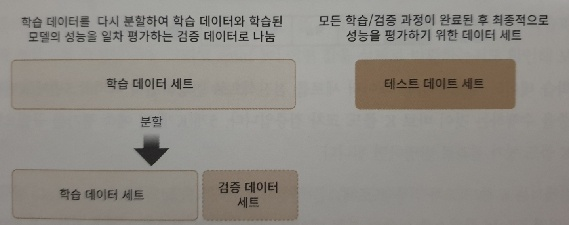
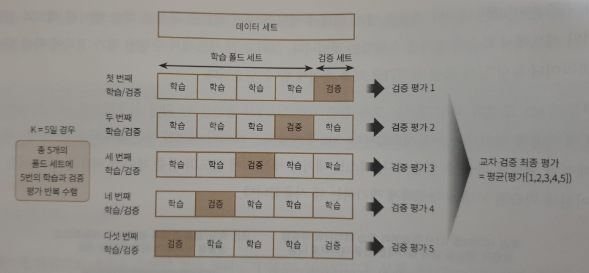
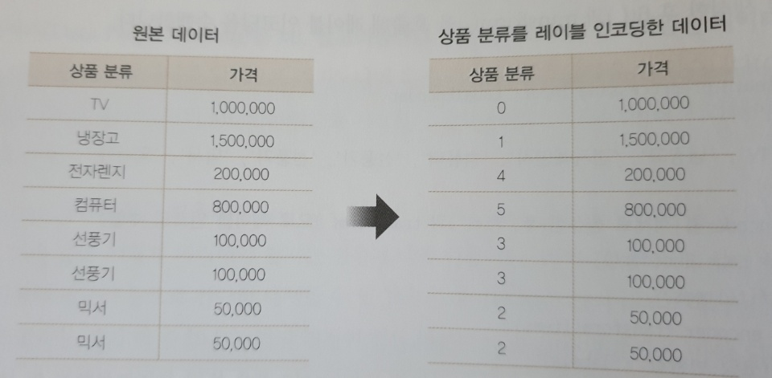
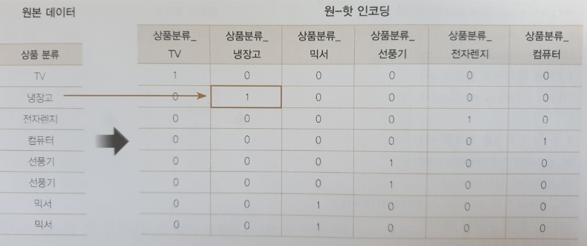
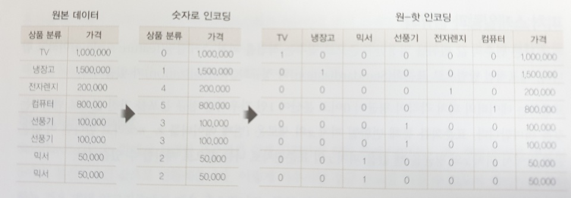

# scikit_learn(사이킷런)

머신러닝 라이브러리 중 가장 많이 사용되는 라이브러리다.

- 파이썬 기반의 다른 머신러닝 패키지도 사이킷런 스타일의 API를 지향할 정도로 쉽고 가장 파이썬스러운 API를 제공한다.
- 머신러닝을 위한 매우 다양한 알고리즘과 개발을 위한 편리한 프레임워크와 API를 제공한다.
- 오랜 기간 환경에서 검증됐으며,  매우 많은 환경에서 사용되는 성숙한 라이브러리 입니다. 


## 라이브러리 다운

```bash
pip install scikit-learn
```


### 버전 확인

```python
import sklearn

print(sklearn.__version__)
```

```bash
0.22
```


## 머신러닝 실습 - 붓꽃 품종 예측하기

R때부터 사용한 유구한 전통이 있는 붓꽃데이터를 가지고 붓꽃의 품종을 분류해보자.


```python
import sklearn
from sklearn.datasets import load_iris
from sklearn.tree import DecisionTreeClassifier
from sklearn.model_selection import train_test_split
from sklearn.metrics import accuracy_score
```

sklearn.datasets : 사이킷런에서 자체적으로 제공하는 데이터 세트를 생성하는 모듈이다.

sklearn.tree : 트리 기반 ML 알고리즘을 구현한 클래스 모임이다. DecisionTreeClassifier는 의사 결정 트리 알고리즘

sklearn.model_selection : 학습 데이터와 검증 데이터, 예측 데이터로 데이터를 분리하거나 최적의 하이퍼 파라미터로 평가하기 위한 다양한 모듈의 모임이다. train_test_split는 데이터 세트를 학습 데이터와 테스트 데이터로 분리하는데 사용한다.

accuracy_score : 정확도 측정하는데 사용한다. 첫번째 파라미터는 실제 데이터 세트, 두번째 파라미터는 예측 데이터 세트


정확도 : 옳게 예측한 경우 True = True로 판단 False를 False로 판단

### 


### DataFrame 만들기

```python
import sklearn
from sklearn.datasets import load_iris
from sklearn.tree import DecisionTreeClassifier
from sklearn.model_selection import train_test_split
import pandas as pd

# iris데이터 세트 로딩
iris = load_iris()

# iris.data는 Iris 데이터 세트에서 피처(feature)만으로 된 데이터 numpy로 가지고 있다.
iris_data = iris.data

# iris.target은 붓꽃 데이터 세트에서 레이블(결정 값) 데이터를 numpy로 가지고 있다.
iris_label = iris.target
print('iris target값:', iris_label)
print('iris target명:', iris.target_names)

# iris 데이터 세트를 자세히 보기 위해 DataFrame으로 변환
iris_df = pd.DataFrame(data=iris_data, columns=iris.feature_names )
iris_df['label'] = iris.target
print(iris_df.head(3))
```

```bash
iris target값: [0 0 0 0 0 0 0 0 0 0 0 0 0 0 0 0 0 0 0 0 0 0 0 0 0 0 0 0 0 0 0 0 0 0 0 0 0
 0 0 0 0 0 0 0 0 0 0 0 0 0 1 1 1 1 1 1 1 1 1 1 1 1 1 1 1 1 1 1 1 1 1 1 1 1
 1 1 1 1 1 1 1 1 1 1 1 1 1 1 1 1 1 1 1 1 1 1 1 1 1 1 2 2 2 2 2 2 2 2 2 2 2
 2 2 2 2 2 2 2 2 2 2 2 2 2 2 2 2 2 2 2 2 2 2 2 2 2 2 2 2 2 2 2 2 2 2 2 2 2
 2 2]
iris target명: ['setosa' 'versicolor' 'virginica']
   sepal length (cm)  sepal width (cm)  petal length (cm)  petal width (cm)  label
0                5.1               3.5                1.4               0.2      0
1                4.9               3.0                1.4               0.2      0
2                4.7               3.2                1.3               0.2      0
```

feature에는 sepal length, sepal width, petal length, petal width가 있다. label(결정값)은 0, 1, 2 세 가지 값으로 돼 있으며 0이 setosa 품종, 1이 versicolor 품종, 2가 virginica 품종을 의미한다.


### Data 분리

```python
X_train, X_test, y_train, y_test = train_test_split(iris_data, iris_label, test_size=0.2, random_state=11)
```

train_test_split()을 이용하면 학습 데이터와 테스트 데이터를 test_size 파라미터 입력 값의 비율로 쉽게 분할한다.

test_size=0.2로 하면 테스트 데이터가 20% 학습 데이터가 80%로 분할한다.

train_test_split()는 무작위로 데이터를 분리 하기 떄문에 random_state를 일정한 숫자 값으로 부여했다(seed와 같은 의미 숫자 자체는 어떤 값을 지정해도 상관없다).


### 의사 결정 트리

```python
# DecisionTreeClassifier 객체 생성
dt_clf = DecisionTreeClassifier(random_state=11)

# 학습 수행
dt_clf.fit(X_train, y_train)
```

의사 결정 트리 기반의 학습 데이터를 기반으로 학습이 완료됐다. 


### 예측

```python
pred = dt_clf.predict(X_test)
print('예측 정확도: {0: .4f}' .format(accuracy_score(y_test, pred)))
```

```bash
예측 정확도:  0.9333
```


### 예측 순서

1. 데이터 세트 분리 : 데이터를 학습 데이터와 테스트 데이터로 분리한다.
2. 모델 학습 : 학습 데이터를 기반으로 ML 알고리즘을 적용해 모델을 학습시킨다.
3. 예측 수행 : 학습된 ML모델을 이용해 테스트 데이터의 분류(붓꽃 종류)를 예측한다.
4. 평가 : 이렇게 예측된 결과값과 테스트 데이터의 실제 결과값을 비교해  ML모델 성능을 평가한다.


## 사이킷런 기반 DataFrame

### Estimator

Classifier와 Regressor를 합쳐서 Estimator라고 부른다.


#### fit()

ML모델 학습

#### predict()

학습된 모델 예측


### 사이킷런 주요 모듈


| 분류                | 모듈명                     | 설명                                                         |
| ------------------- | -------------------------- | ------------------------------------------------------------ |
| 예제 데이터         | sklearn.datasets           | 사이킷런에 내장되어 예제로 제공하는 데이더 세트              |
| 피처 처리           | sklearn.preprocessing      | 데이터 전처리에 필요한 다양한 가공 기능 제공                 |
|                     | sklearn.feature_selection  | 알고리즘에 큰 영향을 미치는 피처를 우선순위대로 설렉션 작업을 수행하는 다양한 기능 제공 |
|                     | sklearn.feature_extraction | 텍스트 데이터나 이미지 데이터의 벡터화 피처를 추출하는데 사용된다. |
| 피처처리 & 차원축소 | sklearn.decomposition      | 차원 축소와 관련한 알고리즘을 지원하는 모듈 PCA, NMF, Truncated SVD 등 |
| 평가                | sklearn.model_selection    | 교차 검증을 위한 학습용/테스트용 분리. 그리드 서치로 최적 파라미터 추출 등의 API제공 |
| ML 알고리즘         | sklearn.ensemble           | 앙상블 알고리즘 제공, 랜덤 포레스트, 에이다 부스트, 그래디언트 부스팅 등을 제공 |
|                     | sklearn.linear_model       | 선형 회귀, 릿지, 라쏘 및 로지스틱회귀 등 회귀관련 알고리즘 지원 |
|                     | sklearn.naive_bayes        | 나이브 베이즈 알고리즘                                       |
|                     | sklearn.neighbors          | 최근접 이웃 알고리즘 제공, K-NN제공                          |
|                     | sklearn.svm                | 서포트 벡터 머신 알고리즘 제공                               |
|                     | sklearn.tree               | 의사 결정 트리 알고리즘 제공                                 |
|                     | sklearn.cluster            | 비지도 클러스터링 알고리즘 제공(K-means, 계층형, DBSCAN등)   |
| 유틸리티            | sklearn.pipeline           | 피처 처리 등의 변환과 ML 알고리즘 학습, 예측 등을 함께 묶어서 실행할 수 있는 유틸리티 제공 |


### 내장된 예제 데이터 세트

#### 연습용 데이터 API

| API 명                        | 설명                                                         |
| ----------------------------- | ------------------------------------------------------------ |
| datasets.load_boston()        | 회귀 용도이며, 미국 보스턴의 집 피치들과 가격에 대한 데이터 세트 |
| datasets.load_breast_cancer() | 분류 용도이며, 위스콘신 유방암 피처들과 악성/음성 레이블 데이터 세트 |
| datasets.load_diabetes()      | 회귀 용도이며, 당뇨 데이터 세트                              |
| datasets.load_digits()        | 분류 용도이며, 0에서 9까지의 숫자의 이미지 픽셀 데이터 세트  |
| datasets.load_iris()          | 분류 용도이며. 붓꽃에 대한 피처를 가진 데이터 세트           |

####  fetch 계열

데이터 크기가 커서 인터넷에서 내려받아 홈 디렉터리 아래의 scikit_learn_data라는 서브 디렉터리에 저장한 후 추후 불러들이는 데이터다. 인터넷이 없으면 사용할 수 없다.

| API명                  | 설명                      |
| ---------------------- | ------------------------- |
| fetch_covtype()        | 회귀 분석용 토지조사 자료 |
| fetch_20newsgroups()   | 뉴스 그룹 텍스트 자료     |
| fetch_olivetti_faces() | 얼굴 이미지 자료          |
| fetch_lfw_people()     | 얼굴 이미지 자료          |
| fetch_lfw_pairs()      | 얼굴 이미지 자료          |
| fetch_rcv1()           | 로이터 뉴스 말뭉치        |
| fetch_mldata()         | ML 웹사이트에서 다운로드  |


#### 분류와 클러스터링을 위한 표본 데이터 생성기

| API명                           | 설명                                                         |
| ------------------------------- | ------------------------------------------------------------ |
| datasets.make_classifications() | 분류를 위한 데이터 세트를 만든다.특히 높은 상관도, 불필요한 속성 등의 노이즈 효과를 위한 데이터를 무작위로 생성해 준다. |
| datasets.make_blobs()           | 클러스터링을 위한 데이터 세트를 무작위로 생성해 준다. 군집 지정 개수에 따라 여러 가지 클러스터링을 위한 데이터 세트를 쉽게 만들어 준다. |


- data는 피처의 데이터 세트를 가리킨다.
- target은 분류 시 레이블 값, 회귀일 때는 숫자 결과값 데이터 세트
- target_names는 개별 레이블의 이름을 나타냅니다.
- feature_names는 피처의 이름을 나타냅니다.
- DESCR은 데이터 세트에 대한 설명과 각 피처의 설명을 나타낸다.


```python
import sklearn
from sklearn.datasets import load_iris

iris_data = load_iris()
print(type(iris_data))
```

```bash
<class 'sklearn.utils.Bunch'>
```


#### key값

```python
keys = iris_data.keys()
print('붓꽃 데이터 세트의 키들:', keys)
```

```bash
붓꽃 데이터 세트의 키들: dict_keys(['data', 'target', 'target_names', 'DESCR', 'feature_names', 'filename'])
```


#### key가 가리키는 값

```python
print('\n feature_names 의 type:', type(iris_data.feature_names))
print(' feature_names 의 shape:', len(iris_data.feature_names))
print(iris_data.feature_names)

print('\n target 의 type:', type(iris_data.target_names))
print(' target_names 의 shape:', len(iris_data.target_names))
print(iris_data.target_names)

print('\n data 의 type:', type(iris_data.data))
print(' data 의 shape:', iris_data.data.shape)
print(iris_data['data'])

print('\n target 의 type:', type(iris_data.target))
print(' target 의 shape:', iris_data.target.shape)
print(iris_data.target)
```

```bash
feature_names 의 type: <class 'list'>
 feature_names 의 shape: 4
['sepal length (cm)', 'sepal width (cm)', 'petal length (cm)', 'petal width (cm)']

 target 의 type: <class 'numpy.ndarray'>
 target_names 의 shape: 3
['setosa' 'versicolor' 'virginica']

 data 의 type: <class 'numpy.ndarray'>
 data 의 shape: (150, 4)
[[5.1 3.5 1.4 0.2]
 [4.9 3.  1.4 0.2]
 [4.7 3.2 1.3 0.2]
 [4.6 3.1 1.5 0.2]
 [5.  3.6 1.4 0.2]
 [5.4 3.9 1.7 0.4]
	........
 [6.7 3.  5.2 2.3]
 [6.3 2.5 5.  1.9]
 [6.5 3.  5.2 2. ]
 [6.2 3.4 5.4 2.3]
 [5.9 3.  5.1 1.8]]

 target 의 type: <class 'numpy.ndarray'>
 target 의 shape: (150,)
[0 0 0 0 0 0 0 0 0 0 0 0 0 0 0 0 0 0 0 0 0 0 0 0 0 0 0 0 0 0 0 0 0 0 0 0 0
 0 0 0 0 0 0 0 0 0 0 0 0 0 1 1 1 1 1 1 1 1 1 1 1 1 1 1 1 1 1 1 1 1 1 1 1 1
 1 1 1 1 1 1 1 1 1 1 1 1 1 1 1 1 1 1 1 1 1 1 1 1 1 1 2 2 2 2 2 2 2 2 2 2 2
 2 2 2 2 2 2 2 2 2 2 2 2 2 2 2 2 2 2 2 2 2 2 2 2 2 2 2 2 2 2 2 2 2 2 2 2 2
 2 2]
```


## Model Selection 모듈

model_selection 모듈은 학습 데이터와 테스트 세트를 분리하거나 교차 검증 분할 및 평가, 그리고 Estimator의 하이퍼 파라미터를 튜닝하기 위한 다양한 함수와 클래스를 제공한다.


### train_test_split() - 학습/테스트 데이터 세트 분리

만약 테스트 데이터를 이용하지 않고 학습 데이터 세트로만 학습하고 예측하면 무엇이 문제인가

```python
import sklearn
from sklearn.datasets import load_iris
from sklearn.tree import DecisionTreeClassifier
from sklearn.metrics import accuracy_score

iris = load_iris()
dt_clf = DecisionTreeClassifier()
train_data = iris.data
train_label = iris.target
dt_clf.fit(train_data, train_label)

#학습 데이터 세트로 예측 수행
pred = dt_clf.predict(train_data)
print('예측 정확도:', accuracy_score(train_label, pred)) 
```

```bash
예측 정확도: 1.0
```

정확도가 1.0(100%)이 된다. 그 이유는 이미 학습한 학습 데이터 세트를 기반으로 예측했기 때문이다.


### train_test_split() 파라미터들

train_test_split()는 첫 번째 파라미터로 피처 데이터 세트, 두 번째 파라미터로 레이블 데이터 세트를 입력 받는다. 그리고 다음 파라미터를 입력받는다.

- **test_size**: 전체 데이터에서 테스트 데이터 세트 크기를 얼마로 샘플링할 것인가 결정한다. 디폴트는 0.25(25%)다.
- **train_size**: 전체 데이터에서 학습용 데이터 세트 크기는 얼마로 샘플링할 것인가를 결정한다. test_size parameter를 통산적으로 사용하기 때문에 train_size는 잘 사용하지 않는다.
- **shuffle**: 데이트를 분리하기 전에 데이트를 미리 섞을지 결정한다. 디폴트는 True다. 데이터를 분산시켜 좀 더 효율적인 학습 및 테스트 데이터 세트를 만드는 데  사용한다.
- **random_state**: random_state는 호출할 때마다 동일한 학습/테스트용 데이터 세트를 생성하기 위해 주어지는 난수 값이다. train_test_split()는 호출 시 무작위로 데이터를 분리하므로 random_state를 지정하지 않으면 수행할 때마다 다른 학습/테스트 용 데이터를 생성한다.


### 실습 - 붓꽃 데이터 나누기

```python
import sklearn
from sklearn.datasets import load_iris
from sklearn.tree import DecisionTreeClassifier
from sklearn.metrics import accuracy_score
from sklearn.model_selection import train_test_split

dt_clf = DecisionTreeClassifier()
iris_data = load_iris()

X_train, X_test, y_train, y_test = train_test_split(iris_data.data, iris_data.target, test_size=0.3, rando_state=121)

# 예측 정확도
dt_clf.fit(X_train, y_train)
pred = dt_clf.predict(X_test)
print('예측 정확도: {0: 4f}'.format(accuracy_score(y_test, pred)))
```

```bash
예측 정확도:  0.955556
```

붓꽃 데이터 세트를 train_test_split()을 이용해 테스트 데이터 세트를 전체를 30%로, 학습 데이터 세트를 70%로 분리했다.

붓꽃 데이터는 150개의 데이터로 데이터 양이 크지 않아 전체의 30%정도인 테스트 데이터는 45개 밖에 되지 않으므로 이를 통해 알고리즘의 예측 성능을 판단하기에는 적절하지 않다.


### 교차검증

학습 데이터와 테스트 데이터는 과적합(Overfitting)에 취약하다는 단점이 있다. 과적합은 모델 학습 데이터에만 과도하게 최적화되어, 실제 예측을 다른 데이터로 수행할 경우에는 예측 성능이 과도하게 떨어지는 것을 말한다. 이러한 문제점을 개선하기 위해 교차 검증을 이용한다.

교차검증이란 여러 세트로 구성된 학습 데이터 세트와 검증 데이터 세트에서 학습과 평가를 수행하는 것을 의미한다. 

대부분의 ML 모델의 성능 평가는 교차 검증 기반으로 1차 평가를 한 뒤에 최종적으로 테스트 데이터 세트에 적용해 평가를 한다.




#### K 폴드 교차 검증

K개의 데이터 폴트 세트를 만들어서 K번만큼 각 폴트 세트에 학습과 검증 평가를 반복적으로 수행하는 방법이다.




##### KFold 객체 생성

```python
import sklearn
from sklearn.datasets import load_iris
from sklearn.tree import DecisionTreeClassifier
from sklearn.metrics import accuracy_score
from sklearn.model_selection import KFold
import numpy as np

iris = load_iris()
features = iris.data
label = iris.target
dt_clf = DecisionTreeClassifier(random_state=156)

# 5개의 폴드 세트로 분리하는 KFold 객체의 폴드 정확도를 담을 리스트 객체 생성.
kfold = KFold(n_splits=5)
cv_accuracy = []
print('붓꽃 데이터 세트 크기:', features.shape[0])
```

```bash
붓꽃 데이터 세트 크기: 150
```


붓꽃 데이터 세트의 크기는 150개 이고 학습용 데이터 세트는 4/5인 120개, 검증용 데이터 세트는 1/5인 30개로 분할 한다.

##### 검증 데이터 세트

split() : 학습용/검증요 데이터를 분할할 수 있는 인덱스를 반환한다.

```python
n_iter = 0

# KFold 객체의 split()를 호출하면 폴드 별 학습용, 검증용 테스트의 로우 인덱스를 array로 반환
for train_index, test_index in kfold.split(features):
    # kfold.split()으로 반환된 인덱스를 이용한 학습용, 검증용 테스트 데이터 추출
    X_train, X_test = features[train_index], features[test_index]
    y_train, y_test = label[train_index], label[test_index]

    # 학습 및 예측
    dt_clf.fit(X_train, y_train)
    pred = dt_clf.predict(X_test)
    n_iter += 1
    
    # 반복 시마다 정확도 측정
    accuracy = np.round(accuracy_score(y_test, pred), 4)
    train_size = X_train.shape[0]
    test_size = X_test.shape[0]
    print('\n#{0} 교차검증 정확도 :{1}, 학습 데이터 크기:{2}, 검증 데이터 크기:{3}'
        .format(n_iter, accuracy, train_size, test_size))
    print('#{0} 검증 세트 인덱스:{1}'.format(n_iter, test_index))
    cv_accuracy.append(accuracy)

# 개별 iteration별 정확도를 합하여 평균 정확도 계산
print('\n## 평균 검증 정확도:', np.mean(cv_accuracy))
```

```bash
#1 교차검증 정확도 :1.0, 학습 데이터 크기:120, 검증 데이터 크기:30
#1 검증 세트 인덱스:[ 0  1  2  3  4  5  6  7  8  9 10 11 12 13 14 15 16 17 18 19 20 21 22 23
 24 25 26 27 28 29]

#2 교차검증 정확도 :0.9667, 학습 데이터 크기:120, 검증 데이터 크기:30
#2 검증 세트 인덱스:[30 31 32 33 34 35 36 37 38 39 40 41 42 43 44 45 46 47 48 49 50 51 52 53
 54 55 56 57 58 59]

#3 교차검증 정확도 :0.8667, 학습 데이터 크기:120, 검증 데이터 크기:30
#3 검증 세트 인덱스:[60 61 62 63 64 65 66 67 68 69 70 71 72 73 74 75 76 77 78 79 80 81 82 83
 84 85 86 87 88 89]

#4 교차검증 정확도 :0.9333, 학습 데이터 크기:120, 검증 데이터 크기:30
#4 검증 세트 인덱스:[ 90  91  92  93  94  95  96  97  98  99 100 101 102 103 104 105 106 107
 108 109 110 111 112 113 114 115 116 117 118 119]

#5 교차검증 정확도 :0.7333, 학습 데이터 크기:120, 검증 데이터 크기:30
#5 검증 세트 인덱스:[120 121 122 123 124 125 126 127 128 129 130 131 132 133 134 135 136 137
 138 139 140 141 142 143 144 145 146 147 148 149]

## 평균 검증 정확도: 0.9
```


5번 교차검증의 평균은 0.9이다. 교차검증 시마다 검증 데이터 세트의 인덱스가 달라짐을 알 수 있다.


#### Stratified K폴드

Stratified K 폴드는 불균형한 분포도를 가진 레이블 데이터 집합을 위한 K폴드 방식이다. 불균형한 레이블 데이터 집합이란 특정 레이블 값이 특이하게 많거나 매우 적어서 값의 분포가 한쪽으로 치우치는 것을 말한다.


##### DataFrame 생성

```python
import pandas as pd
import sklearn
from sklearn.datasets import load_iris
from sklearn.model_selection import KFold

iris = load_iris()
iris_df = pd.DataFrame(data=iris.data, columns=iris.feature_names)
iris_df['label'] = iris.target
print(iris_df['label'].value_counts())
```

```bash
2    50
1    50
0    50
```

레이블 값 0, 1, 2 값 모두 50개로 동일하다.

##### KFold로 만든 데이터 분포 확인

```python
# 데이터 분포 확인
kfold = KFold(n_splits = 3)
n_iter = 0
for train_index, test_index in kfold.split(iris_df):
    n_iter += 1
    label_train = iris_df['label'].iloc[train_index]
    label_test = iris_df['label'].iloc[test_index]
    print('## 교차검증:{0}'.format(n_iter))
    print('학습 레이블 데이터 분포:\n', label_train.value_counts())
    print('검증 레이블 데이터 분포:\n', label_test.value_counts(), iris_df['label'].value_counts())
```

```bash
## 교차검증:1
학습 레이블 데이터 분포:
 2    50
1    50
Name: label, dtype: int64
검증 레이블 데이터 분포:
 0    50
Name: label, dtype: int64 2    50
1    50
0    50
Name: label, dtype: int64
## 교차검증:2
학습 레이블 데이터 분포:
 2    50
0    50
Name: label, dtype: int64
검증 레이블 데이터 분포:
 1    50
Name: label, dtype: int64 2    50
1    50
0    50
Name: label, dtype: int64
## 교차검증:3
학습 레이블 데이터 분포:
 1    50
0    50
Name: label, dtype: int64
검증 레이블 데이터 분포:
 2    50
Name: label, dtype: int64 2    50
1    50
0    50
Name: label, dtype: int64
```

교차검증 시마다 3개의 폴드 세트로 만들어지는 학습 레이블과 검증 레이블이 완전히 다른 값으로 추출됐다. 학습 레이블 1, 2 값이 각각 50개가 추출되고, 검증 레이블 0값이 50개가 추출 됐다. 학습 레이블은 1, 2밖에 없으므로 레이블 0의 경우는 학습을 하지 못했다. 반대로 검증 레이블은 0밖에 없으므로 학습 모델은 절대 0을 예측하지 못한다. 이런 유형으로 교차검증을 하면 검증 예측 정확도는 0이 될 수밖에 없다.


##### StratifiedKFold 레이블 생성

```python
# 추가
from sklearn.model_selection import StratifiedKFold


# StratifiedKFold
skf = StratifiedKFold(n_splits=3)
n_iter=0

for train_index, test_index in skf.split(iris_df, iris_df['label']):
    n_iter += 1
    label_train = iris_df['label'].iloc[train_index]
    label_test = iris_df['label'].iloc[test_index]
    print('## 교차검증: {0}'.format(n_iter))
    print('학습 레이블 데이터 분포:\n', label_train.value_counts())
    print('검증 레이블 데이터 분포:\n', label_test.value_counts())
```

```bash
## 교차검증: 1
학습 레이블 데이터 분포:
 2    34
1    33
0    33
Name: label, dtype: int64
검증 레이블 데이터 분포:
 1    17
0    17
2    16
Name: label, dtype: int64
## 교차검증: 2
학습 레이블 데이터 분포:
 1    34
2    33
0    33
Name: label, dtype: int64
검증 레이블 데이터 분포:
 2    17
0    17
1    16
Name: label, dtype: int64
## 교차검증: 3
학습 레이블 데이터 분포:
 0    34
2    33
1    33
Name: label, dtype: int64
검증 레이블 데이터 분포:
 2    17
1    17
0    16
Name: label, dtype: int64
```


##### StratifiedKFold  교차검증

```python
import pandas as pd
import numpy as np
import sklearn
from sklearn.datasets import load_iris
from sklearn.model_selection import KFold
from sklearn.model_selection import StratifiedKFold
from sklearn.tree import DecisionTreeClassifier
from sklearn.metrics import accuracy_score

iris = load_iris()
iris_df = pd.DataFrame(data=iris.data, columns=iris.feature_names)
iris_df['label'] = iris.target

dt_clf = DecisionTreeClassifier(random_state=156)
features = iris.data
label = iris.target
skfold = StratifiedKFold(n_splits=3)
n_iter=0
cv_accuracy=[]

# StratifiedKFold의 split() 호출시 반드시 레이블 데이터 세트도 추가 입력 필요
for train_index, test_index in skfold.split(features, label):
    #split()으로 반환된 인덱스를 이용해 학습용, 검증용 테스트 데이터 추출
    X_train, X_test = features[train_index], features[test_index]
    y_train, y_test = label[train_index], label[test_index]
    # 학습 및 예측
    dt_clf.fit(X_train, y_train)
    pred = dt_clf.predict(X_test)

    # 반복 시마다 정확도 측정
    n_iter += 1
    accuracy = np.round(accuracy_score(y_test, pred), 4)
    train_size = X_train.shape[0]
    test_size = X_test.shape[0]
    print('\n#{0} 교차검증 정확도 :{1}, 학습 데이터 크기: {2}, 검증 데이터 크기: {3}'.format(n_iter, accuracy, train_size, test_size))
    print('#{0} 검증 세트 인덱스:{1}'.format(n_iter, test_index))
    cv_accuracy.append(accuracy)

# 교차 검증별 정확도 및 평균 정확도 계산
print('\n## 교차 검증별 정확도:', np.round(cv_accuracy, 4))
print('## 평균 검증 정확도:', np.mean(cv_accuracy))

```

```bash
#1 교차검증 정확도 :0.98, 학습 데이터 크기: 100, 검증 데이터 크기: 50
#1 검증 세트 인덱스:[  0   1   2   3   4   5   6   7   8   9  10  11  12  13  14  15  16  50
  51  52  53  54  55  56  57  58  59  60  61  62  63  64  65  66 100 101
 102 103 104 105 106 107 108 109 110 111 112 113 114 115]

#2 교차검증 정확도 :0.94, 학습 데이터 크기: 100, 검증 데이터 크기: 50
#2 검증 세트 인덱스:[ 17  18  19  20  21  22  23  24  25  26  27  28  29  30  31  32  33  67
  68  69  70  71  72  73  74  75  76  77  78  79  80  81  82 116 117 118
 119 120 121 122 123 124 125 126 127 128 129 130 131 132]

#3 교차검증 정확도 :0.98, 학습 데이터 크기: 100, 검증 데이터 크기: 50
#3 검증 세트 인덱스:[ 34  35  36  37  38  39  40  41  42  43  44  45  46  47  48  49  83  84
  85  86  87  88  89  90  91  92  93  94  95  96  97  98  99 133 134 135
 136 137 138 139 140 141 142 143 144 145 146 147 148 149]

## 교차 검증별 정확도: [0.98 0.94 0.98]
## 평균 검증 정확도: 0.9666666666666667
```

3개의 Stratified K 폴드로 교차 검증한 결과 평균 검증 정확도가 0.97로 측정됐다. Stratified K 폴드의 경우 원본 데이터의 레이블 분포도 특성을 반영한 학습 및 검증 데이터 세트를 만들 수 있으므로 왜곡된 레이블 데이터 세트에서는 반드시 Stratified K 폴드를 이용해 교차 검증을 해야한다.

일반적인 분류(Classification)에서의 교차 검증은 K 폴드가 아니라 Stratified K 폴드로 분할돼야 한다. 회귀(Regression)에서는 Stratified K 폴드가 지원되지 않는다. 왜냐하면 회귀의 결정값은 이산값 형태의 레이블이 아니라 연속된 숫자값이기 때문에 결정값별로 분포를 정하는 의미가 없어서이다.


#### cross_val_score()

사이킷런에서는 교차 검증을 좀 더 편리하게 수행할 수 있게 도와주는 API를 제공한다.

1. 폴드 세트를 설정한다.
2. for루프에서 반복으로 학습 및 테스트 데이터의 인덱스를 추출한다.
3. 반복적으로 학습과 예측을 수행하고 예측 성능을 반환한다.

```python
import sklearn
import numpy as np
from sklearn.tree import DecisionTreeClassifier
from sklearn.model_selection import cross_val_score, cross_validate
from sklearn.datasets import load_iris

iris_data = load_iris()
dt_clf = DecisionTreeClassifier(random_state=156)

data = iris_data.data
label = iris_data.target

# 성능 지표는 정확도(accuracy), 교차 검증 세트는 3개
scores = cross_val_score(dt_clf, data, label, scoring='accuracy', cv = 3)
print('교차 검증별 정확도:', np.round(scores, 4))
print('평균 검증 정확도:', np.round(np.mean(scores), 4))
```

```bash
교차 검증별 정확도: [0.98 0.94 0.98]
평균 검증 정확도: 0.9667
```


cross_val_score()는 cv로 지정된 횟수만큼 scoring 파라미터로 지정된 평가 지표로 평가 결과값을 배열로 반환한다. cross_val_score() 내부에서는 학습(fit), 예측(predict), 평가(evaluation)시켜주므로 간단하게 교차검증을 수행할 수 있다. cross_val_score()는 내부적으로 StratifiedKFold을 이용한다.

비슷한 API로 cross_validate()가 있다. cross_val_score()는 하나의 평가 지표만 가능하지만 cross_validate()는 여러 개의 평가 지표를 반환할 수 있다.


#### GridSearchCV

교차검증과 최적 하이퍼 파라미터 튜닝을 한 번에

사이킷런 GridSearchCV API를 이용해 Classifier나 Regressor와 같은 알고리즘에 사용되는 하이퍼 파라미터를 순차적으로 입력하면서 편리하게 최적의 파라미터를 도출할 수 있는 방안을 제공한다.(Grid는 격자라는 뜻으로, 촘촘하게 파라미터를 입력하면서 테스트 하는방식)


GridSearchCV 클래스의 생성자로 들어가는 주요 파라미터

- **estimator** : classifier, regressor, pipeline이 사용될 수 있다.
- **param_grid** :key + 리스트 값을 가지는 딕셔너리가 주어진다. estimator의 튜닝을 위한 파라미터명과 사용될 여러 파라미터 값을 지정합니다.
- **scoring** : 예측 성능을 측정할 평가 방법을 지정합니다. 보통은 사이킷런의 성능 평가 지표를 지정하는 문자열(예:정확도의 경우 'accuracy')로 지정하거나 별도의 성능 평가 지표 함수도 지정할 수 있다.
- **cv** :교차검증을 위해 분할되는 학습/테스트 세트의 개수를 지정한다.
- **refit** : 디폴트가 True이며 True로 생성 시 가장 최적의 하이퍼 파라미터를 찾은 뒤 입력된  estimator 객체를 해당 하이퍼 파라미터로 재학습시킨다.


```python
import sklearn
import numpy as np
import pandas as pd
from sklearn.datasets import load_iris
from sklearn.tree import DecisionTreeClassifier
from sklearn.model_selection import GridSearchCV, train_test_split
from sklearn.metrics import accuracy_score


# 데이터를 로딩하고 학습 데이터와 테스트 데이터 분리
iris = load_iris()

X_train, X_test, y_train, y_test = train_test_split(iris.data, iris.target, test_size=0.2, random_state=121)

dtree = DecisionTreeClassifier()

## 파라미터를 딕셔너리 형태로 설정
parameters = {'max_depth':[1, 2, 3], 'min_samples_split':[2, 3]}

# param_grid의 하이퍼 파라미터를 3개의 train, test set fold로 나누어 텍스트 수행 설정.
### refit = True가 default이다. True이면 가장 좋은 파라미터 설정으로 재학습시킨다.
grid_dtree = GridSearchCV(dtree, param_grid=parameters, cv=3, refit=True)

# 붓꽃 데이터로 param_grid의 하이퍼 파라미터를 순차적으로 학습/평가
grid_dtree.fit(X_train, y_train)

# GridSearchCV  결과를 추출해 DataFrame으로 변환
scores_df = pd.DataFrame(grid_dtree.cv_results_)
scores_df[['params', 'mean_test_score', 'rank_test_score',
        'split0_test_score', 'split1_test_score', 'split2_test_score']]

```

```bash
   mean_fit_time  std_fit_time  mean_score_time  std_score_time  ... split2_test_score mean_test_score std_test_score  rank_test_score
0       0.000332      0.000469         0.000332        0.000470  ...              0.70        0.700000   1.110223e-16
5
1       0.000664      0.000469         0.000334        0.000472  ...              0.70        0.700000   1.110223e-16
5
2       0.000332      0.000470         0.000000        0.000000  ...              0.95        0.958333   3.118048e-02
3
3       0.000000      0.000000         0.000665        0.000470  ...              0.95        0.958333   3.118048e-02
3
4       0.000997      0.000002         0.000000        0.000000  ...              0.95        0.975000   2.041241e-02
1
5       0.000000      0.000000         0.000332        0.000469  ...              0.95        0.975000   2.041241e-02
1

[6 rows x 13 columns]
```


위의 결과에서 총 6개의 결과를 볼 수 있으며, 이는 하이퍼 파라미터 max_depth와 min_samples_split을 순차적으로 총 6번 변경하면서 학습 및 평가를 수행했음을 나타낸다.

주요 칼럼별 의미

- param칼럼에는 수행할 때마다 적용된 개별 하이퍼 파라미터값을 나타낸다.
- rank_test_score는 하이퍼 파라미터별로 성능이 좋은 score 순위를 나타낸다. 1이 가장 뛰어난 순위이며 이때의 파라미터가 최적의 하이퍼 파라미터다.
- mean_test_score는 개별 하이퍼 파라미터별로 CV의 폴딩 테스트 세트에 대해 총 수행한 평가 평균값이다.


##### 최적  하이퍼 파라미터의 값과 정확도

```python
print('GridSearchCV 최적의 파라미터:', grid_dtree.best_params_)
print('GridSearchCV 최고 정확도:{0:.4f}'.format(grid_dtree.best_score_))
```

```bash
GridSearchCV 최적의 파라미터: {'max_depth': 3, 'min_samples_split': 2}
GridSearchCV 최고 정확도:0.9750
```


##### 예측

```python
# GridSearchCV의 best_estimator_는 이미 최적 학습이 됐으므로 별도 학습이 필요 없음
pred = estimator.predict(X_test)
print('테스트 데이터 세트 정확도: {0:.4f}'.format(accuracy_score(y_test, pred)))
```

```bash
테스트 데이터 세트 정확도: 0.9667
```

일반적으로 학습 데이터를 GridSearchCV를 이용해 최적 하이퍼 모파라미터 튜닝을 수행힌 뒤에 별도의 테스트 세트에서 이를 평가하는 것이 일반적인 머신러닝 모델 적용 방법이다.


## 데이터 전처리

ML알고리즘을 적용하기 전에 결손값, 즉 NaN, Null 값은 허용되지 않기 때문에 고정된 다른 값으로 변환해야 한다.


### 데이터 인코딩

#### 레이블 인코딩

카테고리 피처를 코드형 숫자 값으로 변환하는 방식이다.



```python
import sklearn
from sklearn.preprocessing import LabelEncoder

items = ['TV', '냉장고', '전자레인지', '컴퓨터', '선풍기', '믹서', '믹서']

# LableEncoder를 객체로 생성한 후, fit()과 transform()으로 레이블 인코딩 수행.
encoder = LabelEncoder()
encoder.fit(items)
labels = encoder.transform(items)
print('인코딩 변환값:', labels)
print('인코딩 클래스:', encoder.classes_)
```

```bash
인코딩 변환값: [0 1 4 5 3 2 2]
인코딩 클래스: ['TV' '냉장고' '믹서' '선풍기' '전자레인지' '컴퓨터']
```


#### 원-핫 인코딩

피처 값에 유형에 따라 새로운 피처를 추가해 고유 값에 해당하는 칼럼에만 1을 표시하고 나머지 칼럼에는 0을 표시하는 방식이다. 행 형태로 돼 있는 피처의 고유 값을 열 형태로 차원을 변환한 뒤, 고유 값에 해당하는 칼럼에만 1을 표시하고 나머지 칼럼에는 0을 표시한다.



```python
import sklearn
import numpy as np
from sklearn.preprocessing import OneHotEncoder, LabelEncoder

items = ['TV', '냉장고', '전자레인지', '컴퓨터', '선풍기', '선풍기', '믹서', '믹서']

# 먼저 숫자 값으로 변환을 위해 LabelEncoder로 변환한다.
encoder = LabelEncoder()
encoder.fit(items)
labels = encoder.transform(items)

# 2차원 데이터로 변환한다.
labels = labels.reshape(-1, 1)

# 원-핫 인코딩 적용
oh_encoder = OneHotEncoder()
oh_encoder.fit(labels)
oh_labels = oh_encoder.transform(labels)
print('원-핫 인코딩 데이터')
print(oh_labels.toarray())
print('원-핫 인코딩 데이터 차원')
print(oh_labels.shape)
```

```bash
원-핫 인코딩 데이터
[[1. 0. 0. 0. 0. 0.]
 [0. 1. 0. 0. 0. 0.]
 [0. 0. 0. 0. 1. 0.]
 [0. 0. 0. 0. 0. 1.]
 [0. 0. 0. 1. 0. 0.]
 [0. 0. 0. 1. 0. 0.]
 [0. 0. 1. 0. 0. 0.]
 [0. 0. 1. 0. 0. 0.]]
원-핫 인코딩 데이터 차원
(8, 6)
```

8개의 레코드와 1개의 칼럼을 가진 원본 데이터가 8개의 레코드와 6개의 칼럼을 가진 데이터로 변환됐다. 




##### 판다스 OneHotEncoder

```python
import pandas as pd

df = pd.DataFrame({'item':['TV', '냉장고', '전자레인지', '컴퓨터', '선풍기', '선풍기', '믹서', '믹서']})
print(pd.get_dummies(df))
```

```bash
   item_TV  item_냉장고  item_믹서  item_선풍기  item_전자레인지  item_컴퓨터
0        1         0        0         0           0         0
1        0         1        0         0           0         0
2        0         0        0         0           1         0
3        0         0        0         0           0         1
4        0         0        0         1           0         0
5        0         0        0         1           0         0
6        0         0        1         0           0         0
7        0         0        1         0           0         0
```

get_dummies()를 이용하면 숫자형 값으로 변환 없이도 바로 변환이 가능함을 알 수 있다.


#### 피처 스케일링과 정규화

서로 다른 변수의 값 범위를 일정한 수준으로 맞추는 작업을 피쳐 스케일링(feature scaling)이라고 한다. 대표적인 방법으로 표준화(Standardization)와 정규화(Normalization)이 있다.

표준화는 데이터의 피처 각각이 평균이 0이고 분산이 1인 가우시안 정규 분포를 가진 값으로 변환하는 것을 의미한다. 


정규화는 일반적으로 서로 다른 피처의 크기를 통일하기 위해 크기를 변환해주는 개념이다.


그런데 사이킷런의 전처리에서 제공하는 Normalizer 모듈과 일반적인 정규화는 약간 차이가 있다. 사이키런의 Normalizer모듈은 선형대수에서의 정규화 개념이 적용됐으며, 개별 백터의 크기를 맞추기 위해 변환하는 것을 의미한다.


##### StandardScaler

표준화를 쉽게 지원하기 위한 클래스다.

###### 데이터 세트

```python
import sklearn
from sklearn.datasets import load_iris
import pandas as pd

# 붓꽃 데이터 세트를 로딩하고 DataFrame으로 변환한다.
iris = load_iris()
iris_data = iris.data
iris_df = pd.DataFrame(data=iris_data, columns=iris.feature_names)

print('feature 들의 평균 값')
print(iris_df.mean())
print('\nfeature 들의 분산 값')
print(iris_df.var())
```

```bash
feature 들의 평균 값
sepal length (cm)    5.843333
sepal width (cm)     3.057333
petal length (cm)    3.758000
petal width (cm)     1.199333
dtype: float64

feature 들의 분산 값
sepal length (cm)    0.685694
sepal width (cm)     0.189979
petal length (cm)    3.116278
petal width (cm)     0.581006
dtype: float64
```

 

###### 표준화

```python
# StandardScaler 객체 생성
scaler = StandardScaler()
# StandardScaler로 데이터 세트 변환. fit()과 transform()호출.
scaler.fit(iris_df)
iris_scaled = scaler.transform(iris_df)

# transform()시 스케일 변환된 데이터 세트가 NumPy ndarray로 변환돼 이를 DataFrame으로 변환
iris_df_scaled = pd.DataFrame(data=iris_scaled, columns=iris.feature_names)
print('feature 들의 평균 값')
print(iris_df_scaled.mean())
print('\nfeature 들의 분산 값')
print(iris_df_scaled.var())
```

```bash
feature 들의 평균 값
sepal length (cm)   -1.690315e-15
sepal width (cm)    -1.842970e-15
petal length (cm)   -1.698641e-15
petal width (cm)    -1.409243e-15
dtype: float64

feature 들의 분산 값
sepal length (cm)    1.006711
sepal width (cm)     1.006711
petal length (cm)    1.006711
petal width (cm)     1.006711
dtype: float64
```

모든 칼럼 값의 평균이 0에 가까운 값으로, 분산은 1에 아주 가까운 값으로 변환됐다.


##### MinMaxScaler

데이터값을 0과 1사이의 범위 값으로 변환한다(음수 값이 있으면 -1에서 1값으로 변환).

```python
import sklearn
import pandas as pd
from sklearn.datasets import load_iris
from sklearn.preprocessing import MinMaxScaler
iris = load_iris()
iris_data = iris.data
iris_df = pd.DataFrame(data=iris_data, columns=iris.feature_names)
# MinMaxScaler객체 생성
scaler = MinMaxScaler()
# MinMaxScaler로 데이터 세트 변환. fit()과 transform() 호출.
scaler.fit(iris_df)
iris_scaled = scaler.transform(iris_df)

# transform() 시 스케일 변환된 데이터 세트가 NumPy ndarray로 반환돼 이를 DataFrame으로 변환
iris_df_scaled = pd.DataFrame(data=iris_scaled, columns=iris.feature_names)
print('feature들의 최솟값')
print(iris_df_scaled.min())
print('\nfeature들의 최댓값')
print(iris_df_scaled.max())
```

```bash
feature들의 최솟값
sepal length (cm)    0.0
sepal width (cm)     0.0
petal length (cm)    0.0
petal width (cm)     0.0
dtype: float64

feature들의 최댓값
sepal length (cm)    1.0
sepal width (cm)     1.0
petal length (cm)    1.0
petal width (cm)     1.0
dtype: float64
```

