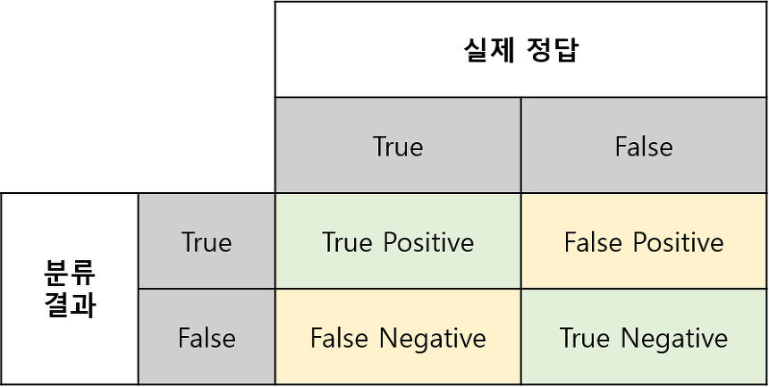
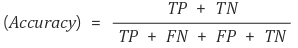
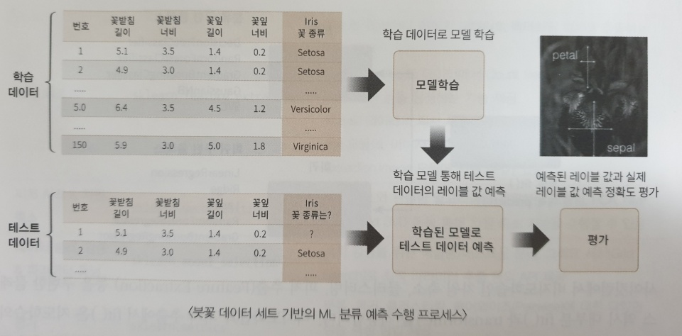
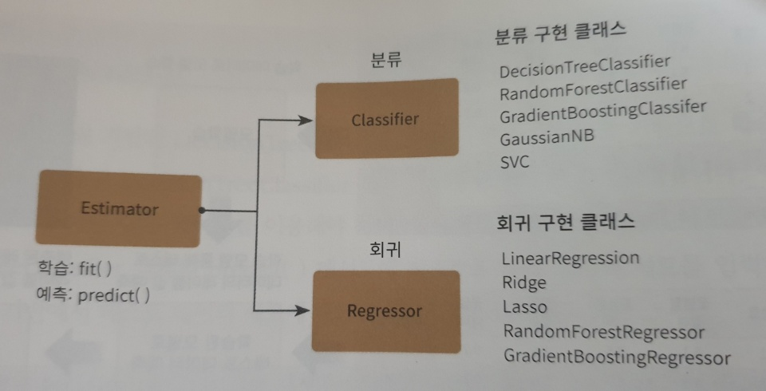

# scikit_learn(사이킷런)

머신러닝 라이브러리 중 가장 많이 사용되는 라이브러리다.

- 파이썬 기반의 다른 머신러닝 패키지도 사이킷런 스타일의 API를 지향할 정도로 쉽고 가장 파이썬스러운 API를 제공한다.
- 머신러닝을 위한 매우 다양한 알고리즘과 개발을 위한 편리한 프레임워크와 API를 제공한다.
- 오랜 기간 환경에서 검증됐으며,  매우 많은 환경에서 사용되는 성숙한 라이브러리 입니다. 


## 라이브러리 다운

```bash
pip install scikit-learn
```


### 버전 확인

```python
import sklearn

print(sklearn.__version__)
```

```bash
0.22
```


## 머신러닝 실습 - 붓꽃 품종 예측하기

R때부터 사용한 유구한 전통이 있는 붓꽃데이터를 가지고 붓꽃의 품종을 분류해보자.


```python
import sklearn
from sklearn.datasets import load_iris
from sklearn.tree import DecisionTreeClassifier
from sklearn.model_selection import train_test_split
from sklearn.metrics import accuracy_score
```

sklearn.datasets : 사이킷런에서 자체적으로 제공하는 데이터 세트를 생성하는 모듈이다.

sklearn.tree : 트리 기반 ML 알고리즘을 구현한 클래스 모임이다. DecisionTreeClassifier는 의사 결정 트리 알고리즘

sklearn.model_selection : 학습 데이터와 검증 데이터, 예측 데이터로 데이터를 분리하거나 최적의 하이퍼 파라미터로 평가하기 위한 다양한 모듈의 모임이다. train_test_split는 데이터 세트를 학습 데이터와 테스트 데이터로 분리하는데 사용한다.

accuracy_score : 정확도 측정하는데 사용한다. 첫번째 파라미터는 실제 데이터 세트, 두번째 파라미터는 예측 데이터 세트


정확도 : 옳게 예측한 경우 True = True로 판단 False를 False로 판단

### 





### DataFrame 만들기

```python
import sklearn
from sklearn.datasets import load_iris
from sklearn.tree import DecisionTreeClassifier
from sklearn.model_selection import train_test_split
import pandas as pd

# iris데이터 세트 로딩
iris = load_iris()

# iris.data는 Iris 데이터 세트에서 피처(feature)만으로 된 데이터 numpy로 가지고 있다.
iris_data = iris.data

# iris.target은 붓꽃 데이터 세트에서 레이블(결정 값) 데이터를 numpy로 가지고 있다.
iris_label = iris.target
print('iris target값:', iris_label)
print('iris target명:', iris.target_names)

# iris 데이터 세트를 자세히 보기 위해 DataFrame으로 변환
iris_df = pd.DataFrame(data=iris_data, columns=iris.feature_names )
iris_df['label'] = iris.target
print(iris_df.head(3))
```

```bash
iris target값: [0 0 0 0 0 0 0 0 0 0 0 0 0 0 0 0 0 0 0 0 0 0 0 0 0 0 0 0 0 0 0 0 0 0 0 0 0
 0 0 0 0 0 0 0 0 0 0 0 0 0 1 1 1 1 1 1 1 1 1 1 1 1 1 1 1 1 1 1 1 1 1 1 1 1
 1 1 1 1 1 1 1 1 1 1 1 1 1 1 1 1 1 1 1 1 1 1 1 1 1 1 2 2 2 2 2 2 2 2 2 2 2
 2 2 2 2 2 2 2 2 2 2 2 2 2 2 2 2 2 2 2 2 2 2 2 2 2 2 2 2 2 2 2 2 2 2 2 2 2
 2 2]
iris target명: ['setosa' 'versicolor' 'virginica']
   sepal length (cm)  sepal width (cm)  petal length (cm)  petal width (cm)  label
0                5.1               3.5                1.4               0.2      0
1                4.9               3.0                1.4               0.2      0
2                4.7               3.2                1.3               0.2      0
```

feature에는 sepal length, sepal width, petal length, petal width가 있다. label(결정값)은 0, 1, 2 세 가지 값으로 돼 있으며 0이 setosa 품종, 1이 versicolor 품종, 2가 virginica 품종을 의미한다.


### Data 분리

```python
X_train, X_test, y_train, y_test = train_test_split(iris_data, iris_label, test_size=0.2, random_state=11)
```

train_test_split()을 이용하면 학습 데이터와 테스트 데이터를 test_size 파라미터 입력 값의 비율로 쉽게 분할한다.

test_size=0.2로 하면 테스트 데이터가 20% 학습 데이터가 80%로 분할한다.

train_test_split()는 무작위로 데이터를 분리 하기 떄문에 random_state를 일정한 숫자 값으로 부여했다(seed와 같은 의미 숫자 자체는 어떤 값을 지정해도 상관없다).


### 의사 결정 트리

```python
# DecisionTreeClassifier 객체 생성
dt_clf = DecisionTreeClassifier(random_state=11)

# 학습 수행
dt_clf.fit(X_train, y_train)
```

의사 결정 트리 기반의 학습 데이터를 기반으로 학습이 완료됐다. 


### 예측

```python
pred = dt_clf.predict(X_test)
print('예측 정확도: {0: .4f}' .format(accuracy_score(y_test, pred)))
```

```bash
예측 정확도:  0.9333
```


### 예측 순서

1. 데이터 세트 분리 : 데이터를 학습 데이터와 테스트 데이터로 분리한다.
2. 모델 학습 : 학습 데이터를 기반으로 ML 알고리즘을 적용해 모델을 학습시킨다.
3. 예측 수행 : 학습된 ML모델을 이용해 테스트 데이터의 분류(붓꽃 종류)를 예측한다.
4. 평가 : 이렇게 예측된 결과값과 테스트 데이터의 실제 결과값을 비교해  ML모델 성능을 평가한다.




## 사이킷런 기반 DataFrame

### Estimator

Classifier와 Regressor를 합쳐서 Estimator라고 부른다.



#### fit()

ML모델 학습

#### predict()

학습된 모델 예측


### 사이킷런 주요 모듈


| 분류                | 모듈명                     | 설명                                                         |
| ------------------- | -------------------------- | ------------------------------------------------------------ |
| 예제 데이터         | sklearn.datasets           | 사이킷런에 내장되어 예제로 제공하는 데이더 세트              |
| 피처 처리           | sklearn.preprocessing      | 데이터 전처리에 필요한 다양한 가공 기능 제공                 |
|                     | sklearn.feature_selection  | 알고리즘에 큰 영향을 미치는 피처를 우선순위대로 설렉션 작업을 수행하는 다양한 기능 제공 |
|                     | sklearn.feature_extraction | 텍스트 데이터나 이미지 데이터의 벡터화 피처를 추출하는데 사용된다. |
| 피처처리 & 차원축소 | sklearn.decomposition      | 차원 축소와 관련한 알고리즘을 지원하는 모듈 PCA, NMF, Truncated SVD 등 |
| 평가                | sklearn.model_selection    | 교차 검증을 위한 학습용/테스트용 분리. 그리드 서치로 최적 파라미터 추출 등의 API제공 |
| ML 알고리즘         | sklearn.ensemble           | 앙상블 알고리즘 제공, 랜덤 포레스트, 에이다 부스트, 그래디언트 부스팅 등을 제공 |
|                     | sklearn.linear_model       | 선형 회귀, 릿지, 라쏘 및 로지스틱회귀 등 회귀관련 알고리즘 지원 |
|                     | sklearn.naive_bayes        | 나이브 베이즈 알고리즘                                       |
|                     | sklearn.neighbors          | 최근접 이웃 알고리즘 제공, K-NN제공                          |
|                     | sklearn.svm                | 서포트 벡터 머신 알고리즘 제공                               |
|                     | sklearn.tree               | 의사 결정 트리 알고리즘 제공                                 |
|                     | sklearn.cluster            | 비지도 클러스터링 알고리즘 제공(K-means, 계층형, DBSCAN등)   |
| 유틸리티            | sklearn.pipeline           | 피처 처리 등의 변환과 ML 알고리즘 학습, 예측 등을 함께 묶어서 실행할 수 있는 유틸리티 제공 |


### 내장된 예제 데이터 세트

#### 연습용 데이터 API

| API 명                        | 설명                                                         |
| ----------------------------- | ------------------------------------------------------------ |
| datasets.load_boston()        | 회귀 용도이며, 미국 보스턴의 집 피치들과 가격에 대한 데이터 세트 |
| datasets.load_breast_cancer() | 분류 용도이며, 위스콘신 유방암 피처들과 악성/음성 레이블 데이터 세트 |
| datasets.load_diabetes()      | 회귀 용도이며, 당뇨 데이터 세트                              |
| datasets.load_digits()        | 분류 용도이며, 0에서 9까지의 숫자의 이미지 픽셀 데이터 세트  |
| datasets.load_iris()          | 분류 용도이며. 붓꽃에 대한 피처를 가진 데이터 세트           |

####  fetch 계열

데이터 크기가 커서 인터넷에서 내려받아 홈 디렉터리 아래의 scikit_learn_data라는 서브 디렉터리에 저장한 후 추후 불러들이는 데이터다. 인터넷이 없으면 사용할 수 없다.

| API명                  | 설명                      |
| ---------------------- | ------------------------- |
| fetch_covtype()        | 회귀 분석용 토지조사 자료 |
| fetch_20newsgroups()   | 뉴스 그룹 텍스트 자료     |
| fetch_olivetti_faces() | 얼굴 이미지 자료          |
| fetch_lfw_people()     | 얼굴 이미지 자료          |
| fetch_lfw_pairs()      | 얼굴 이미지 자료          |
| fetch_rcv1()           | 로이터 뉴스 말뭉치        |
| fetch_mldata()         | ML 웹사이트에서 다운로드  |


#### 분류와 클러스터링을 위한 표본 데이터 생성기

| API명                           | 설명                                                         |
| ------------------------------- | ------------------------------------------------------------ |
| datasets.make_classifications() | 분류를 위한 데이터 세트를 만든다.특히 높은 상관도, 불필요한 속성 등의 노이즈 효과를 위한 데이터를 무작위로 생성해 준다. |
| datasets.make_blobs()           | 클러스터링을 위한 데이터 세트를 무작위로 생성해 준다. 군집 지정 개수에 따라 여러 가지 클러스터링을 위한 데이터 세트를 쉽게 만들어 준다. |


- data는 피처의 데이터 세트를 가리킨다.
- target은 분류 시 레이블 값, 회귀일 때는 숫자 결과값 데이터 세트
- target_names는 개별 레이블의 이름을 나타냅니다.
- feature_names는 피처의 이름을 나타냅니다.
- DESCR은 데이터 세트에 대한 설명과 각 피처의 설명을 나타낸다.


```python
import sklearn
from sklearn.datasets import load_iris

iris_data = load_iris()
print(type(iris_data))
```

```bash
<class 'sklearn.utils.Bunch'>
```


#### key값

```python
keys = iris_data.keys()
print('붓꽃 데이터 세트의 키들:', keys)
```

```bash
붓꽃 데이터 세트의 키들: dict_keys(['data', 'target', 'target_names', 'DESCR', 'feature_names', 'filename'])
```


#### key가 가리키는 값

```python
print('\n feature_names 의 type:', type(iris_data.feature_names))
print(' feature_names 의 shape:', len(iris_data.feature_names))
print(iris_data.feature_names)

print('\n target 의 type:', type(iris_data.target_names))
print(' target_names 의 shape:', len(iris_data.target_names))
print(iris_data.target_names)

print('\n data 의 type:', type(iris_data.data))
print(' data 의 shape:', iris_data.data.shape)
print(iris_data['data'])

print('\n target 의 type:', type(iris_data.target))
print(' target 의 shape:', iris_data.target.shape)
print(iris_data.target)
```

```bash
feature_names 의 type: <class 'list'>
 feature_names 의 shape: 4
['sepal length (cm)', 'sepal width (cm)', 'petal length (cm)', 'petal width (cm)']

 target 의 type: <class 'numpy.ndarray'>
 target_names 의 shape: 3
['setosa' 'versicolor' 'virginica']

 data 의 type: <class 'numpy.ndarray'>
 data 의 shape: (150, 4)
[[5.1 3.5 1.4 0.2]
 [4.9 3.  1.4 0.2]
 [4.7 3.2 1.3 0.2]
 [4.6 3.1 1.5 0.2]
 [5.  3.6 1.4 0.2]
 [5.4 3.9 1.7 0.4]
	........
 [6.7 3.  5.2 2.3]
 [6.3 2.5 5.  1.9]
 [6.5 3.  5.2 2. ]
 [6.2 3.4 5.4 2.3]
 [5.9 3.  5.1 1.8]]

 target 의 type: <class 'numpy.ndarray'>
 target 의 shape: (150,)
[0 0 0 0 0 0 0 0 0 0 0 0 0 0 0 0 0 0 0 0 0 0 0 0 0 0 0 0 0 0 0 0 0 0 0 0 0
 0 0 0 0 0 0 0 0 0 0 0 0 0 1 1 1 1 1 1 1 1 1 1 1 1 1 1 1 1 1 1 1 1 1 1 1 1
 1 1 1 1 1 1 1 1 1 1 1 1 1 1 1 1 1 1 1 1 1 1 1 1 1 1 2 2 2 2 2 2 2 2 2 2 2
 2 2 2 2 2 2 2 2 2 2 2 2 2 2 2 2 2 2 2 2 2 2 2 2 2 2 2 2 2 2 2 2 2 2 2 2 2
 2 2]
```


