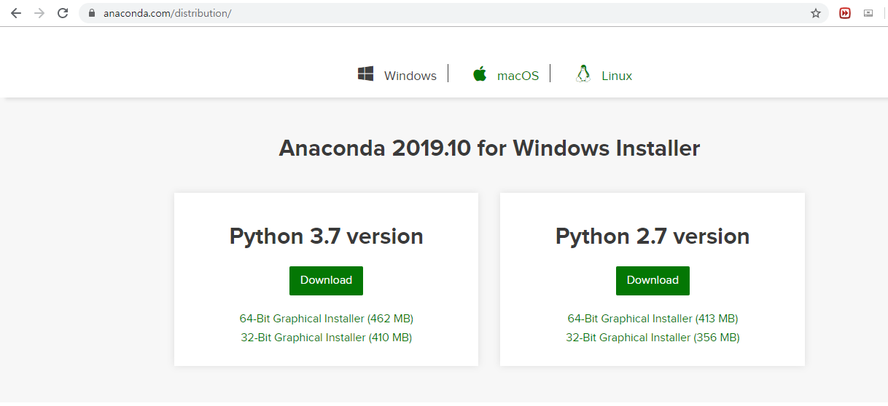
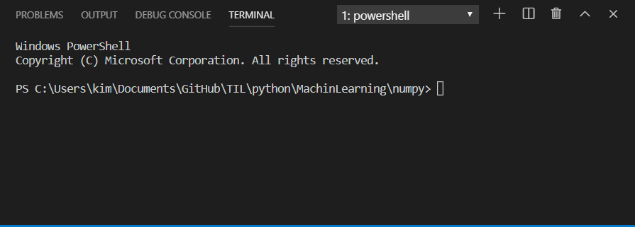
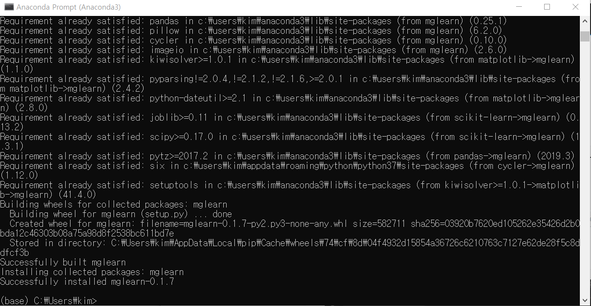
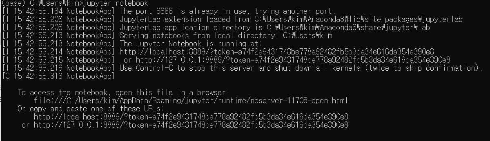
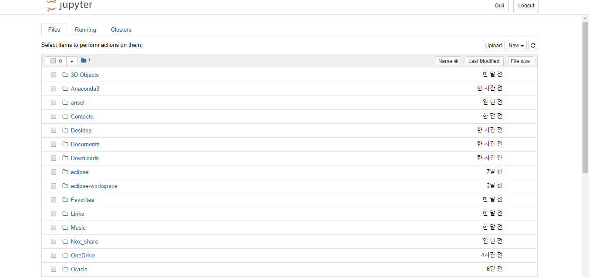
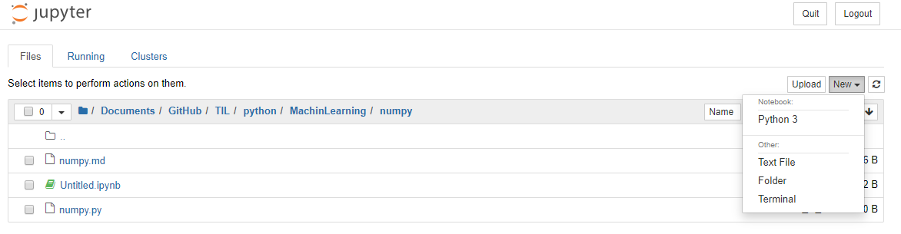

# 기본S/W

일단 기본적으로 python과  VScode가 깔려있는 환경에서 작성을 시작했다.

## Anaconda

기본적인 머신러닝에 필요한 패키지들을 일괄적으로 설치할 수 있으며, 윈도우 환경에 설치가 어려운 패키지들도 간편하게 설치할 수 있다.

[다운로드링크](https://www.anaconda.com/distribution/)



> 설치 오래걸린다. 유튜브에서 뭐라도 보고있자


버전확인을 해보자



> 기본 터미널 설정이 파워셀이다.....


### Anaconda 기본설정

anaconda prompt에 들어가서

```
pip install numpy scipy matplotlib ipython scikit-learn pandas pillow
pip install tensorflow
pip install mglearn
```

설치



> 이런식으로 나온다.


### 주피터 노트북

프롬프트에

```
jupyter notebook
```

입력







#### 새로만들기



python 3으로 만든다.


### 파이썬터미널여는법


​	

## Pandas

2차원 데이터를 효율적으로 가공/처리할 수 있는 라이브러리

```bash
pip install pandas
```

